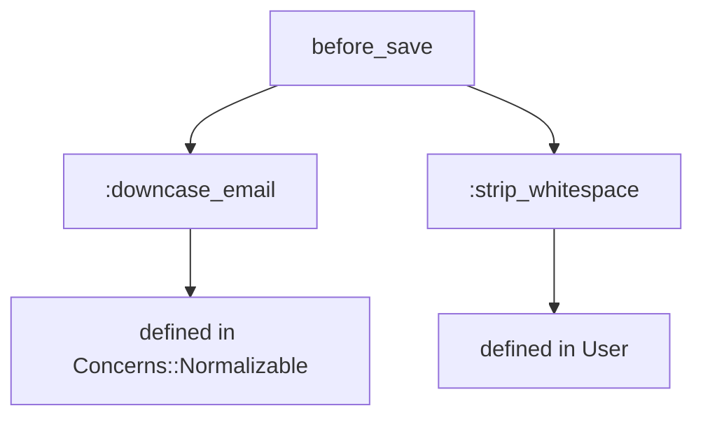
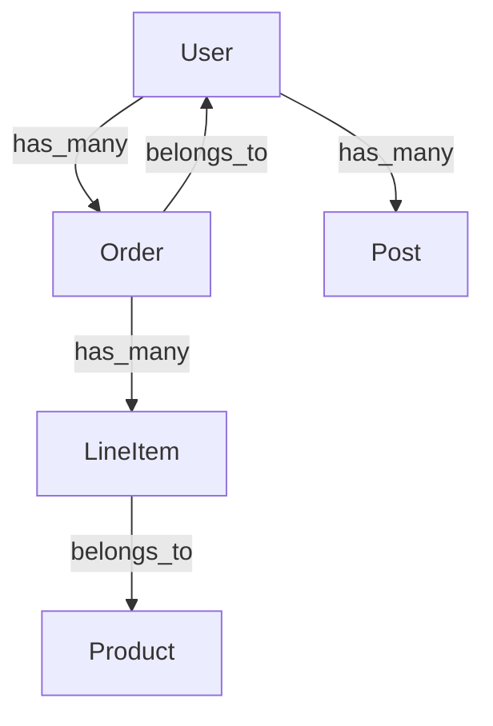

[日本語](README_ja.md)

# rails-lens

[](https://github.com/ei-nakamura/rails-lens/actions/workflows/ci.yml)
[](https://badge.fury.io/py/rails-lens)
[](https://pypi.org/project/rails-lens/)

MCP server that reveals implicit Rails dependencies for AI coding tools.

## Overview

rails-lens is an MCP (Model Context Protocol) server that extracts and exposes
Ruby on Rails application structure to AI coding tools like Claude Code and Cursor.
It helps AI tools understand Rails implicit dependencies such as callbacks, associations,
concerns, and dynamic method generation.

**9 tools** are provided to give AI assistants deep insight into Rails applications:

- Introspect models with callbacks, associations, validations
- Find all references to a method or class across the codebase
- Trace full callback chains including inherited and concern-injected hooks
- Generate dependency graphs between models
- Dump database schema and routes
- Analyze shared concerns
- Manage the introspection cache

## Installation

```bash
pip install rails-lens
```

## Tools

### `rails_lens_introspect_model`

Introspects a single Rails model and returns its callbacks, associations, validations, scopes, and class methods.

**Parameters:**
- `model_name` (string, required): Rails model class name (e.g. `"User"`, `"Order"`)
- `include_inherited` (boolean, optional): Include inherited callbacks. Default: `true`

**Example output:**
```
Model: User
Callbacks:
  before_save: :downcase_email, :strip_whitespace
  after_create: :send_welcome_email
Associations:
  has_many: :orders, :posts
  belongs_to: :organization
Validations:
  validates :email, presence: true, uniqueness: true
```

---

### `rails_lens_list_models`

Lists all ActiveRecord model classes found in the Rails application.

**Parameters:** none

**Example output:**
```
Models (12):
  User, Order, Product, Category, Tag, Comment,
  Organization, Role, Permission, Session, AuditLog, Setting
```

---

### `rails_lens_find_references`

Searches the codebase for all references to a given method or class name using fast text search.

**Parameters:**
- `name` (string, required): Method or class name to search for
- `file_pattern` (string, optional): Glob pattern to restrict search (e.g. `"app/**/*.rb"`)

**Example output:**
```
References to "send_welcome_email" (3 found):
  app/models/user.rb:42    after_create :send_welcome_email
  app/mailers/user_mailer.rb:8    def send_welcome_email(user)
  spec/models/user_spec.rb:15    expect(user).to receive(:send_welcome_email)
```

---

### `rails_lens_trace_callback_chain`

Traces the full callback chain for a model event, including hooks from concerns and parent classes.

**Parameters:**
- `model_name` (string, required): Rails model class name
- `event` (string, required): Callback event (e.g. `"before_save"`, `"after_create"`)

**Example output (Mermaid diagram):**


---

### `rails_lens_dependency_graph`

Generates a dependency graph showing associations between models.

**Parameters:**
- `root_model` (string, optional): Starting model for the graph. If omitted, graphs all models.
- `depth` (integer, optional): Maximum traversal depth. Default: `2`

**Example output (Mermaid diagram):**


---

### `rails_lens_get_schema`

Dumps the current database schema (from `db/schema.rb`) in a structured format.

**Parameters:**
- `table_name` (string, optional): Filter to a specific table. If omitted, returns all tables.

**Example output:**
```
Table: users
  id: bigint, primary key
  email: string, not null, unique
  created_at: datetime, not null
  updated_at: datetime, not null
```

---

### `rails_lens_get_routes`

Returns all defined Rails routes from `config/routes.rb` or `rails routes` output.

**Parameters:**
- `filter` (string, optional): Filter routes by path or controller name

**Example output:**
```
GET    /users          users#index
POST   /users          users#create
GET    /users/:id      users#show
PATCH  /users/:id      users#update
DELETE /users/:id      users#destroy
```

---

### `rails_lens_analyze_concern`

Analyzes a Rails concern module and lists the methods, callbacks, and validations it injects.

**Parameters:**
- `concern_name` (string, required): Concern module name (e.g. `"Normalizable"`, `"Auditable"`)

**Example output:**
```
Concern: Concerns::Auditable
Injects callbacks:
  before_create: :set_creator
  before_update: :set_updater
Injects methods:
  :created_by_name, :updated_by_name
Injects validations:
  validates :creator, presence: true
```

---

### `rails_lens_refresh_cache`

Clears and rebuilds the introspection cache by re-running Rails scripts.

**Parameters:**
- `model_name` (string, optional): Refresh cache for a specific model only. If omitted, refreshes all.

**Example output:**
```
Cache refreshed for: User, Order, Product (3 models)
Duration: 4.2s
```

---

## Configuration

### Claude Code (`~/.claude/claude_desktop_config.json`)

```json
{
  "mcpServers": {
    "rails-lens": {
      "command": "rails-lens",
      "env": {
        "RAILS_LENS_PROJECT_PATH": "/path/to/your/rails/project"
      }
    }
  }
}
```

### Cursor (`.cursor/mcp.json`)

```json
{
  "mcpServers": {
    "rails-lens": {
      "command": "rails-lens",
      "env": {
        "RAILS_LENS_PROJECT_PATH": "/path/to/your/rails/project"
      }
    }
  }
}
```

### `.rails-lens.toml` (optional, in your Rails project root)

```toml
[rails]
project_path = "/path/to/rails/project"
timeout = 30

[cache]
auto_invalidate = true

[search]
command = "rg"
```

## Developer Setup

```bash
git clone https://github.com/ei-nakamura/rails-lens.git
cd rails-lens
pip install -e ".[dev]"
pytest tests/
```

Run with coverage:

```bash
pytest tests/ --cov=src/rails_lens --cov-report=term-missing
```

See [CONTRIBUTING.md](CONTRIBUTING.md) for contribution guidelines.

## License

MIT
