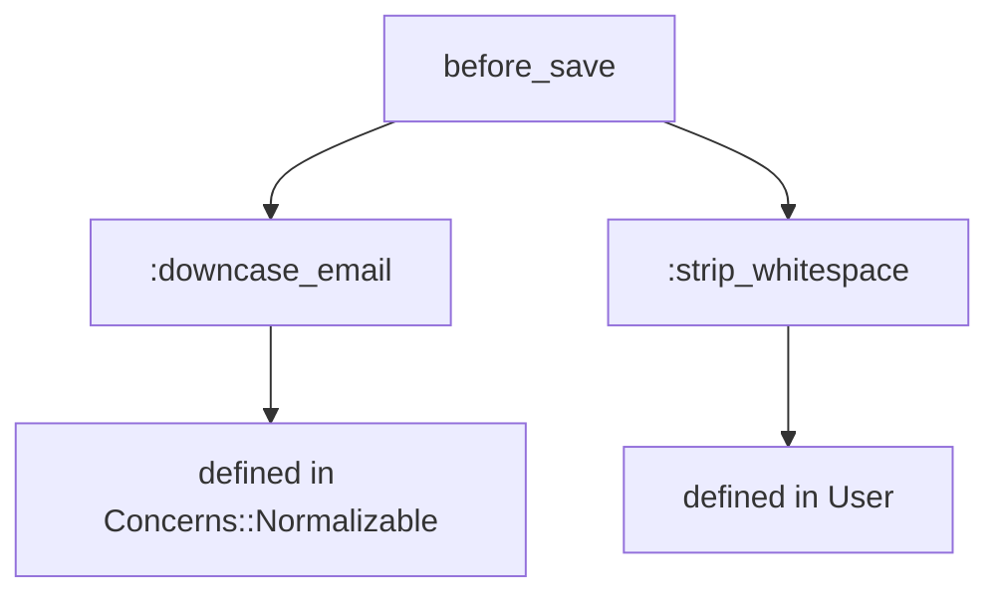
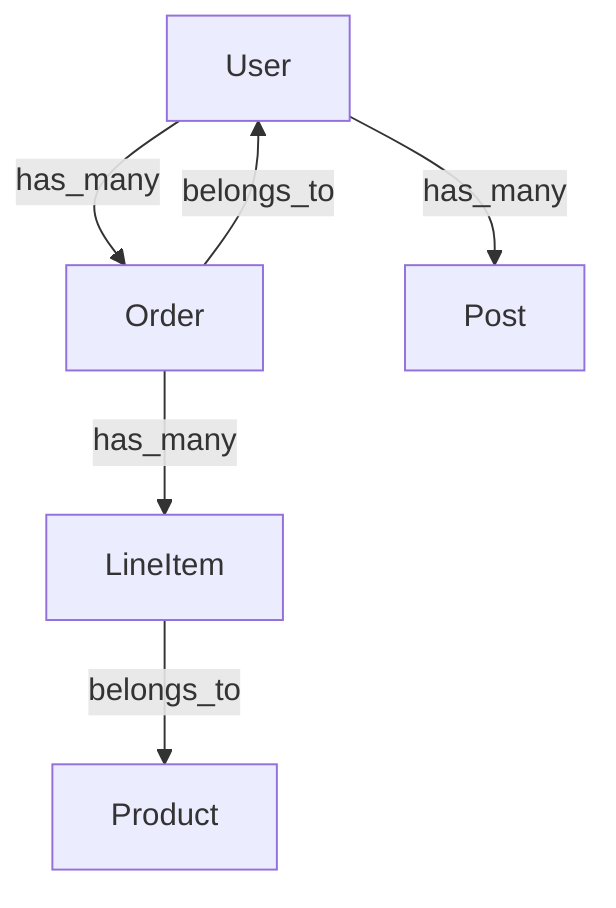
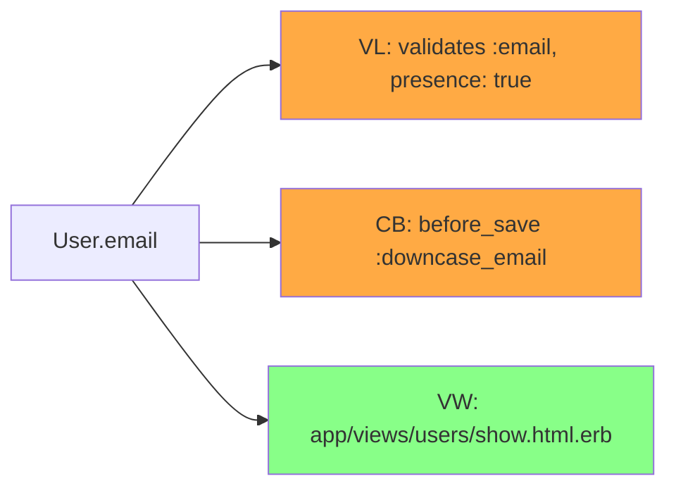
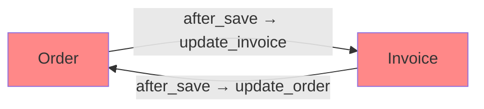
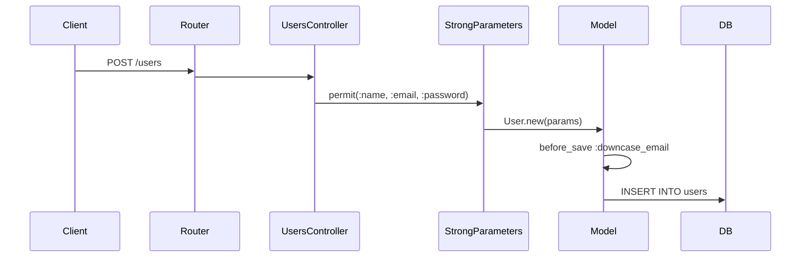

[日本語](README_ja.md)

# rails-lens

[](https://github.com/ei-nakamura/rails-lens/actions/workflows/ci.yml)
[](https://badge.fury.io/py/rails-lens)
[](https://pypi.org/project/rails-lens/)

MCP server that reveals implicit Rails dependencies for AI coding tools.

## Overview

rails-lens is an MCP (Model Context Protocol) server that extracts and exposes
Ruby on Rails application structure to AI coding tools like Claude Code and Cursor.
It helps AI tools understand Rails implicit dependencies such as callbacks, associations,
concerns, and dynamic method generation.

**18 tools** are provided to give AI assistants deep insight into Rails applications:

**Phase 1–4 (Core Introspection)**
- Introspect models with callbacks, associations, validations
- Find all references to a method or class across the codebase
- Trace full callback chains including inherited and concern-injected hooks
- Generate dependency graphs between models
- Dump database schema and routes
- Analyze shared concerns
- Manage the introspection cache

**Phase 5–8 (Advanced Analysis)**
- Explain method resolution order (MRO) and ancestor chains
- Introspect Gem-injected methods and callbacks
- Analyze the impact of changing a column or method
- Map models and methods to their test files
- Detect dead code (unused methods, callbacks, scopes)
- Detect circular dependencies between models
- Identify Concern extraction candidates from Fat Models
- Trace data flow from HTTP request to database
- Provide migration context and safety warnings

## Installation

```bash
pip install rails-lens
```

## Tools

### Phase 1–4: Core Introspection

---

### `rails_lens_introspect_model`

Introspects a single Rails model and returns its callbacks, associations, validations, scopes, and class methods.

**Use case:** Understand a model's full behavior before modifying it.

**Parameters:**
- `model_name` (string, required): Rails model class name (e.g. `"User"`, `"Order"`)
- `include_inherited` (boolean, optional): Include inherited callbacks. Default: `true`

**Example output:**
```
Model: User
Callbacks:
  before_save: :downcase_email, :strip_whitespace
  after_create: :send_welcome_email
Associations:
  has_many: :orders, :posts
  belongs_to: :organization
Validations:
  validates :email, presence: true, uniqueness: true
```

---

### `rails_lens_list_models`

Lists all ActiveRecord model classes found in the Rails application.

**Use case:** Get an overview of the data model before exploring specific models.

**Parameters:** none

**Example output:**
```
Models (12):
  User, Order, Product, Category, Tag, Comment,
  Organization, Role, Permission, Session, AuditLog, Setting
```

---

### `rails_lens_find_references`

Searches the codebase for all references to a given method or class name using fast text search.

**Use case:** Find everywhere a method is called before renaming or removing it.

**Parameters:**
- `name` (string, required): Method or class name to search for
- `file_pattern` (string, optional): Glob pattern to restrict search (e.g. `"app/**/*.rb"`)

**Example output:**
```
References to "send_welcome_email" (3 found):
  app/models/user.rb:42    after_create :send_welcome_email
  app/mailers/user_mailer.rb:8    def send_welcome_email(user)
  spec/models/user_spec.rb:15    expect(user).to receive(:send_welcome_email)
```

---

### `rails_lens_trace_callback_chain`

Traces the full callback chain for a model event, including hooks from concerns and parent classes.

**Use case:** Debug unexpected behavior triggered by callbacks before modifying a model event.

**Parameters:**
- `model_name` (string, required): Rails model class name
- `event` (string, required): Callback event (e.g. `"before_save"`, `"after_create"`)

**Example output (Mermaid diagram):**


---

### `rails_lens_dependency_graph`

Generates a dependency graph showing associations between models.

**Use case:** Understand cross-model dependencies before a refactoring or data migration.

**Parameters:**
- `root_model` (string, optional): Starting model for the graph. If omitted, graphs all models.
- `depth` (integer, optional): Maximum traversal depth. Default: `2`

**Example output (Mermaid diagram):**


---

### `rails_lens_get_schema`

Dumps the current database schema (from `db/schema.rb`) in a structured format.

**Use case:** Inspect column types and constraints before writing a migration.

**Parameters:**
- `table_name` (string, optional): Filter to a specific table. If omitted, returns all tables.

**Example output:**
```
Table: users
  id: bigint, primary key
  email: string, not null, unique
  created_at: datetime, not null
  updated_at: datetime, not null
```

---

### `rails_lens_get_routes`

Returns all defined Rails routes from `config/routes.rb` or `rails routes` output.

**Use case:** Verify available routes and their controller mappings.

**Parameters:**
- `filter` (string, optional): Filter routes by path or controller name

**Example output:**
```
GET    /users          users#index
POST   /users          users#create
GET    /users/:id      users#show
PATCH  /users/:id      users#update
DELETE /users/:id      users#destroy
```

---

### `rails_lens_analyze_concern`

Analyzes a Rails concern module and lists the methods, callbacks, and validations it injects.

**Use case:** Understand what a concern adds to a model before including or removing it.

**Parameters:**
- `concern_name` (string, required): Concern module name (e.g. `"Normalizable"`, `"Auditable"`)

**Example output:**
```
Concern: Concerns::Auditable
Injects callbacks:
  before_create: :set_creator
  before_update: :set_updater
Injects methods:
  :created_by_name, :updated_by_name
Injects validations:
  validates :creator, presence: true
```

---

### `rails_lens_refresh_cache`

Clears and rebuilds the introspection cache by re-running Rails scripts.

**Use case:** Refresh stale cache after adding new models or modifying existing ones.

**Parameters:**
- `model_name` (string, optional): Refresh cache for a specific model only. If omitted, refreshes all.

**Example output:**
```
Cache refreshed for: User, Order, Product (3 models)
Duration: 4.2s
```

---

### Phase 5: Method Resolution & Gem Introspection

---

### `rails_lens_explain_method_resolution`

Returns the method resolution order (MRO), ancestor chain, and method owner for a Rails model.

**Use case:** Understand where a method is defined when multiple modules and concerns are included.

**Parameters:**
- `model_name` (string, required): Rails model class name
- `method_name` (string, optional): Specific method to locate. If omitted, returns the full ancestor chain.
- `show_internal` (boolean, optional): Include Ruby/Rails internal modules. Default: `false`

**Example output:**
```json
{
  "model_name": "User",
  "method_owner": "Concerns::Normalizable",
  "ancestors": ["User", "Concerns::Auditable", "Concerns::Normalizable", "ApplicationRecord"],
  "super_chain": ["Concerns::Normalizable#downcase_email"],
  "monkey_patches": []
}
```

---

### `rails_lens_gem_introspect`

Returns methods, callbacks, and routes injected by Gems into a Rails model.

**Use case:** Discover what Devise, Paranoia, PaperTrail, or other gems add to a model.

**Parameters:**
- `model_name` (string, required): Rails model class name
- `gem_name` (string, optional): Filter results to a specific gem. If omitted, returns all gems.

**Example output:**
```json
{
  "model_name": "User",
  "gem_methods": [
    {"gem_name": "devise", "method_name": "authenticate", "source_file": null}
  ],
  "gem_callbacks": [
    {"gem_name": "paper_trail", "kind": "after_update", "event": "after_update", "method_name": "record_update"}
  ],
  "gem_routes": []
}
```

---

### Phase 6: Change Safety

---

### `rails_lens_analyze_impact`

Analyzes the impact of modifying or removing a column or method — including callbacks, validations, views, mailers, and cascade effects.

**Use case:** Assess risk before renaming a column or changing a method signature.

**Parameters:**
- `model_name` (string, required): Rails model class name
- `target` (string, required): Column or method name to analyze
- `change_type` (string, optional): `remove`, `rename`, `type_change`, or `modify`. Default: `modify`

**Example output (Mermaid diagram):**


---

### `rails_lens_test_mapping`

Detects test files related to a model or method and returns the run command.

**Use case:** Find which specs to run after modifying a model or method.

**Parameters:**
- `target` (string, required): Model name (e.g. `"User"`) or method spec (e.g. `"User#activate"`)
- `include_indirect` (boolean, optional): Include indirectly related specs (shared examples, feature specs). Default: `true`

**Example output:**
```json
{
  "target": "User#activate",
  "test_framework": "rspec",
  "direct_tests": [
    {"file": "spec/models/user_spec.rb", "type": "unit", "relevance": "direct"}
  ],
  "indirect_tests": [
    {"file": "spec/features/user_registration_spec.rb", "type": "feature", "relevance": "indirect"}
  ],
  "run_command": "bundle exec rspec spec/models/user_spec.rb spec/features/user_registration_spec.rb"
}
```

---

### Phase 7: Refactoring

---

### `rails_lens_dead_code`

Detects unused methods, callbacks, and scopes with confidence ratings.

**Use case:** Find safe candidates for removal during a cleanup or refactoring session.

**Parameters:**
- `scope` (string, optional): Detection scope: `models`, `controllers`, or `all`. Default: `models`
- `model_name` (string, optional): Limit detection to a specific model.
- `confidence` (string, optional): `high` (certainly unused) or `medium` (possibly dynamic). Default: `high`

**Example output:**
```json
{
  "scope": "models",
  "total_methods_analyzed": 42,
  "total_dead_code_found": 3,
  "items": [
    {
      "type": "method", "name": "legacy_export", "file": "app/models/user.rb",
      "line": 87, "confidence": "high", "reason": "No references found",
      "reference_count": 0, "dynamic_call_risk": false
    }
  ]
}
```

---

### `rails_lens_circular_dependencies`

Detects circular dependencies between models (mutual callback updates, bidirectional associations) and visualizes them as a Mermaid diagram.

**Use case:** Identify models that mutually trigger each other's callbacks, causing stack overflows or data corruption.

**Parameters:**
- `entry_point` (string, optional): Filter to cycles containing this model.
- `format` (string, optional): `mermaid` or `json`. Default: `mermaid`

**Example output (Mermaid diagram):**


---

### `rails_lens_extract_concern_candidate`

Analyzes a Fat Model's methods by cohesion and suggests Concern extraction candidates with rationale.

**Use case:** Identify groups of related methods in a large model that should be extracted into concerns.

**Parameters:**
- `model_name` (string, required): Rails model class name
- `min_cluster_size` (integer, optional): Minimum number of methods per cluster. Default: `3`

**Example output:**
```json
{
  "model_name": "User",
  "total_methods": 45,
  "candidates": [
    {
      "suggested_name": "Notifiable",
      "methods": ["send_welcome_email", "send_reset_password", "notify_admin"],
      "cohesion_score": 0.87,
      "rationale": "All methods relate to email/notification dispatch"
    }
  ]
}
```

---

### Phase 8: Data Flow & Migration

---

### `rails_lens_data_flow`

Traces data flow from an HTTP request through routing, strong parameters, callbacks, and into the database.

**Use case:** Understand the full lifecycle of a user-submitted attribute before modifying it.

**Parameters:**
- `controller_action` (string, optional): Controller#action (e.g. `"UsersController#create"`)
- `model_name` (string, optional): Model name as an alternative entry point
- `attribute` (string, optional): Specific attribute to trace. If omitted, traces all.

**Example output (Mermaid sequence diagram):**


---

### `rails_lens_migration_context`

Provides migration context for a table: current schema, migration history, safety warnings, and a migration template.

**Use case:** Get all relevant context and safety checks before writing a migration for a large table.

**Parameters:**
- `table_name` (string, required): Table name (e.g. `"users"`)
- `operation` (string, optional): Planned operation: `add_column`, `remove_column`, `add_index`, `change_column`, `add_reference`, or `general`. Default: `general`

**Example output:**
```json
{
  "table_name": "users",
  "operation": "add_column",
  "estimated_row_count": 2500000,
  "warnings": [
    {
      "type": "large_table",
      "message": "Table has ~2.5M rows. Adding a non-null column without a default will lock the table.",
      "suggestion": "Use `add_column` with a default, then backfill and add NOT NULL constraint separately."
    }
  ],
  "template": {
    "description": "Add column with default for large table",
    "code": "add_column :users, :new_column, :string, default: nil\n# backfill...\nchange_column_null :users, :new_column, false"
  }
}
```

---

## Configuration

### Claude Code (`~/.claude/claude_desktop_config.json`)

```json
{
  "mcpServers": {
    "rails-lens": {
      "command": "rails-lens",
      "env": {
        "RAILS_LENS_PROJECT_PATH": "/path/to/your/rails/project"
      }
    }
  }
}
```

### Cursor (`.cursor/mcp.json`)

```json
{
  "mcpServers": {
    "rails-lens": {
      "command": "rails-lens",
      "env": {
        "RAILS_LENS_PROJECT_PATH": "/path/to/your/rails/project"
      }
    }
  }
}
```

### `.rails-lens.toml` (optional, in your Rails project root)

```toml
[rails]
project_path = "/path/to/rails/project"
timeout = 30

[cache]
auto_invalidate = true

[search]
command = "rg"
```

## Developer Setup

```bash
git clone https://github.com/ei-nakamura/rails-lens.git
cd rails-lens
pip install -e ".[dev]"
pytest tests/
```

Run with coverage:

```bash
pytest tests/ --cov=src/rails_lens --cov-report=term-missing
```

See [CONTRIBUTING.md](CONTRIBUTING.md) for contribution guidelines.

## License

MIT
