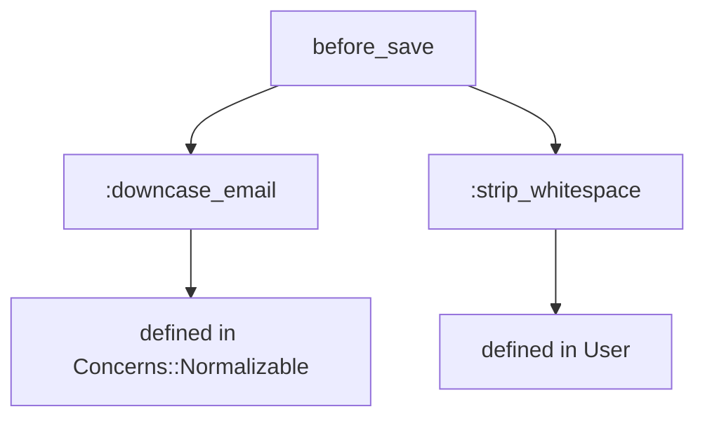
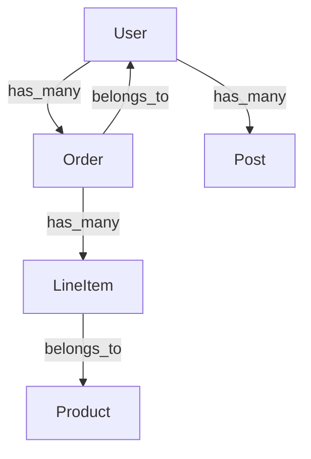

[English](README.md)

# rails-lens

[](https://github.com/ei-nakamura/rails-lens/actions/workflows/ci.yml)
[](https://badge.fury.io/py/rails-lens)
[](https://pypi.org/project/rails-lens/)

AIコーディングツール向けに、Railsの暗黙的な依存関係を可視化するMCPサーバー。

## 概要

rails-lensは、RubyonRailsアプリケーションの構造を抽出し、Claude CodeやCursorなどのAIコーディングツールへ提供するMCP（Model Context Protocol）サーバーです。
コールバック、アソシエーション、コンサーン、動的メソッド生成といったRailsの暗黙的な依存関係をAIツールが理解できるよう支援します。

**9つのツール**でAIアシスタントにRailsアプリケーションの深い洞察を提供します:

- コールバック・アソシエーション・バリデーション付きでモデルをイントロスペクト
- コードベース全体からメソッドやクラスへの参照を検索
- コンサーンや親クラスからの継承を含む完全なコールバックチェーンをトレース
- モデル間の依存グラフを生成
- データベーススキーマとルーティングをダンプ
- 共有コンサーンを解析
- イントロスペクションキャッシュを管理

## インストール

```bash
pip install rails-lens
```

## ツール一覧

### `rails_lens_introspect_model`

単一のRailsモデルをイントロスペクトし、コールバック・アソシエーション・バリデーション・スコープ・クラスメソッドを返します。

**パラメータ:**
- `model_name` (string, 必須): Railsモデルのクラス名（例: `"User"`, `"Order"`）
- `include_inherited` (boolean, 任意): 継承されたコールバックを含めるか。デフォルト: `true`

**出力例:**
```
Model: User
Callbacks:
  before_save: :downcase_email, :strip_whitespace
  after_create: :send_welcome_email
Associations:
  has_many: :orders, :posts
  belongs_to: :organization
Validations:
  validates :email, presence: true, uniqueness: true
```

---

### `rails_lens_list_models`

Railsアプリケーション内の全ActiveRecordモデルクラスを一覧表示します。

**パラメータ:** なし

**出力例:**
```
Models (12):
  User, Order, Product, Category, Tag, Comment,
  Organization, Role, Permission, Session, AuditLog, Setting
```

---

### `rails_lens_find_references`

高速テキスト検索を使って、指定したメソッドまたはクラス名へのすべての参照をコードベースから検索します。

**パラメータ:**
- `name` (string, 必須): 検索するメソッドまたはクラス名
- `file_pattern` (string, 任意): 検索対象を絞るGlobパターン（例: `"app/**/*.rb"`）

**出力例:**
```
References to "send_welcome_email" (3 found):
  app/models/user.rb:42    after_create :send_welcome_email
  app/mailers/user_mailer.rb:8    def send_welcome_email(user)
  spec/models/user_spec.rb:15    expect(user).to receive(:send_welcome_email)
```

---

### `rails_lens_trace_callback_chain`

コンサーンや親クラスからのフックを含む、モデルイベントの完全なコールバックチェーンをトレースします。

**パラメータ:**
- `model_name` (string, 必須): Railsモデルのクラス名
- `event` (string, 必須): コールバックイベント（例: `"before_save"`, `"after_create"`）

**出力例（Mermaid図）:**


---

### `rails_lens_dependency_graph`

モデル間のアソシエーションを示す依存グラフを生成します。

**パラメータ:**
- `root_model` (string, 任意): グラフの起点モデル。省略時は全モデルをグラフ化。
- `depth` (integer, 任意): 最大トラバース深度。デフォルト: `2`

**出力例（Mermaid図）:**


---

### `rails_lens_get_schema`

`db/schema.rb` から現在のデータベーススキーマを構造化された形式でダンプします。

**パラメータ:**
- `table_name` (string, 任意): 特定のテーブルに絞り込む。省略時は全テーブルを返す。

**出力例:**
```
Table: users
  id: bigint, primary key
  email: string, not null, unique
  created_at: datetime, not null
  updated_at: datetime, not null
```

---

### `rails_lens_get_routes`

`config/routes.rb` または `rails routes` 出力から定義済みの全Railsルーティングを返します。

**パラメータ:**
- `filter` (string, 任意): パスまたはコントローラ名でルーティングを絞り込む

**出力例:**
```
GET    /users          users#index
POST   /users          users#create
GET    /users/:id      users#show
PATCH  /users/:id      users#update
DELETE /users/:id      users#destroy
```

---

### `rails_lens_analyze_concern`

Railsコンサーンモジュールを解析し、インジェクトされるメソッド・コールバック・バリデーションを一覧表示します。

**パラメータ:**
- `concern_name` (string, 必須): コンサーンモジュール名（例: `"Normalizable"`, `"Auditable"`）

**出力例:**
```
Concern: Concerns::Auditable
Injects callbacks:
  before_create: :set_creator
  before_update: :set_updater
Injects methods:
  :created_by_name, :updated_by_name
Injects validations:
  validates :creator, presence: true
```

---

### `rails_lens_refresh_cache`

Railsスクリプトを再実行してイントロスペクションキャッシュをクリア・再構築します。

**パラメータ:**
- `model_name` (string, 任意): 特定モデルのキャッシュのみリフレッシュ。省略時は全キャッシュをリフレッシュ。

**出力例:**
```
Cache refreshed for: User, Order, Product (3 models)
Duration: 4.2s
```

---

## 設定

### Claude Code (`~/.claude/claude_desktop_config.json`)

```json
{
  "mcpServers": {
    "rails-lens": {
      "command": "rails-lens",
      "env": {
        "RAILS_LENS_PROJECT_PATH": "/path/to/your/rails/project"
      }
    }
  }
}
```

### Cursor (`.cursor/mcp.json`)

```json
{
  "mcpServers": {
    "rails-lens": {
      "command": "rails-lens",
      "env": {
        "RAILS_LENS_PROJECT_PATH": "/path/to/your/rails/project"
      }
    }
  }
}
```

### `.rails-lens.toml`（任意、Railsプロジェクトのルートに配置）

```toml
[rails]
project_path = "/path/to/rails/project"
timeout = 30

[cache]
auto_invalidate = true

[search]
command = "rg"
```

## 開発者向けセットアップ

```bash
git clone https://github.com/ei-nakamura/rails-lens.git
cd rails-lens
pip install -e ".[dev]"
pytest tests/
```

カバレッジ付きで実行:

```bash
pytest tests/ --cov=src/rails_lens --cov-report=term-missing
```

コントリビューションガイドは [CONTRIBUTING.md](CONTRIBUTING.md) を参照してください。

## ライセンス

MIT
