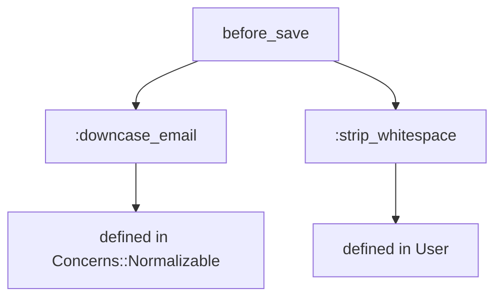
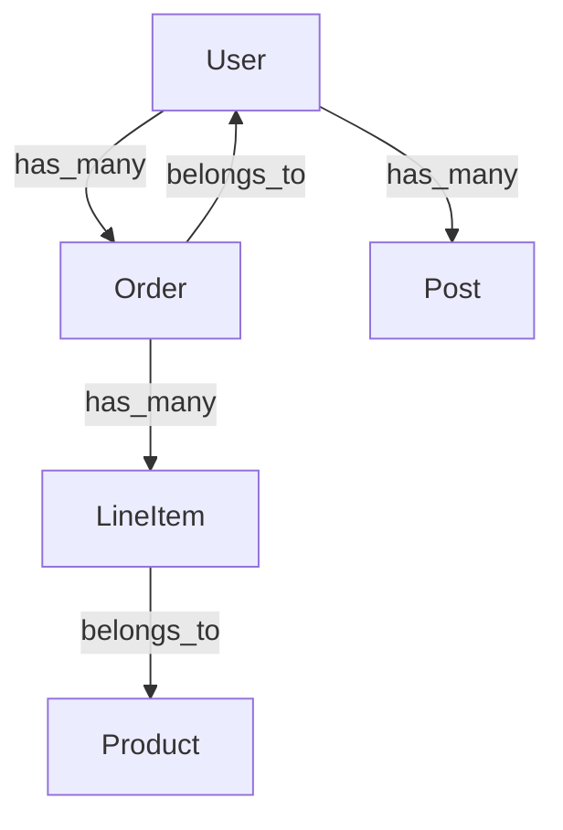
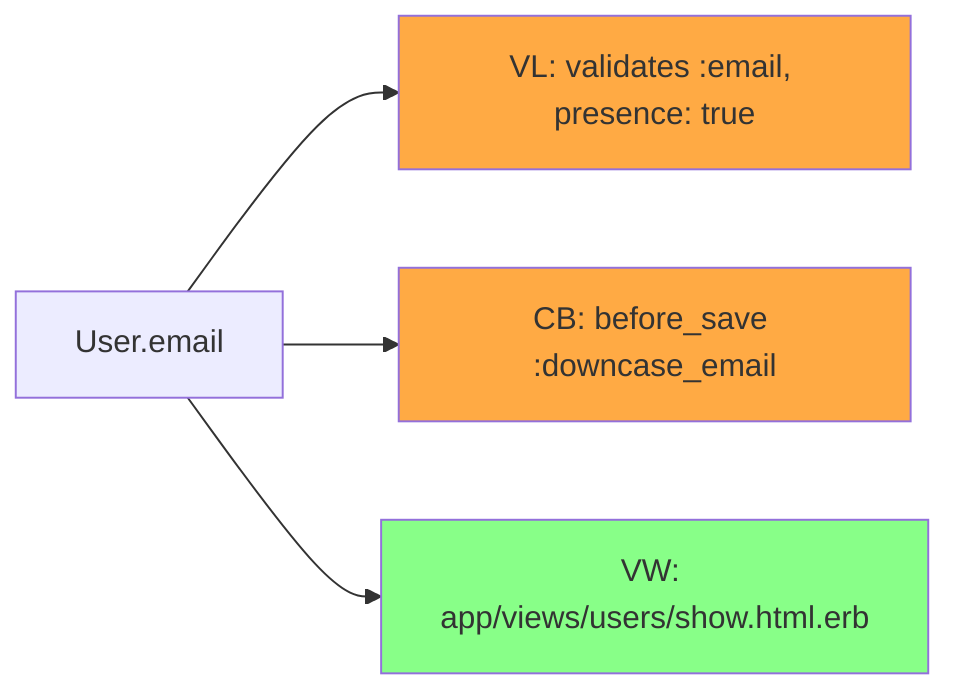
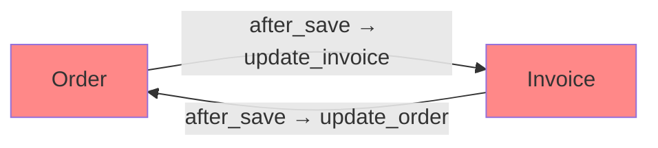
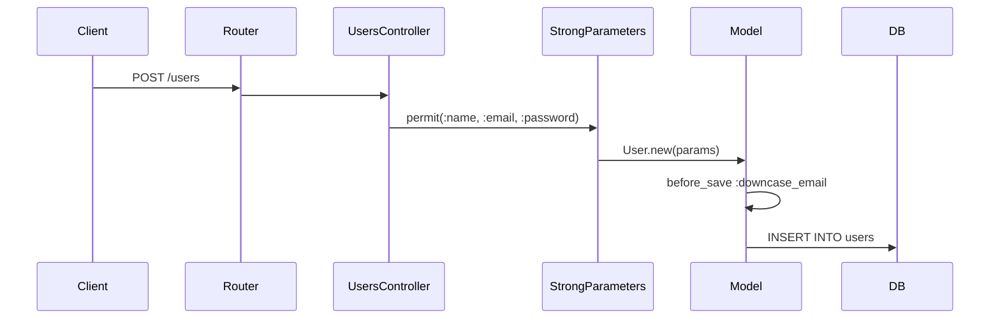

[English](README.md)

# rails-lens

[](https://github.com/ei-nakamura/rails-lens/actions/workflows/ci.yml)
[](https://badge.fury.io/py/rails-lens)
[](https://pypi.org/project/rails-lens/)

AIコーディングツール向けに、Railsの暗黙的な依存関係を可視化するMCPサーバー。

## 概要

rails-lensは、RubyonRailsアプリケーションの構造を抽出し、Claude CodeやCursorなどのAIコーディングツールへ提供するMCP（Model Context Protocol）サーバーです。
コールバック、アソシエーション、コンサーン、動的メソッド生成といったRailsの暗黙的な依存関係をAIツールが理解できるよう支援します。

**18のツール**でAIアシスタントにRailsアプリケーションの深い洞察を提供します:

**Phase 1〜4（コアイントロスペクション）**
- コールバック・アソシエーション・バリデーション付きでモデルをイントロスペクト
- コードベース全体からメソッドやクラスへの参照を検索
- コンサーンや親クラスからの継承を含む完全なコールバックチェーンをトレース
- モデル間の依存グラフを生成
- データベーススキーマとルーティングをダンプ
- 共有コンサーンを解析
- イントロスペクションキャッシュを管理

**Phase 5〜8（高度な分析）**
- メソッド解決順序（MRO）と祖先チェーンを説明
- Gemが注入するメソッドとコールバックを調査
- カラムやメソッド変更の影響範囲を分析
- モデルやメソッドに対応するテストファイルをマッピング
- 未使用コード（デッドコード）を検出
- モデル間の循環依存を検出
- Fat ModelからのConcern切り出し候補を提示
- HTTPリクエストからDBまでのデータフローを追跡
- マイグレーションコンテキストと安全性警告を提供

## インストール

```bash
pip install rails-lens
```

## ツール一覧

### Phase 1〜4: コアイントロスペクション

---

### `rails_lens_introspect_model`

単一のRailsモデルをイントロスペクトし、コールバック・アソシエーション・バリデーション・スコープ・クラスメソッドを返します。

**ユースケース:** モデルを変更する前に、その全体的な振る舞いを把握する。

**パラメータ:**
- `model_name` (string, 必須): Railsモデルのクラス名（例: `"User"`, `"Order"`）
- `include_inherited` (boolean, 任意): 継承されたコールバックを含めるか。デフォルト: `true`

**出力例:**
```
Model: User
Callbacks:
  before_save: :downcase_email, :strip_whitespace
  after_create: :send_welcome_email
Associations:
  has_many: :orders, :posts
  belongs_to: :organization
Validations:
  validates :email, presence: true, uniqueness: true
```

---

### `rails_lens_list_models`

Railsアプリケーション内の全ActiveRecordモデルクラスを一覧表示します。

**ユースケース:** 特定のモデルを調べる前に、データモデル全体を把握する。

**パラメータ:** なし

**出力例:**
```
Models (12):
  User, Order, Product, Category, Tag, Comment,
  Organization, Role, Permission, Session, AuditLog, Setting
```

---

### `rails_lens_find_references`

高速テキスト検索を使って、指定したメソッドまたはクラス名へのすべての参照をコードベースから検索します。

**ユースケース:** メソッドをリネームまたは削除する前に、呼び出し箇所をすべて確認する。

**パラメータ:**
- `name` (string, 必須): 検索するメソッドまたはクラス名
- `file_pattern` (string, 任意): 検索対象を絞るGlobパターン（例: `"app/**/*.rb"`）

**出力例:**
```
References to "send_welcome_email" (3 found):
  app/models/user.rb:42    after_create :send_welcome_email
  app/mailers/user_mailer.rb:8    def send_welcome_email(user)
  spec/models/user_spec.rb:15    expect(user).to receive(:send_welcome_email)
```

---

### `rails_lens_trace_callback_chain`

コンサーンや親クラスからのフックを含む、モデルイベントの完全なコールバックチェーンをトレースします。

**ユースケース:** モデルのイベントを変更する前に、コールバックによる予期しない動作を把握する。

**パラメータ:**
- `model_name` (string, 必須): Railsモデルのクラス名
- `event` (string, 必須): コールバックイベント（例: `"before_save"`, `"after_create"`）

**出力例（Mermaid図）:**


---

### `rails_lens_dependency_graph`

モデル間のアソシエーションを示す依存グラフを生成します。

**ユースケース:** リファクタリングやデータマイグレーションの前に、モデル間の依存関係を把握する。

**パラメータ:**
- `root_model` (string, 任意): グラフの起点モデル。省略時は全モデルをグラフ化。
- `depth` (integer, 任意): 最大トラバース深度。デフォルト: `2`

**出力例（Mermaid図）:**


---

### `rails_lens_get_schema`

`db/schema.rb` から現在のデータベーススキーマを構造化された形式でダンプします。

**ユースケース:** マイグレーションを書く前に、カラムの型と制約を確認する。

**パラメータ:**
- `table_name` (string, 任意): 特定のテーブルに絞り込む。省略時は全テーブルを返す。

**出力例:**
```
Table: users
  id: bigint, primary key
  email: string, not null, unique
  created_at: datetime, not null
  updated_at: datetime, not null
```

---

### `rails_lens_get_routes`

`config/routes.rb` または `rails routes` 出力から定義済みの全Railsルーティングを返します。

**ユースケース:** 利用可能なルーティングとそのコントローラマッピングを確認する。

**パラメータ:**
- `filter` (string, 任意): パスまたはコントローラ名でルーティングを絞り込む

**出力例:**
```
GET    /users          users#index
POST   /users          users#create
GET    /users/:id      users#show
PATCH  /users/:id      users#update
DELETE /users/:id      users#destroy
```

---

### `rails_lens_analyze_concern`

Railsコンサーンモジュールを解析し、インジェクトされるメソッド・コールバック・バリデーションを一覧表示します。

**ユースケース:** コンサーンをincludeまたは削除する前に、そのモデルへの影響を把握する。

**パラメータ:**
- `concern_name` (string, 必須): コンサーンモジュール名（例: `"Normalizable"`, `"Auditable"`）

**出力例:**
```
Concern: Concerns::Auditable
Injects callbacks:
  before_create: :set_creator
  before_update: :set_updater
Injects methods:
  :created_by_name, :updated_by_name
Injects validations:
  validates :creator, presence: true
```

---

### `rails_lens_refresh_cache`

Railsスクリプトを再実行してイントロスペクションキャッシュをクリア・再構築します。

**ユースケース:** 新しいモデルを追加したり既存モデルを変更した後に、古いキャッシュを更新する。

**パラメータ:**
- `model_name` (string, 任意): 特定モデルのキャッシュのみリフレッシュ。省略時は全キャッシュをリフレッシュ。

**出力例:**
```
Cache refreshed for: User, Order, Product (3 models)
Duration: 4.2s
```

---

### Phase 5: メソッド解決・Gemイントロスペクション

---

### `rails_lens_explain_method_resolution`

Railsモデルのメソッド解決順序（MRO）・祖先チェーン・メソッドオーナーを返します。

**ユースケース:** 複数のモジュールやコンサーンがincludeされている場合に、メソッドがどこで定義されているかを把握する。

**パラメータ:**
- `model_name` (string, 必須): Railsモデルのクラス名
- `method_name` (string, 任意): 特定のメソッドを検索する。省略時は祖先チェーン全体を返す。
- `show_internal` (boolean, 任意): Ruby/Rails内部モジュールを含めるか。デフォルト: `false`

**出力例:**
```json
{
  "model_name": "User",
  "method_owner": "Concerns::Normalizable",
  "ancestors": ["User", "Concerns::Auditable", "Concerns::Normalizable", "ApplicationRecord"],
  "super_chain": ["Concerns::Normalizable#downcase_email"],
  "monkey_patches": []
}
```

---

### `rails_lens_gem_introspect`

Gemがモデルに注入するメソッド・コールバック・ルートを返します。

**ユースケース:** Devise、Paranoia、PaperTrailなどのGemがモデルに何を追加しているかを調査する。

**パラメータ:**
- `model_name` (string, 必須): Railsモデルのクラス名
- `gem_name` (string, 任意): 特定のGemに絞り込む。省略時は全Gemの結果を返す。

**出力例:**
```json
{
  "model_name": "User",
  "gem_methods": [
    {"gem_name": "devise", "method_name": "authenticate", "source_file": null}
  ],
  "gem_callbacks": [
    {"gem_name": "paper_trail", "kind": "after_update", "event": "after_update", "method_name": "record_update"}
  ],
  "gem_routes": []
}
```

---

### Phase 6: 変更安全性

---

### `rails_lens_analyze_impact`

カラムやメソッドを変更・削除した場合の影響範囲（コールバック・バリデーション・ビュー・メーラー・カスケード効果）を分析します。

**ユースケース:** カラムをリネームしたり、メソッドのシグネチャを変更する前にリスクを評価する。

**パラメータ:**
- `model_name` (string, 必須): Railsモデルのクラス名
- `target` (string, 必須): 分析対象のカラム名またはメソッド名
- `change_type` (string, 任意): `remove`（削除）、`rename`（リネーム）、`type_change`（型変更）、`modify`（変更）。デフォルト: `modify`

**出力例（Mermaid図）:**


---

### `rails_lens_test_mapping`

モデルやメソッドに関連するテストファイルを検出し、実行コマンドを返します。

**ユースケース:** モデルやメソッドを変更した後に実行すべきspecを特定する。

**パラメータ:**
- `target` (string, 必須): モデル名（例: `"User"`）またはメソッド指定（例: `"User#activate"`）
- `include_indirect` (boolean, 任意): 間接的なspec（shared_examples、featurespec）を含めるか。デフォルト: `true`

**出力例:**
```json
{
  "target": "User#activate",
  "test_framework": "rspec",
  "direct_tests": [
    {"file": "spec/models/user_spec.rb", "type": "unit", "relevance": "direct"}
  ],
  "indirect_tests": [
    {"file": "spec/features/user_registration_spec.rb", "type": "feature", "relevance": "indirect"}
  ],
  "run_command": "bundle exec rspec spec/models/user_spec.rb spec/features/user_registration_spec.rb"
}
```

---

### Phase 7: リファクタリング

---

### `rails_lens_dead_code`

未使用のメソッド・コールバック・スコープを検出し、削除の安全性をconfidence付きで報告します。

**ユースケース:** クリーンアップやリファクタリング時に、安全に削除できる候補を見つける。

**パラメータ:**
- `scope` (string, 任意): 検出スコープ: `models`、`controllers`、`all`。デフォルト: `models`
- `model_name` (string, 任意): 特定のモデルに限定する。
- `confidence` (string, 任意): `high`（確実に未使用）または `medium`（動的呼び出しの可能性あり）。デフォルト: `high`

**出力例:**
```json
{
  "scope": "models",
  "total_methods_analyzed": 42,
  "total_dead_code_found": 3,
  "items": [
    {
      "type": "method", "name": "legacy_export", "file": "app/models/user.rb",
      "line": 87, "confidence": "high", "reason": "No references found",
      "reference_count": 0, "dynamic_call_risk": false
    }
  ]
}
```

---

### `rails_lens_circular_dependencies`

モデル間の循環依存（コールバック相互更新・双方向association）を検出し、Mermaid図で可視化します。

**ユースケース:** スタックオーバーフローやデータ破壊を引き起こす、互いのコールバックをトリガーするモデルを特定する。

**パラメータ:**
- `entry_point` (string, 任意): 特定のモデルを含むサイクルに絞り込む。
- `format` (string, 任意): `mermaid` または `json`。デフォルト: `mermaid`

**出力例（Mermaid図）:**


---

### `rails_lens_extract_concern_candidate`

Fat Modelのメソッドを凝集度で分析し、Concern切り出し候補を根拠付きで提示します。

**ユースケース:** 大きなモデル内の、Concernとして切り出すべき関連メソッドのグループを特定する。

**パラメータ:**
- `model_name` (string, 必須): Railsモデルのクラス名
- `min_cluster_size` (integer, 任意): クラスタあたりの最小メソッド数。デフォルト: `3`

**出力例:**
```json
{
  "model_name": "User",
  "total_methods": 45,
  "candidates": [
    {
      "suggested_name": "Notifiable",
      "methods": ["send_welcome_email", "send_reset_password", "notify_admin"],
      "cohesion_score": 0.87,
      "rationale": "All methods relate to email/notification dispatch"
    }
  ]
}
```

---

### Phase 8: データフロー・マイグレーション

---

### `rails_lens_data_flow`

HTTPリクエストからルーティング・Strong Parameters・コールバックを経てDBまでのデータフローを追跡します。

**ユースケース:** ユーザーが送信した属性を変更する前に、その完全なライフサイクルを把握する。

**パラメータ:**
- `controller_action` (string, 任意): Controller#action（例: `"UsersController#create"`）
- `model_name` (string, 任意): 代替エントリポイントとしてのモデル名
- `attribute` (string, 任意): 追跡する特定の属性。省略時は全属性を追跡。

**出力例（Mermaidシーケンス図）:**


---

### `rails_lens_migration_context`

テーブルのマイグレーションコンテキスト（現在のスキーマ・マイグレーション履歴・安全性警告・テンプレート）を提供します。

**ユースケース:** 大規模テーブルへのマイグレーションを書く前に、関連コンテキストと安全性チェックをすべて取得する。

**パラメータ:**
- `table_name` (string, 必須): テーブル名（例: `"users"`）
- `operation` (string, 任意): 予定されている操作: `add_column`、`remove_column`、`add_index`、`change_column`、`add_reference`、`general`。デフォルト: `general`

**出力例:**
```json
{
  "table_name": "users",
  "operation": "add_column",
  "estimated_row_count": 2500000,
  "warnings": [
    {
      "type": "large_table",
      "message": "テーブルに約250万行あります。デフォルト値なしのNOT NULLカラム追加はテーブルをロックします。",
      "suggestion": "デフォルト値付きで`add_column`し、バックフィル後にNOT NULL制約を追加してください。"
    }
  ],
  "template": {
    "description": "大規模テーブルへのカラム追加（デフォルト値付き）",
    "code": "add_column :users, :new_column, :string, default: nil\n# backfill...\nchange_column_null :users, :new_column, false"
  }
}
```

---

## Webダッシュボード

rails-lensにはブラウザでRailsプロジェクト構造を可視化するWebダッシュボードが内蔵されています。

### インストール

```bash
pip install rails-lens[web]
```

### 起動方法

```bash
uvicorn rails_lens.web.app:app --host 0.0.0.0 --port 8000
```

Pythonモジュールとして起動する場合:

```bash
python -m rails_lens.web
```

### ページ一覧

**コア（6ページ）**
| ページ | URL | 説明 |
|--------|-----|------|
| ダッシュボードTOP | `/` | プロジェクト概要、モデル数、キャッシュ状態 |
| モデル一覧 | `/models` | 全モデルのカラム数・アソシエーション数 |
| モデル詳細 | `/models/{name}` | スキーマ、コールバック、Mermaidコールバックチェーン |
| ERダイアグラム | `/er` | エンティティ関連図（Mermaid erDiagram） |
| 依存グラフ | `/graph/{name}` | モデル依存グラフ（Mermaid graph LR） |
| キャッシュ管理 | `/cache` | キャッシュ状態、無効化コントロール |

**拡張（5ページ）**
| ページ | URL | 説明 |
|--------|-----|------|
| プロジェクトヘルス | `/health` | 循環依存・デッドコード概要 |
| リクエストフロー | `/flow` | HTTPリクエスト→DBフロー（Mermaid sequenceDiagram） |
| 影響範囲分析 | `/impact/{name}` | 変更影響範囲の可視化 |
| リファクタリング支援 | `/refactor/{name}` | Concern切り出し候補 |
| Gem情報 | `/gems` | インストール済みGemとRails統合情報 |

### 技術スタック

FastAPI + Jinja2 + [PicoCSS](https://picocss.com/) + [Mermaid.js](https://mermaid.js.org/)

全ダイアグラムはMermaid.jsによりブラウザ上でレンダリングされます — サーバーサイドの画像生成は不要です。

## 設定

### Claude Code (`~/.claude/claude_desktop_config.json`)

```json
{
  "mcpServers": {
    "rails-lens": {
      "command": "rails-lens",
      "env": {
        "RAILS_LENS_PROJECT_PATH": "/path/to/your/rails/project"
      }
    }
  }
}
```

### Cursor (`.cursor/mcp.json`)

```json
{
  "mcpServers": {
    "rails-lens": {
      "command": "rails-lens",
      "env": {
        "RAILS_LENS_PROJECT_PATH": "/path/to/your/rails/project"
      }
    }
  }
}
```

### `.rails-lens.toml`（任意、Railsプロジェクトのルートに配置）

```toml
[rails]
project_path = "/path/to/rails/project"
timeout = 30

[cache]
auto_invalidate = true

[search]
command = "rg"
```

## 開発者向けセットアップ

```bash
git clone https://github.com/ei-nakamura/rails-lens.git
cd rails-lens
pip install -e ".[dev]"
pytest tests/
```

カバレッジ付きで実行:

```bash
pytest tests/ --cov=src/rails_lens --cov-report=term-missing
```

コントリビューションガイドは [CONTRIBUTING.md](CONTRIBUTING.md) を参照してください。

## ライセンス

MIT
