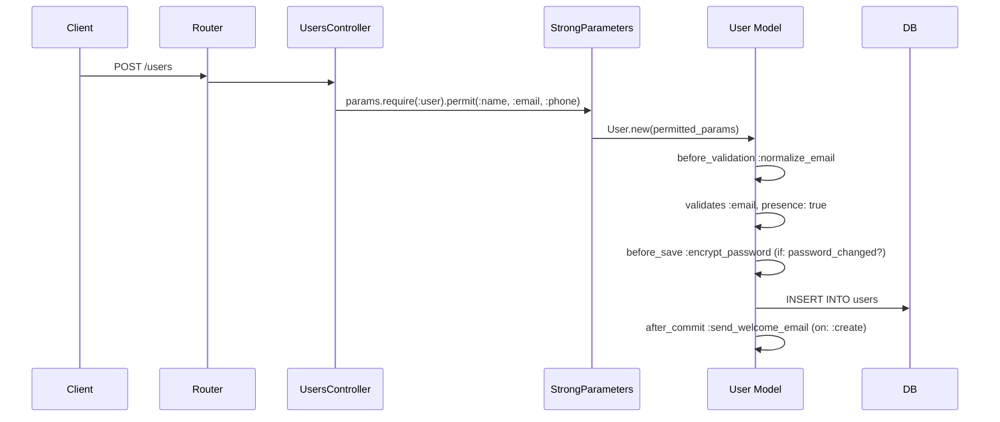

# rails-lens 追加機能設計書

> **バージョン**: 1.0.0
> **最終更新**: 2026-03-28
> **ステータス**: 設計確定・実装前
> **前提ドキュメント**: [REQUIREMENTS.md](./REQUIREMENTS.md)

---

## 目次

1. [概要](#1-概要)
2. [カテゴリA: 変更の安全性を担保する](#2-カテゴリa-変更の安全性を担保する)
   - [A-1. rails_lens_impact_analysis](#a-1-rails_lens_impact_analysis)
   - [A-2. rails_lens_test_mapping](#a-2-rails_lens_test_mapping)
3. [カテゴリB: コードの「なぜ」を理解する](#3-カテゴリb-コードのなぜを理解する)
   - [B-1. rails_lens_explain_method_resolution](#b-1-rails_lens_explain_method_resolution)
   - [B-2. rails_lens_data_flow](#b-2-rails_lens_data_flow)
4. [カテゴリC: リファクタリング支援](#4-カテゴリc-リファクタリング支援)
   - [C-1. rails_lens_dead_code](#c-1-rails_lens_dead_code)
   - [C-2. rails_lens_circular_dependencies](#c-2-rails_lens_circular_dependencies)
   - [C-3. rails_lens_extract_concern_candidate](#c-3-rails_lens_extract_concern_candidate)
5. [カテゴリD: 既存の仕組みとの統合](#5-カテゴリd-既存の仕組みとの統合)
   - [D-1. rails_lens_gem_introspect](#d-1-rails_lens_gem_introspect)
   - [D-2. rails_lens_migration_context](#d-2-rails_lens_migration_context)
6. [実装フェーズ](#6-実装フェーズ)

---

## 1. 概要

本ドキュメントは、[REQUIREMENTS.md](./REQUIREMENTS.md) で定義された rails-lens の基盤（Phase 1〜4）の上に構築する追加機能を定義する。

### 設計原則

既存アーキテクチャの以下の原則を踏襲する:

| 原則 | 内容 |
|---|---|
| **ハイブリッド構成** | Python（FastMCP + ツール定義）+ Ruby（ランタイムイントロスペクション）|
| **共通ブリッジパターン** | 全ランタイム解析は `bridge/runner.py` 経由で `bundle exec rails runner` を実行 |
| **ツール登録パターン** | `register(mcp, get_deps)` による遅延初期化 |
| **キャッシュ戦略** | ファイルベースJSONキャッシュ + mtime自動無効化 |
| **構造化出力** | Pydanticモデルによる型安全な入出力 + JSON文字列返却 |
| **アノテーション** | 全ツール `readOnlyHint=True`, `destructiveHint=False`, `idempotentHint=True` |

### ツール一覧

| ID | ツール名 | カテゴリ | 解析方式 | 難易度 |
|---|---|---|---|---|
| A-1 | `rails_lens_impact_analysis` | 変更安全性 | ランタイム + 静的解析 | L |
| A-2 | `rails_lens_test_mapping` | 変更安全性 | 静的解析 | M |
| B-1 | `rails_lens_explain_method_resolution` | コード理解 | ランタイム | S |
| B-2 | `rails_lens_data_flow` | コード理解 | ランタイム + 静的解析 | L |
| C-1 | `rails_lens_dead_code` | リファクタリング | 静的解析 + ランタイム補完 | L |
| C-2 | `rails_lens_circular_dependencies` | リファクタリング | ランタイム | M |
| C-3 | `rails_lens_extract_concern_candidate` | リファクタリング | 静的解析 + ランタイム | M |
| D-1 | `rails_lens_gem_introspect` | 統合 | ランタイム | M |
| D-2 | `rails_lens_migration_context` | 統合 | ランタイム + 静的解析 | M |

---

## 2. カテゴリA: 変更の安全性を担保する

### A-1. rails_lens_impact_analysis

#### 解決する課題と利用シーン

**課題**: `introspect_model` はモデルの「現在の状態」のスナップショットを返すが、「あるカラムやメソッドを変更した場合、何が壊れるか」という**変更の波及経路**は返さない。AIは変更前に影響範囲を網羅的に把握できず、関連するバリデーション・ビュー・メーラー等の修正漏れが発生する。

**利用シーン**:
- AIが「Userモデルのemailカラムの型を変更して」と依頼されたとき、変更前にこのツールを呼び、影響を受けるバリデーション・ビュー・メーラーを特定し、全箇所を同時に修正する
- カラムの削除やリネーム前に、依存するスコープ・シリアライザ・ActiveJobを把握する
- `dependent: :destroy` 等のカスケード影響を事前に確認する

#### ツール仕様

##### 入力スキーマ

```json
{
  "type": "object",
  "required": ["model_name", "target"],
  "properties": {
    "model_name": {
      "type": "string",
      "description": "対象モデル名（例: 'User', 'Admin::Company'）",
      "minLength": 1,
      "maxLength": 200
    },
    "target": {
      "type": "string",
      "description": "影響分析の対象（カラム名 or メソッド名）",
      "minLength": 1
    },
    "change_type": {
      "type": "string",
      "description": "変更の種別",
      "enum": ["remove", "rename", "type_change", "modify"],
      "default": "modify"
    }
  }
}
```

##### Pydanticモデル定義

```python
class ImpactAnalysisInput(BaseModel):
    model_config = ConfigDict(str_strip_whitespace=True)
    model_name: str = Field(
        ...,
        description="ActiveRecord model name (e.g., 'User', 'Admin::Company')",
        min_length=1,
        max_length=200,
    )
    target: str = Field(
        ...,
        description="Column or method name to analyze impact for",
        min_length=1,
    )
    change_type: str = Field(
        "modify",
        description="Type of change: remove, rename, type_change, modify",
    )


class ImpactItem(BaseModel):
    category: str          # "callback", "validation", "scope", "view", "mailer",
                           # "serializer", "job", "association_cascade", "controller"
    file: str
    line: int
    description: str       # 人間可読な影響の説明
    severity: str          # "breaking", "warning", "info"
    code_snippet: str = "" # 該当コード断片


class CascadeEffect(BaseModel):
    source_model: str
    target_model: str
    relation: str          # "dependent_destroy", "dependent_nullify", "touch", etc.
    description: str


class ImpactAnalysisOutput(BaseModel):
    model_name: str
    target: str
    change_type: str
    target_type: str                         # "column" or "method"（自動判定結果）
    direct_impacts: list[ImpactItem] = Field(default_factory=list)
    cascade_effects: list[CascadeEffect] = Field(default_factory=list)
    affected_files: list[str] = Field(default_factory=list)   # 修正が必要なファイル一覧
    summary: str = ""                        # 影響の要約テキスト
```

##### 出力例

```json
{
  "model_name": "User",
  "target": "email",
  "change_type": "remove",
  "target_type": "column",
  "direct_impacts": [
    {
      "category": "validation",
      "file": "app/models/user.rb",
      "line": 15,
      "description": "validates :email, presence: true, uniqueness: true が失敗する",
      "severity": "breaking",
      "code_snippet": "validates :email, presence: true, uniqueness: true"
    },
    {
      "category": "callback",
      "file": "app/models/concerns/emailable.rb",
      "line": 8,
      "description": "before_save :normalize_email が存在しないカラムを参照する",
      "severity": "breaking",
      "code_snippet": "before_save :normalize_email"
    },
    {
      "category": "mailer",
      "file": "app/mailers/user_mailer.rb",
      "line": 12,
      "description": "UserMailer#welcome で user.email を参照している",
      "severity": "breaking",
      "code_snippet": "mail(to: user.email)"
    },
    {
      "category": "view",
      "file": "app/views/users/_form.html.erb",
      "line": 8,
      "description": "フォームで email フィールドを使用している",
      "severity": "breaking",
      "code_snippet": "<%= f.email_field :email %>"
    },
    {
      "category": "scope",
      "file": "app/models/user.rb",
      "line": 25,
      "description": "scope :with_email が email カラムを参照している",
      "severity": "breaking",
      "code_snippet": "scope :with_email, -> { where.not(email: nil) }"
    }
  ],
  "cascade_effects": [],
  "affected_files": [
    "app/models/user.rb",
    "app/models/concerns/emailable.rb",
    "app/mailers/user_mailer.rb",
    "app/views/users/_form.html.erb"
  ],
  "summary": "emailカラムの削除により5箇所が破壊的影響を受けます（バリデーション1件、コールバック1件、メーラー1件、ビュー1件、スコープ1件）"
}
```

#### 実装方針: ハイブリッド（ランタイム + 静的解析）

**ランタイム解析**（Rubyスクリプト: `ruby/impact_analysis.rb`）:
1. `introspect_model` のキャッシュ結果を再利用し、対象がカラムかメソッドかを判定
2. 対象カラム/メソッドに依存するコールバック、バリデーション、スコープを `__callbacks` / `validators` から抽出
3. `reflect_on_all_associations` で `dependent:` オプションを持つ関連を特定し、カスケード影響を算出
4. `accepts_nested_attributes_for` による間接的な依存も検出

**静的解析**（Python側: `analyzers/impact_search.py`）:
1. `GrepSearch` を拡張し、ビューテンプレート（ERB/Haml/Slim）内の参照を検索
2. メーラー、ジョブ、シリアライザ内の参照を `rg` で検索
3. コントローラでの Strong Parameters 参照を検出

**処理フロー**:
```
1. bridge.execute("impact_analysis.rb", [model_name, target])
   → コールバック・バリデーション・スコープ・カスケードの依存情報を取得
2. grep.search(target, scope="views")      → ビュー参照
3. grep.search(target, scope="mailers")    → メーラー参照
4. grep.search(target, scope="jobs")       → ジョブ参照
5. grep.search(target, scope="serializers") → シリアライザ参照
6. 結果をマージし、severity を change_type に基づいて付与
```

#### 既存ツールとの連携

| 既存ツール | 連携方法 |
|---|---|
| `introspect_model` | キャッシュからモデルの全体像（カラム一覧、コールバック、バリデーション）を取得。二重のランタイム解析を回避 |
| `find_references` | 静的解析部分で `GrepSearch` を共有。ビュー・メーラー・ジョブ内の参照検索に使用 |
| `trace_callback_chain` | コールバック連鎖による間接的な影響の追跡に結果を利用可能 |
| `dependency_graph` | カスケード影響の可視化に依存グラフのデータを再利用可能 |

#### 難易度と工数: L（大）

- ランタイム解析 + 静的解析の組み合わせが複雑
- ビューテンプレートのパース（ERB/Haml/Slim）の対応範囲が広い
- severity 判定のロジックが change_type ごとに異なる
- 新規Rubyスクリプト + Python側アナライザの両方が必要

---

### A-2. rails_lens_test_mapping

#### 解決する課題と利用シーン

**課題**: AIがコードを変更した後、「どのテストを実行すべきか」が不明確。Railsの規約ベースの対応（`spec/models/user_spec.rb`）は把握できるが、shared_examples での間接テスト、フィーチャスペックでの統合テスト、factory定義の所在は見えない。

**利用シーン**:
- AIがUserモデルを変更した後、`bundle exec rspec <ファイルリスト>` をそのまま実行できる形式でテストファイルを返す
- 間接的にテストしているspec（shared_examples経由）も含めて漏れなく検出する
- FactoryBotのファクトリ定義の所在を特定し、テストデータの整合性確認に使う

#### ツール仕様

##### 入力スキーマ

```json
{
  "type": "object",
  "required": ["target"],
  "properties": {
    "target": {
      "type": "string",
      "description": "モデル名（例: 'User'）または メソッド指定（例: 'User#activate'）",
      "minLength": 1
    },
    "include_indirect": {
      "type": "boolean",
      "description": "間接的にテストしているspecも含めるか",
      "default": true
    }
  }
}
```

##### Pydanticモデル定義

```python
class TestMappingInput(BaseModel):
    model_config = ConfigDict(str_strip_whitespace=True)
    target: str = Field(
        ...,
        description="Model name (e.g., 'User') or method spec (e.g., 'User#activate')",
        min_length=1,
    )
    include_indirect: bool = Field(
        True,
        description="Include indirectly testing specs (shared_examples, feature specs)",
    )


class TestFile(BaseModel):
    file: str
    type: str               # "unit", "request", "feature", "shared_example", "factory"
    relevance: str           # "direct", "indirect"
    matched_examples: list[str] = Field(default_factory=list)  # テストケース名


class TestMappingOutput(BaseModel):
    target: str
    test_framework: str      # "rspec" or "minitest"
    direct_tests: list[TestFile] = Field(default_factory=list)
    indirect_tests: list[TestFile] = Field(default_factory=list)
    factories: list[TestFile] = Field(default_factory=list)
    run_command: str = ""    # "bundle exec rspec <files>" 形式
```

##### 出力例

```json
{
  "target": "User",
  "test_framework": "rspec",
  "direct_tests": [
    {
      "file": "spec/models/user_spec.rb",
      "type": "unit",
      "relevance": "direct",
      "matched_examples": ["#activate", "#deactivate", "validations"]
    }
  ],
  "indirect_tests": [
    {
      "file": "spec/support/shared_examples/activatable.rb",
      "type": "shared_example",
      "relevance": "indirect",
      "matched_examples": ["behaves like activatable"]
    },
    {
      "file": "spec/requests/users_spec.rb",
      "type": "request",
      "relevance": "indirect",
      "matched_examples": ["POST /users", "PATCH /users/:id"]
    }
  ],
  "factories": [
    {
      "file": "spec/factories/users.rb",
      "type": "factory",
      "relevance": "direct",
      "matched_examples": ["factory :user", "trait :admin"]
    }
  ],
  "run_command": "bundle exec rspec spec/models/user_spec.rb spec/support/shared_examples/activatable.rb spec/requests/users_spec.rb"
}
```

#### 実装方針: 静的解析

全て静的解析で実装する。`rails runner` は不要。

**Python側**（`analyzers/test_mapper.py`）:
1. テストフレームワークの判定: `spec/` ディレクトリの存在で RSpec、`test/` ディレクトリで minitest を判定
2. 規約ベースのマッピング:
   - RSpec: `spec/models/<model_name_snake>_spec.rb`
   - minitest: `test/models/<model_name_snake>_test.rb`
3. `GrepSearch` で以下を検索:
   - `spec/` 全体から対象モデル名/メソッド名の参照
   - `spec/factories/` からファクトリ定義
   - `spec/support/shared_examples/` から shared_examples
   - `spec/requests/` / `spec/features/` から統合テスト
4. メソッド指定（`User#activate`）の場合、`describe '#activate'` や `it 'activates'` のパターンで絞り込み

#### 既存ツールとの連携

| 既存ツール | 連携方法 |
|---|---|
| `find_references` | `GrepSearch` インスタンスを共有し、テストファイル内の参照検索に使用 |
| `list_models` | モデル名の正規化（名前空間の解決）に利用 |

#### 難易度と工数: M（中）

- 静的解析のみで完結するため実装はシンプル
- テストフレームワーク（RSpec / minitest）の両対応が必要
- shared_examples の間接参照の追跡がやや複雑

---

## 3. カテゴリB: コードの「なぜ」を理解する

### B-1. rails_lens_explain_method_resolution

#### 解決する課題と利用シーン

**課題**: 複数のConcernが include されたモデルで、メソッドの定義元が不明瞭。`super` がどこに委譲されるかは `Model.ancestors` チェーンを見ないとわからず、AIが意図せず既存メソッドをオーバーライドしたり、存在しないメソッドを呼んでしまう。

**利用シーン**:
- AIが「Userモデルに validate メソッドを追加して」と頼まれたとき、同名メソッドが既存Concernで定義されていないか確認する
- `super` 呼び出しの委譲先を明示し、Concern の挿入順序が引き起こすバグを防ぐ
- Gem由来のモジュール（Devise等）によるモンキーパッチを検出する

#### ツール仕様

##### 入力スキーマ

```json
{
  "type": "object",
  "required": ["model_name"],
  "properties": {
    "model_name": {
      "type": "string",
      "description": "対象モデル名",
      "minLength": 1,
      "maxLength": 200
    },
    "method_name": {
      "type": "string",
      "description": "解決経路を調べるメソッド名（省略時はancestorsチェーン全体を返す）"
    },
    "show_internal": {
      "type": "boolean",
      "description": "ActiveRecord/ActiveModel内部モジュールも表示するか",
      "default": false
    }
  }
}
```

##### Pydanticモデル定義

```python
class MethodResolutionInput(BaseModel):
    model_config = ConfigDict(str_strip_whitespace=True)
    model_name: str = Field(
        ...,
        description="ActiveRecord model name",
        min_length=1,
        max_length=200,
    )
    method_name: str | None = Field(
        None,
        description="Method name to trace resolution for (optional)",
    )
    show_internal: bool = Field(
        False,
        description="Include ActiveRecord/ActiveModel internal modules",
    )


class AncestorEntry(BaseModel):
    name: str
    type: str                        # "self", "concern", "gem_module", "active_record_internal", "ruby_core"
    defines_target_method: bool = False
    is_method_owner: bool = False     # instance_method(:name).owner == this
    source_file: str | None = None


class MethodResolutionOutput(BaseModel):
    model_name: str
    method_name: str | None = None
    ancestors: list[AncestorEntry] = Field(default_factory=list)
    method_owner: str | None = None   # メソッドの実際の定義元
    super_chain: list[str] = Field(default_factory=list)  # super 呼び出し時の委譲順序
    monkey_patches: list[str] = Field(default_factory=list)  # Gem由来のオーバーライド検出
```

##### 出力例

```json
{
  "model_name": "User",
  "method_name": "save",
  "ancestors": [
    { "name": "User", "type": "self", "defines_target_method": false, "is_method_owner": false, "source_file": "app/models/user.rb" },
    { "name": "Auditable", "type": "concern", "defines_target_method": false, "is_method_owner": false, "source_file": "app/models/concerns/auditable.rb" },
    { "name": "Devise::Models::DatabaseAuthenticatable", "type": "gem_module", "defines_target_method": false, "is_method_owner": false, "source_file": null },
    { "name": "ActiveRecord::Base", "type": "active_record_internal", "defines_target_method": true, "is_method_owner": true, "source_file": null }
  ],
  "method_owner": "ActiveRecord::Base",
  "super_chain": ["ActiveRecord::Base"],
  "monkey_patches": []
}
```

#### 実装方針: ランタイム解析

**Rubyスクリプト**: `ruby/method_resolution.rb`

```ruby
# 主要な処理ロジック
model_name = ARGV[0]
method_name = ARGV[1]  # optional
show_internal = ARGV[2] == "true"

klass = model_name.constantize

ancestors_data = klass.ancestors.map do |ancestor|
  type = classify_ancestor(ancestor)  # self, concern, gem_module, etc.
  next if !show_internal && type == "active_record_internal"

  entry = {
    name: ancestor.name || ancestor.to_s,
    type: type,
    defines_target_method: method_name ? ancestor.method_defined?(method_name.to_sym) : false,
    is_method_owner: false,
    source_file: detect_source_file(ancestor)
  }
  entry
end.compact

if method_name
  owner = klass.instance_method(method_name.to_sym).owner
  # ancestors_data 内の owner にフラグを立てる
  # super_chain を構築
end
```

ランタイムでのみ取得可能な情報:
- `Model.ancestors` の正確な順序
- `Model.instance_method(:name).owner` による実際の定義元
- Gem由来モジュールの検出（`source_location` が gem パス内かどうか）

#### 既存ツールとの連携

| 既存ツール | 連携方法 |
|---|---|
| `introspect_model` | `concerns` セクションのキャッシュを利用し、Concernのソースファイルパスを取得 |
| `list_models` | モデル名のバリデーションに利用 |

#### 難易度と工数: S（小）

- Rubyの `ancestors` / `instance_method` APIで大部分が取得可能
- Rubyスクリプト1本 + Pythonツール定義1本で完結
- 静的解析が不要

---

### B-2. rails_lens_data_flow

#### 解決する課題と利用シーン

**課題**: HTTPリクエストのパラメータがDBに保存されるまでの経路が見えない。ルーティング→Strong Parameters→モデルのattribute assignment→コールバックという流れを一本の線で追跡できないと、AIは「新しいパラメータを追加したい」ときに正しい場所（permit リスト、バリデーション、ビューのフォーム）を全て修正できない。

**利用シーン**:
- 「Userモデルに phone カラムを追加したい」とき、既存のデータフローに沿ってStrong Parameters の permit リスト、バリデーション、ビューのフォームに漏れなくコードを追加する
- `accepts_nested_attributes_for` による関連モデルへのパラメータ伝播を把握する
- コールバックによる値の変換（`before_save :normalize_phone`）を見落とさない

#### ツール仕様

##### 入力スキーマ

```json
{
  "type": "object",
  "properties": {
    "controller_action": {
      "type": "string",
      "description": "コントローラ#アクション形式（例: 'UsersController#create'）"
    },
    "model_name": {
      "type": "string",
      "description": "モデル名（controller_action の代わりに指定可能）"
    },
    "attribute": {
      "type": "string",
      "description": "追跡する属性名（省略時は全属性のフローを返す）"
    }
  }
}
```

##### Pydanticモデル定義

```python
class DataFlowInput(BaseModel):
    model_config = ConfigDict(str_strip_whitespace=True)
    controller_action: str | None = Field(
        None,
        description="Controller#action (e.g., 'UsersController#create')",
    )
    model_name: str | None = Field(
        None,
        description="Model name (alternative to controller_action)",
    )
    attribute: str | None = Field(
        None,
        description="Attribute to trace (optional, traces all if omitted)",
    )


class RouteInfo(BaseModel):
    verb: str
    path: str
    controller: str
    action: str


class StrongParamsInfo(BaseModel):
    file: str
    line: int
    permitted_params: list[str]
    nested_params: dict[str, list[str]] = Field(default_factory=dict)  # accepts_nested_attributes_for


class CallbackTransform(BaseModel):
    kind: str              # "before_save", "before_validation", etc.
    method_name: str
    file: str
    line: int
    description: str       # "email を小文字に正規化" のような説明


class DataFlowStep(BaseModel):
    order: int
    layer: str             # "routing", "strong_params", "assignment", "callback", "nested_propagation"
    description: str
    file: str | None = None
    line: int | None = None
    details: dict[str, Any] = Field(default_factory=dict)


class DataFlowOutput(BaseModel):
    entry_point: str       # controller_action or model_name
    attribute: str | None = None
    route: RouteInfo | None = None
    strong_params: StrongParamsInfo | None = None
    callbacks: list[CallbackTransform] = Field(default_factory=list)
    flow_steps: list[DataFlowStep] = Field(default_factory=list)
    mermaid_diagram: str = ""
```

##### 出力例（Mermaid）



#### 実装方針: ハイブリッド（ランタイム + 静的解析）

**ランタイム解析**（Rubyスクリプト: `ruby/data_flow.rb`）:
1. `Rails.application.routes` からルーティング情報を取得
2. `introspect_model` のキャッシュからコールバック情報を取得
3. `accepts_nested_attributes_for` の設定を `reflect_on_all_associations` と組み合わせて取得

**静的解析**（Python側）:
1. コントローラファイルから Strong Parameters の `permit` 呼び出しを正規表現で抽出
2. ビューテンプレートから `form_for` / `form_with` のフィールド定義を検索

**処理フロー**:
```
1. controller_action が指定された場合:
   a. bridge.execute("data_flow.rb", [controller, action]) → ルーティング + コールバック情報
   b. grep でコントローラファイルから Strong Parameters を抽出
2. model_name が指定された場合:
   a. introspect_model のキャッシュからコールバック・バリデーション情報を取得
   b. grep でコントローラ内の該当モデル操作箇所を検索
3. flow_steps を組み立て、Mermaid図を生成
```

#### 既存ツールとの連携

| 既存ツール | 連携方法 |
|---|---|
| `introspect_model` | コールバック・バリデーション情報をキャッシュから取得 |
| `trace_callback_chain` | コールバック実行順序の詳細データを再利用 |
| `find_references` | コントローラ内のモデル参照箇所の検索 |

#### 難易度と工数: L（大）

- ルーティング→コントローラ→モデル→DBの全レイヤーを横断する解析
- Strong Parameters のパースが正規表現では限界があるケースが存在（動的なpermit等）
- Mermaid図の生成ロジックが複雑

---

## 4. カテゴリC: リファクタリング支援

### C-1. rails_lens_dead_code

#### 解決する課題と利用シーン

**課題**: 大規模Railsアプリでは使われていないメソッド、呼ばれていないコールバック、参照のないスコープが蓄積する。AIがリファクタリングを提案する際、「このメソッドは安全に削除できるか」を判断する根拠が必要。

**利用シーン**:
- リファクタリング前の掃除として、未使用コードを検出し「このメソッドは安全に削除できます」と提案する
- `send` / `public_send` による動的呼び出しの可能性を考慮し、誤検知を抑える
- 特定モデルに絞った分析で、Fat Model の削減対象を特定する

#### ツール仕様

##### 入力スキーマ

```json
{
  "type": "object",
  "properties": {
    "scope": {
      "type": "string",
      "description": "検出範囲",
      "enum": ["models", "controllers", "all"],
      "default": "models"
    },
    "model_name": {
      "type": "string",
      "description": "特定モデルに絞る場合のモデル名"
    },
    "confidence": {
      "type": "string",
      "description": "信頼度フィルタ",
      "enum": ["high", "medium"],
      "default": "high"
    }
  }
}
```

##### Pydanticモデル定義

```python
class DeadCodeInput(BaseModel):
    model_config = ConfigDict(str_strip_whitespace=True)
    scope: str = Field(
        "models",
        description="Detection scope: models, controllers, all",
    )
    model_name: str | None = Field(
        None,
        description="Limit to specific model (optional)",
    )
    confidence: str = Field(
        "high",
        description="Confidence filter: high (certainly unused), medium (possibly dynamic)",
    )


class DeadCodeItem(BaseModel):
    type: str              # "method", "callback", "scope", "validation"
    name: str
    file: str
    line: int
    confidence: str        # "high", "medium"
    reason: str            # "参照箇所が0件", "send経由の可能性あり" 等
    reference_count: int = 0
    dynamic_call_risk: bool = False  # send/public_send で呼ばれる可能性


class DeadCodeOutput(BaseModel):
    scope: str
    model_name: str | None = None
    items: list[DeadCodeItem] = Field(default_factory=list)
    total_methods_analyzed: int = 0
    total_dead_code_found: int = 0
    summary: str = ""
```

#### 実装方針: 静的解析 + ランタイム補完

**静的解析**（`analyzers/dead_code_detector.py`）:
1. `GrepSearch` で対象スコープ内の全メソッド定義を抽出（`def method_name` パターン）
2. 各メソッドに対してコードベース全体から参照カウントを算出
3. 参照カウントが0のものを候補として抽出
4. `send(`, `public_send(`, `method(` パターンでの動的呼び出しを検出し、confidence を下げる

**ランタイム補完**（Rubyスクリプト: `ruby/dead_code_check.rb`）:
1. `introspect_model` のキャッシュからスコープ・コールバック一覧を取得
2. Rakeタスク、APIエンドポイント、Serializer から呼ばれるメソッドを除外リストとして構築

#### 既存ツールとの連携

| 既存ツール | 連携方法 |
|---|---|
| `introspect_model` | モデルのメソッド一覧（class_methods, instance_methods）をキャッシュから取得 |
| `find_references` | 各メソッドの参照カウント算出に `GrepSearch` を共有 |
| `list_models` | 全モデル走査時のモデル名一覧取得 |

#### 難易度と工数: L（大）

- コードベース全体の走査が必要で、パフォーマンスチューニングが重要
- 動的呼び出しの検出ロジックが複雑（`send` の引数が変数の場合等）
- Rakeタスク・Serializer等の除外リスト管理

---

### C-2. rails_lens_circular_dependencies

#### 解決する課題と利用シーン

**課題**: 大規模Railsアプリではモデル間の循環依存が発生しやすい。コールバックで相互更新するモデル、双方向の `has_many :through`、相互参照するバリデーションなどがデッドロックや無限ループの原因になる。

**利用シーン**:
- リファクタリングの優先度判断として、循環依存を可視化する
- 新しいコールバックや関連を追加する前に、循環が生まれないか検証する
- Mermaid図でチームに共有し、設計上の問題を議論する材料にする

#### ツール仕様

##### 入力スキーマ

```json
{
  "type": "object",
  "properties": {
    "entry_point": {
      "type": "string",
      "description": "特定モデルを含む循環のみ表示（省略時は全循環を検出）"
    },
    "format": {
      "type": "string",
      "description": "出力形式",
      "enum": ["mermaid", "json"],
      "default": "mermaid"
    }
  }
}
```

##### Pydanticモデル定義

```python
class CircularDependenciesInput(BaseModel):
    model_config = ConfigDict(str_strip_whitespace=True)
    entry_point: str | None = Field(
        None,
        description="Filter cycles containing this model (optional)",
    )
    format: str = Field(
        "mermaid",
        description="Output format: mermaid or json",
    )


class CyclePath(BaseModel):
    models: list[str]                # ["Order", "User", "Order"] のように循環を表現
    edges: list[GraphEdge]           # 既存の GraphEdge モデルを再利用
    cycle_type: str                  # "callback_mutual", "association_bidirectional",
                                     # "validation_cross_reference"
    severity: str                    # "critical"（無限ループの可能性）, "warning"（設計上の問題）


class CircularDependenciesOutput(BaseModel):
    total_cycles: int = 0
    cycles: list[CyclePath] = Field(default_factory=list)
    mermaid_diagram: str | None = None
    summary: str = ""
```

#### 実装方針: ランタイム解析

**Rubyスクリプト**: `ruby/circular_dependencies.rb`

1. `Rails.application.eager_load!` で全モデルをロード
2. 全モデルの `reflect_on_all_associations` と `__callbacks` を収集
3. 有向グラフを構築:
   - 頂点: モデル
   - 辺: association（has_many/belongs_to）、callback（after_save で他モデルを更新）
4. 深さ優先探索（DFS）で循環を検出
5. 循環の種別を分類し、severity を判定

**Python側**:
- Rubyから受け取ったグラフデータに対して循環検出を実行することも可能だが、Rubyスクリプト内で完結させる方がシンプル
- Python側は Mermaid 図の生成とフォーマット整形を担当

#### 既存ツールとの連携

| 既存ツール | 連携方法 |
|---|---|
| `dependency_graph` | `GraphEdge` モデルを再利用。依存グラフのデータを入力として循環検出に利用可能 |
| `introspect_model` | 各モデルのコールバック情報をキャッシュから取得し、コールバック相互更新の検出に利用 |
| `list_models` | 全モデルの列挙に利用 |

#### 難易度と工数: M（中）

- グラフの循環検出アルゴリズム自体は標準的
- コールバックの相互更新パターンの検出がやや複雑
- 既存の `dependency_graph` のデータ構造を再利用可能

---

### C-3. rails_lens_extract_concern_candidate

#### 解決する課題と利用シーン

**課題**: Fat Model（数百行のモデル）のリファクタリングで、どのメソッド群をConcernに切り出すべきかの判断が難しい。AIが根拠なく分割案を提示すると、凝集度の低いConcernが生まれ、かえって保守性が下がる。

**利用シーン**:
- 「Userモデルが800行あるのでリファクタリングして」と頼まれたとき、AIが凝集度に基づく分割案を提示する
- 既存Concernとの重複がないことを確認した上で提案する
- 各クラスタがアクセスするカラム・メソッドの共通性を根拠として示す

#### ツール仕様

##### 入力スキーマ

```json
{
  "type": "object",
  "required": ["model_name"],
  "properties": {
    "model_name": {
      "type": "string",
      "description": "対象モデル名",
      "minLength": 1,
      "maxLength": 200
    },
    "min_cluster_size": {
      "type": "integer",
      "description": "最小クラスタサイズ",
      "default": 3,
      "minimum": 2,
      "maximum": 10
    }
  }
}
```

##### Pydanticモデル定義

```python
class ExtractConcernInput(BaseModel):
    model_config = ConfigDict(str_strip_whitespace=True)
    model_name: str = Field(
        ...,
        description="ActiveRecord model name",
        min_length=1,
        max_length=200,
    )
    min_cluster_size: int = Field(
        3,
        description="Minimum number of methods in a cluster",
        ge=2,
        le=10,
    )


class MethodNode(BaseModel):
    name: str
    type: str                # "instance_method", "class_method"
    accesses_columns: list[str] = Field(default_factory=list)
    calls_methods: list[str] = Field(default_factory=list)
    source_file: str
    source_line: int
    line_count: int = 0


class ConcernCandidate(BaseModel):
    suggested_name: str      # "Activatable", "Searchable" 等の提案名
    methods: list[str]
    shared_columns: list[str]   # クラスタ内で共通してアクセスされるカラム
    cohesion_score: float       # 0.0〜1.0 の凝集度スコア
    rationale: str              # "これらのメソッドは全て status カラムに関連する操作" 等
    existing_concern_overlap: list[str] = Field(default_factory=list)  # 重複する既存Concern


class ExtractConcernOutput(BaseModel):
    model_name: str
    total_methods: int = 0
    total_lines: int = 0
    candidates: list[ConcernCandidate] = Field(default_factory=list)
    unclustered_methods: list[str] = Field(default_factory=list)  # どのクラスタにも属さないメソッド
    summary: str = ""
```

#### 実装方針: 静的解析 + ランタイム補完

**静的解析**（`analyzers/concern_extractor.py`）:
1. モデルファイルを解析し、メソッド定義とその本体を抽出
2. 各メソッドが参照するインスタンス変数・カラム名を抽出（正規表現: `self\.(\w+)`, カラム名パターン）
3. メソッド間の呼び出し関係をグラフ化（`method_a` 内で `method_b` を呼んでいるか）
4. 共通カラムアクセスと呼び出し関係に基づいてクラスタリング（Union-Find or 連結成分分析）

**ランタイム補完**（`introspect_model` のキャッシュを利用）:
1. 既存Concernの提供メソッド一覧を取得し、重複チェック
2. カラム一覧を取得し、メソッド内のカラム参照を正確に判定

#### 既存ツールとの連携

| 既存ツール | 連携方法 |
|---|---|
| `introspect_model` | 既存Concern情報（`concerns` セクション）とカラム一覧（`schema` セクション）をキャッシュから取得 |
| `find_references` | 候補Concern名の重複チェックに `GrepSearch` を利用 |

#### 難易度と工数: M（中）

- メソッド本体のパースと呼び出し関係の構築がメイン
- クラスタリングアルゴリズムはシンプルな連結成分分析で十分
- Concern名の自動提案は共通カラム名からのヒューリスティック

---

## 5. カテゴリD: 既存の仕組みとの統合

### D-1. rails_lens_gem_introspect

#### 解決する課題と利用シーン

**課題**: Devise、CarrierWave、acts_as_paranoid 等のGemがモデルに暗黙的に追加するメソッド・コールバック・ルートをAIが把握できない。`before_save :downcase_email` のようなGem由来のコールバックを知らずに壊すリスクがある。

**利用シーン**:
- Deviseを使った User モデルを編集するとき、Gem由来のコールバック・メソッドを事前に把握する
- 特定Gemの影響範囲を一覧で確認し、Gem由来の挙動とアプリ固有の挙動を区別する
- Gemのアップデート前に影響範囲を確認する

#### ツール仕様

##### 入力スキーマ

```json
{
  "type": "object",
  "properties": {
    "gem_name": {
      "type": "string",
      "description": "Gem名（省略時は影響の大きいGem一覧を返す）"
    },
    "model_name": {
      "type": "string",
      "description": "特定モデルへの影響に絞る"
    }
  }
}
```

##### Pydanticモデル定義

```python
class GemIntrospectInput(BaseModel):
    model_config = ConfigDict(str_strip_whitespace=True)
    gem_name: str | None = Field(
        None,
        description="Gem name (optional, returns high-impact gems if omitted)",
    )
    model_name: str | None = Field(
        None,
        description="Limit to specific model (optional)",
    )


class GemMethod(BaseModel):
    name: str
    type: str                # "instance_method", "class_method", "scope"
    source_module: str       # Gem由来のモジュール名


class GemCallback(BaseModel):
    kind: str
    event: str
    method_name: str
    source_module: str


class GemRoute(BaseModel):
    verb: str
    path: str
    controller: str
    action: str


class GemImpact(BaseModel):
    gem_name: str
    gem_version: str
    affected_models: list[str] = Field(default_factory=list)
    added_methods: list[GemMethod] = Field(default_factory=list)
    added_callbacks: list[GemCallback] = Field(default_factory=list)
    added_routes: list[GemRoute] = Field(default_factory=list)
    overridden_methods: list[str] = Field(default_factory=list)  # オーバーライドされた既存メソッド


class GemIntrospectOutput(BaseModel):
    gem_name: str | None = None
    model_name: str | None = None
    gems: list[GemImpact] = Field(default_factory=list)
    summary: str = ""
```

#### 実装方針: ランタイム解析

**Rubyスクリプト**: `ruby/gem_introspect.rb`

1. `Bundler.locked_gems` から Gem バージョンを取得
2. 指定モデルの `ancestors` チェーンから Gem由来のモジュールを抽出（`source_location` がGemパス内かで判定）
3. Gem由来のモジュールが定義するメソッドを `instance_methods(false)` で列挙
4. コールバック一覧から Gem由来のもの（`source_location` で判定）を抽出
5. `Rails.application.routes` から Gem が追加したルート（Devise の `/users/sign_in` 等）を抽出

**既知のGem向けの特殊処理**:
- Devise: `devise :database_authenticatable, :registerable, ...` の設定から追加されるモジュールを特定
- CarrierWave: `mount_uploader` の宣言を検出
- acts_as_paranoid: `destroy` のオーバーライドを検出
- Pundit / CanCanCan: 認可メソッドの注入を検出

#### 既存ツールとの連携

| 既存ツール | 連携方法 |
|---|---|
| `introspect_model` | `concerns` セクションから Gem 由来モジュールを既に部分的に取得しており、そのキャッシュを再利用 |
| `explain_method_resolution` (B-1) | `ancestors` チェーン情報を共有し、Gem由来モジュールの特定に利用 |

#### 難易度と工数: M（中）

- 基本的な仕組みは `ancestors` + `source_location` で汎用的に対応可能
- 主要Gem向けの特殊処理（Devise等）は追加開発が必要だが、段階的に対応可能
- ルート情報の取得は既存の `dump_routes.rb` を拡張して対応

---

### D-2. rails_lens_migration_context

#### 解決する課題と利用シーン

**課題**: AIがマイグレーションファイルを生成する際、既存テーブルの構造（カラム、インデックス、外部キー）や過去のマイグレーション履歴を把握していないと、不適切なマイグレーション（既存インデックスとの競合、外部キー制約の欠落等）を生成してしまう。

**利用シーン**:
- 「usersテーブルに phone カラムを追加したい」とき、既存のカラム定義やインデックスとの整合性を保ったマイグレーションを生成する
- 大規模テーブルへのカラム追加時に、オンラインDDLやstrong_migrations的な警告を提供する
- 過去のマイグレーション履歴から同テーブルへの変更パターンを把握する

#### ツール仕様

##### 入力スキーマ

```json
{
  "type": "object",
  "required": ["table_name"],
  "properties": {
    "table_name": {
      "type": "string",
      "description": "テーブル名",
      "minLength": 1
    },
    "operation": {
      "type": "string",
      "description": "予定している操作",
      "enum": ["add_column", "remove_column", "add_index", "change_column", "add_reference", "general"],
      "default": "general"
    }
  }
}
```

##### Pydanticモデル定義

```python
class MigrationContextInput(BaseModel):
    model_config = ConfigDict(str_strip_whitespace=True)
    table_name: str = Field(
        ...,
        description="Table name (e.g., 'users')",
        min_length=1,
    )
    operation: str = Field(
        "general",
        description="Planned operation type",
    )


class MigrationHistoryItem(BaseModel):
    version: str           # "20260315120000"
    name: str              # "AddPhoneToUsers"
    file: str              # "db/migrate/20260315120000_add_phone_to_users.rb"
    operation_summary: str # "add_column :users, :phone, :string"


class MigrationWarning(BaseModel):
    type: str              # "large_table", "missing_index", "null_constraint", "foreign_key"
    message: str
    suggestion: str


class MigrationTemplate(BaseModel):
    description: str
    code: str              # マイグレーションファイルのテンプレート


class MigrationContextOutput(BaseModel):
    table_name: str
    operation: str
    schema: SchemaInfo                                           # 既存の SchemaInfo モデルを再利用
    migration_history: list[MigrationHistoryItem] = Field(default_factory=list)
    warnings: list[MigrationWarning] = Field(default_factory=list)
    template: MigrationTemplate | None = None
    related_models: list[str] = Field(default_factory=list)      # このテーブルを使うモデル
    estimated_row_count: int | None = None                       # 概算行数（大規模テーブル警告用）
```

##### 出力例

```json
{
  "table_name": "users",
  "operation": "add_column",
  "schema": {
    "columns": [
      { "name": "id", "type": "bigint", "null": false, "default": null, "limit": 8 },
      { "name": "email", "type": "string", "null": false, "default": null, "limit": null },
      { "name": "name", "type": "string", "null": true, "default": null, "limit": null },
      { "name": "created_at", "type": "datetime", "null": false, "default": null, "limit": null },
      { "name": "updated_at", "type": "datetime", "null": false, "default": null, "limit": null }
    ],
    "indexes": [
      { "name": "index_users_on_email", "columns": ["email"], "unique": true }
    ],
    "foreign_keys": []
  },
  "migration_history": [
    {
      "version": "20260101000000",
      "name": "CreateUsers",
      "file": "db/migrate/20260101000000_create_users.rb",
      "operation_summary": "create_table :users (id, email, name, timestamps)"
    },
    {
      "version": "20260201000000",
      "name": "AddUniqueIndexToUsersEmail",
      "file": "db/migrate/20260201000000_add_unique_index_to_users_email.rb",
      "operation_summary": "add_index :users, :email, unique: true"
    }
  ],
  "warnings": [
    {
      "type": "large_table",
      "message": "usersテーブルは推定100万行以上です。NOT NULL制約付きのカラム追加はテーブルロックを引き起こす可能性があります",
      "suggestion": "デフォルト値を設定するか、NULLを許可してバックフィルする2段階マイグレーションを検討してください"
    }
  ],
  "template": {
    "description": "usersテーブルへのカラム追加マイグレーション",
    "code": "class AddPhoneToUsers < ActiveRecord::Migration[7.1]\n  def change\n    add_column :users, :phone, :string\n  end\nend"
  },
  "related_models": ["User", "Admin::User"],
  "estimated_row_count": 1250000
}
```

#### 実装方針: ハイブリッド（ランタイム + 静的解析）

**ランタイム解析**（Rubyスクリプト: `ruby/migration_context.rb`）:
1. `ActiveRecord::Base.connection.columns(table_name)` でカラム定義を取得
2. `ActiveRecord::Base.connection.indexes(table_name)` でインデックスを取得
3. `ActiveRecord::Base.connection.foreign_keys(table_name)` で外部キーを取得
4. `ActiveRecord::Base.connection.exec_query("SELECT reltuples FROM pg_class WHERE relname = '#{table_name}'")` で概算行数を取得（PostgreSQLの場合）
5. `ActiveRecord::SchemaMigration` から過去のマイグレーション一覧を取得

**静的解析**（Python側）:
1. `db/migrate/` ディレクトリから該当テーブルに関連するマイグレーションファイルを `GrepSearch` で検索
2. マイグレーションファイルの内容からオペレーションサマリーを抽出（正規表現）
3. `operation` パラメータに基づいて警告（warnings）を生成
4. マイグレーションテンプレートを生成

**警告ルール**:
| 条件 | 警告 |
|---|---|
| 推定行数 > 100万 かつ NOT NULL カラム追加 | テーブルロックのリスク |
| 推定行数 > 100万 かつ インデックス追加 | 長時間ロックのリスク（`CONCURRENTLY` を推奨） |
| 外部キー参照先テーブルが存在しない | 外部キー制約エラーの可能性 |
| 既存のユニークインデックスと重複するカラム | インデックス設計の見直しを推奨 |

#### 既存ツールとの連携

| 既存ツール | 連携方法 |
|---|---|
| `introspect_model` | `schema` セクション（カラム、インデックス、外部キー）のキャッシュを再利用。ただし行数推定はランタイムで別途取得 |
| `list_models` | テーブル名からモデル名の逆引きに利用（`related_models` の算出） |
| `find_references` | マイグレーションファイル内のテーブル名検索に `GrepSearch` を利用 |

#### 難易度と工数: M（中）

- スキーマ情報は `introspect_model` の `schema` セクションを大幅に再利用可能
- マイグレーション履歴のパースはファイル名規約とgrepで対応
- 警告ルールはルールベースで段階的に追加可能
- テンプレート生成は operation パラメータに基づく条件分岐

---

## 6. 実装フェーズ

既存の Phase 1〜4 に続く追加フェーズとして、依存関係と難易度を考慮した順序で整理する。

### Phase 5: メソッド解決とGem解析

**ゴール**: Rubyの内部構造とGemの影響をAIが理解できるようにする

| 対象 | ファイル |
|---|---|
| Ruby | `ruby/method_resolution.rb`, `ruby/gem_introspect.rb` |
| Python | `tools/explain_method_resolution.py`, `tools/gem_introspect.py` |
| モデル | `models.py` に入出力モデルを追加 |
| テスト | `test_method_resolution.py`, `test_gem_introspect.py` |

**選定理由**:
- B-1（method_resolution）は難易度Sで、ランタイムAPIのみで完結するため最初に着手しやすい
- D-1（gem_introspect）は B-1 の `ancestors` 解析と共通基盤を持つため、同フェーズで実装効率が高い
- 両ツールとも後続フェーズのツール（impact_analysis 等）の基盤になる

**完了条件**:
- `rails_lens_explain_method_resolution` が ancestors チェーンと method owner を正確に返す
- `rails_lens_gem_introspect` が Devise 等の主要 Gem の影響を検出する
- ユニットテストが通る

---

### Phase 6: 変更安全性ツール

**ゴール**: AIが変更前に影響範囲を把握し、テストを実行できる

| 対象 | ファイル |
|---|---|
| Ruby | `ruby/impact_analysis.rb` |
| Python | `tools/impact_analysis.py`, `tools/test_mapping.py`, `analyzers/impact_search.py`, `analyzers/test_mapper.py` |
| モデル | `models.py` に入出力モデルを追加 |
| テスト | `test_impact_analysis.py`, `test_test_mapping.py` |

**選定理由**:
- A-1（impact_analysis）は Phase 5 の gem_introspect の結果を活用し、Gem由来のコールバック影響も含めた分析が可能になる
- A-2（test_mapping）は静的解析のみで独立性が高く、impact_analysis と組み合わせて「影響範囲の把握→テスト実行」のワークフローを完成させる

**完了条件**:
- `rails_lens_impact_analysis` がカラム/メソッドの変更影響を正確に検出する
- `rails_lens_test_mapping` が RSpec / minitest 両方のテストファイルを特定する
- `run_command` フィールドでそのまま実行可能なコマンドを返す

---

### Phase 7: リファクタリング支援ツール

**ゴール**: AIが根拠のあるリファクタリング提案をできる

| 対象 | ファイル |
|---|---|
| Ruby | `ruby/dead_code_check.rb`, `ruby/circular_dependencies.rb` |
| Python | `tools/dead_code.py`, `tools/circular_dependencies.py`, `tools/extract_concern_candidate.py`, `analyzers/dead_code_detector.py`, `analyzers/concern_extractor.py` |
| モデル | `models.py` に入出力モデルを追加 |
| テスト | `test_dead_code.py`, `test_circular_dependencies.py`, `test_extract_concern.py` |

**選定理由**:
- C-1（dead_code）、C-2（circular_dependencies）、C-3（extract_concern_candidate）は全て Phase 5〜6 の基盤ツールの結果を活用可能
- 3ツールとも独立性が比較的高く、並行開発が可能

**完了条件**:
- `rails_lens_dead_code` が未使用メソッドを confidence 付きで検出する
- `rails_lens_circular_dependencies` が循環依存を Mermaid 図で可視化する
- `rails_lens_extract_concern_candidate` が凝集度に基づく分割案を提示する

---

### Phase 8: データフローとマイグレーション

**ゴール**: ルーティングからDBまでの全レイヤーを横断する解析とマイグレーション支援

| 対象 | ファイル |
|---|---|
| Ruby | `ruby/data_flow.rb`, `ruby/migration_context.rb` |
| Python | `tools/data_flow.py`, `tools/migration_context.py` |
| モデル | `models.py` に入出力モデルを追加 |
| テスト | `test_data_flow.py`, `test_migration_context.py` |

**選定理由**:
- B-2（data_flow）は最も複雑なツール（難易度L）であり、Phase 5〜7 の全ツールの知見と基盤が必要
- D-2（migration_context）は `introspect_model` のスキーマ情報を大幅に再利用でき、data_flow と同フェーズで実装することでコントローラ→モデル→DBの一貫した解析基盤が完成する

**完了条件**:
- `rails_lens_data_flow` がHTTPリクエストからDB保存までの全経路を Mermaid 図で可視化する
- `rails_lens_migration_context` が適切な警告とテンプレートを返す
- 全9ツール + 既存5ツール = 14ツールが統合的に動作する

---

### フェーズ別サマリー

| フェーズ | ツール | 新規Rubyスクリプト | 新規Pythonファイル | 想定難易度合計 |
|---|---|---|---|---|
| Phase 5 | B-1, D-1 | 2本 | 2ツール | S + M |
| Phase 6 | A-1, A-2 | 1本 | 2ツール + 2アナライザ | L + M |
| Phase 7 | C-1, C-2, C-3 | 2本 | 3ツール + 2アナライザ | L + M + M |
| Phase 8 | B-2, D-2 | 2本 | 2ツール | L + M |

### 全フェーズ通しての設計制約チェックリスト

- [ ] 全ツールは `bridge/runner.py` 経由で Ruby スクリプトを実行する共通パターンに従う
- [ ] ランタイム解析が必要なツールは `ruby/` に対応スクリプトを追加する
- [ ] 静的解析のみのツールは `analyzers/` に実装を追加する
- [ ] 出力はJSONで構造化し、段階的開示（summary → details）でコンテキスト消費を制御する
- [ ] `introspect_model` のキャッシュを再利用し、二重ランタイム解析を回避する
- [ ] 全ツールの `annotations` に `readOnlyHint: True` を設定する
- [ ] ツール名は `rails_lens_` プレフィックスを付ける
- [ ] 全ツールの登録は `register(mcp, get_deps)` パターンに従う
- [ ] エラー応答は `ErrorResponse` モデルで統一する
