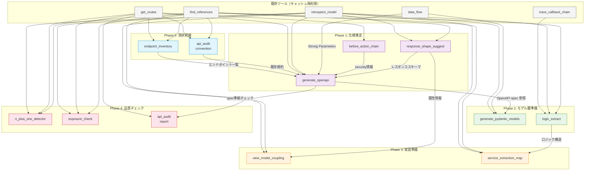

# rails-lens API化支援機能設計書

> **バージョン**: 1.0.0
> **最終更新**: 2026-03-28
> **ステータス**: 設計確定・実装前
> **前提ドキュメント**: [REQUIREMENTS.md](./REQUIREMENTS.md), [ADDITIONAL_FEATURES.md](./ADDITIONAL_FEATURES.md)

---

## 目次

1. [概要](#1-概要)
2. [カテゴリE: 仕様生成・コード生成](#2-カテゴリe-仕様生成コード生成)
   - [E-1. rails_lens_generate_openapi](#e-1-rails_lens_generate_openapi)
   - [E-2. rails_lens_generate_pydantic_models](#e-2-rails_lens_generate_pydantic_models)
   - [E-3. rails_lens_logic_extract](#e-3-rails_lens_logic_extract)
3. [カテゴリF: API設計の品質管理](#3-カテゴリf-api設計の品質管理)
   - [F-1. rails_lens_response_shape_suggest](#f-1-rails_lens_response_shape_suggest)
   - [F-2. rails_lens_api_audit](#f-2-rails_lens_api_audit)
   - [F-3. rails_lens_n_plus_one_detector](#f-3-rails_lens_n_plus_one_detector)
   - [F-4. rails_lens_exposure_check](#f-4-rails_lens_exposure_check)
4. [カテゴリG: 既存コードとAPI層の橋渡し](#4-カテゴリg-既存コードとapi層の橋渡し)
   - [G-1. rails_lens_endpoint_inventory](#g-1-rails_lens_endpoint_inventory)
   - [G-2. rails_lens_before_action_chain](#g-2-rails_lens_before_action_chain)
   - [G-3. rails_lens_view_model_coupling](#g-3-rails_lens_view_model_coupling)
   - [G-4. rails_lens_service_extraction_map](#g-4-rails_lens_service_extraction_map)
5. [API化ワークフロー](#5-api化ワークフロー)
6. [実装フェーズとマイルストーン](#6-実装フェーズとマイルストーン)
7. [OpenAPI spec 生成の精度向上戦略](#7-openapi-spec-生成の精度向上戦略)

---

## 1. 概要

### 背景と課題

既存のRailsアプリケーションをAPI化する、あるいはPythonなど別言語でAPIとして再実装するプロジェクトにおいて、AIコーディングツールは以下の点で正確な実装ができない:

| 躓きポイント | 具体例 | 影響 |
|---|---|---|
| レスポンス設計がわからない | ビューテンプレートに散らばった表示ロジックのうち、何をAPIレスポンスに含めるべきか判断不能 | 不完全・過剰なレスポンス設計 |
| ビジネスロジックの境界が見えない | コントローラ・モデル・ビューヘルパーにまたがるロジックの全体像を把握不能 | 実装漏れ・重複実装 |
| 認証・認可の移行方法がわからない | Session認証→Token認証の切り替えで `before_action` チェーンのどこを変えるべきか不明 | 認証漏れ・CSRF設定ミス |
| 一貫性を保てない | 既存APIの命名規則・レスポンス構造・エラー形式を知らない | 新旧エンドポイント間の乖離 |
| パフォーマンスの落とし穴 | ページネーションで隠れていたN+1クエリがAPI全件返しで顕在化 | 本番環境でのレスポンス劣化 |
| セキュリティリスク | `to_json` / `as_json` で意図せず `password_digest` 等が漏洩 | 機密情報の露出 |

### 解決の方向性

rails-lens が既に持つ解析能力（ルーティング、モデル構造、コールバック、データフロー）を組み合わせて:

- **OpenAPI仕様書を自動生成**し、APIの「契約」を先に定義する
- **既存ロジックの構造を言語非依存な形で抽出**し、Python等での再実装を支援する
- **API化に伴うリスク**（情報漏洩、N+1、一貫性破壊）を事前に検出する

### 設計原則

既存アーキテクチャの原則を踏襲する:

| 原則 | 内容 |
|---|---|
| **ハイブリッド構成** | Python（FastMCP + ツール定義）+ Ruby（ランタイムイントロスペクション）|
| **共通ブリッジパターン** | 全ランタイム解析は `bridge/runner.py` 経由で `bundle exec rails runner` を実行 |
| **ツール登録パターン** | `register(mcp, get_deps)` による遅延初期化 |
| **キャッシュ戦略** | ファイルベースJSONキャッシュ + mtime自動無効化 |
| **構造化出力** | Pydanticモデルによる型安全な入出力 + JSON文字列返却 |
| **アノテーション** | 全ツール `readOnlyHint=True`, `destructiveHint=False`, `idempotentHint=True` |

### 本ドキュメント固有の設計制約

- `generate_openapi` と `generate_pydantic_models` は**コード生成ツール**であり、他の読み取り専用ツールと性質が異なる。出力はファイルとして保存可能な形式（YAML/JSON/Python文字列）にする
- OpenAPI spec の生成は完全自動化を目指さない。「**80%ドラフト + TODOコメント**」の方針を明示する
- `logic_extract` のAST解析には Ruby の `parser` gem（whitequark/parser）を使用する。ランタイム解析ではなく静的解析
- セキュリティ関連ツール（`exposure_check`）は **false negative（見逃し）よりも false positive（過検知）を許容**する設計にする
- 全ツールの出力は、大規模アプリでは**要約 → 詳細の段階的開示パターン**を採用し、AIのコンテキストウィンドウ消費を制御する

### ツール一覧

| ID | ツール名 | カテゴリ | 解析方式 | 難易度 |
|---|---|---|---|---|
| E-1 | `rails_lens_generate_openapi` | 仕様生成 | ランタイム + 静的解析 | L |
| E-2 | `rails_lens_generate_pydantic_models` | コード生成 | ランタイム | M |
| E-3 | `rails_lens_logic_extract` | コード生成 | 静的解析 + ランタイム補完 | L |
| F-1 | `rails_lens_response_shape_suggest` | 品質管理 | ランタイム + 静的解析 | M |
| F-2 | `rails_lens_api_audit` | 品質管理 | ランタイム + 静的解析 | M |
| F-3 | `rails_lens_n_plus_one_detector` | 品質管理 | 静的解析 | M |
| F-4 | `rails_lens_exposure_check` | 品質管理 | ランタイム + 静的解析 | S |
| G-1 | `rails_lens_endpoint_inventory` | 橋渡し | ランタイム + 静的解析 | M |
| G-2 | `rails_lens_before_action_chain` | 橋渡し | ランタイム | M |
| G-3 | `rails_lens_view_model_coupling` | 橋渡し | 静的解析 | M |
| G-4 | `rails_lens_service_extraction_map` | 橋渡し | 静的解析 + ランタイム補完 | M |

---

## 2. カテゴリE: 仕様生成・コード生成

### E-1. rails_lens_generate_openapi

#### 解決する課題と利用シーン

**課題**: API化プロジェクトで最初に必要なのは「何をAPIとして公開するか」の仕様定義。ゼロから設計する代わりに、既存のルーティング・コントローラ・モデルから仕様を逆算することで初期コストを大幅に削減する。

**利用シーン**:
- API化プロジェクト開始時に、既存アプリの全エンドポイントからOpenAPI仕様のドラフトを生成する
- AIが新規APIエンドポイントを追加する際、既存specに追記する形で一貫性を保つ
- フロントエンド・モバイルチームへのAPI仕様共有資料として使用する
- Python等での再実装時、仕様を先に確定させてからコード生成に進むワークフローで使用する

#### ツール仕様

##### 入力スキーマ

```json
{
  "type": "object",
  "properties": {
    "scope": {
      "type": "string",
      "description": "生成対象の範囲: 'all', 'api_only'（/api/ 以下のみ）, 'namespace:Api::V1' 等",
      "default": "all"
    },
    "format": {
      "type": "string",
      "description": "出力フォーマット",
      "enum": ["yaml", "json"],
      "default": "yaml"
    },
    "include_internal": {
      "type": "boolean",
      "description": "管理画面等の内部エンドポイントを含めるか",
      "default": false
    },
    "base_url": {
      "type": "string",
      "description": "APIのベースURL",
      "default": "http://localhost:3000"
    },
    "version": {
      "type": "string",
      "description": "APIバージョン文字列",
      "default": "1.0.0"
    },
    "controller_name": {
      "type": "string",
      "description": "特定コントローラに限定する場合に指定（例: 'UsersController'）"
    }
  }
}
```

##### Pydanticモデル定義

```python
class GenerateOpenApiInput(BaseModel):
    model_config = ConfigDict(str_strip_whitespace=True)
    scope: str = Field(
        "all",
        description="Generation scope: 'all', 'api_only', 'namespace:Api::V1'",
    )
    format: str = Field(
        "yaml",
        description="Output format: 'yaml' or 'json'",
    )
    include_internal: bool = Field(
        False,
        description="Include internal endpoints (admin, etc.)",
    )
    base_url: str = Field(
        "http://localhost:3000",
        description="API base URL for the servers section",
    )
    version: str = Field(
        "1.0.0",
        description="API version string",
    )
    controller_name: str | None = Field(
        None,
        description="Limit generation to a specific controller",
    )


class OpenApiPathOperation(BaseModel):
    method: str                          # "get", "post", "put", "patch", "delete"
    path: str                            # "/api/v1/users/{id}"
    operation_id: str                    # "getUser"
    summary: str
    tags: list[str] = Field(default_factory=list)
    parameters: list[dict] = Field(default_factory=list)
    request_body: dict | None = None
    responses: dict = Field(default_factory=dict)
    security: list[dict] = Field(default_factory=list)
    todo_notes: list[str] = Field(default_factory=list)  # 人間がレビューすべき箇所


class OpenApiSchema(BaseModel):
    name: str                            # "User", "Order"
    properties: dict = Field(default_factory=dict)
    required: list[str] = Field(default_factory=list)
    source_model: str                    # 生成元のRailsモデル名
    todo_notes: list[str] = Field(default_factory=list)


class GenerateOpenApiOutput(BaseModel):
    spec_string: str                     # OpenAPI 3.1 準拠の YAML or JSON 文字列
    format: str                          # "yaml" or "json"
    stats: dict = Field(default_factory=dict)  # { paths: 25, schemas: 12, todo_count: 8 }
    validation_errors: list[str] = Field(default_factory=list)  # spec バリデーション結果
    warnings: list[str] = Field(default_factory=list)  # 推定に基づく箇所の警告
```

##### 生成ロジック（各セクションの情報源）

| OpenAPI セクション | rails-lens の情報源 | 信頼度 |
|---|---|---|
| `paths` + HTTPメソッド | `rails_lens_get_routes` のルーティング定義 | 高 |
| `paths/{path}/parameters` | ルーティングのURL中のパラメータ（`:id` 等） | 高 |
| `requestBody` のスキーマ | `rails_lens_data_flow` の Strong Parameters 解析結果 | 中 |
| `responses` のスキーマ | `rails_lens_response_shape_suggest` の出力 / 既存シリアライザ・jbuilder | 中〜低 |
| `components/schemas` | `rails_lens_introspect_model` のスキーマ + バリデーション → JSON Schema変換 | 高 |
| `security` / `securitySchemes` | `rails_lens_before_action_chain` の認証メソッド解析 | 中 |
| `tags` | コントローラの名前空間（`Api::V1::UsersController` → tag: "Users"） | 高 |

##### バリデーションからJSON Schema制約への変換ルール

| Rails バリデーション | JSON Schema 制約 | 変換可否 |
|---|---|---|
| `validates :name, presence: true` | `required` に追加 | 完全自動 |
| `validates :name, length: { maximum: 100 }` | `maxLength: 100` | 完全自動 |
| `validates :name, length: { minimum: 3 }` | `minLength: 3` | 完全自動 |
| `validates :name, length: { in: 3..100 }` | `minLength: 3, maxLength: 100` | 完全自動 |
| `validates :email, format: { with: /.../ }` | `pattern: "..."` | 自動（正規表現の互換性注意） |
| `validates :age, numericality: { greater_than: 0 }` | `minimum: 1` (exclusiveMinimum) | 完全自動 |
| `validates :age, numericality: { less_than_or_equal_to: 150 }` | `maximum: 150` | 完全自動 |
| `validates :status, inclusion: { in: %w[active inactive] }` | `enum: ["active", "inactive"]` | 完全自動 |
| `validates :slug, uniqueness: true` | 変換不可（ランタイム制約） | `description` に注記 |
| `validate :custom_method` | 変換不可 | `description` に注記 + TODO |

##### 出力例（抜粋）

```yaml
openapi: "3.1.0"
info:
  title: "MyApp API"
  version: "1.0.0"
  description: "Auto-generated by rails-lens. TODO箇所は人間のレビューが必要です。"
servers:
  - url: "https://api.example.com"
paths:
  /api/v1/users:
    get:
      operationId: listUsers
      summary: "ユーザー一覧を取得"
      tags: ["Users"]
      security:
        - bearerAuth: []
      parameters:
        - name: page
          in: query
          schema:
            type: integer
          description: "TODO: ページネーションパラメータを確認してください"
      responses:
        "200":
          description: "成功"
          content:
            application/json:
              schema:
                type: array
                items:
                  $ref: "#/components/schemas/User"
    post:
      operationId: createUser
      summary: "ユーザーを作成"
      tags: ["Users"]
      security:
        - bearerAuth: []
      requestBody:
        required: true
        content:
          application/json:
            schema:
              $ref: "#/components/schemas/UserCreateRequest"
      responses:
        "201":
          description: "作成成功"
          content:
            application/json:
              schema:
                $ref: "#/components/schemas/User"
        "422":
          description: "バリデーションエラー"
          content:
            application/json:
              schema:
                $ref: "#/components/schemas/ErrorResponse"
components:
  schemas:
    User:
      type: object
      required: ["id", "name", "email"]
      properties:
        id:
          type: integer
        name:
          type: string
          maxLength: 100
        email:
          type: string
          pattern: "^[\\w\\.-]+@[\\w\\.-]+\\.\\w+$"
        status:
          type: string
          enum: ["active", "inactive", "suspended"]
        created_at:
          type: string
          format: date-time
        updated_at:
          type: string
          format: date-time
    UserCreateRequest:
      type: object
      description: "Strong Parameters: user_params から生成"
      required: ["name", "email"]
      properties:
        name:
          type: string
          minLength: 1
          maxLength: 100
        email:
          type: string
          pattern: "^[\\w\\.-]+@[\\w\\.-]+\\.\\w+$"
        status:
          type: string
          enum: ["active", "inactive", "suspended"]
          default: "active"
    ErrorResponse:
      type: object
      properties:
        errors:
          type: array
          items:
            type: object
            properties:
              field:
                type: string
              message:
                type: string
  securitySchemes:
    bearerAuth:
      type: http
      scheme: bearer
      description: "TODO: 認証方式を確認してください（既存はsession認証: Devise authenticate_user!）"
```

#### 実装方針: ハイブリッド（ランタイム + 静的解析）

**処理フロー**:

```
1. bridge.execute("dump_routes.rb") → ルーティング情報を取得（キャッシュ再利用）
2. 各ルートに対して:
   a. controller_name からコントローラファイルを特定（静的解析）
   b. Strong Parameters の解析（data_flow キャッシュ or 静的パース）→ requestBody 生成
   c. introspect_model のキャッシュから関連モデルのスキーマ情報取得 → components/schemas 生成
   d. before_action_chain のキャッシュから認証情報取得 → security 生成
   e. response_shape_suggest の結果（あれば）→ responses 生成
3. バリデーション → JSON Schema 制約変換
4. OpenAPI spec としてアセンブル
5. openapi-spec-validator 等でバリデーション実行
6. format に応じて YAML or JSON 文字列として出力
```

**Rubyスクリプト**: 新規追加不要（既存の `dump_routes.rb`, `introspect_model.rb` のキャッシュを再利用）

**Python側**:
- `tools/generate_openapi.py` — ツール定義とメインロジック
- `analyzers/openapi_builder.py` — OpenAPI spec のアセンブルとバリデーション
- `analyzers/strong_params_parser.py` — Strong Parameters の静的パース（`data_flow` キャッシュがない場合のフォールバック）

**依存ライブラリ（追加）**:
- `pyyaml` — YAML出力
- `openapi-spec-validator` — 生成した spec の構文バリデーション

#### 既存ツールとの連携

| 既存ツール | 連携方法 |
|---|---|
| `get_routes` | ルーティング定義をキャッシュから取得。paths セクションの元データ |
| `introspect_model` | モデルのスキーマ・バリデーション情報をキャッシュから取得。components/schemas の元データ |
| `data_flow`（ADDITIONAL_FEATURES B-2） | Strong Parameters 解析結果を requestBody に変換 |
| `before_action_chain`（本ドキュメント G-2） | 認証メソッドの解析結果を security セクションに反映 |
| `response_shape_suggest`（本ドキュメント F-1） | レスポンススキーマの推定結果を responses に反映 |

#### 設計上の注意点

- 完全な自動生成は不可能。生成された spec は「**80%完成のドラフト**」であり、人間がレビュー・修正する前提
- レスポンスのスキーマが推定できない場合は `description: "TODO: レスポンス定義を確認してください"` を挿入する
- 生成した spec に対して構文バリデーションを通し、出力前にエラーがないことを保証する
- 大規模アプリの場合、`controller_name` パラメータで分割生成できること。全エンドポイント一括生成時は `stats` でサマリーのみ返し、詳細は分割取得を案内する
- Ruby の正規表現と JSON Schema の `pattern`（ECMA-262準拠）の差異に注意。変換不可能な正規表現は TODO として記録する

#### 難易度と工数: L（大）

- 複数の既存ツールの出力を統合する「集大成」ツール
- OpenAPI 3.1 仕様への準拠と構文バリデーションが必要
- バリデーション → JSON Schema 変換ルールの網羅的な実装
- 大規模アプリ対応の分割生成ロジック

---

### E-2. rails_lens_generate_pydantic_models

#### 解決する課題と利用シーン

**課題**: Rails → Python 移行時のモデル層の再実装コストが高い。手動でカラム定義やバリデーションを写す作業は退屈でミスが起きやすい。

**利用シーン**:
- Python（FastAPI / Django）での再実装時に、Pydanticモデルのひな形を自動生成する
- AIが「UserモデルをPydanticで再実装して」と依頼されたとき、正確な型・制約付きのコードを一発で生成する
- OpenAPIを経由するより直接的で、Rails固有のバリデーション知識を活用したきめ細かい変換が可能

#### ツール仕様

##### 入力スキーマ

```json
{
  "type": "object",
  "required": ["model_name"],
  "properties": {
    "model_name": {
      "type": "string",
      "description": "モデル名（例: 'User'）。'all' で全モデル対象",
      "minLength": 1,
      "maxLength": 200
    },
    "style": {
      "type": "string",
      "description": "生成スタイル: 'api'（リクエスト/レスポンス分離）or 'orm'（SQLAlchemy連携用）",
      "enum": ["api", "orm"],
      "default": "api"
    },
    "include_associations": {
      "type": "boolean",
      "description": "関連モデルのネスト定義を含めるか",
      "default": false
    },
    "base_class": {
      "type": "string",
      "description": "生成するクラスの継承元",
      "default": "BaseModel"
    }
  }
}
```

##### Pydanticモデル定義

```python
class GeneratePydanticModelsInput(BaseModel):
    model_config = ConfigDict(str_strip_whitespace=True)
    model_name: str = Field(
        ...,
        description="Model name (e.g., 'User') or 'all' for all models",
        min_length=1,
        max_length=200,
    )
    style: str = Field(
        "api",
        description="Generation style: 'api' (request/response split) or 'orm' (SQLAlchemy)",
    )
    include_associations: bool = Field(
        False,
        description="Include nested association definitions",
    )
    base_class: str = Field(
        "BaseModel",
        description="Base class for generated models",
    )


class GeneratedModel(BaseModel):
    class_name: str                     # "UserCreateRequest"
    code: str                           # 生成されたPythonコード文字列
    source_model: str                   # 元のRailsモデル名
    role: str                           # "request", "response", "orm"
    manual_review_notes: list[str] = Field(default_factory=list)  # 手動確認が必要な箇所


class GeneratePydanticModelsOutput(BaseModel):
    models: list[GeneratedModel] = Field(default_factory=list)
    imports: str                        # 必要な import 文をまとめた文字列
    enum_definitions: str               # Enum クラスの定義文字列
    total_models: int = 0
    unconvertible_validations: list[str] = Field(default_factory=list)  # 変換不可のバリデーション一覧
```

##### 変換ルール

| Rails (ActiveRecord) | Python (Pydantic) | 備考 |
|---|---|---|
| `string` / `text` カラム | `str` | |
| `integer` カラム | `int` | |
| `float` / `decimal` カラム | `float` / `Decimal` | `decimal` は `Decimal` を使用 |
| `boolean` カラム | `bool` | |
| `datetime` / `date` / `time` | `datetime` / `date` / `time` | |
| `json` / `jsonb` カラム | `dict[str, Any]` | 型付きdictが推定可能な場合はそちらを使用 |
| `NOT NULL` 制約 | `Field(...)` （required） | |
| `NULL` 許可 | `Optional[...]` with `Field(default=None)` | |
| `default` 値 | `Field(default=...)` | |
| `validates :x, presence: true` | `Field(..., min_length=1)` for str | 非文字列型はrequired |
| `validates :x, length: { in: 3..50 }` | `Field(..., min_length=3, max_length=50)` | |
| `validates :x, numericality: { gt: 0 }` | `Field(..., gt=0)` | `ge`, `le`, `lt` も同様 |
| `validates :x, format: { with: /.../ }` | `Field(..., pattern="...")` | |
| `validates :x, inclusion: { in: [...] }` | `Literal[...]` or `Enum` | 値が3つ以上なら `Enum` |
| `enum status: { ... }` | `class StatusEnum(str, Enum): ...` | |
| `belongs_to :company` | `company_id: int` | コメントで関連先を注記 |
| `has_many :posts` | 生成しない（"api" style） | "orm" style では relationship として出力 |
| `validates :x, uniqueness: true` | コメントとして残す | Pydantic側では表現不可 |
| `validate :custom_method` | コメントで元メソッド名と定義元ファイルを記載 | 手動実装を促す |

##### style: "api" の出力例

```python
# --- 生成されたコード ---
# Source: User model (app/models/user.rb)
# Generated by: rails-lens generate_pydantic_models

from pydantic import BaseModel, Field, ConfigDict
from enum import Enum
from typing import Optional
from datetime import datetime


class UserStatusEnum(str, Enum):
    ACTIVE = "active"
    INACTIVE = "inactive"
    SUSPENDED = "suspended"


class UserCreateRequest(BaseModel):
    """POST /users 用リクエストモデル（Strong Parameters の permit リストに基づく）"""
    model_config = ConfigDict(str_strip_whitespace=True)

    name: str = Field(..., min_length=1, max_length=100, description="ユーザー名")
    email: str = Field(..., pattern=r'^[\w\.-]+@[\w\.-]+\.\w+$', description="メールアドレス")
    status: UserStatusEnum = Field(default=UserStatusEnum.ACTIVE)
    # NOTE: validates :email, uniqueness: true はDBレベルの制約です。アプリ層で別途実装してください。


class UserUpdateRequest(BaseModel):
    """PATCH /users/:id 用リクエストモデル（全フィールドOptional）"""
    model_config = ConfigDict(str_strip_whitespace=True)

    name: Optional[str] = Field(None, min_length=1, max_length=100)
    email: Optional[str] = Field(None, pattern=r'^[\w\.-]+@[\w\.-]+\.\w+$')
    status: Optional[UserStatusEnum] = None


class UserResponse(BaseModel):
    """GET /users/:id 用レスポンスモデル"""
    id: int
    name: str
    email: str
    status: UserStatusEnum
    created_at: datetime
    updated_at: datetime
    # NOTE: password_digest, reset_password_token 等の機密カラムは除外済み
```

#### 実装方針: ランタイム解析

**Rubyスクリプト**: 新規追加不要（`introspect_model.rb` のキャッシュを再利用）

**Python側**:
- `tools/generate_pydantic_models.py` — ツール定義とメインロジック
- `analyzers/pydantic_generator.py` — コード生成ロジック（型変換、バリデーション変換、テンプレート）

**処理フロー**:

```
1. introspect_model のキャッシュからモデル情報を取得（schema, validations, enums, associations）
2. data_flow のキャッシュから Strong Parameters 情報を取得（あれば）→ リクエストモデルのフィールド絞り込み
3. カラム型 → Python型 の変換
4. バリデーション → Field制約 の変換
5. enum → Enum クラスの生成
6. style に応じてクラス構成を決定:
   - "api": CreateRequest + UpdateRequest + Response
   - "orm": 単一モデル（SQLAlchemy互換）
7. 機密カラムをレスポンスモデルから除外
8. Python コード文字列としてフォーマット
```

#### 既存ツールとの連携

| 既存ツール | 連携方法 |
|---|---|
| `introspect_model` | カラム定義、バリデーション、enum、関連の全情報をキャッシュから取得 |
| `data_flow`（ADDITIONAL_FEATURES B-2） | Strong Parameters の permit リストからリクエストモデルのフィールドを決定 |
| `exposure_check`（本ドキュメント F-4） | レスポンスモデルから除外すべき機密カラムの判定に利用可能 |
| `list_models` | `model_name: "all"` 指定時に全モデルの一覧を取得 |

#### 設計上の注意点

- `has_many` / `has_one` の扱いは `style` によって変える。"orm" なら SQLAlchemy の relationship として出力、"api" ならリクエスト/レスポンスを分離して出力
- `uniqueness` バリデーションはPydantic側では表現できないので、コメントとして残す
- カスタムバリデータ（`validate :custom_method`）は変換不可。コメントで元のRubyメソッド名と定義元ファイルを記載し、手動実装を促す
- `accepts_nested_attributes_for` がある場合、ネストしたリクエストモデルを生成する
- `model_name: "all"` 指定時は生成コードが巨大になるため、モデルごとの個別出力とimport集約を分離する

#### 難易度と工数: M（中）

- `introspect_model` のキャッシュ再利用で新規ランタイム解析は不要
- 型変換・バリデーション変換は機械的なマッピング
- コード生成のテンプレート設計がやや複雑

---

### E-3. rails_lens_logic_extract

#### 解決する課題と利用シーン

**課題**: AIにRubyコードを渡して「Pythonに書き換えて」と頼むと、Rubyのイディオム（`tap`、`then`、`&:method_name`、暗黙のreturn等）に引きずられた不自然なPythonが生成される。ロジックを一度抽象化することで、ターゲット言語のイディオムで自然に再実装できる。

**利用シーン**:
- コントローラアクションの処理フローを構造化して抽出し、Python/Go等での再実装の設計書として使う
- 複雑なビジネスロジックの「何をしているか」を言語非依存に理解する
- 外部サービス呼び出し（Stripe、SendGrid等）の依存関係を移行前に把握する

#### ツール仕様

##### 入力スキーマ

```json
{
  "type": "object",
  "required": ["target"],
  "properties": {
    "target": {
      "type": "string",
      "description": "対象: 'OrdersController#create' or 'Order#calculate_total'",
      "minLength": 1
    },
    "depth": {
      "type": "string",
      "description": "展開深度: 'shallow'（対象メソッドのみ）or 'deep'（呼び出し先も再帰展開）",
      "enum": ["shallow", "deep"],
      "default": "shallow"
    }
  }
}
```

##### Pydanticモデル定義

```python
class LogicExtractInput(BaseModel):
    model_config = ConfigDict(str_strip_whitespace=True)
    target: str = Field(
        ...,
        description="Target: 'OrdersController#create' or 'Order#calculate_total'",
        min_length=1,
    )
    depth: str = Field(
        "shallow",
        description="Expansion depth: 'shallow' (target only) or 'deep' (recursive)",
    )


class LogicStep(BaseModel):
    type: str                           # "authorization", "input_parsing", "model_create",
                                        # "model_update", "query", "method_call",
                                        # "transaction", "callback_triggered",
                                        # "side_effect", "conditional", "error_handling",
                                        # "response"
    description: str                    # 人間可読な説明
    source_line: int | None = None
    implementation: str = ""            # 元のRuby実装の要約
    note: str = ""                      # 移行時の注意点
    steps: list["LogicStep"] = Field(default_factory=list)  # ネストしたステップ（transaction内等）


class SideEffect(BaseModel):
    type: str                           # "email", "external_api", "job_enqueue",
                                        # "webhook", "file_io", "cache_write"
    description: str
    service: str = ""                   # "StripeGateway", "SendGrid", "ActiveJob"
    async_: bool = False                # 非同期実行か（ActiveJob経由等）


class LogicExtractOutput(BaseModel):
    method: str                         # "OrdersController#create"
    source_file: str
    source_lines: list[int] = Field(default_factory=list)  # [start, end]
    inputs: list[dict] = Field(default_factory=list)        # 引数とその型の推定
    preconditions: list[str] = Field(default_factory=list)  # ガード節・権限チェック
    steps: list[LogicStep] = Field(default_factory=list)
    side_effects: list[SideEffect] = Field(default_factory=list)
    transaction_boundaries: list[dict] = Field(default_factory=list)
    output: dict = Field(default_factory=dict)  # 戻り値とその型
    called_methods: list[str] = Field(default_factory=list)  # 呼び出し先メソッド一覧
    external_dependencies: list[str] = Field(default_factory=list)  # 外部サービス依存
```

##### 出力例

```json
{
  "method": "OrdersController#create",
  "source_file": "app/controllers/orders_controller.rb",
  "source_lines": [45, 82],
  "inputs": [
    { "name": "params[:order]", "type": "Hash", "via": "Strong Parameters" }
  ],
  "preconditions": [
    "ログインユーザーであること（before_action :authenticate_user! / Devise）"
  ],
  "steps": [
    {
      "type": "input_parsing",
      "description": "Strong Parameters でリクエストパラメータをフィルタ",
      "source_line": 78,
      "implementation": "order_params: permit(:item_id, :quantity, :shipping_address_id)",
      "steps": []
    },
    {
      "type": "transaction",
      "description": "ActiveRecord::Base.transaction ブロック内の処理",
      "steps": [
        {
          "type": "model_create",
          "description": "Order レコードを作成",
          "source_line": 48,
          "implementation": "Order.new(order_params)",
          "steps": []
        },
        {
          "type": "method_call",
          "description": "小計・税・送料を計算して total カラムに設定",
          "source_line": 50,
          "implementation": "order.calculate_total",
          "note": "TaxCalculator は外部API (tax_service) を呼ぶ。移行時は外部APIクライアントの実装が必要",
          "steps": []
        },
        {
          "type": "callback_triggered",
          "description": "after_create コールバックにより副作用が発生",
          "implementation": "OrderMailer#confirmation (非同期), InventoryService#decrement_stock",
          "steps": []
        }
      ]
    },
    {
      "type": "response",
      "description": "成功: 201 Created with order JSON / 失敗: 422 with errors",
      "steps": []
    }
  ],
  "side_effects": [
    {
      "type": "email",
      "description": "注文確認メールの送信",
      "service": "OrderMailer (ActiveJob経由)",
      "async_": true
    },
    {
      "type": "external_api",
      "description": "税計算APIの呼び出し",
      "service": "TaxCalculator → tax_service API",
      "async_": false
    }
  ],
  "transaction_boundaries": [
    { "start_line": 47, "end_line": 65, "models": ["Order", "OrderItem", "Inventory"] }
  ],
  "output": {
    "success": { "status": 201, "body": "Order JSON" },
    "failure": { "status": 422, "body": "Validation errors" }
  },
  "called_methods": [
    "Order#calculate_total",
    "TaxCalculator#compute",
    "ShippingRate#for_address",
    "InventoryService#decrement_stock"
  ],
  "external_dependencies": ["tax_service API", "SMTP (メール送信)"]
}
```

#### 実装方針: 静的解析 + ランタイム補完

**Rubyスクリプト**: `ruby/logic_extract.rb`（新規）

Ruby の `parser` gem（whitequark/parser）を使用してAST解析を行う:

```ruby
# 主要な処理ロジック概要
require 'parser/current'

# 1. 対象メソッドのソースコードをASTとしてパース
# 2. AST を走査して以下のパターンを検出:
#    - メソッド呼び出し（send / csend ノード）
#    - トランザクションブロック（transaction メソッド呼び出し）
#    - 条件分岐（if / case / unless ノード）
#    - rescue 節
#    - 外部サービス呼び出し（Net::HTTP, Faraday, HTTParty 等のパターン）
# 3. 検出したパターンを構造化JSONとして出力
```

**Python側**:
- `tools/logic_extract.py` — ツール定義
- `analyzers/ast_logic_parser.py` — AST解析結果の構造化と深堀り展開

**処理フロー**:

```
1. 対象メソッドのファイルパスと行範囲を特定（静的解析: grep + ファイル読み取り）
2. bridge.execute("logic_extract.rb", [target]) → AST解析結果を取得
3. introspect_model / trace_callback_chain のキャッシュからコールバック情報を補完
4. depth: "deep" の場合、呼び出し先メソッドに対して再帰的にステップ2-3を実行
   - 再帰の上限: 5階層
   - Rails/Ruby標準ライブラリの内部には入らない
5. 副作用（メール送信、外部API、ジョブenqueue）を分類
6. 構造化された LogicExtractOutput を返却
```

#### 既存ツールとの連携

| 既存ツール | 連携方法 |
|---|---|
| `introspect_model` | コールバック情報の補完。`callback_triggered` ステップの詳細化 |
| `trace_callback_chain` | コールバック実行順序の正確な取得 |
| `find_references` | `depth: "deep"` での呼び出し先メソッドの定義元ファイル検索 |
| `data_flow`（ADDITIONAL_FEATURES B-2） | Strong Parameters 情報の取得。`input_parsing` ステップの詳細化 |
| `get_routes` | コントローラアクションのHTTPメソッド・パスの特定 |

#### 設計上の注意点

- `parser` gem はRubyの構文を完全に解析できるが、動的メソッド（`method_missing`、`define_method`）は静的解析では検出不可。コメントで注記する
- `depth: "deep"` の再帰展開は、Rails/Ruby標準ライブラリの内部には入らない（境界を設ける）
- 外部サービス呼び出し（`Net::HTTP`, `Faraday`, `HTTParty`, `RestClient` 等）のパターンマッチで「副作用」として明示する
- 出力が巨大になる場合（deep展開で多数のメソッドを含む場合）、`called_methods` のリストのみ返し、個別メソッドの詳細は別途呼び出しを促す

#### 難易度と工数: L（大）

- Ruby AST パーサー（`parser` gem）の導入と AST ノード走査の実装
- 再帰的展開のロジックと深度制限
- 外部サービス呼び出しパターンの網羅的な検出
- 新規Rubyスクリプトの開発が必要

---

## 3. カテゴリF: API設計の品質管理

### F-1. rails_lens_response_shape_suggest

#### 解決する課題と利用シーン

**課題**: 既存の画面と等価な情報をAPIで返すために、「何をレスポンスに含めるべきか」を自動で導出する必要がある。ビューテンプレートに散らばった属性参照を手動で拾うのは非効率。

**利用シーン**:
- API化の際に「この画面をAPIに置き換えるとき、レスポンスに何を含めればいいか」の初期案を得る
- `generate_openapi` の responses セクション生成の入力データとして使用する
- 既存のシリアライザ/jbuilder がある場合は、それをベースに推奨構造を返す

#### ツール仕様

##### 入力スキーマ

```json
{
  "type": "object",
  "properties": {
    "controller_action": {
      "type": "string",
      "description": "コントローラ#アクション（例: 'UsersController#show'）"
    },
    "model_name": {
      "type": "string",
      "description": "モデル名（コントローラを指定しない場合に汎用レスポンスを推定）"
    },
    "include_associations": {
      "type": "boolean",
      "description": "関連モデルのネストを含めるか",
      "default": true
    },
    "depth": {
      "type": "integer",
      "description": "関連モデルのネスト深度",
      "default": 1,
      "minimum": 0,
      "maximum": 3
    }
  }
}
```

##### Pydanticモデル定義

```python
class ResponseShapeSuggestInput(BaseModel):
    model_config = ConfigDict(str_strip_whitespace=True)
    controller_action: str | None = Field(
        None,
        description="Controller#Action (e.g., 'UsersController#show')",
    )
    model_name: str | None = Field(
        None,
        description="Model name for generic response estimation",
    )
    include_associations: bool = Field(
        True,
        description="Include nested association data",
    )
    depth: int = Field(
        1,
        description="Association nesting depth",
        ge=0,
        le=3,
    )


class ResponseField(BaseModel):
    name: str
    type: str                           # "string", "integer", "object", "array", etc.
    source: str                         # 情報源: "serializer:UserSerializer:5", "jbuilder:show.json.jbuilder:3",
                                        # "view:show.html.erb:15", "model_schema", "as_json_override"
    confidence: str                     # "high", "medium", "low"
    nested_fields: list["ResponseField"] = Field(default_factory=list)
    note: str = ""


class ResponseShapeSuggestOutput(BaseModel):
    target: str                         # controller_action or model_name
    source_type: str                    # "serializer", "jbuilder", "rabl", "view_inference",
                                        # "as_json", "model_fallback"
    suggested_shape: list[ResponseField] = Field(default_factory=list)
    excluded_sensitive_fields: list[str] = Field(default_factory=list)
    json_example: str = ""              # 推奨JSONの具体例文字列
    warnings: list[str] = Field(default_factory=list)
```

**情報源の優先順位**:

| 優先度 | 情報源 | 信頼度 | 検出方法 |
|---|---|---|---|
| 1 | 既存シリアライザ（ActiveModelSerializers, Blueprinter, JSONAPI::Resources等） | 高 | `app/serializers/` 内のファイルを静的パース |
| 2 | jbuilder / rabl テンプレート | 高 | `app/views/**/*.json.jbuilder`, `*.rabl` を静的パース |
| 3 | `as_json` / `to_json` のオーバーライド | 中 | モデルファイル内の `def as_json` を静的検索 |
| 4 | ビューテンプレート（ERB/Haml/Slim）の `@model.attribute` パターン | 低 | 静的パターンマッチ |
| 5 | フォールバック: `introspect_model` のスキーマから機密属性除外 | 低 | キャッシュ再利用 |

#### 実装方針: ランタイム + 静的解析

**Rubyスクリプト**: `ruby/response_shape.rb`（新規）
- シリアライザが存在する場合、ランタイムで `SerializerClass.new(model_instance).as_json` の構造を取得
- jbuilder テンプレートのパースは静的解析で実施

**Python側**:
- `tools/response_shape_suggest.py` — ツール定義
- `analyzers/serializer_parser.py` — シリアライザ / jbuilder / rabl の静的パース
- `analyzers/view_attribute_extractor.py` — ビューテンプレートからの属性抽出

#### 既存ツールとの連携

| 既存ツール | 連携方法 |
|---|---|
| `introspect_model` | フォールバック時にスキーマ情報から全カラムを取得 |
| `find_references` | シリアライザ・jbuilder ファイルの検索 |
| `exposure_check`（本ドキュメント F-4） | 除外すべき機密属性の判定 |
| `get_routes` | controller_action からビューファイルパスの推定 |

#### 難易度と工数: M（中）

- シリアライザ / jbuilder の静的パーサーが主な実装コスト
- 優先順位ベースのフォールバックロジック
- ビューテンプレートからの属性抽出は正確性が低く、confidence の適切な設定が重要

---

### F-2. rails_lens_api_audit

#### 解決する課題と利用シーン

**課題**: APIが成長するにつれて、開発者ごとのスタイル差異が蓄積する。AIが新しいエンドポイントを追加するとき、既存パターンに合わせるための「規約」が明文化されていないと一貫性が崩れる。

**利用シーン**:
- API化プロジェクト開始時に、既存APIのパターン・規約を自動抽出する（`output_style: "convention"`）
- API化完了後に、一貫性の最終チェックを行う（`output_style: "report"`）
- AIが新規エンドポイントを追加する前に、既存の規約を確認して準拠する

#### ツール仕様

##### 入力スキーマ

```json
{
  "type": "object",
  "properties": {
    "scope": {
      "type": "string",
      "description": "監査範囲: 'api'（/api/ 以下）or 'all'",
      "enum": ["api", "all"],
      "default": "api"
    },
    "output_style": {
      "type": "string",
      "description": "出力形式: 'report'（問題点レポート）or 'convention'（規約集として出力）",
      "enum": ["report", "convention"],
      "default": "report"
    }
  }
}
```

##### Pydanticモデル定義

```python
class ApiAuditInput(BaseModel):
    model_config = ConfigDict(str_strip_whitespace=True)
    scope: str = Field(
        "api",
        description="Audit scope: 'api' (/api/ routes only) or 'all'",
    )
    output_style: str = Field(
        "report",
        description="Output style: 'report' (issues) or 'convention' (extracted rules)",
    )


class Convention(BaseModel):
    category: str                       # "response_wrapper", "naming", "pagination",
                                        # "error_format", "auth", "versioning", "status_codes"
    pattern: str                        # 検出されたパターンの説明
    adoption_rate: str                  # "23/25 エンドポイント" 等
    examples: list[str] = Field(default_factory=list)  # 該当エンドポイント例


class Violation(BaseModel):
    endpoint: str                       # "GET /api/v1/reports/summary"
    category: str                       # Convention の category と対応
    issue: str                          # 問題の説明
    suggestion: str                     # 修正提案
    severity: str                       # "error", "warning", "info"


class ApiAuditOutput(BaseModel):
    scope: str
    total_endpoints: int = 0
    detected_conventions: list[Convention] = Field(default_factory=list)
    violations: list[Violation] = Field(default_factory=list)
    summary: str = ""                   # 監査結果の要約
```

##### 検出項目

| カテゴリ | 検出内容 | 解析方法 |
|---|---|---|
| `naming` | snake_case / camelCase 混在、複数形/単数形の不統一 | ルーティングパスの静的パターンマッチ |
| `response_wrapper` | `{ data: {...} }` / フラット / `{ user: {...} }` の混在 | シリアライザ・jbuilder・コントローラの静的パース |
| `status_codes` | 成功時200/201の使い分け、エラー時422/400の使い分け | コントローラの `render` 文の静的パース |
| `auth` | エンドポイントごとの before_action フィルタの差異 | `before_action_chain` の結果を利用 |
| `pagination` | Link header / response body / cursor / offset | コントローラ・Gem（kaminari, pagy）の静的検索 |
| `error_format` | `{ error: "..." }` / `{ errors: [...] }` / `{ message: "..." }` | コントローラの `render json:` パターン検索 |
| `versioning` | URL / Header / Query Parameter | ルーティング定義とコントローラの解析 |

##### output_style: "convention" の出力例

```json
{
  "scope": "api",
  "total_endpoints": 25,
  "detected_conventions": [
    {
      "category": "response_wrapper",
      "pattern": "{ data: {...} } パターン",
      "adoption_rate": "23/25 エンドポイント",
      "examples": ["GET /api/v1/users", "GET /api/v1/orders"]
    },
    {
      "category": "naming",
      "pattern": "snake_case",
      "adoption_rate": "25/25 エンドポイント",
      "examples": []
    },
    {
      "category": "pagination",
      "pattern": "Link header + X-Total-Count",
      "adoption_rate": "8/8 一覧系エンドポイント",
      "examples": ["GET /api/v1/users", "GET /api/v1/orders"]
    },
    {
      "category": "error_format",
      "pattern": "{ errors: [{ field: '...', message: '...' }] }",
      "adoption_rate": "20/25 エンドポイント",
      "examples": []
    },
    {
      "category": "auth",
      "pattern": "Authorization: Bearer token",
      "adoption_rate": "25/25 エンドポイント",
      "examples": []
    },
    {
      "category": "versioning",
      "pattern": "URLベース（/api/v1/）",
      "adoption_rate": "25/25 エンドポイント",
      "examples": []
    }
  ],
  "violations": [
    {
      "endpoint": "GET /api/v1/reports/summary",
      "category": "response_wrapper",
      "issue": "response_wrapper を使用していない（直接JSONを返している）",
      "suggestion": "他のエンドポイントに合わせて { data: {...} } でラップすることを推奨",
      "severity": "warning"
    }
  ],
  "summary": "25エンドポイントを監査。6つの規約を検出。1件の規約違反を検出。"
}
```

#### 実装方針: ランタイム + 静的解析

**Rubyスクリプト**: 新規追加不要（`dump_routes.rb` のキャッシュを再利用）

**Python側**:
- `tools/api_audit.py` — ツール定義
- `analyzers/api_convention_detector.py` — 規約検出と違反判定のロジック

**処理フロー**:

```
1. get_routes のキャッシュからAPIエンドポイント一覧を取得
2. 各エンドポイントのコントローラファイルを読み込み:
   a. render 文のパターンを検出 → レスポンスラッパー・ステータスコード・エラー形式を分類
   b. before_action チェーンからの認証パターンを取得
3. ルーティングパスから命名規則・バージョニング方式を検出
4. ページネーション関連のGem/メソッド呼び出しを検索
5. 各カテゴリごとに多数派パターンを「規約」として抽出
6. 少数派パターンを「違反」として報告
```

#### 既存ツールとの連携

| 既存ツール | 連携方法 |
|---|---|
| `get_routes` | APIエンドポイントの一覧取得 |
| `before_action_chain`（本ドキュメント G-2） | 認証パターンの取得 |
| `find_references` | コントローラ内の `render` パターン検索 |

#### 難易度と工数: M（中）

- 静的パターンマッチが主体で実装は比較的シンプル
- 検出項目が多いが、各項目は独立して実装可能
- 「多数派パターンの抽出」ロジックの設計がポイント

---

### F-3. rails_lens_n_plus_one_detector

#### 解決する課題と利用シーン

**課題**: 画面ではページネーションやキャッシュで隠れていたN+1クエリが、APIで全件返す際に顕在化する。API化で最も踏みやすいパフォーマンス地雷。

**利用シーン**:
- API化前の品質チェックとして、全APIエンドポイントをスキャンする
- AIが新規エンドポイントを実装した後、N+1の可能性を自動検出する
- 既存のN+1問題を把握し、`includes` の追加提案を行う

#### ツール仕様

##### 入力スキーマ

```json
{
  "type": "object",
  "properties": {
    "controller_action": {
      "type": "string",
      "description": "特定アクション（例: 'Api::V1::OrdersController#index'）"
    },
    "scope": {
      "type": "string",
      "description": "スキャン範囲: 'api' or 'all'",
      "enum": ["api", "all"]
    }
  }
}
```

##### Pydanticモデル定義

```python
class NPlusOneDetectorInput(BaseModel):
    model_config = ConfigDict(str_strip_whitespace=True)
    controller_action: str | None = Field(
        None,
        description="Specific action (e.g., 'Api::V1::OrdersController#index')",
    )
    scope: str | None = Field(
        None,
        description="Scan scope: 'api' or 'all'",
    )


class NPlusOneIssue(BaseModel):
    location: str                       # "Api::V1::OrdersController#index (line 12)"
    query: str                          # "Order.where(user_id: current_user.id)"
    missing_eager_load: list[str]       # ["order_items", "order_items.product"]
    accessed_in: str                    # "app/views/api/v1/orders/index.json.jbuilder:5"
    suggested_fix: str                  # "Order.where(...).includes(:order_items, order_items: :product)"
    estimated_impact: str               # "1 + N + N → includes で 3クエリに削減"
    severity: str                       # "high", "medium", "low"


class NPlusOneDetectorOutput(BaseModel):
    scan_scope: str                     # "Api::V1::OrdersController#index" or "api"
    total_actions_scanned: int = 0
    potential_n_plus_one: list[NPlusOneIssue] = Field(default_factory=list)
    already_optimized: list[str] = Field(default_factory=list)  # includes が適用済みの箇所
    summary: str = ""
```

##### 出力例

```json
{
  "scan_scope": "Api::V1::OrdersController#index",
  "total_actions_scanned": 1,
  "potential_n_plus_one": [
    {
      "location": "Api::V1::OrdersController#index (line 12)",
      "query": "Order.where(user_id: current_user.id)",
      "missing_eager_load": ["order_items", "order_items.product"],
      "accessed_in": "app/views/api/v1/orders/index.json.jbuilder:5",
      "suggested_fix": "Order.where(user_id: current_user.id).includes(:order_items, order_items: :product)",
      "estimated_impact": "1 + N + N（Nはorder数）→ includes で 3クエリに削減",
      "severity": "high"
    }
  ],
  "already_optimized": [],
  "summary": "1件のN+1候補を検出。推定クエリ数: O(N^2) → O(1) に改善可能。"
}
```

##### 検出ロジック

```
1. コントローラアクションのソースコードを読み取り
2. コレクション取得パターンを検出:
   - Model.all, Model.where(...), Model.scope_name
   - @models = ... の代入文
3. 取得クエリに .includes / .preload / .eager_load が付いているか確認
4. ビュー/シリアライザ/jbuilder 内でコレクションの各要素から関連アクセスを検出:
   - item.association_name パターン
   - jbuilder: json.items @orders do |order| ... order.items ...
5. 3 で eager load されていない関連への 4 でのアクセスがあれば N+1 として報告
6. introspect_model の関連情報を使って、suggested_fix を生成
```

#### 実装方針: 静的解析

**Rubyスクリプト**: 新規追加不要

**Python側**:
- `tools/n_plus_one_detector.py` — ツール定義
- `analyzers/n_plus_one_analyzer.py` — 検出ロジック

**処理フロー**:

```
1. controller_action or scope からコントローラファイルを特定（get_routes キャッシュ利用）
2. コントローラファイルをパースし、モデル取得パターンを検出
3. 対応するビュー/シリアライザ/jbuilder ファイルを特定
4. ビュー内の関連アクセスパターンを検出
5. eager load の有無を照合
6. introspect_model キャッシュから関連定義を取得し、suggested_fix を生成
```

#### 既存ツールとの連携

| 既存ツール | 連携方法 |
|---|---|
| `introspect_model` | モデルの関連定義（has_many, belongs_to等）を取得し、N+1の可能性を判定 |
| `get_routes` | scope 指定時にAPIエンドポイントの一覧を取得 |
| `find_references` | ビュー/シリアライザ内のモデル参照を検索 |

#### 難易度と工数: M（中）

- 静的解析のみで完結
- コレクション取得パターンの正規表現マッチが主体
- jbuilder / シリアライザの構文パースがやや複雑

---

### F-4. rails_lens_exposure_check

#### 解決する課題と利用シーン

**課題**: API化で最もリスクが高いセキュリティ問題。`to_json` や `as_json` をオーバーライドせずに使っているケースで `password_digest` 等が漏れる。

**利用シーン**:
- API化の品質チェックとして、全APIエンドポイントの情報漏洩リスクをスキャンする
- AIが `render json: @user` のようなコードを生成しそうなとき、事前にリスクを警告する
- セキュリティレビューの自動化の一部として使用する

#### ツール仕様

##### 入力スキーマ

```json
{
  "type": "object",
  "properties": {
    "scope": {
      "type": "string",
      "description": "チェック範囲: 'api' or 'all'",
      "enum": ["api", "all"],
      "default": "api"
    },
    "model_name": {
      "type": "string",
      "description": "特定モデルに絞る場合に指定"
    },
    "additional_sensitive": {
      "type": "array",
      "items": { "type": "string" },
      "description": "アプリ固有の機密属性名を追加",
      "default": []
    }
  }
}
```

##### Pydanticモデル定義

```python
class ExposureCheckInput(BaseModel):
    model_config = ConfigDict(str_strip_whitespace=True)
    scope: str = Field(
        "api",
        description="Check scope: 'api' or 'all'",
    )
    model_name: str | None = Field(
        None,
        description="Limit to specific model",
    )
    additional_sensitive: list[str] = Field(
        default_factory=list,
        description="App-specific sensitive attribute names",
    )


class ExposureRisk(BaseModel):
    model: str                          # "User"
    attribute: str                      # "password_digest"
    risk_level: str                     # "critical", "high", "medium"
    detection_pattern: str              # "render json: @user (no serializer)"
    location: str                       # "app/controllers/api/v1/users_controller.rb:25"
    reason: str                         # "password_digest はパスワードハッシュ。APIレスポンスに含めるべきではない"
    suggested_fix: str                  # "シリアライザを使用し、明示的にフィールドを指定してください"


class ExposureCheckOutput(BaseModel):
    scope: str
    total_models_checked: int = 0
    risks: list[ExposureRisk] = Field(default_factory=list)
    safe_endpoints: list[str] = Field(default_factory=list)  # リスクのないエンドポイント
    summary: str = ""
```

##### チェック対象の機密属性

**明示的ブラックリスト**:
- `password_digest`, `encrypted_password`, `reset_password_token`, `confirmation_token`, `unlock_token`
- `otp_secret`, `api_key`, `secret_key`, `access_token`, `refresh_token`

**パターンマッチ**:
- `*_digest`, `*_token`, `*_secret`, `encrypted_*`, `*_password`

**内部管理用（Devise系）**:
- `sign_in_count`, `failed_attempts`, `locked_at`, `current_sign_in_ip`, `last_sign_in_ip`

**監査用（paranoia/discard系）**:
- `created_by`, `updated_by`, `deleted_at`

##### 検出パターンとリスクレベル

| パターン | リスクレベル | 説明 |
|---|---|---|
| `render json: @model`（シリアライザなし） | critical | 全カラムがレスポンスに含まれる |
| `as_json` / `to_json` で `except` に漏れがある | high | 明示的に除外しているが不完全 |
| シリアライザで `attributes *` / `:all` を使用 | high | 全属性を公開している |
| jbuilder で個別指定だが機密カラムを含む | medium | 意図的である可能性もある |
| `as_json` で `only` を使用し機密カラムが含まれていない | safe | 適切に制御されている |

#### 実装方針: ランタイム + 静的解析

**Rubyスクリプト**: 新規追加不要（`introspect_model.rb` のキャッシュからスキーマ情報を取得）

**Python側**:
- `tools/exposure_check.py` — ツール定義
- `analyzers/exposure_analyzer.py` — 検出ロジック

**処理フロー**:

```
1. introspect_model のキャッシュから対象モデルのカラム一覧を取得
2. 機密属性リスト（ブラックリスト + パターンマッチ + additional_sensitive）と照合
3. コントローラファイルを静的解析して render パターンを検出:
   a. render json: @model → critical（シリアライザなし）
   b. render json: @model.as_json(except: [...]) → except リストを確認
   c. render json: serializer_class.new(@model) → シリアライザファイルを確認
4. シリアライザ / jbuilder の公開属性と機密属性リストを照合
5. リスクレベルを判定して報告
```

#### 既存ツールとの連携

| 既存ツール | 連携方法 |
|---|---|
| `introspect_model` | モデルのカラム一覧を取得。機密属性の有無を判定 |
| `get_routes` | scope 指定時にAPIエンドポイントの一覧を取得 |
| `find_references` | `render json:` パターンの検索 |

#### 設計上の注意点

- **false negative（見逃し）よりも false positive（過検知）を許容**する設計。安全側に倒す
- `additional_sensitive` でアプリ固有の機密属性（SSN、マイナンバー等）を追加可能にする
- Devise以外の認証Gem（Sorcery、Clearance等）のカラムパターンも考慮する
- `deleted_at` はソフトデリートの実装パターンに依存するため、severity を下げる

#### 難易度と工数: S（小）

- 機密属性のブラックリストとパターンマッチは単純
- `render` パターンの静的検出も正規表現で実装可能
- 新規ランタイム解析は不要

---

## 4. カテゴリG: 既存コードとAPI層の橋渡し

### G-1. rails_lens_endpoint_inventory

#### 解決する課題と利用シーン

**課題**: API化プロジェクト開始時に「全体でいくつのエンドポイントがあり、何がAPI化済みで、何が残っているか」を把握する手段がない。

**利用シーン**:
- API化プロジェクト開始時の現状把握と規模感の見積もり
- 「次にどのエンドポイントをAPI化すべきか」を複雑度の低いものから提案する根拠
- プロジェクト進行中の進捗トラッキング

#### ツール仕様

##### 入力スキーマ

```json
{
  "type": "object",
  "properties": {
    "group_by": {
      "type": "string",
      "description": "グルーピング方式",
      "enum": ["status", "controller", "resource"],
      "default": "status"
    },
    "include_complexity": {
      "type": "boolean",
      "description": "複雑度分析を含めるか",
      "default": true
    }
  }
}
```

##### Pydanticモデル定義

```python
class EndpointInventoryInput(BaseModel):
    model_config = ConfigDict(str_strip_whitespace=True)
    group_by: str = Field(
        "status",
        description="Grouping: 'status', 'controller', 'resource'",
    )
    include_complexity: bool = Field(
        True,
        description="Include complexity analysis",
    )


class EndpointInfo(BaseModel):
    http_method: str                    # "GET", "POST", etc.
    path: str                           # "/api/v1/users/:id"
    controller_action: str              # "Api::V1::UsersController#show"
    status: str                         # "api_ready", "web_only", "both", "unimplemented"
    models_used: list[str] = Field(default_factory=list)
    auth_method: str = ""               # "bearer_token", "session", "none"
    has_tests: bool = False
    test_files: list[str] = Field(default_factory=list)
    complexity: dict = Field(default_factory=dict)  # { lines: 25, branches: 3, model_ops: 4 }
    has_eager_loading: bool = False      # includes/preload の有無


class EndpointGroup(BaseModel):
    name: str                           # グループ名
    endpoints: list[EndpointInfo] = Field(default_factory=list)
    count: int = 0


class EndpointInventoryOutput(BaseModel):
    total_endpoints: int = 0
    groups: list[EndpointGroup] = Field(default_factory=list)
    statistics: dict = Field(default_factory=dict)  # { api_ready: 25, web_only: 40, both: 10, unimplemented: 3 }
    suggested_migration_order: list[str] = Field(default_factory=list)  # 複雑度の低い順
    summary: str = ""
```

##### 分類ロジック

| ステータス | 判定条件 |
|---|---|
| `api_ready` | `/api/` 以下のルーティング、または `respond_to :json` があるアクション |
| `web_only` | HTMLレスポンスのみのアクション |
| `both` | `respond_to do \|format\| format.html; format.json; end` パターン |
| `unimplemented` | ルーティング定義はあるがコントローラにアクションメソッドがない |

#### 実装方針: ランタイム + 静的解析

**Rubyスクリプト**: 新規追加不要（`dump_routes.rb` のキャッシュを再利用）

**Python側**:
- `tools/endpoint_inventory.py` — ツール定義
- `analyzers/endpoint_classifier.py` — エンドポイント分類と複雑度分析

**処理フロー**:

```
1. get_routes のキャッシュから全ルーティングを取得
2. 各ルートに対応するコントローラファイルを特定
3. コントローラファイルを静的解析:
   a. アクションメソッドの存在確認 → unimplemented 判定
   b. respond_to パターンの検出 → status 分類
   c. 行数・分岐数・モデル操作数 → complexity 算出
   d. includes/preload/eager_load の有無 → has_eager_loading
4. テストファイルの存在確認（test_mapping と同様のロジック）
5. group_by に応じてグルーピング
6. 複雑度の低い順にソートして suggested_migration_order を生成
```

#### 既存ツールとの連携

| 既存ツール | 連携方法 |
|---|---|
| `get_routes` | 全ルーティング定義を取得 |
| `find_references` | コントローラファイルの検索、テストファイルの検索 |
| `test_mapping`（ADDITIONAL_FEATURES A-2） | テストの有無判定のロジックを共有可能 |

#### 難易度と工数: M（中）

- 既存ツールのキャッシュを大幅に再利用
- 複雑度分析は行数・分岐のカウントで比較的シンプル
- グルーピングと統計の集計ロジック

---

### G-2. rails_lens_before_action_chain

#### 解決する課題と利用シーン

**課題**: API化では認証・認可の仕組みが根本的に変わる（session → token）。既存のフィルタチェーンの全体像を把握しないと、APIコントローラ新設時に認証漏れやCSRF設定ミスが起きる。

**利用シーン**:
- APIコントローラの基底クラスを設計する際、既存のフィルタチェーンから移行すべきフィルタを特定する
- `generate_openapi` の security セクション生成の入力データとして使用する
- CSRF保護の無効化（`skip_before_action :verify_authenticity_token`）が適切に行われているか確認する

#### ツール仕様

##### 入力スキーマ

```json
{
  "type": "object",
  "properties": {
    "controller_name": {
      "type": "string",
      "description": "特定コントローラ（例: 'OrdersController'）"
    },
    "scope": {
      "type": "string",
      "description": "対象範囲: 'api' or 'all'",
      "enum": ["api", "all"]
    },
    "action": {
      "type": "string",
      "description": "特定アクションに絞る場合"
    }
  }
}
```

##### Pydanticモデル定義

```python
class BeforeActionChainInput(BaseModel):
    model_config = ConfigDict(str_strip_whitespace=True)
    controller_name: str | None = Field(
        None,
        description="Specific controller (e.g., 'OrdersController')",
    )
    scope: str | None = Field(
        None,
        description="Scope: 'api' or 'all'",
    )
    action: str | None = Field(
        None,
        description="Limit to specific action",
    )


class ActionFilter(BaseModel):
    kind: str                           # "before_action", "after_action", "around_action"
    method: str                         # "authenticate_user!"
    defined_in: str                     # "Devise::Controllers::Helpers (gem)" or
                                        # "ApplicationController (app/controllers/application_controller.rb:23)"
    applied_to: list[str] | str         # ["show", "update"] or "all actions"
    inherited_from: str | None = None   # "ApplicationController"
    skipped: bool = False
    skipped_in: str | None = None       # skip_before_action を定義したコントローラ
    only: list[str] = Field(default_factory=list)
    except_: list[str] = Field(default_factory=list)
    note: str = ""                      # 特記事項（CSRFスキップの理由等）


class BeforeActionChainOutput(BaseModel):
    controller: str
    inheritance_chain: list[str] = Field(default_factory=list)  # 継承チェーン
    filters: list[ActionFilter] = Field(default_factory=list)
    auth_summary: str = ""              # 認証方式の要約
    csrf_status: str = ""               # CSRF保護の状態
    warnings: list[str] = Field(default_factory=list)  # 潜在的な問題
```

##### 出力例

```json
{
  "controller": "Api::V1::OrdersController",
  "inheritance_chain": ["ApplicationController", "Api::BaseController", "Api::V1::BaseController"],
  "filters": [
    {
      "kind": "before_action",
      "method": "authenticate_user!",
      "defined_in": "Devise::Controllers::Helpers (gem)",
      "applied_to": "all actions",
      "inherited_from": "ApplicationController",
      "skipped": false,
      "note": ""
    },
    {
      "kind": "before_action",
      "method": "set_locale",
      "defined_in": "ApplicationController (app/controllers/application_controller.rb:23)",
      "applied_to": "all actions",
      "inherited_from": "ApplicationController",
      "skipped": false,
      "note": ""
    },
    {
      "kind": "before_action",
      "method": "verify_authenticity_token",
      "defined_in": "ActionController::RequestForgeryProtection (Rails)",
      "applied_to": "all actions",
      "skipped": true,
      "skipped_in": "Api::BaseController",
      "note": "APIコントローラではCSRFトークン検証を無効化"
    },
    {
      "kind": "before_action",
      "method": "set_order",
      "defined_in": "Api::V1::OrdersController (app/controllers/api/v1/orders_controller.rb:8)",
      "applied_to": ["show", "update", "destroy"],
      "inherited_from": null,
      "skipped": false,
      "only": ["show", "update", "destroy"],
      "note": ""
    }
  ],
  "auth_summary": "Devise authenticate_user! による認証（全アクション）",
  "csrf_status": "無効化済み（Api::BaseController で skip_before_action）",
  "warnings": []
}
```

#### 実装方針: ランタイム解析

**Rubyスクリプト**: `ruby/before_action_chain.rb`（新規）

```ruby
# 主要な処理ロジック概要
controller_name = ARGV[0]
action_name = ARGV[1]  # optional

klass = controller_name.constantize

# 継承チェーンの取得
inheritance = []
current = klass
while current != ActionController::Base && current != Object
  inheritance << current.name
  current = current.superclass
end

# フィルタチェーンの取得
filters = klass._process_action_callbacks.map do |callback|
  {
    kind: callback.kind,            # :before, :after, :around
    filter: callback.filter,        # メソッド名
    options: {
      only: callback.options[:only],
      except: callback.options[:except],
      if: callback.options[:if],
      unless: callback.options[:unless]
    }
  }
end

# 各フィルタの定義元を特定
# method(:filter_name).source_location で取得
```

**Python側**:
- `tools/before_action_chain.py` — ツール定義

#### 既存ツールとの連携

| 既存ツール | 連携方法 |
|---|---|
| `get_routes` | scope 指定時にAPIコントローラの一覧を取得 |
| `analyze_concern` | フィルタメソッドがConcern由来かの判定に利用可能 |
| `gem_introspect`（ADDITIONAL_FEATURES D-1） | Devise等のGem由来フィルタの特定 |

#### 難易度と工数: M（中）

- Rails の `_process_action_callbacks` APIで比較的簡潔に取得可能
- `skip_before_action` の追跡がやや複雑（継承チェーン上のどこでスキップされたか）
- 新規Rubyスクリプトの開発が必要

---

### G-3. rails_lens_view_model_coupling

#### 解決する課題と利用シーン

**課題**: API化の際、「この画面をAPIに置き換えるとき、レスポンスに何を含めればいいか」の判断が困難。ビューに散らばった属性参照を網羅的に把握する必要がある。

**利用シーン**:
- 特定モデルがどのビューから参照されているかの逆引き
- 特定ビューが依存するモデル属性の一覧取得
- ビュー内に紛れ込んだビジネスロジック（表示/非表示の条件分岐等）の検出

#### ツール仕様

##### 入力スキーマ

```json
{
  "type": "object",
  "properties": {
    "model_name": {
      "type": "string",
      "description": "モデル名（そのモデルを参照しているビュー一覧を取得）"
    },
    "view_path": {
      "type": "string",
      "description": "ビューファイルパス（そのビューが依存するモデル属性一覧を取得）"
    }
  }
}
```

##### Pydanticモデル定義

```python
class ViewModelCouplingInput(BaseModel):
    model_config = ConfigDict(str_strip_whitespace=True)
    model_name: str | None = Field(
        None,
        description="Model name (find views referencing this model)",
    )
    view_path: str | None = Field(
        None,
        description="View file path (find model attributes this view depends on)",
    )


class ViewAttribute(BaseModel):
    attribute: str                      # "name", "email", "full_name"
    type: str                           # "column", "method", "association", "helper"
    access_pattern: str                 # "@user.name", "user.full_name", "user.posts.count"
    view_file: str
    view_line: int
    in_conditional: bool = False        # 条件分岐内での参照か
    conditional_context: str = ""       # "if @user.admin?" 等


class PartialDependency(BaseModel):
    partial_path: str                   # "users/_card"
    rendered_from: list[str]            # ["users/show.html.erb:10", "users/index.html.erb:15"]
    passes_locals: list[str]            # ["user", "show_email"]


class FormField(BaseModel):
    attribute: str                      # "name"
    field_type: str                     # "text_field", "email_field", "select"
    view_file: str
    view_line: int


class ViewModelCouplingOutput(BaseModel):
    query_type: str                     # "model_to_views" or "view_to_models"
    target: str                         # model_name or view_path
    attributes: list[ViewAttribute] = Field(default_factory=list)
    partials: list[PartialDependency] = Field(default_factory=list)
    form_fields: list[FormField] = Field(default_factory=list)
    business_logic_in_view: list[str] = Field(default_factory=list)  # ビュー内のロジック警告
    summary: str = ""
```

##### 解析内容

| 解析対象 | 検出方法 | 出力先 |
|---|---|---|
| `@model.attribute` パターン | ERB/Haml/Slim の正規表現マッチ | `attributes` |
| ビューヘルパー経由のメソッド呼び出し | `helpers/` ファイルとの突合 | `attributes` (type: "helper") |
| `render partial:` のチェーン | 静的パースで依存グラフ構築 | `partials` |
| `form.text_field :name` 等 | フォームビルダーのパターンマッチ | `form_fields` |
| 条件分岐内のモデル属性参照 | `<% if @model.attr %>` パターン | `attributes` (in_conditional: true) |

#### 実装方針: 静的解析

**Rubyスクリプト**: 新規追加不要

**Python側**:
- `tools/view_model_coupling.py` — ツール定義
- `analyzers/view_parser.py` — ERB/Haml/Slim テンプレートの静的パース

#### 既存ツールとの連携

| 既存ツール | 連携方法 |
|---|---|
| `introspect_model` | 検出された属性がカラムかメソッドかの判定 |
| `find_references` | モデル名でビューファイルを検索 |
| `response_shape_suggest`（本ドキュメント F-1） | 結果を入力として使用可能 |

#### 難易度と工数: M（中）

- ERB/Haml/Slim の3テンプレートエンジンへの対応
- パーシャル間の依存関係追跡
- ビューヘルパーとの突合がやや複雑

---

### G-4. rails_lens_service_extraction_map

#### 解決する課題と利用シーン

**課題**: API化の際、WebコントローラとAPIコントローラでロジックを重複させないために、共通のService層を設ける必要がある。既存のFat Controllerからロジックの境界を特定し、抽出案を提案する。

**利用シーン**:
- API化前のリファクタリングフェーズで、Service Object に抽出すべきロジックを特定する
- AIが「このコントローラをAPI化して」と頼まれたとき、先にService層の設計を行う
- 既存のService Object がある場合、その利用状況を把握する

#### ツール仕様

##### 入力スキーマ

```json
{
  "type": "object",
  "required": ["controller_name"],
  "properties": {
    "controller_name": {
      "type": "string",
      "description": "対象コントローラ名",
      "minLength": 1
    },
    "action": {
      "type": "string",
      "description": "特定アクションに絞る場合（省略時は全アクション）"
    },
    "threshold_lines": {
      "type": "integer",
      "description": "この行数以上のアクションのみ分析対象",
      "default": 10,
      "minimum": 1
    }
  }
}
```

##### Pydanticモデル定義

```python
class ServiceExtractionMapInput(BaseModel):
    model_config = ConfigDict(str_strip_whitespace=True)
    controller_name: str = Field(
        ...,
        description="Target controller name",
        min_length=1,
    )
    action: str | None = Field(
        None,
        description="Specific action (optional, default: all actions)",
    )
    threshold_lines: int = Field(
        10,
        description="Minimum action lines to analyze",
        ge=1,
    )


class ExtractionCandidate(BaseModel):
    name_suggestion: str                # "CreateOrderService"
    source_action: str                  # "OrdersController#create"
    lines: list[int]                    # [15, 38]（開始行, 終了行）
    description: str                    # 処理内容の要約
    models_involved: list[str]          # ["Order", "OrderItem", "Inventory"]
    external_calls: list[str]           # ["StripeGateway#charge"]
    reusable_from: list[str]            # ["Api::V1::OrdersController#create", "Admin::OrdersController#create"]
    complexity: int                     # cyclomatic complexity
    transaction_required: bool = False  # トランザクション境界を含むか


class ExistingService(BaseModel):
    name: str                           # "OrderCreationService"
    file: str                           # "app/services/order_creation_service.rb"
    used_in: list[str]                  # 使用箇所


class ServiceExtractionMapOutput(BaseModel):
    controller: str
    total_actions_analyzed: int = 0
    extraction_candidates: list[ExtractionCandidate] = Field(default_factory=list)
    existing_services: list[ExistingService] = Field(default_factory=list)
    summary: str = ""
```

##### 出力例

```json
{
  "controller": "OrdersController",
  "total_actions_analyzed": 3,
  "extraction_candidates": [
    {
      "name_suggestion": "CreateOrderService",
      "source_action": "OrdersController#create",
      "lines": [15, 38],
      "description": "注文作成 → 在庫確認 → 決済 → メール送信の一連の処理",
      "models_involved": ["Order", "OrderItem", "Inventory", "Payment"],
      "external_calls": ["StripeGateway#charge", "InventoryService#check_availability"],
      "reusable_from": ["Api::V1::OrdersController#create", "Admin::OrdersController#create"],
      "complexity": 8,
      "transaction_required": true
    }
  ],
  "existing_services": [
    {
      "name": "InventoryService",
      "file": "app/services/inventory_service.rb",
      "used_in": ["OrdersController#create:25"]
    }
  ],
  "summary": "3アクション中1件がService Object抽出候補。推定複雑度: 8。トランザクション境界を含む。"
}
```

#### 実装方針: 静的解析 + ランタイム補完

**Rubyスクリプト**: 新規追加不要（`introspect_model.rb` のキャッシュを再利用）

**Python側**:
- `tools/service_extraction_map.py` — ツール定義
- `analyzers/service_extractor.py` — 抽出候補の検出ロジック

**処理フロー**:

```
1. コントローラファイルを読み込み、各アクションメソッドを特定
2. threshold_lines 以上のアクションを分析対象に選別
3. 各アクションの静的解析:
   a. モデル操作（CRUD、スコープ呼び出し）を列挙
   b. トランザクション境界の特定（ActiveRecord::Base.transaction）
   c. cyclomatic complexity の計算
   d. 複数モデルにまたがる操作の検出
   e. 外部サービス呼び出しの検出
4. app/services/ 配下の既存 Service Object を検索
5. 既存 Service Object の使用箇所を find_references で検索
6. 抽出候補に対して name_suggestion と reusable_from を生成
```

#### 既存ツールとの連携

| 既存ツール | 連携方法 |
|---|---|
| `introspect_model` | 関与するモデルの確認、トランザクション影響範囲の判定 |
| `find_references` | 既存Service Objectの使用箇所検索 |
| `logic_extract`（本ドキュメント E-3） | 抽出候補のロジック構造の詳細化に利用可能 |
| `trace_callback_chain` | トランザクション内のコールバック副作用の把握 |

#### 難易度と工数: M（中）

- 静的解析が主体で比較的シンプル
- cyclomatic complexity の計算ロジック
- Service Object の命名提案ロジック

---

## 5. API化ワークフロー

### 標準ワークフロー（ツールの使用順序）

```
Phase 0: 現状把握
├── endpoint_inventory     → 全体の規模感と現状を把握
└── api_audit (convention) → 既存APIがあればパターンを抽出

Phase 1: 仕様策定
├── generate_openapi        → ドラフト仕様を自動生成
├── response_shape_suggest  → レスポンス設計の根拠を取得
└── before_action_chain     → 認証設計の移行方針を決定

Phase 2: モデル層の準備（Python移行の場合）
├── generate_pydantic_models → モデル定義を自動生成
└── logic_extract            → ビジネスロジックを構造化して抽出

Phase 3: 実装準備
├── view_model_coupling      → ビューからAPIレスポンスに必要な属性を把握
└── service_extraction_map   → 共通ロジック層の設計

Phase 4: 品質チェック
├── n_plus_one_detector → パフォーマンス問題の事前検出
├── exposure_check      → セキュリティチェック
└── api_audit (report)  → 一貫性の最終チェック
```

### ツール間の入出力関係図



### 各フェーズの入出力サマリー

| フェーズ | 入力 | 出力 | 次フェーズへの引き渡し |
|---|---|---|---|
| Phase 0 | Railsプロジェクトそのもの | エンドポイント棚卸し結果、既存規約 | Phase 1 のスコープ決定、OpenAPI生成の規約参照 |
| Phase 1 | Phase 0 の結果 + 既存ツールキャッシュ | OpenAPI spec ドラフト、レスポンス設計案、認証移行方針 | Phase 2 のモデル生成、Phase 4 の品質基準 |
| Phase 2 | Phase 1 のspec + 既存ツールキャッシュ | Pydanticモデルコード、構造化ロジック記述 | 実装コードの直接的な入力 |
| Phase 3 | Phase 1〜2 の結果 | ビュー依存属性一覧、Service抽出案 | 実装設計の根拠 |
| Phase 4 | 実装済みコード + Phase 1 のspec | N+1検出結果、セキュリティ問題、一貫性レポート | 修正タスクのバックログ |

---

## 6. 実装フェーズとマイルストーン

既存の Phase 1〜8（REQUIREMENTS.md Phase 1〜4、ADDITIONAL_FEATURES.md Phase 5〜8）に続く追加フェーズとして整理する。

### Phase 9: API基盤ツール（橋渡し・品質管理の基盤）

**ゴール**: API化プロジェクトの現状把握と設計判断に必要な情報を取得できる

| 対象 | ファイル |
|---|---|
| Ruby | `ruby/before_action_chain.rb` |
| Python | `tools/endpoint_inventory.py`, `tools/before_action_chain.py`, `tools/exposure_check.py`, `analyzers/endpoint_classifier.py`, `analyzers/exposure_analyzer.py` |
| モデル | `models.py` に入出力モデルを追加 |
| テスト | `test_endpoint_inventory.py`, `test_before_action_chain.py`, `test_exposure_check.py` |

**選定理由**:
- G-1（endpoint_inventory）は他のツールの基盤となる棚卸しツール。最初に動くべき
- G-2（before_action_chain）は認証移行の設計に必須で、`generate_openapi` の security セクション生成にも必要
- F-4（exposure_check）は難易度S で早期に実装可能。セキュリティチェックは早期に使えるほど価値が高い

**完了条件**:
- `endpoint_inventory` が全エンドポイントをステータス別に分類し、複雑度を算出する
- `before_action_chain` が継承チェーン上の全フィルタを正確に取得する
- `exposure_check` が機密属性の漏洩リスクを検出する

---

### Phase 10: レスポンス設計・監査ツール

**ゴール**: APIのレスポンス設計と一貫性チェックが自動化できる

| 対象 | ファイル |
|---|---|
| Ruby | `ruby/response_shape.rb` |
| Python | `tools/response_shape_suggest.py`, `tools/api_audit.py`, `tools/n_plus_one_detector.py`, `analyzers/serializer_parser.py`, `analyzers/view_attribute_extractor.py`, `analyzers/api_convention_detector.py`, `analyzers/n_plus_one_analyzer.py` |
| モデル | `models.py` に入出力モデルを追加 |
| テスト | `test_response_shape_suggest.py`, `test_api_audit.py`, `test_n_plus_one_detector.py` |

**選定理由**:
- F-1（response_shape_suggest）は `generate_openapi` の responses セクション生成に必要
- F-2（api_audit）は Phase 9 の endpoint_inventory と before_action_chain の結果を活用
- F-3（n_plus_one_detector）は静的解析のみで独立性が高く、Phase 9 完了後すぐに着手可能

**完了条件**:
- `response_shape_suggest` がシリアライザ / jbuilder / ビューの優先順位に基づいてレスポンス構造を提案する
- `api_audit` が6つの検出カテゴリで規約検出と違反レポートを生成する
- `n_plus_one_detector` が N+1 の可能性を suggested_fix 付きで報告する

---

### Phase 11: 仕様生成・ビュー解析ツール

**ゴール**: OpenAPI spec の自動生成とビュー-モデル間の依存関係を可視化できる

| 対象 | ファイル |
|---|---|
| Python | `tools/generate_openapi.py`, `tools/view_model_coupling.py`, `tools/service_extraction_map.py`, `analyzers/openapi_builder.py`, `analyzers/strong_params_parser.py`, `analyzers/view_parser.py`, `analyzers/service_extractor.py` |
| モデル | `models.py` に入出力モデルを追加 |
| テスト | `test_generate_openapi.py`, `test_view_model_coupling.py`, `test_service_extraction_map.py` |
| 依存追加 | `pyyaml`, `openapi-spec-validator` を pyproject.toml に追加 |

**選定理由**:
- E-1（generate_openapi）は Phase 9〜10 の全ツールの出力を統合する「集大成」ツール。先行フェーズの完了が前提
- G-3（view_model_coupling）は response_shape_suggest と同じビューパーサーを共有
- G-4（service_extraction_map）は logic_extract（Phase 12）の簡易版として先に実装

**完了条件**:
- `generate_openapi` が OpenAPI 3.1 準拠の spec を生成し、バリデーションが通る
- `view_model_coupling` が ERB/Haml/Slim テンプレートからモデル属性参照を抽出する
- `service_extraction_map` が Fat Controller から Service Object 抽出候補を提案する

---

### Phase 12: コード生成ツール

**ゴール**: Python移行を直接支援するコード生成が動作する

| 対象 | ファイル |
|---|---|
| Ruby | `ruby/logic_extract.rb` |
| Python | `tools/generate_pydantic_models.py`, `tools/logic_extract.py`, `analyzers/pydantic_generator.py`, `analyzers/ast_logic_parser.py` |
| モデル | `models.py` に入出力モデルを追加 |
| テスト | `test_generate_pydantic_models.py`, `test_logic_extract.py` |
| Ruby依存追加 | `parser` gem（whitequark/parser）の導入ガイド |

**選定理由**:
- E-2（generate_pydantic_models）は introspect_model のキャッシュから直接生成可能で比較的シンプル
- E-3（logic_extract）は最も複雑なツールの一つで、Ruby `parser` gem の導入が必要。最終フェーズに配置

**完了条件**:
- `generate_pydantic_models` が "api" / "orm" 両スタイルで正確なPydanticモデルを生成する
- `logic_extract` が shallow / deep 両モードでビジネスロジックを構造化抽出する
- 生成されたPydanticコードが構文的に正しいことをテストで確認する

---

### フェーズ別サマリー

| フェーズ | ツール | 新規Rubyスクリプト | 新規Pythonファイル | 想定難易度合計 |
|---|---|---|---|---|
| Phase 9 | G-1, G-2, F-4 | 1本 | 3ツール + 2アナライザ | M + M + S |
| Phase 10 | F-1, F-2, F-3 | 1本 | 3ツール + 4アナライザ | M + M + M |
| Phase 11 | E-1, G-3, G-4 | 0本 | 3ツール + 4アナライザ | L + M + M |
| Phase 12 | E-2, E-3 | 1本 | 2ツール + 2アナライザ | M + L |

### 全フェーズ通しての設計制約チェックリスト

- [ ] 全ツールは `bridge/runner.py` 経由で Ruby スクリプトを実行する共通パターンに従う
- [ ] ランタイム解析が必要なツールは `ruby/` に対応スクリプトを追加する
- [ ] 静的解析のみのツールは `analyzers/` に実装を追加する
- [ ] 出力はJSONで構造化し、段階的開示（summary → details）でコンテキスト消費を制御する
- [ ] `introspect_model` / `get_routes` のキャッシュを再利用し、二重ランタイム解析を回避する
- [ ] 全ツールの `annotations` に `readOnlyHint: True` を設定する
- [ ] ツール名は `rails_lens_` プレフィックスを付ける
- [ ] 全ツールの登録は `register(mcp, get_deps)` パターンに従う
- [ ] エラー応答は `ErrorResponse` モデルで統一する
- [ ] コード生成ツール（E-1, E-2）の出力はファイルとして保存可能な形式にする
- [ ] セキュリティツール（F-4）は false positive を許容し、false negative を最小化する
- [ ] 大規模アプリ対応: スコープ指定による分割処理とサマリー → 詳細の段階的開示

---

## 7. OpenAPI spec 生成の精度向上戦略

### 自動化可能な領域と人間の判断が必要な領域

| 領域 | 自動化レベル | 説明 |
|---|---|---|
| **paths + HTTPメソッド** | ★★★ 完全自動 | ルーティング定義から確定的に生成可能 |
| **URL parameters** | ★★★ 完全自動 | `:id` 等のルーティングパラメータから確定的に生成 |
| **components/schemas（カラム定義）** | ★★★ 完全自動 | DBスキーマから確定的に型マッピング |
| **requestBody（Strong Parameters）** | ★★☆ 高精度 | permit リストの静的パースで取得可能。ただし動的 permit は検出不可 |
| **バリデーション → JSON Schema** | ★★☆ 高精度 | 標準バリデータは機械的変換可能。カスタムバリデータは不可 |
| **tags** | ★★☆ 高精度 | コントローラ名前空間から機械的に生成。ただし望ましい粒度は人間が判断 |
| **security / securitySchemes** | ★☆☆ 推定 | before_action から認証の有無は検出可能。具体的なスキーマは推定 |
| **responses のスキーマ** | ★☆☆ 推定 | シリアライザがあれば高精度。なければビューからの推定で低精度 |
| **description / summary** | ☆☆☆ 人間必須 | ビジネス的な意味の記述は自動生成不可 |
| **operationId の命名** | ★☆☆ 推定 | controller#action から機械的に生成可能だが、API設計として望ましい命名は人間が判断 |
| **エラーレスポンスの詳細** | ☆☆☆ 人間必須 | どのエラーケースを文書化するかは設計判断 |

### 精度向上のための段階的アプローチ

**Level 1: 構造のみ（paths + methods + parameters）**
- ルーティングから確定的に生成可能な情報のみ
- 精度: ほぼ100%
- 人間の作業: responses と requestBody の定義

**Level 2: + スキーマ（components/schemas + requestBody）**
- introspect_model と data_flow のキャッシュを活用
- 精度: 80-90%（Standard validators のカバレッジに依存）
- 人間の作業: カスタムバリデータの対応、レスポンススキーマの確認

**Level 3: + レスポンス（responses）**
- response_shape_suggest の結果を統合
- 精度: 50-80%（シリアライザの有無に大きく依存）
- 人間の作業: 推定精度の低いレスポンスの修正、description の追記

**Level 4: + セキュリティ・メタデータ**
- before_action_chain と api_audit の結果を統合
- 精度: 40-60%（認証方式の推定、説明文の自動生成は限界がある）
- 人間の作業: securitySchemes の確定、description / summary の記述

### TODO マーカー戦略

生成された spec 内の不確実な箇所には、レベルに応じた TODO マーカーを埋め込む:

```yaml
# 信頼度: 高（確認推奨）
description: "TODO(confirm): ページネーションパラメータの仕様を確認してください"

# 信頼度: 中（修正が必要な可能性あり）
description: "TODO(review): ビューテンプレートから推定したレスポンス構造です。実際のAPIレスポンスと照合してください"

# 信頼度: 低（要定義）
description: "TODO(define): レスポンス構造を定義してください。シリアライザ/jbuilderが見つかりませんでした"
```

### フィードバックループ

```
1. generate_openapi で初回ドラフトを生成
2. 人間がレビューし、TODO箇所を修正
3. 修正された spec を api_audit (report) で一貫性チェック
4. 新規エンドポイント追加時は generate_openapi (controller_name指定) で差分生成
5. 差分を既存 spec にマージし、api_audit で再チェック
```

---

## 付録

### A. 全ツール間の依存関係マトリクス

```
凡例: → は「左のツールの出力を右のツールが入力として使用」を意味する

既存ツール:
  get_routes      → endpoint_inventory, api_audit, generate_openapi, before_action_chain,
                     n_plus_one_detector, exposure_check
  introspect_model → generate_openapi, generate_pydantic_models, response_shape_suggest,
                     n_plus_one_detector, exposure_check, view_model_coupling,
                     service_extraction_map
  find_references  → response_shape_suggest, api_audit, n_plus_one_detector,
                     view_model_coupling, service_extraction_map, logic_extract
  trace_callback_chain → logic_extract
  data_flow        → generate_openapi, generate_pydantic_models

新規ツール間:
  endpoint_inventory     → generate_openapi（スコープ決定）
  api_audit (convention) → generate_openapi（規約参照）
  before_action_chain    → generate_openapi（security生成）
  response_shape_suggest → generate_openapi（responses生成）
  exposure_check         → generate_pydantic_models（機密カラム除外）
  logic_extract          → service_extraction_map（ロジック構造の詳細化）
```

### B. 用語集（本ドキュメント固有）

| 用語 | 説明 |
|---|---|
| OpenAPI | RESTful APIの仕様を記述するための標準フォーマット。旧名Swagger |
| Pydantic | Pythonのデータバリデーション・型定義ライブラリ |
| Strong Parameters | Rails のパラメータフィルタリング機構。`params.require(:user).permit(:name, :email)` |
| jbuilder | RailsのJSON生成DSL。`app/views/**/*.json.jbuilder` ファイルで定義 |
| シリアライザ | モデルからAPIレスポンス用のJSONへの変換を担当するクラス（ActiveModelSerializers, Blueprinter等） |
| N+1クエリ問題 | コレクションの各要素に対して個別にSQLクエリが発行される性能問題 |
| Fat Controller | ビジネスロジックが集中したコントローラ。Service Object への抽出が推奨される |
| Service Object | ビジネスロジックをカプセル化するデザインパターン。`app/services/` に配置 |
| AST | Abstract Syntax Tree。ソースコードの構文構造を木構造で表現したもの |
| cyclomatic complexity | 分岐の数に基づくコードの複雑度指標 |
