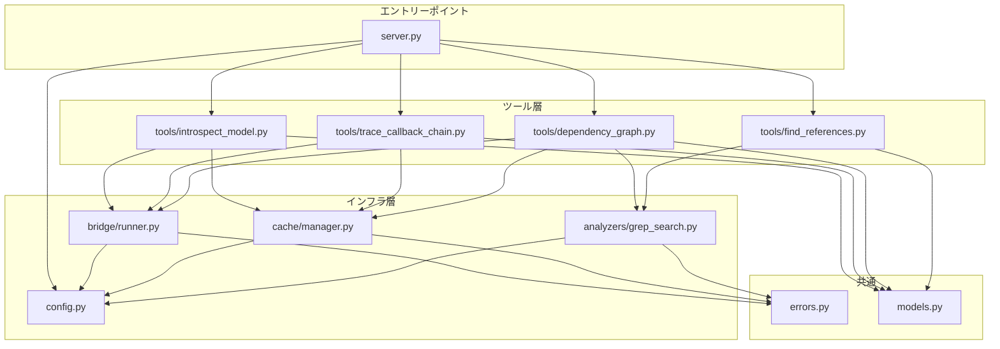
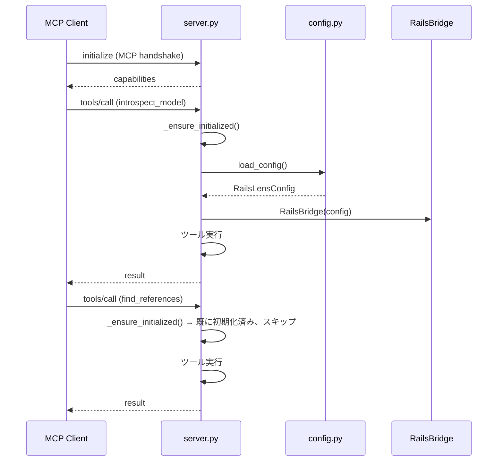
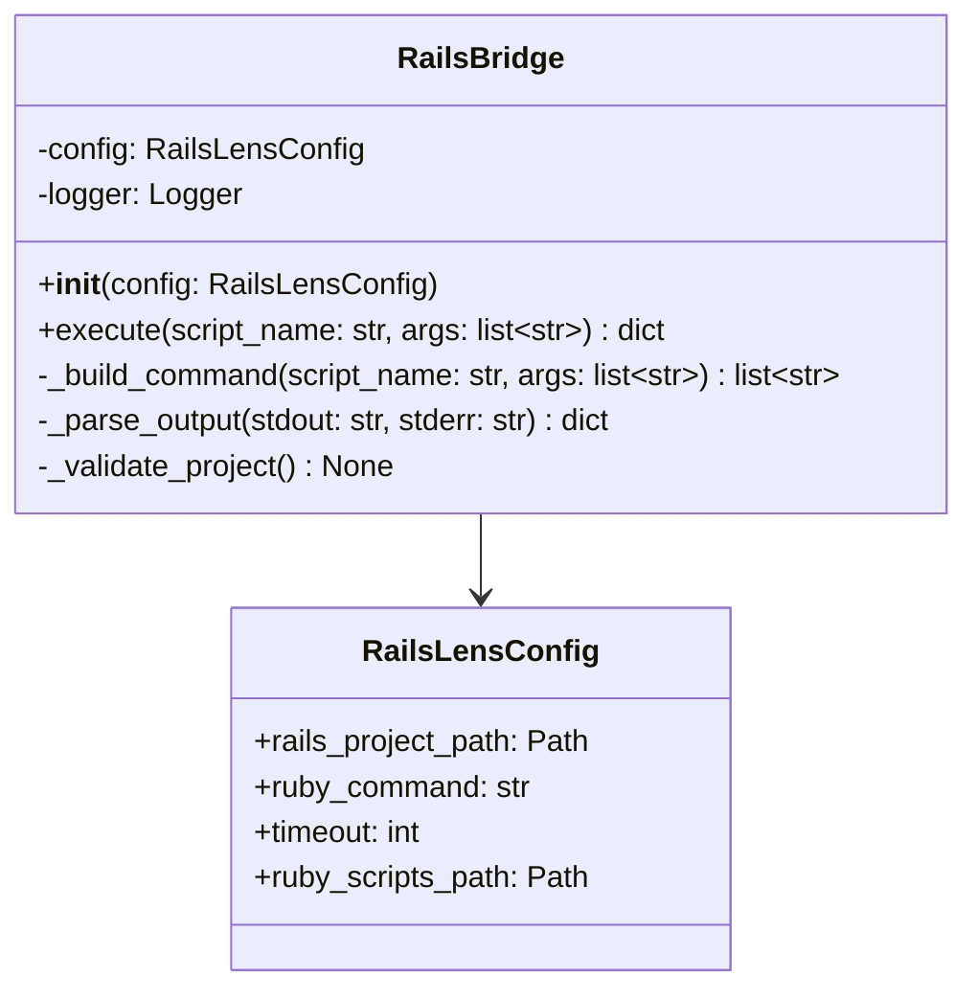
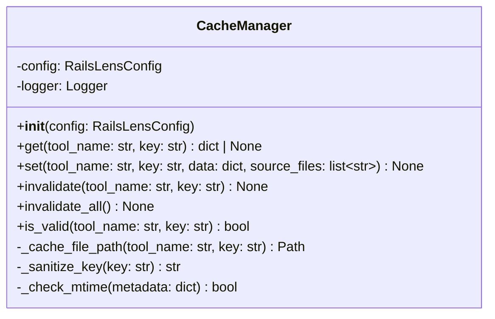
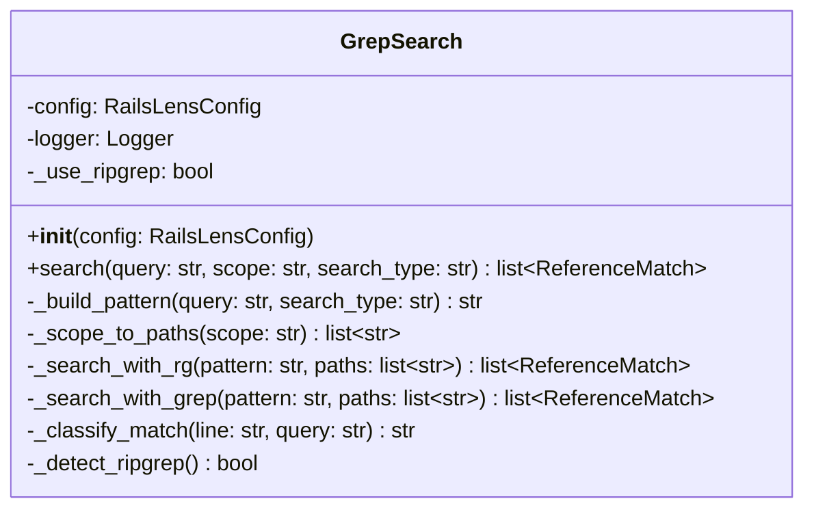
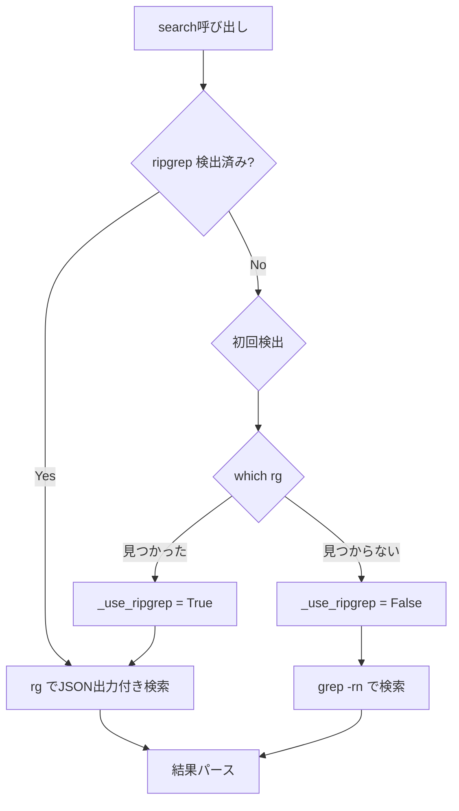
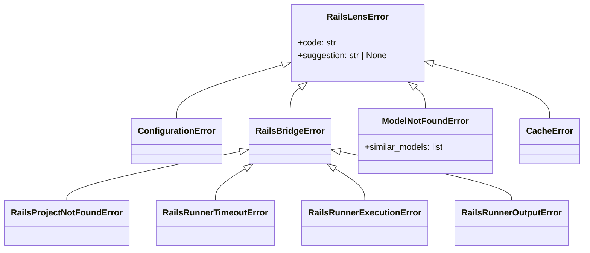
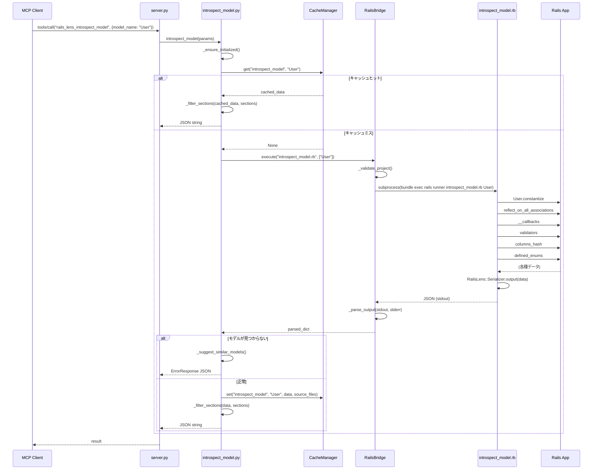
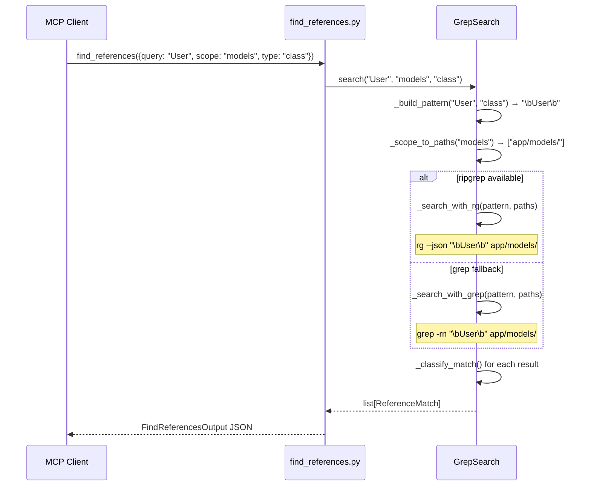

# rails-lens 設計書

> **バージョン**: 1.0.0
> **最終更新**: 2026-03-28
> **前提ドキュメント**: [要件定義書 (REQUIREMENTS.md)](./REQUIREMENTS.md)

---

## 目次

1. [設計方針](#1-設計方針)
2. [モジュール構成と依存関係](#2-モジュール構成と依存関係)
3. [データモデル定義](#3-データモデル定義)
4. [server.py — MCPサーバーエントリーポイント](#4-serverpy--mcpサーバーエントリーポイント)
5. [config.py — 設定管理](#5-configpy--設定管理)
6. [bridge/runner.py — ランタイムブリッジ](#6-bridgerunnerpy--ランタイムブリッジ)
7. [cache/manager.py — キャッシュ管理](#7-cachemanagerpy--キャッシュ管理)
8. [analyzers/grep_search.py — 静的解析](#8-analyzersgrep_searchpy--静的解析)
9. [tools/ — MCPツール実装](#9-tools--mcpツール実装)
10. [ruby/ — Rubyスクリプト実装](#10-ruby--rubyスクリプト実装)
11. [エラー型定義](#11-エラー型定義)
12. [処理シーケンス詳細](#12-処理シーケンス詳細)
13. [テスト設計](#13-テスト設計)
14. [パッケージングと配布](#14-パッケージングと配布)

---

## 1. 設計方針

### 1.1 原則

| 原則 | 説明 | 適用例 |
|---|---|---|
| **単一責務** | 各モジュールは1つの責務のみ持つ | ツール定義、ブリッジ、キャッシュ、解析を分離 |
| **依存逆転** | 上位モジュールが下位モジュールの具象に依存しない | ツールはブリッジのインターフェースに依存し、実行詳細を知らない |
| **フェイルセーフ** | エラー時は安全側に倒し、actionableなメッセージを返す | キャッシュ破損時はキャッシュ無視して再取得 |
| **キャッシュファースト** | ランタイム解析の結果は常にキャッシュし、可能な限りキャッシュから返す | `rails runner` の起動コスト（数秒〜十数秒）を回避 |

### 1.2 非同期処理の方針

- MCPサーバーは `asyncio` ベースで動作する
- `rails runner` の呼び出しは `asyncio.create_subprocess_exec` で非ブロッキング実行する
- ファイルI/O（キャッシュ読み書き）は `aiofiles` を使うか、または同期I/Oを `asyncio.to_thread` でラップする

> **設計判断**: `rails runner` は1リクエストあたり1プロセスであり並行起動は想定しないため、非同期の主な恩恵はMCPプロトコルのメッセージループをブロックしないことにある。ファイルI/Oについては、キャッシュファイルのサイズが通常数KB〜数十KBと小さいため、初期実装では同期I/Oで十分とし、パフォーマンス問題が出た場合に `aiofiles` へ移行する。

---

## 2. モジュール構成と依存関係

### 2.1 モジュール依存グラフ



### 2.2 各モジュールの責務

| モジュール | 責務 | 依存先 |
|---|---|---|
| `server.py` | FastMCPインスタンスの生成、ツールの登録、サーバー起動 | config, tools/* |
| `config.py` | `.rails-lens.toml` と環境変数からの設定読み込み、バリデーション | なし（標準ライブラリのみ） |
| `models.py` | 全ツールの入出力に使うPydanticモデル定義 | なし（pydanticのみ） |
| `errors.py` | カスタム例外クラスの定義 | なし |
| `bridge/runner.py` | `rails runner` のサブプロセス実行、JSON解析 | config, errors |
| `cache/manager.py` | JSONキャッシュの読み書き、mtime比較による無効化 | config, errors |
| `analyzers/grep_search.py` | `rg` / `grep` によるコード検索、結果のパース | config, errors |
| `tools/introspect_model.py` | モデルイントロスペクションのMCPツール定義 | bridge, cache, models |
| `tools/find_references.py` | コード参照検索のMCPツール定義 | grep_search, models |
| `tools/trace_callback_chain.py` | コールバックトレースのMCPツール定義 | bridge, cache, models |
| `tools/dependency_graph.py` | 依存関係グラフのMCPツール定義 | bridge, cache, grep_search, models |

---

## 3. データモデル定義

### 3.1 ファイル: `src/rails_lens/models.py`

全ツールの入出力に使うPydanticモデルを1ファイルに集約する。

> **設計判断**: ツールごとにモデルを分散させるとインポートが複雑になり、スキーマの整合性も取りづらい。`models.py` に集約することで、JSON Schemaのエクスポートやテストでのフィクスチャ生成が容易になる。

```python
"""rails-lens データモデル定義"""
from __future__ import annotations

from pydantic import BaseModel, ConfigDict, Field


# ============================================================
# 共通
# ============================================================

class SourceLocation(BaseModel):
    """ソースコード上の位置"""
    source_file: str
    source_line: int


class Conditions(BaseModel):
    """コールバック / バリデーションの条件"""
    if_condition: str | None = Field(None, alias="if")
    unless_condition: str | None = Field(None, alias="unless")

    model_config = ConfigDict(populate_by_name=True)


# ============================================================
# introspect_model 入力
# ============================================================

VALID_SECTIONS = [
    "associations", "callbacks", "validations", "scopes",
    "concerns", "enums", "schema", "sti", "delegations",
    "class_methods", "instance_methods",
]

class IntrospectModelInput(BaseModel):
    model_config = ConfigDict(str_strip_whitespace=True)
    model_name: str = Field(
        ...,
        description="ActiveRecord model name (e.g., 'User', 'Admin::Company')",
        min_length=1,
        max_length=200,
    )
    sections: list[str] | None = Field(
        default=None,
        description="Sections to include (default: all)",
    )


# ============================================================
# introspect_model 出力
# ============================================================

class Association(BaseModel):
    name: str
    type: str  # belongs_to, has_many, has_one, has_and_belongs_to_many
    class_name: str
    foreign_key: str | None = None
    through: str | None = None
    polymorphic: bool = False
    dependent: str | None = None
    has_scope: bool = False


class Callback(BaseModel, SourceLocation):
    kind: str  # before, after, around
    event: str
    method_name: str
    source_file: str
    source_line: int
    conditions: Conditions = Field(default_factory=Conditions)
    defined_in_concern: str | None = None


class Validation(BaseModel, SourceLocation):
    type: str
    attributes: list[str]
    options: dict = Field(default_factory=dict)
    custom_validator: str | None = None
    source_file: str
    source_line: int


class Scope(SourceLocation):
    name: str
    source_file: str
    source_line: int


class ConcernInfo(BaseModel):
    name: str
    provided_methods: list[str] = Field(default_factory=list)
    source_file: str


class EnumInfo(BaseModel):
    name: str
    values: dict


class ColumnInfo(BaseModel):
    name: str
    type: str
    null: bool = True
    default: str | int | float | bool | None = None
    limit: int | None = None


class IndexInfo(BaseModel):
    name: str
    columns: list[str]
    unique: bool = False


class ForeignKeyInfo(BaseModel):
    from_column: str
    to_table: str
    to_column: str = "id"


class SchemaInfo(BaseModel):
    columns: list[ColumnInfo] = Field(default_factory=list)
    indexes: list[IndexInfo] = Field(default_factory=list)
    foreign_keys: list[ForeignKeyInfo] = Field(default_factory=list)


class STIInfo(BaseModel):
    base_class: str
    descendants: list[str] = Field(default_factory=list)
    type_column: str = "type"


class Delegation(BaseModel):
    methods: list[str]
    to: str
    prefix: str | bool | None = None


class MethodInfo(SourceLocation):
    name: str
    source_file: str
    source_line: int


class IntrospectModelOutput(BaseModel):
    model_name: str
    table_name: str
    file_path: str
    associations: list[Association] = Field(default_factory=list)
    callbacks: list[Callback] = Field(default_factory=list)
    validations: list[Validation] = Field(default_factory=list)
    scopes: list[Scope] = Field(default_factory=list)
    concerns: list[ConcernInfo] = Field(default_factory=list)
    enums: list[EnumInfo] = Field(default_factory=list)
    schema: SchemaInfo = Field(default_factory=SchemaInfo)
    sti: STIInfo | None = None
    delegations: list[Delegation] = Field(default_factory=list)
    class_methods: list[MethodInfo] = Field(default_factory=list)
    instance_methods: list[MethodInfo] = Field(default_factory=list)


# ============================================================
# find_references 入力 / 出力
# ============================================================

class FindReferencesInput(BaseModel):
    model_config = ConfigDict(str_strip_whitespace=True)
    query: str = Field(..., min_length=1, description="Search query")
    scope: str = Field("all", description="Search scope")
    type: str = Field("any", description="Search type")


class MatchContext(BaseModel):
    before: str = ""
    match: str = ""
    after: str = ""


class ReferenceMatch(BaseModel):
    file: str
    line: int
    column: int = 0
    context: MatchContext = Field(default_factory=MatchContext)
    match_type: str = "other"


class FindReferencesOutput(BaseModel):
    query: str
    total_matches: int = 0
    matches: list[ReferenceMatch] = Field(default_factory=list)


# ============================================================
# trace_callback_chain 入力 / 出力
# ============================================================

class TraceCallbackChainInput(BaseModel):
    model_config = ConfigDict(str_strip_whitespace=True)
    model_name: str = Field(..., min_length=1, max_length=200)
    lifecycle_event: str


class CallbackStep(BaseModel):
    order: int
    kind: str
    method_name: str
    source_file: str
    source_line: int
    defined_in_concern: str | None = None
    conditions: Conditions = Field(default_factory=Conditions)
    note: str | None = None


class TraceCallbackChainOutput(BaseModel):
    model_name: str
    lifecycle_event: str
    execution_order: list[CallbackStep] = Field(default_factory=list)
    mermaid_diagram: str = ""


# ============================================================
# dependency_graph 入力 / 出力
# ============================================================

class DependencyGraphInput(BaseModel):
    model_config = ConfigDict(str_strip_whitespace=True)
    entry_point: str = Field(..., min_length=1)
    depth: int = Field(2, ge=1, le=5)
    format: str = Field("mermaid")


class GraphNode(BaseModel):
    id: str
    type: str  # model, controller, concern, service
    file_path: str = ""


class GraphEdge(BaseModel):
    from_node: str = Field(..., alias="from")
    to_node: str = Field(..., alias="to")
    relation: str  # association, callback, include, reference, inheritance
    label: str = ""

    model_config = ConfigDict(populate_by_name=True)


class DependencyGraphOutput(BaseModel):
    entry_point: str
    depth: int
    nodes: list[GraphNode] = Field(default_factory=list)
    edges: list[GraphEdge] = Field(default_factory=list)
    mermaid_diagram: str | None = None


# ============================================================
# ユーティリティツール
# ============================================================

class ModelSummary(BaseModel):
    name: str
    table_name: str
    file_path: str


class ListModelsOutput(BaseModel):
    models: list[ModelSummary] = Field(default_factory=list)


class ErrorResponse(BaseModel):
    code: str
    message: str
    suggestion: str | None = None
```

### 3.2 モデル設計の注意点

- `Conditions` モデルは `alias` を使用する。Pythonでは `if` が予約語であるため、フィールド名は `if_condition` / `unless_condition` とし、シリアライズ時に `if` / `unless` として出力する
- `GraphEdge` も同様に `from` が予約語であるため `from_node` を使う
- 出力モデルの各フィールドにはデフォルト値を設定し、Rubyスクリプトが一部のフィールドを返さなかった場合でもデシリアライズが成功するようにする

---

## 4. server.py — MCPサーバーエントリーポイント

### 4.1 責務

- `FastMCP` インスタンスの生成
- 設定の読み込み（`config.py`）
- 共有リソース（`RailsBridge`, `CacheManager`, `GrepSearch`）のインスタンス化
- ツールの登録
- `main()` 関数によるサーバー起動

### 4.2 設計

```python
"""rails-lens MCP Server"""
import sys
from mcp.server.fastmcp import FastMCP

from rails_lens.config import load_config, RailsLensConfig
from rails_lens.bridge.runner import RailsBridge
from rails_lens.cache.manager import CacheManager
from rails_lens.analyzers.grep_search import GrepSearch

mcp = FastMCP(
    "rails-lens",
    version="0.1.0",
    instructions=(
        "Rails application introspection server. "
        "Use rails_lens_introspect_model to understand model dependencies "
        "before making changes."
    ),
)

# --- グローバル状態（サーバーライフサイクルで共有） ---
_config: RailsLensConfig | None = None
_bridge: RailsBridge | None = None
_cache: CacheManager | None = None
_grep: GrepSearch | None = None


def _ensure_initialized() -> tuple[RailsLensConfig, RailsBridge, CacheManager, GrepSearch]:
    """遅延初期化。初回ツール呼び出し時に設定を読み込む。"""
    global _config, _bridge, _cache, _grep
    if _config is None:
        _config = load_config()
        _bridge = RailsBridge(_config)
        _cache = CacheManager(_config)
        _grep = GrepSearch(_config)
    return _config, _bridge, _cache, _grep


# --- ツール登録 ---
# 各ツールモジュールがmcpインスタンスとget_dependencies関数を受け取る
from rails_lens.tools.introspect_model import register as register_introspect
from rails_lens.tools.find_references import register as register_find_refs
from rails_lens.tools.trace_callback_chain import register as register_trace
from rails_lens.tools.dependency_graph import register as register_dep_graph

register_introspect(mcp, _ensure_initialized)
register_find_refs(mcp, _ensure_initialized)
register_trace(mcp, _ensure_initialized)
register_dep_graph(mcp, _ensure_initialized)


def main():
    mcp.run(transport="stdio")


if __name__ == "__main__":
    main()
```

### 4.3 遅延初期化パターン



> **設計判断**: MCPサーバー起動時ではなく初回ツール呼び出し時に設定を読み込む遅延初期化を採用。理由: (1) 設定ファイルが存在しない場合でもサーバー起動自体は成功させ、ツール呼び出し時に適切なエラーを返せる。(2) テスト時にモック注入しやすい。

### 4.4 ツール登録パターン

各ツールモジュールは `register(mcp, get_deps)` 関数をエクスポートする。この関数内で `@mcp.tool()` デコレータを使ってツールを登録する。

```python
# tools/introspect_model.py の register 関数シグネチャ
def register(
    mcp: FastMCP,
    get_deps: Callable[[], tuple[RailsLensConfig, RailsBridge, CacheManager, GrepSearch]],
) -> None:
    """MCPサーバーにツールを登録する。"""
    @mcp.tool(name="rails_lens_introspect_model", ...)
    async def introspect_model(params: IntrospectModelInput) -> str:
        config, bridge, cache, grep = get_deps()
        ...
```

> **設計判断**: デコレータを直接 `server.py` で使うのではなく、各ツールファイルの `register()` 関数内でデコレートする。これにより (1) ツールのテスト時に `mcp` インスタンスをモックに差し替えられる、(2) ツール追加時に `server.py` の変更が最小限になる。

---

## 5. config.py — 設定管理

### 5.1 設定の読み込み優先順位

```
1. 環境変数           （最優先）
2. .rails-lens.toml    （ファイル）
3. デフォルト値        （フォールバック）
```

### 5.2 実装設計

```python
"""設定管理"""
from __future__ import annotations

import os
from dataclasses import dataclass, field
from pathlib import Path

try:
    import tomllib  # Python 3.11+
except ModuleNotFoundError:
    import tomli as tomllib  # fallback


@dataclass(frozen=True)
class RailsLensConfig:
    """rails-lens の設定値"""

    # --- Rails ---
    rails_project_path: Path
    ruby_command: str = "bundle exec rails runner"
    timeout: int = 30

    # --- Cache ---
    cache_directory: str = ".rails-lens/cache"
    auto_invalidate: bool = True

    # --- Search ---
    search_command: str = "rg"
    exclude_dirs: tuple[str, ...] = (
        "tmp", "log", "vendor", "node_modules", ".git",
    )

    @property
    def cache_path(self) -> Path:
        """キャッシュディレクトリの絶対パス"""
        return self.rails_project_path / self.cache_directory

    @property
    def ruby_scripts_path(self) -> Path:
        """Rubyスクリプトディレクトリのパス"""
        # パッケージ内の ruby/ ディレクトリを参照
        return Path(__file__).resolve().parent.parent.parent / "ruby"


def load_config(
    config_path: Path | None = None,
    project_path: Path | None = None,
) -> RailsLensConfig:
    """
    設定を読み込む。

    Args:
        config_path: .rails-lens.toml のパス（テスト用）
        project_path: 明示的なプロジェクトパス（テスト用）

    Returns:
        RailsLensConfig

    Raises:
        ConfigurationError: 必須設定が不足している場合
    """
    # 1. 環境変数から取得
    env_project_path = os.environ.get("RAILS_LENS_PROJECT_PATH")

    # 2. TOMLファイルから取得
    toml_data: dict = {}
    if config_path is None:
        # カレントディレクトリから .rails-lens.toml を探す
        candidates = [
            Path.cwd() / ".rails-lens.toml",
        ]
        if env_project_path:
            candidates.insert(0, Path(env_project_path) / ".rails-lens.toml")

        for candidate in candidates:
            if candidate.is_file():
                config_path = candidate
                break

    if config_path and config_path.is_file():
        with open(config_path, "rb") as f:
            toml_data = tomllib.load(f)

    # 3. 値の解決（環境変数 > TOML > デフォルト）
    rails_section = toml_data.get("rails", {})
    cache_section = toml_data.get("cache", {})
    search_section = toml_data.get("search", {})

    resolved_project_path = (
        project_path
        or (Path(env_project_path) if env_project_path else None)
        or (Path(rails_section["project_path"]) if "project_path" in rails_section else None)
    )

    if resolved_project_path is None:
        from rails_lens.errors import ConfigurationError
        raise ConfigurationError(
            "Rails project path is not configured. "
            "Set 'rails.project_path' in .rails-lens.toml "
            "or RAILS_LENS_PROJECT_PATH environment variable."
        )

    return RailsLensConfig(
        rails_project_path=Path(resolved_project_path).resolve(),
        ruby_command=os.environ.get(
            "RAILS_LENS_RUBY_COMMAND",
            rails_section.get("ruby_command", "bundle exec rails runner"),
        ),
        timeout=int(os.environ.get(
            "RAILS_LENS_TIMEOUT",
            rails_section.get("timeout", 30),
        )),
        cache_directory=os.environ.get(
            "RAILS_LENS_CACHE_DIR",
            cache_section.get("directory", ".rails-lens/cache"),
        ),
        auto_invalidate=cache_section.get("auto_invalidate", True),
        search_command=search_section.get("command", "rg"),
        exclude_dirs=tuple(search_section.get(
            "exclude_dirs",
            ["tmp", "log", "vendor", "node_modules", ".git"],
        )),
    )
```

### 5.3 `ruby_scripts_path` の解決

Rubyスクリプトはパッケージの `ruby/` ディレクトリに配置される。`pip install` した場合と開発時（`pip install -e .`）の両方でパスが正しく解決される必要がある。

```
パッケージインストール時:
  site-packages/rails_lens/config.py  →  __file__ から3階層上 → site-packages/ruby/
  ↑ これは動かない

開発時 (editable install):
  src/rails_lens/config.py  →  __file__ から3階層上 → rails-lens/ruby/
  ↑ これは動く
```

> **設計判断**: `pyproject.toml` の `[tool.setuptools.package-data]` で `ruby/` ディレクトリをパッケージデータとして含めるか、`importlib.resources` を使う。初期実装では `importlib.resources` を採用し、パスの解決を標準ライブラリに委ねる。

```python
# config.py の ruby_scripts_path プロパティ（改良版）
@property
def ruby_scripts_path(self) -> Path:
    """Rubyスクリプトディレクトリのパス"""
    import importlib.resources as pkg_resources
    # パッケージ内の ruby/ を参照
    ref = pkg_resources.files("rails_lens") / ".." / ".." / "ruby"
    return Path(str(ref.resolve()))
```

---

## 6. bridge/runner.py — ランタイムブリッジ

### 6.1 クラス設計



### 6.2 実装詳細

```python
"""Ruby実行ブリッジ"""
from __future__ import annotations

import asyncio
import json
import logging
from pathlib import Path

from rails_lens.config import RailsLensConfig
from rails_lens.errors import (
    RailsBridgeError,
    RailsProjectNotFoundError,
    RailsRunnerTimeoutError,
    RailsRunnerExecutionError,
    RailsRunnerOutputError,
)

logger = logging.getLogger(__name__)


class RailsBridge:
    """rails runner を介してRubyスクリプトを実行するブリッジ"""

    def __init__(self, config: RailsLensConfig) -> None:
        self.config = config

    async def execute(
        self,
        script_name: str,
        args: list[str] | None = None,
    ) -> dict:
        """
        Rubyスクリプトを実行し、JSONレスポンスを返す。

        Args:
            script_name: 実行するスクリプト名（例: "introspect_model.rb"）
            args: スクリプトに渡す引数のリスト

        Returns:
            Rubyスクリプトが出力したJSONをパースしたdict

        Raises:
            RailsProjectNotFoundError: Railsプロジェクトが見つからない
            RailsRunnerTimeoutError: タイムアウト
            RailsRunnerExecutionError: rails runner の実行に失敗
            RailsRunnerOutputError: 出力のJSON解析に失敗
        """
        self._validate_project()

        command = self._build_command(script_name, args or [])
        logger.info("Executing: %s", " ".join(command))

        try:
            process = await asyncio.create_subprocess_exec(
                *command,
                stdout=asyncio.subprocess.PIPE,
                stderr=asyncio.subprocess.PIPE,
                cwd=str(self.config.rails_project_path),
            )

            stdout_bytes, stderr_bytes = await asyncio.wait_for(
                process.communicate(),
                timeout=self.config.timeout,
            )

        except asyncio.TimeoutError:
            process.kill()
            await process.wait()
            raise RailsRunnerTimeoutError(
                f"Rails runner timed out after {self.config.timeout} seconds. "
                f"The Rails application may be slow to boot. "
                f"Try increasing 'rails.timeout' in .rails-lens.toml."
            )
        except FileNotFoundError:
            raise RailsRunnerExecutionError(
                "Failed to execute Rails runner. "
                "Ensure Ruby and Bundler are installed and available in PATH."
            )

        stdout = stdout_bytes.decode("utf-8", errors="replace")
        stderr = stderr_bytes.decode("utf-8", errors="replace")

        if stderr:
            logger.debug("Rails runner stderr:\n%s", stderr)

        if process.returncode != 0:
            raise RailsRunnerExecutionError(
                f"Rails runner exited with code {process.returncode}. "
                f"Ensure 'bundle install' has been run in the Rails project.\n"
                f"stderr: {stderr[:500]}"
            )

        return self._parse_output(stdout, stderr)

    def _build_command(self, script_name: str, args: list[str]) -> list[str]:
        """実行コマンドを組み立てる"""
        script_path = self.config.ruby_scripts_path / script_name

        if not script_path.is_file():
            raise RailsBridgeError(
                f"Ruby script not found: {script_path}"
            )

        # "bundle exec rails runner" → ["bundle", "exec", "rails", "runner"]
        command_parts = self.config.ruby_command.split()
        return [*command_parts, str(script_path), *args]

    def _parse_output(self, stdout: str, stderr: str) -> dict:
        """標準出力のJSONを解析する"""
        stdout = stdout.strip()
        if not stdout:
            raise RailsRunnerOutputError(
                "Rails runner produced no output. "
                "Check stderr for details."
            )

        try:
            result = json.loads(stdout)
        except json.JSONDecodeError as e:
            # stdout の先頭部分をヒントとして含める
            preview = stdout[:200]
            raise RailsRunnerOutputError(
                f"Failed to parse JSON from Rails runner output. "
                f"This may be caused by debug output in the Rails application. "
                f"Output preview: {preview!r}\n"
                f"Parse error: {e}"
            )

        # RailsLens::Serializer の status チェック
        if result.get("status") == "error":
            error_info = result.get("error", {})
            raise RailsRunnerExecutionError(
                error_info.get("message", "Unknown error from Rails runner"),
            )

        return result.get("data", result)

    def _validate_project(self) -> None:
        """Railsプロジェクトの存在を確認する"""
        project_path = self.config.rails_project_path

        if not project_path.is_dir():
            raise RailsProjectNotFoundError(
                f"Rails project directory not found: {project_path}"
            )

        gemfile = project_path / "Gemfile"
        if not gemfile.is_file():
            raise RailsProjectNotFoundError(
                f"No Gemfile found at {project_path}. "
                f"Ensure the path points to a Rails project root."
            )
```

### 6.3 コマンド組み立ての例

| 設定 | script_name | args | 生成コマンド |
|---|---|---|---|
| `ruby_command = "bundle exec rails runner"` | `introspect_model.rb` | `["User"]` | `bundle exec rails runner /path/to/ruby/introspect_model.rb User` |
| `ruby_command = "bin/rails runner"` | `trace_callbacks.rb` | `["Order", "save"]` | `bin/rails runner /path/to/ruby/trace_callbacks.rb Order save` |

---

## 7. cache/manager.py — キャッシュ管理

### 7.1 クラス設計



### 7.2 実装詳細

```python
"""JSONファイルキャッシュ管理"""
from __future__ import annotations

import json
import logging
import shutil
from datetime import datetime, timezone
from pathlib import Path

from rails_lens.config import RailsLensConfig

logger = logging.getLogger(__name__)


class CacheManager:
    """ファイルベースのJSONキャッシュ管理"""

    def __init__(self, config: RailsLensConfig) -> None:
        self.config = config
        self._cache_dir = config.cache_path

    def get(self, tool_name: str, key: str) -> dict | None:
        """
        キャッシュからデータを取得する。

        Returns:
            キャッシュされたデータ（dict）。キャッシュミス or 無効の場合は None。
        """
        path = self._cache_file_path(tool_name, key)

        if not path.is_file():
            logger.debug("Cache miss: %s/%s", tool_name, key)
            return None

        try:
            with open(path, "r", encoding="utf-8") as f:
                cached = json.load(f)
        except (json.JSONDecodeError, OSError) as e:
            logger.warning("Cache read error for %s/%s: %s", tool_name, key, e)
            # 破損キャッシュは削除
            path.unlink(missing_ok=True)
            return None

        # 自動無効化チェック
        if self.config.auto_invalidate:
            metadata = cached.get("_cache_metadata", {})
            if not self._check_mtime(metadata):
                logger.info("Cache invalidated (mtime changed): %s/%s", tool_name, key)
                path.unlink(missing_ok=True)
                return None

        logger.debug("Cache hit: %s/%s", tool_name, key)
        return cached.get("data")

    def set(
        self,
        tool_name: str,
        key: str,
        data: dict,
        source_files: list[str] | None = None,
    ) -> None:
        """データをキャッシュに書き込む。"""
        path = self._cache_file_path(tool_name, key)
        path.parent.mkdir(parents=True, exist_ok=True)

        # ソースファイルのmtimeを記録
        source_files_mtime = {}
        if source_files:
            for sf in source_files:
                sf_path = self.config.rails_project_path / sf
                if sf_path.is_file():
                    mtime = sf_path.stat().st_mtime
                    source_files_mtime[sf] = datetime.fromtimestamp(
                        mtime, tz=timezone.utc
                    ).isoformat()

        cache_entry = {
            "_cache_metadata": {
                "created_at": datetime.now(tz=timezone.utc).isoformat(),
                "source_files_mtime": source_files_mtime,
                "rails_lens_version": "0.1.0",
            },
            "data": data,
        }

        with open(path, "w", encoding="utf-8") as f:
            json.dump(cache_entry, f, ensure_ascii=False, indent=2)

        logger.debug("Cache written: %s/%s", tool_name, key)

    def invalidate(self, tool_name: str, key: str) -> None:
        """特定のキャッシュを無効化する。"""
        path = self._cache_file_path(tool_name, key)
        path.unlink(missing_ok=True)
        logger.info("Cache invalidated: %s/%s", tool_name, key)

    def invalidate_all(self) -> None:
        """全キャッシュを無効化する。"""
        if self._cache_dir.is_dir():
            shutil.rmtree(self._cache_dir)
            logger.info("All caches invalidated")

    def _cache_file_path(self, tool_name: str, key: str) -> Path:
        """キャッシュファイルのパスを生成する。"""
        sanitized_key = self._sanitize_key(key)
        return self._cache_dir / tool_name / f"{sanitized_key}.json"

    @staticmethod
    def _sanitize_key(key: str) -> str:
        """キャッシュキーをファイル名として安全な文字列に変換する。"""
        # "::" → "__", "/" → "_", その他のファイルシステム非安全文字を除去
        return key.replace("::", "__").replace("/", "_").replace("\\", "_")

    def _check_mtime(self, metadata: dict) -> bool:
        """
        キャッシュメタデータのmtimeと現在のファイルmtimeを比較する。

        Returns:
            True: キャッシュは有効, False: キャッシュは無効（ファイルが変更されている）
        """
        source_files_mtime = metadata.get("source_files_mtime", {})

        if not source_files_mtime:
            # ソースファイル情報がない場合は有効とみなす
            return True

        for rel_path, cached_mtime_str in source_files_mtime.items():
            file_path = self.config.rails_project_path / rel_path
            if not file_path.is_file():
                # ファイルが削除された → 無効
                return False

            current_mtime = datetime.fromtimestamp(
                file_path.stat().st_mtime, tz=timezone.utc
            ).isoformat()

            if current_mtime != cached_mtime_str:
                return False

        return True
```

### 7.3 キャッシュキーの例

| ツール | 入力 | キャッシュパス |
|---|---|---|
| `introspect_model` | `User` | `.rails-lens/cache/introspect_model/User.json` |
| `introspect_model` | `Admin::Company` | `.rails-lens/cache/introspect_model/Admin__Company.json` |
| `trace_callbacks` | `Order`, `save` | `.rails-lens/cache/trace_callbacks/Order__save.json` |
| `list_models` | (なし) | `.rails-lens/cache/models/_all.json` |

---

## 8. analyzers/grep_search.py — 静的解析

### 8.1 クラス設計



### 8.2 検索パターンの構築

Ruby構文を考慮したパターンマッチングのロジック:

| search_type | query例 | 生成されるregexパターン | マッチ対象 |
|---|---|---|---|
| `class` | `User` | `\bUser\b` | クラス参照（`User.new`, `class User`, `belongs_to :user, class_name: "User"`） |
| `method` | `activate!` | `[.:]activate!|\bactivate!\b` | メソッド呼び出し（`.activate!`, `:activate!`） |
| `any` | `User` | `\bUser\b` | 全マッチ |

### 8.3 マッチタイプの分類ロジック

```python
def _classify_match(self, line: str, query: str) -> str:
    """マッチした行のコンテキストからマッチタイプを推定する"""
    stripped = line.strip()

    # クラス参照パターン
    if re.search(rf'class\s+{re.escape(query)}', stripped):
        return "class_reference"
    if re.search(rf'{re.escape(query)}\.(new|find|where|create)', stripped):
        return "class_reference"
    if re.search(rf'class_name:\s*["\']?{re.escape(query)}', stripped):
        return "class_reference"

    # メソッド呼び出しパターン
    if re.search(rf'\.{re.escape(query)}[\s(]', stripped):
        return "method_call"
    if re.search(rf'def\s+{re.escape(query)}', stripped):
        return "method_call"

    # シンボル参照パターン
    if re.search(rf':{re.escape(query)}\b', stripped):
        return "symbol_reference"

    # 文字列リテラル
    if re.search(rf'["\'].*{re.escape(query)}.*["\']', stripped):
        return "string_literal"

    return "other"
```

### 8.4 ripgrep / grep フォールバック



### 8.5 スコープとディレクトリの対応

| scope | 検索ディレクトリ（Railsプロジェクトルート相対） |
|---|---|
| `models` | `app/models/` |
| `controllers` | `app/controllers/` |
| `views` | `app/views/` |
| `services` | `app/services/` |
| `all` | `app/`, `lib/`, `config/` |

---

## 9. tools/ — MCPツール実装

### 9.1 共通パターン

全ツールは以下の共通パターンに従う:

```python
# tools/introspect_model.py
"""rails_lens_introspect_model ツール"""
from __future__ import annotations

import json
import logging
from typing import Callable

from mcp.server.fastmcp import FastMCP

from rails_lens.models import IntrospectModelInput, IntrospectModelOutput, ErrorResponse
from rails_lens.errors import RailsLensError

logger = logging.getLogger(__name__)


def register(mcp: FastMCP, get_deps: Callable) -> None:
    """MCPサーバーにツールを登録する"""

    @mcp.tool(
        name="rails_lens_introspect_model",
        annotations={
            "title": "Introspect Rails Model",
            "readOnlyHint": True,
            "destructiveHint": False,
            "idempotentHint": True,
            "openWorldHint": False,
        },
    )
    async def introspect_model(params: IntrospectModelInput) -> str:
        """モデルの全依存関係（associations, callbacks, validations,
        scopes, concerns, schema等）を返す。
        モデルを変更する前に必ずこのツールで影響範囲を確認すること。
        """
        try:
            config, bridge, cache, _ = get_deps()
        except Exception as e:
            return _error_json("INITIALIZATION_ERROR", str(e))

        model_name = params.model_name

        # 1. キャッシュ確認
        cache_key = model_name
        cached = cache.get("introspect_model", cache_key)
        if cached is not None:
            return _filter_sections(cached, params.sections)

        # 2. rails runner 実行
        try:
            raw_data = await bridge.execute(
                "introspect_model.rb",
                args=[model_name],
            )
        except RailsLensError as e:
            return _error_json(e.code, str(e), suggestion=e.suggestion)

        # 3. キャッシュ保存
        source_files = _extract_source_files(raw_data, model_name)
        cache.set("introspect_model", cache_key, raw_data, source_files)

        # 4. セクションフィルタリング & 返却
        return _filter_sections(raw_data, params.sections)


def _filter_sections(data: dict, sections: list[str] | None) -> str:
    """指定されたセクションのみを含むJSONを返す"""
    if sections is None:
        return json.dumps(data, ensure_ascii=False, indent=2)

    filtered = {
        k: v for k, v in data.items()
        if k in sections or k in ("model_name", "table_name", "file_path")
    }
    return json.dumps(filtered, ensure_ascii=False, indent=2)


def _extract_source_files(data: dict, model_name: str) -> list[str]:
    """キャッシュ無効化に使うソースファイルのリストを抽出する"""
    files = [f"db/schema.rb"]

    file_path = data.get("file_path")
    if file_path:
        files.append(file_path)

    for concern in data.get("concerns", []):
        sf = concern.get("source_file")
        if sf:
            files.append(sf)

    return files


def _error_json(code: str, message: str, suggestion: str | None = None) -> str:
    """エラーレスポンスをJSON文字列として返す"""
    resp = ErrorResponse(code=code, message=message, suggestion=suggestion)
    return resp.model_dump_json(indent=2)
```

### 9.2 各ツールの固有ロジック

#### introspect_model — 類似モデルサジェスト

モデルが見つからない場合、Ruby側が `ModelNotFoundError` とともに全モデル名のリストを返す。Python側でレーベンシュタイン距離（または `difflib.get_close_matches`）を使って類似モデルをサジェストする。

```python
from difflib import get_close_matches

def _suggest_similar_models(model_name: str, all_models: list[str]) -> list[str]:
    """類似モデル名のサジェストを返す"""
    return get_close_matches(model_name, all_models, n=3, cutoff=0.4)
```

#### trace_callback_chain — Mermaid図の生成

Python側でコールバックリストからMermaid sequence diagramを生成する:

```python
def _generate_mermaid_diagram(
    model_name: str,
    lifecycle_event: str,
    callbacks: list[dict],
) -> str:
    """コールバック連鎖のMermaid sequence diagramを生成する"""
    participants: dict[str, str] = {"App": "Application"}
    # モデル自身
    participants[model_name] = f"{model_name} Model"

    # Concernを参加者として追加
    for cb in callbacks:
        concern = cb.get("defined_in_concern")
        if concern and concern not in participants:
            participants[concern] = f"{concern} Concern"

    lines = ["sequenceDiagram"]
    for pid, label in participants.items():
        lines.append(f"    participant {pid} as {label}")

    lines.append(f"    App->>{model_name}: {lifecycle_event}")

    before_done = False
    for cb in callbacks:
        kind = cb["kind"]
        method = cb["method_name"]
        source = cb.get("defined_in_concern") or model_name
        condition = ""

        conds = cb.get("conditions", {})
        if conds.get("if"):
            condition = f" (if: {conds['if']})"
        elif conds.get("unless"):
            condition = f" (unless: {conds['unless']})"

        # before → DB Write → after の区切り
        if not before_done and kind in ("after",):
            lines.append(f"    Note over {model_name}: --- DB Write ---")
            before_done = True

        lines.append(f"    {model_name}->>{source}: {kind}_{lifecycle_event} :{method}{condition}")

    return "\n".join(lines)
```

#### dependency_graph — Mermaid graph の生成

```python
def _generate_mermaid_graph(nodes: list[dict], edges: list[dict]) -> str:
    """依存関係グラフのMermaid graph LRを生成する"""
    lines = ["graph LR"]
    for edge in edges:
        lines.append(f"    {edge['from']} -->|{edge['label']}| {edge['to']}")
    return "\n".join(lines)
```

---

## 10. ruby/ — Rubyスクリプト実装

### 10.1 共通ヘルパー: helpers/serializer.rb

```ruby
# frozen_string_literal: true

require 'json'

module RailsLens
  module Serializer
    def self.output(data)
      $stdout.puts JSON.generate({
        status: 'success',
        data: data,
        metadata: {
          rails_version: Rails.version,
          ruby_version: RUBY_VERSION,
          timestamp: Time.now.iso8601
        }
      })
    end

    def self.error(message, details: nil)
      $stdout.puts JSON.generate({
        status: 'error',
        error: {
          message: message,
          details: details
        }
      })
    end
  end
end
```

### 10.2 introspect_model.rb

最も重要なスクリプト。使用するRails内部API:

| 情報 | Rails API | 備考 |
|---|---|---|
| associations | `Model.reflect_on_all_associations` | `ActiveRecord::Reflection::AssociationReflection` |
| callbacks | `Model.__callbacks` | `ActiveSupport::Callbacks` の内部構造 |
| validations | `Model.validators` | `ActiveModel::Validations` |
| scopes | `Model.defined_enums`, scope methods | `ActiveRecord::Scoping::Named` |
| concerns | `Model.ancestors.select { module? }` | `ActiveSupport::Concern` |
| enums | `Model.defined_enums` | Rails 7+ |
| schema | `Model.columns_hash`, `Model.connection.indexes` | `ActiveRecord::ConnectionAdapters` |
| STI | `Model.descends_from_active_record?`, `Model.descendants` | `ActiveRecord::Inheritance` |
| delegations | ソースコード解析 | `delegate` はメタ情報を保持しないため静的解析にフォールバック |

```ruby
# frozen_string_literal: true

require_relative 'helpers/serializer'

begin
  model_name = ARGV[0]

  unless model_name
    RailsLens::Serializer.error('Model name is required as first argument')
    exit 0
  end

  # モデルクラスの取得
  begin
    klass = model_name.constantize
  rescue NameError
    # 全モデルリストを取得してサジェスト用に返す
    all_models = ActiveRecord::Base.descendants.map(&:name).compact.sort
    RailsLens::Serializer.error(
      "Model '#{model_name}' not found.",
      details: { all_models: all_models }
    )
    exit 0
  end

  unless klass < ActiveRecord::Base
    RailsLens::Serializer.error("'#{model_name}' is not an ActiveRecord model.")
    exit 0
  end

  data = {}

  # --- 基本情報 ---
  data[:model_name] = klass.name
  data[:table_name] = klass.table_name
  data[:file_path] = begin
    source_location = klass.instance_method(:initialize).source_location&.first
    # ApplicationRecordを指す場合はモデルファイルを推定
    source_location || "app/models/#{model_name.underscore}.rb"
  rescue
    "app/models/#{model_name.underscore}.rb"
  end

  # --- Associations ---
  data[:associations] = klass.reflect_on_all_associations.map do |ref|
    {
      name: ref.name.to_s,
      type: ref.macro.to_s,
      class_name: ref.class_name,
      foreign_key: ref.foreign_key.to_s,
      through: ref.is_a?(ActiveRecord::Reflection::ThroughReflection) ? ref.through_reflection.name.to_s : nil,
      polymorphic: ref.respond_to?(:polymorphic?) && ref.polymorphic?,
      dependent: ref.options[:dependent]&.to_s,
      has_scope: ref.scope ? true : false,
    }
  end

  # --- Callbacks ---
  callback_kinds = %i[
    before_validation after_validation
    before_save after_save around_save
    before_create after_create around_create
    before_update after_update around_update
    before_destroy after_destroy around_destroy
    after_commit after_rollback
    after_initialize after_find after_touch
  ]

  data[:callbacks] = []
  callback_kinds.each do |cb_kind|
    # ActiveSupport::Callbacks の内部構造にアクセス
    # cb_kind = :before_save → event = "save", kind = "before"
    kind_str = cb_kind.to_s
    parts = kind_str.split('_', 2)
    next unless parts.length == 2

    kind = parts[0]      # "before", "after", "around"
    event = parts[1]     # "save", "create", etc.

    begin
      callbacks = klass.__callbacks[event.to_sym]
      next unless callbacks

      callbacks.each do |callback|
        next unless callback.kind.to_s == kind

        filter = callback.filter
        method_name = case filter
                      when Symbol then filter.to_s
                      when String then filter
                      else filter.class.name || 'anonymous'
                      end

        # ソースロケーションの取得
        source_file = nil
        source_line = nil
        defined_in_concern = nil

        if filter.is_a?(Symbol) && klass.method_defined?(filter)
          method_obj = klass.instance_method(filter)
          loc = method_obj.source_location
          if loc
            source_file = loc[0]
            source_line = loc[1]

            # Concern判定: メソッドの定義元がklass自身でなければConcern
            owner = method_obj.owner
            if owner != klass && owner.is_a?(Module)
              defined_in_concern = owner.name
            end
          end
        end

        # conditions の取得
        conditions = {}
        if callback.instance_variable_defined?(:@if)
          if_conds = callback.instance_variable_get(:@if)
          conditions[:if] = if_conds.first.to_s unless if_conds.empty?
        end
        if callback.instance_variable_defined?(:@unless)
          unless_conds = callback.instance_variable_get(:@unless)
          conditions[:unless] = unless_conds.first.to_s unless unless_conds.empty?
        end

        data[:callbacks] << {
          kind: kind,
          event: event,
          method_name: method_name,
          source_file: source_file,
          source_line: source_line,
          conditions: conditions,
          defined_in_concern: defined_in_concern,
        }
      end
    rescue => e
      $stderr.puts "Warning: Failed to inspect callbacks for #{cb_kind}: #{e.message}"
    end
  end

  # --- Validations ---
  data[:validations] = klass.validators.map do |v|
    source_file = nil
    source_line = nil

    if v.respond_to?(:source_location)
      loc = v.source_location
      source_file = loc&.first
      source_line = loc&.last
    end

    {
      type: v.class.name.demodulize.underscore,
      attributes: v.attributes.map(&:to_s),
      options: v.options.transform_keys(&:to_s),
      custom_validator: v.is_a?(ActiveModel::Validations::WithValidator) ? v.options[:with]&.name : nil,
      source_file: source_file,
      source_line: source_line,
    }
  end

  # --- Scopes ---
  data[:scopes] = []
  if klass.respond_to?(:scope_names)
    # Rails 内部: scope_names は公式APIではないため、
    # defined_scopes or singleton_methods からフィルタ
  end
  # フォールバック: クラスのシングルトンメソッドでActiveRecord::Relationを返すものを検出
  scope_methods = klass.methods(false).select do |m|
    begin
      klass.method(m).source_location&.first&.include?('app/models')
    rescue
      false
    end
  end
  scope_methods.each do |m|
    loc = klass.method(m).source_location
    data[:scopes] << {
      name: m.to_s,
      source_file: loc&.first,
      source_line: loc&.last,
    }
  end

  # --- Concerns ---
  data[:concerns] = []
  klass.ancestors.each do |ancestor|
    next if ancestor == klass
    next unless ancestor.is_a?(Module) && !ancestor.is_a?(Class)
    next if ancestor.name.nil?
    next if ancestor.name.start_with?('ActiveRecord', 'ActiveModel', 'ActiveSupport')
    next if ancestor.name.start_with?('Kernel', 'JSON', 'PP', 'Object', 'BasicObject')

    provided_methods = ancestor.instance_methods(false).map(&:to_s)
    source_file = begin
      first_method = ancestor.instance_methods(false).first
      first_method ? ancestor.instance_method(first_method).source_location&.first : nil
    rescue
      nil
    end

    data[:concerns] << {
      name: ancestor.name,
      provided_methods: provided_methods,
      source_file: source_file,
    }
  end

  # --- Enums ---
  data[:enums] = if klass.respond_to?(:defined_enums)
    klass.defined_enums.map do |name, values|
      { name: name, values: values }
    end
  else
    []
  end

  # --- Schema ---
  columns = klass.columns_hash.map do |name, col|
    {
      name: name,
      type: col.type.to_s,
      null: col.null,
      default: col.default,
      limit: col.limit,
    }
  end

  indexes = begin
    klass.connection.indexes(klass.table_name).map do |idx|
      {
        name: idx.name,
        columns: idx.columns,
        unique: idx.unique,
      }
    end
  rescue
    []
  end

  foreign_keys = begin
    klass.connection.foreign_keys(klass.table_name).map do |fk|
      {
        from_column: fk.column,
        to_table: fk.to_table,
        to_column: fk.primary_key,
      }
    end
  rescue
    []
  end

  data[:schema] = {
    columns: columns,
    indexes: indexes,
    foreign_keys: foreign_keys,
  }

  # --- STI ---
  if klass.column_names.include?(klass.inheritance_column)
    data[:sti] = {
      base_class: klass.base_class.name,
      descendants: klass.descendants.map(&:name).compact,
      type_column: klass.inheritance_column,
    }
  else
    data[:sti] = nil
  end

  # --- Delegations ---
  # delegate はメタ情報を保持しないため、ソースコードから正規表現で抽出
  data[:delegations] = []
  model_file = Rails.root.join("app/models/#{model_name.underscore}.rb")
  if File.exist?(model_file)
    content = File.read(model_file)
    content.scan(/delegate\s+(.+?)(?:,\s*to:\s*[:\"]?(\w+)[:\"]?)(?:,\s*prefix:\s*(\w+|true|false))?/m) do |methods_str, to, prefix|
      methods = methods_str.scan(/:(\w+[?!]?)/).flatten
      data[:delegations] << {
        methods: methods,
        to: to,
        prefix: prefix == 'true' ? true : (prefix == 'false' ? false : prefix),
      }
    end
  end

  # --- Methods (model-specific only) ---
  base_methods = ActiveRecord::Base.instance_methods + ApplicationRecord.instance_methods
  data[:instance_methods] = (klass.instance_methods(false) - base_methods).map do |m|
    loc = begin
            klass.instance_method(m).source_location
          rescue
            nil
          end
    {
      name: m.to_s,
      source_file: loc&.first,
      source_line: loc&.last,
    }
  end

  base_class_methods = ActiveRecord::Base.methods + ApplicationRecord.methods
  data[:class_methods] = (klass.methods(false) - base_class_methods).map do |m|
    loc = begin
            klass.method(m).source_location
          rescue
            nil
          end
    {
      name: m.to_s,
      source_file: loc&.first,
      source_line: loc&.last,
    }
  end

  RailsLens::Serializer.output(data)

rescue => e
  RailsLens::Serializer.error(
    "Unexpected error: #{e.message}",
    details: { backtrace: e.backtrace&.first(10) }
  )
end
```

### 10.3 trace_callbacks.rb

```ruby
# frozen_string_literal: true

require_relative 'helpers/serializer'

begin
  model_name = ARGV[0]
  lifecycle_event = ARGV[1]

  unless model_name && lifecycle_event
    RailsLens::Serializer.error(
      'Usage: trace_callbacks.rb <ModelName> <lifecycle_event>'
    )
    exit 0
  end

  klass = model_name.constantize

  # イベントに関連するコールバック種別のマッピング
  event_to_callbacks = {
    'save'     => %w[before_save around_save after_save],
    'create'   => %w[before_validation after_validation before_save before_create around_create after_create after_save after_commit],
    'update'   => %w[before_validation after_validation before_save before_update around_update after_update after_save after_commit],
    'destroy'  => %w[before_destroy around_destroy after_destroy after_commit],
    'validate' => %w[before_validation after_validation],
    'commit'   => %w[after_commit after_rollback],
  }

  target_callbacks = event_to_callbacks[lifecycle_event]
  unless target_callbacks
    RailsLens::Serializer.error(
      "Unknown lifecycle event: '#{lifecycle_event}'. " \
      "Valid events: #{event_to_callbacks.keys.join(', ')}"
    )
    exit 0
  end

  execution_order = []
  order_counter = 0

  target_callbacks.each do |cb_kind|
    parts = cb_kind.split('_', 2)
    kind = parts[0]
    event = parts[1]

    callbacks = klass.__callbacks[event.to_sym]
    next unless callbacks

    callbacks.each do |callback|
      next unless callback.kind.to_s == kind

      order_counter += 1
      filter = callback.filter
      method_name = filter.is_a?(Symbol) ? filter.to_s : filter.to_s

      # ソースロケーション取得（introspect_model.rbと同様のロジック）
      source_file = nil
      source_line = nil
      defined_in_concern = nil

      if filter.is_a?(Symbol) && klass.method_defined?(filter)
        method_obj = klass.instance_method(filter)
        loc = method_obj.source_location
        if loc
          source_file = loc[0]
          source_line = loc[1]
          owner = method_obj.owner
          defined_in_concern = owner.name if owner != klass && owner.is_a?(Module)
        end
      end

      conditions = {}
      # conditionsの取得ロジック（省略、introspect_modelと同様）

      execution_order << {
        order: order_counter,
        kind: kind,
        method_name: method_name,
        source_file: source_file,
        source_line: source_line,
        defined_in_concern: defined_in_concern,
        conditions: conditions,
        note: nil,
      }
    end
  end

  RailsLens::Serializer.output({
    model_name: klass.name,
    lifecycle_event: lifecycle_event,
    execution_order: execution_order,
  })

rescue NameError
  all_models = ActiveRecord::Base.descendants.map(&:name).compact.sort
  RailsLens::Serializer.error(
    "Model '#{model_name}' not found.",
    details: { all_models: all_models }
  )
rescue => e
  RailsLens::Serializer.error(
    "Unexpected error: #{e.message}",
    details: { backtrace: e.backtrace&.first(10) }
  )
end
```

### 10.4 list_models.rb

```ruby
# frozen_string_literal: true

require_relative 'helpers/serializer'

begin
  # 全てのモデルを確実にロードする
  Rails.application.eager_load!

  models = ActiveRecord::Base.descendants
    .reject(&:abstract_class?)
    .select { |k| k.name.present? }
    .sort_by(&:name)
    .map do |klass|
      {
        name: klass.name,
        table_name: begin; klass.table_name; rescue; nil; end,
        file_path: "app/models/#{klass.name.underscore}.rb",
      }
    end

  RailsLens::Serializer.output({ models: models })

rescue => e
  RailsLens::Serializer.error(
    "Unexpected error: #{e.message}",
    details: { backtrace: e.backtrace&.first(10) }
  )
end
```

### 10.5 dump_schema.rb / dump_routes.rb

これらはPhase 4で実装する。基本構造は `list_models.rb` と同様で、それぞれ `ActiveRecord::Base.connection` と `Rails.application.routes` を使用する。

---

## 11. エラー型定義

### 11.1 ファイル: `src/rails_lens/errors.py`

```python
"""rails-lens カスタム例外"""


class RailsLensError(Exception):
    """全てのrails-lensエラーの基底クラス"""

    code: str = "UNKNOWN_ERROR"
    suggestion: str | None = None


class ConfigurationError(RailsLensError):
    """設定エラー"""
    code = "CONFIGURATION_ERROR"


class RailsBridgeError(RailsLensError):
    """ブリッジ基底エラー"""
    code = "BRIDGE_ERROR"


class RailsProjectNotFoundError(RailsBridgeError):
    """Railsプロジェクトが見つからない"""
    code = "PROJECT_NOT_FOUND"


class RailsRunnerTimeoutError(RailsBridgeError):
    """rails runner がタイムアウトした"""
    code = "RUNNER_TIMEOUT"


class RailsRunnerExecutionError(RailsBridgeError):
    """rails runner の実行に失敗した"""
    code = "RUNNER_EXECUTION_ERROR"


class RailsRunnerOutputError(RailsBridgeError):
    """rails runner の出力解析に失敗した"""
    code = "RUNNER_OUTPUT_ERROR"


class ModelNotFoundError(RailsLensError):
    """指定されたモデルが見つからない"""
    code = "MODEL_NOT_FOUND"

    def __init__(self, message: str, similar_models: list[str] | None = None):
        super().__init__(message)
        if similar_models:
            self.suggestion = f"Did you mean: {', '.join(similar_models)}?"


class CacheError(RailsLensError):
    """キャッシュ操作エラー"""
    code = "CACHE_ERROR"
```

### 11.2 例外階層



---

## 12. 処理シーケンス詳細

### 12.1 introspect_model 完全シーケンス



### 12.2 find_references シーケンス



---

## 13. テスト設計

### 13.1 テストファイル構成

```
tests/
├── conftest.py                     # 共通フィクスチャ
├── test_config.py                  # config.py のテスト
├── test_bridge_runner.py           # bridge/runner.py のテスト
├── test_cache_manager.py           # cache/manager.py のテスト
├── test_grep_search.py             # analyzers/grep_search.py のテスト
├── test_introspect_model.py        # introspect_model ツールのテスト
├── test_find_references.py         # find_references ツールのテスト
├── test_trace_callback_chain.py    # trace_callback_chain ツールのテスト
├── test_models.py                  # Pydanticモデルのシリアライズテスト
└── fixtures/
    ├── sample_rails_app/           # テスト用Railsアプリ構造
    │   ├── Gemfile
    │   ├── config/
    │   ├── db/schema.rb
    │   └── app/models/
    └── ruby_output/                # Rubyスクリプト出力のサンプルJSON
        ├── introspect_user.json
        ├── introspect_not_found.json
        ├── trace_callbacks_user_save.json
        └── list_models.json
```

### 13.2 conftest.py — 共通フィクスチャ

```python
"""テスト共通フィクスチャ"""
import json
from pathlib import Path
from unittest.mock import AsyncMock

import pytest

from rails_lens.config import RailsLensConfig
from rails_lens.bridge.runner import RailsBridge
from rails_lens.cache.manager import CacheManager


FIXTURES_DIR = Path(__file__).parent / "fixtures"


@pytest.fixture
def sample_rails_app(tmp_path: Path) -> Path:
    """テスト用のRailsプロジェクト構造を作成する"""
    project = tmp_path / "rails_app"
    project.mkdir()
    (project / "Gemfile").write_text("gem 'rails'\n")
    (project / "config").mkdir()
    (project / "app" / "models").mkdir(parents=True)
    (project / "app" / "models" / "user.rb").write_text(
        "class User < ApplicationRecord\nend\n"
    )
    (project / "db").mkdir()
    (project / "db" / "schema.rb").write_text("ActiveRecord::Schema.define {}\n")
    return project


@pytest.fixture
def config(sample_rails_app: Path) -> RailsLensConfig:
    """テスト用の設定"""
    return RailsLensConfig(
        rails_project_path=sample_rails_app,
        timeout=10,
    )


@pytest.fixture
def cache_manager(config: RailsLensConfig) -> CacheManager:
    """テスト用のキャッシュマネージャー"""
    return CacheManager(config)


@pytest.fixture
def mock_bridge(config: RailsLensConfig) -> RailsBridge:
    """subprocess をモックしたブリッジ"""
    bridge = RailsBridge(config)
    bridge.execute = AsyncMock()
    return bridge


def load_fixture(name: str) -> dict:
    """テストフィクスチャのJSONを読み込む"""
    path = FIXTURES_DIR / "ruby_output" / name
    with open(path) as f:
        return json.load(f)
```

### 13.3 テストケース例

#### test_config.py

| テストケース | 検証内容 |
|---|---|
| `test_load_from_toml` | TOMLファイルから正しく設定を読み込めること |
| `test_env_var_override` | 環境変数がTOMLの値を上書きすること |
| `test_missing_project_path` | プロジェクトパス未設定で `ConfigurationError` が発生すること |
| `test_default_values` | デフォルト値が正しく設定されること |

#### test_bridge_runner.py

| テストケース | 検証内容 |
|---|---|
| `test_execute_success` | 正常なJSON出力がパースされること |
| `test_execute_timeout` | タイムアウト時に `RailsRunnerTimeoutError` が発生すること |
| `test_execute_nonzero_exit` | 非0終了コードで `RailsRunnerExecutionError` が発生すること |
| `test_execute_invalid_json` | 不正なJSON出力で `RailsRunnerOutputError` が発生すること |
| `test_execute_ruby_error` | Ruby側がerrorステータスを返した場合のハンドリング |
| `test_validate_project_no_gemfile` | Gemfileがないディレクトリで `RailsProjectNotFoundError` が発生すること |

#### test_cache_manager.py

| テストケース | 検証内容 |
|---|---|
| `test_set_and_get` | 書き込んだデータが読み出せること |
| `test_cache_miss` | 存在しないキーでNoneが返ること |
| `test_auto_invalidate_on_file_change` | ソースファイル変更時にキャッシュが無効化されること |
| `test_sanitize_key` | `::`や`/`が安全な文字に変換されること |
| `test_corrupted_cache` | 破損JSONファイルを読んだ場合にNoneが返ること |
| `test_invalidate_all` | 全キャッシュの削除が動作すること |

#### test_introspect_model.py

| テストケース | 検証内容 |
|---|---|
| `test_introspect_with_cache` | キャッシュがある場合にブリッジを呼ばないこと |
| `test_introspect_cache_miss` | キャッシュミス時にブリッジを呼び、結果をキャッシュすること |
| `test_introspect_section_filter` | `sections` パラメータで出力がフィルタされること |
| `test_introspect_model_not_found` | モデル不在時にサジェスト付きエラーが返ること |
| `test_introspect_bridge_timeout` | タイムアウト時の適切なエラーレスポンス |

---

## 14. パッケージングと配布

### 14.1 pyproject.toml

```toml
[build-system]
requires = ["setuptools>=68.0", "setuptools-scm>=8.0"]
build-backend = "setuptools.build_meta"

[project]
name = "rails-lens"
version = "0.1.0"
description = "MCP server for Rails application introspection"
readme = "README.md"
license = { text = "MIT" }
requires-python = ">=3.11"
authors = [
    { name = "Your Name", email = "your@email.com" },
]
keywords = ["rails", "mcp", "introspection", "ai", "claude"]
classifiers = [
    "Development Status :: 3 - Alpha",
    "Intended Audience :: Developers",
    "License :: OSI Approved :: MIT License",
    "Programming Language :: Python :: 3.11",
    "Programming Language :: Python :: 3.12",
    "Programming Language :: Python :: 3.13",
    "Topic :: Software Development :: Libraries",
]

dependencies = [
    "mcp>=1.0.0",
    "pydantic>=2.0.0",
]

[project.optional-dependencies]
dev = [
    "pytest>=8.0",
    "pytest-asyncio>=0.23",
    "pytest-cov>=5.0",
    "ruff>=0.4",
    "mypy>=1.10",
]

[project.scripts]
rails-lens = "rails_lens.server:main"

[tool.setuptools.packages.find]
where = ["src"]

[tool.setuptools.package-data]
rails_lens = ["../../ruby/**/*.rb"]

[tool.ruff]
target-version = "py311"
line-length = 100

[tool.ruff.lint]
select = ["E", "F", "I", "N", "W", "UP", "B", "A", "C4", "SIM"]

[tool.mypy]
python_version = "3.11"
strict = true
warn_return_any = true
warn_unused_configs = true

[tool.pytest.ini_options]
testpaths = ["tests"]
asyncio_mode = "auto"
markers = [
    "integration: marks tests as integration tests",
    "e2e: marks tests as end-to-end tests",
]
```

### 14.2 MCP クライアント設定例

#### Claude Code (`~/.claude/claude_desktop_config.json`)

```json
{
  "mcpServers": {
    "rails-lens": {
      "command": "rails-lens",
      "env": {
        "RAILS_LENS_PROJECT_PATH": "/path/to/your/rails/project"
      }
    }
  }
}
```

#### Cursor (`.cursor/mcp.json`)

```json
{
  "mcpServers": {
    "rails-lens": {
      "command": "rails-lens",
      "env": {
        "RAILS_LENS_PROJECT_PATH": "/path/to/your/rails/project"
      }
    }
  }
}
```

### 14.3 Rubyスクリプトの配布

Rubyスクリプトはパッケージ内に含める。`pyproject.toml` の `package-data` でインクルードされるが、`importlib.resources` でアクセスするためには `data_files` として明示的に配置するか、パッケージ内にシンボリックリンクを含める方式を検討する。

> **設計判断**: 初期実装では `ruby/` ディレクトリをパッケージルートに配置し、`importlib.resources` ではなくパッケージの `__file__` からの相対パスで参照する。PyPI配布時に `MANIFEST.in` で `ruby/` を含める。

```
MANIFEST.in:
include ruby/**/*.rb
```
