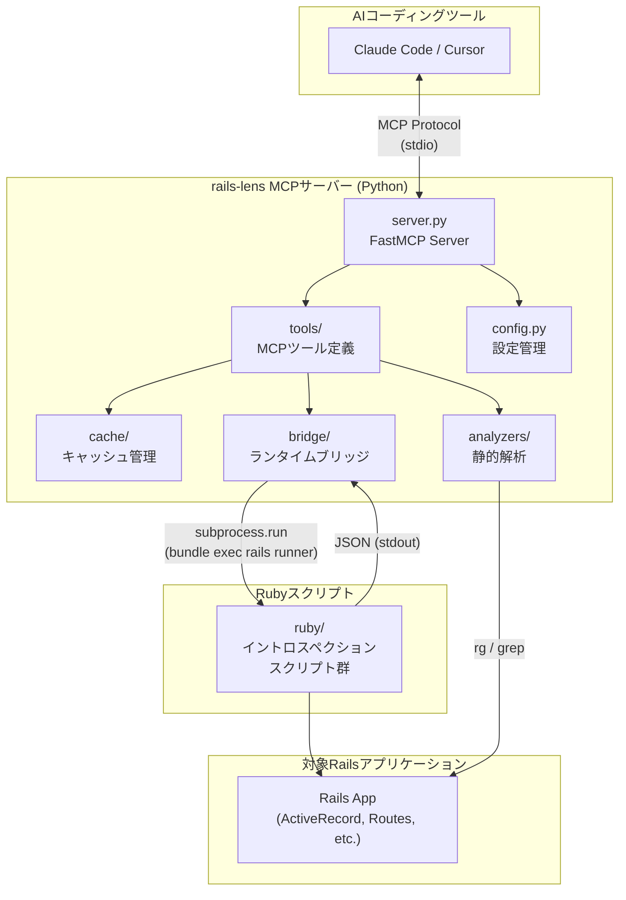
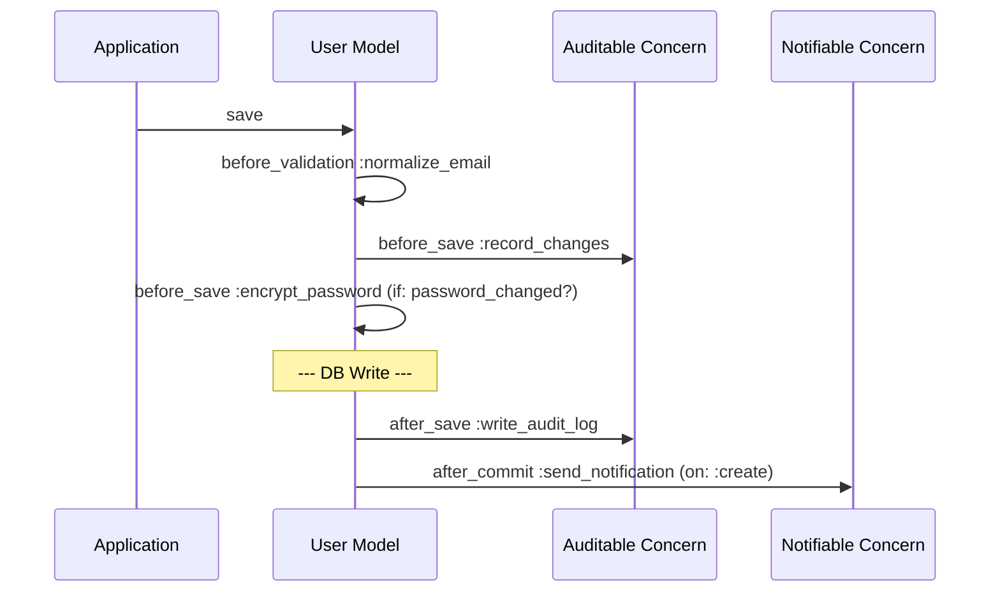
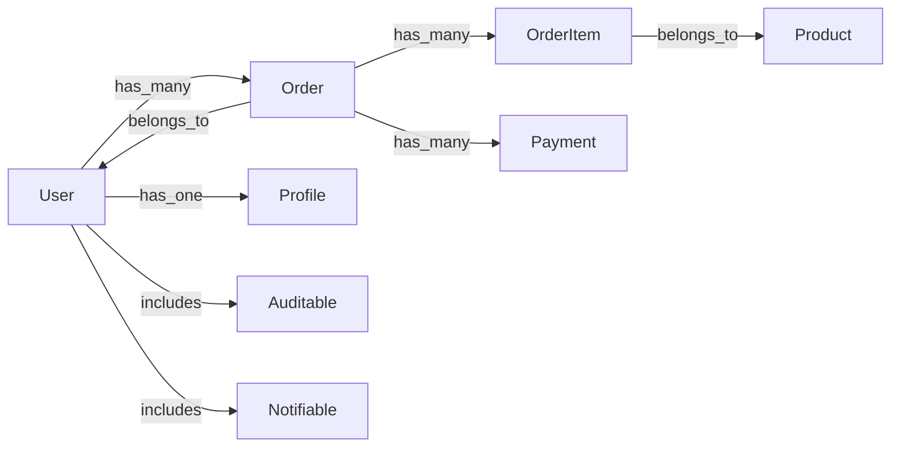
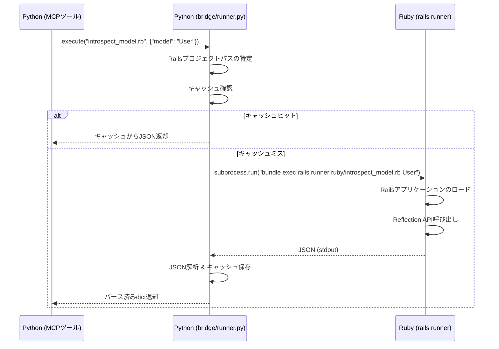
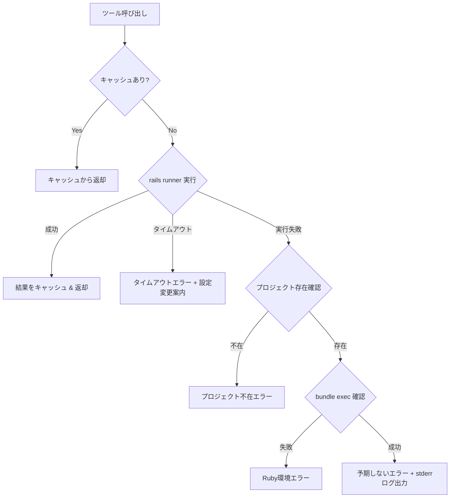

# rails-lens 要件定義書

> **バージョン**: 1.0.0
> **最終更新**: 2026-03-28
> **ステータス**: 設計確定・実装前

---

## 目次

1. [プロジェクト概要と解決する課題](#1-プロジェクト概要と解決する課題)
2. [アーキテクチャ設計](#2-アーキテクチャ設計)
3. [ツール一覧と各ツールの詳細仕様](#3-ツール一覧と各ツールの詳細仕様)
4. [Ruby側ランタイムブリッジの設計](#4-ruby側ランタイムブリッジの設計)
5. [キャッシュ戦略](#5-キャッシュ戦略)
6. [エラーハンドリング方針](#6-エラーハンドリング方針)
7. [テスト戦略](#7-テスト戦略)
8. [実装フェーズとマイルストーン](#8-実装フェーズとマイルストーン)
9. [将来の拡張計画](#9-将来の拡張計画)

---

## 1. プロジェクト概要と解決する課題

### 1.1 課題

Ruby on Railsで構築された大規模コードベースにおいて、AIコーディングツール（Claude Code、Cursor等）が正しいコードを生成できない問題がある。根本原因は、Railsが「Convention over Configuration」の設計思想に基づき、大量の**暗黙の依存関係**を生み出す構造を持つことにある。

具体的な問題領域:

| 問題 | 例 | AIへの影響 |
|---|---|---|
| コールバック連鎖 | `before_save` → `after_save` → `after_commit` が複数モデルにまたがる | 副作用を見落とし、データ不整合を引き起こすコードを生成する |
| Concernsのmixin | 複数のConcernが同じモデルにincludeされる | メソッドの出所が不明で、存在しないメソッドを呼んだり意図せずオーバーライドする |
| 動的メソッド生成 | `method_missing`によるスコープ、enum、関連メソッド | 静的解析では検出不可能なメソッドを認識できない |
| STI・ポリモーフィック関連 | Single Table Inheritance、polymorphic associations | 型階層と関連の全体像が見えない |
| Gemによるモンキーパッチ | Deviseの`authenticate_user!`等 | 暗黙的に追加されるメソッドやフィルタを認識できない |

AIはコンテキストウィンドウに含まれる「見えている範囲」でしか判断できないため、これらの暗黙知が欠落し、誤った実装を生成する。

### 1.2 解決策

**rails-lens** は、Railsアプリケーションの内部構造をランタイム情報として正確に抽出し、**MCP（Model Context Protocol）サーバー**としてAIコーディングツールに提供するツールである。

```
AIコーディングツール ──MCP Protocol──► rails-lens ──rails runner──► Railsアプリ
                                         │
                                         ├── モデルの全依存関係を構造化して返す
                                         ├── コールバック実行順序を可視化する
                                         ├── コード参照箇所を検索する
                                         └── 依存関係グラフを生成する
```

### 1.3 プロジェクトの位置づけ

- **OSSとして公開**する前提で開発する
- ポートフォリオとしても活用するため、コード品質・ドキュメント・テストカバレッジを重視する
- 対象ユーザー: Railsプロジェクトで AI コーディングツールを活用する開発者

---

## 2. アーキテクチャ設計

### 2.1 全体構成図



### 2.2 技術スタックと選定理由

#### 実装言語: Python + Ruby のハイブリッド構成

| レイヤー | 言語 | 責務 | 選定理由 |
|---|---|---|---|
| MCPサーバー | Python | サーバー本体、ツール定義、キャッシュ管理、静的解析 | MCP Python SDK (`FastMCP`) が安定しており、デコレータベースのツール登録で開発効率が高い |
| ランタイムイントロスペクション | Ruby | Rails内部APIの呼び出し、メタプログラミング情報の抽出 | Railsの `ActiveRecord::Reflection`、`ActiveSupport::Callbacks` 等の内部APIを直接呼び出す必要があり、静的解析では正確な情報を取得できない |

> **設計判断の記録**: Rubyだけで完結させる案（Ruby MCP SDKを使用）も検討したが、Ruby MCP SDKの成熟度がPython版に比べて低く、FastMCPのデコレータベースのツール登録が開発効率で優位であるためハイブリッド構成を採用した。

#### 解析アプローチ: ハイブリッド（ランタイム + 静的解析）

| アプローチ | 用途 | 手段 |
|---|---|---|
| ランタイム解析 | モデルイントロスペクション、コールバックトレース | `rails runner` でRailsアプリをロードし、Reflection APIでJSON出力 |
| 静的解析 | コード参照検索、パターンマッチング | `ripgrep` (rg) + Pythonフォールバック |
| キャッシュ | 通常のツール呼び出し応答 | JSONファイルキャッシュ |

> **設計判断の記録**: 全てをランタイム解析にする案も検討したが、`rails runner` の起動コスト（数秒〜十数秒）を考慮し、コード検索系は静的解析で高速に返す方針とした。

#### トランスポート: stdio

- Claude Code、Cursor等のローカル開発ツールとの統合を想定
- シングルユーザー・シングルセッション
- HTTP/SSEトランスポートは将来の拡張として検討（セクション9参照）

### 2.3 ディレクトリ構成

```
rails-lens/
├── pyproject.toml                   # プロジェクト定義・依存関係
├── README.md                        # プロジェクト説明・セットアップ手順
├── docs/
│   └── REQUIREMENTS.md              # 本ドキュメント
├── src/
│   └── rails_lens/
│       ├── __init__.py
│       ├── server.py                # FastMCP サーバー定義 & main()
│       ├── config.py                # 設定管理（TOML読み込み、環境変数）
│       ├── tools/                   # MCPツール定義（1ツール1ファイル）
│       │   ├── __init__.py
│       │   ├── introspect_model.py
│       │   ├── find_references.py
│       │   ├── trace_callback_chain.py
│       │   └── dependency_graph.py
│       ├── bridge/                  # Ruby実行ブリッジ
│       │   ├── __init__.py
│       │   └── runner.py            # rails runner の呼び出しとJSON解析
│       ├── analyzers/               # 静的解析
│       │   ├── __init__.py
│       │   └── grep_search.py       # rg / grep ベースのコード検索
│       └── cache/                   # キャッシュ管理
│           ├── __init__.py
│           └── manager.py           # JSONキャッシュの読み書きと鮮度管理
├── ruby/                            # Rails runner で実行するRubyスクリプト
│   ├── helpers/
│   │   └── serializer.rb            # 共通シリアライズヘルパー
│   ├── introspect_model.rb
│   ├── trace_callbacks.rb
│   ├── dump_schema.rb
│   ├── dump_routes.rb
│   └── list_models.rb
└── tests/
    ├── conftest.py
    ├── test_introspect_model.py
    ├── test_find_references.py
    └── fixtures/                    # テスト用のモックRailsアプリ構造
        └── sample_rails_app/
```

### 2.4 設定ファイル

MCPサーバーの設定は**環境変数**または**プロジェクトルートの `.rails-lens.toml`** で指定する。環境変数が設定されている場合はTOMLファイルより優先する。

```toml
[rails]
project_path = "/path/to/rails/project"   # 必須。対象Railsプロジェクトのルートパス
ruby_command = "bundle exec rails runner"  # デフォルト値
timeout = 30                               # rails runner のタイムアウト秒数

[cache]
directory = ".rails-lens/cache"            # キャッシュディレクトリ（Railsプロジェクトルート相対）
auto_invalidate = true                     # ファイル変更時の自動無効化

[search]
command = "rg"                             # 検索コマンド（"rg" or "grep"）
exclude_dirs = ["tmp", "log", "vendor", "node_modules", ".git"]
```

対応する環境変数:

| 環境変数 | 対応する設定 |
|---|---|
| `RAILS_LENS_PROJECT_PATH` | `rails.project_path` |
| `RAILS_LENS_RUBY_COMMAND` | `rails.ruby_command` |
| `RAILS_LENS_TIMEOUT` | `rails.timeout` |
| `RAILS_LENS_CACHE_DIR` | `cache.directory` |

---

## 3. ツール一覧と各ツールの詳細仕様

### 3.1 ツール一覧と優先順位

| 優先度 | ツール名 | 種別 | 解析方式 |
|---|---|---|---|
| 1 (最優先) | `rails_lens_introspect_model` | コア | ランタイム |
| 2 | `rails_lens_find_references` | コア | 静的解析 |
| 3 | `rails_lens_trace_callback_chain` | コア | ランタイム |
| 4 | `rails_lens_dependency_graph` | コア | ランタイム + 静的解析 |
| 5 | `rails_lens_list_models` | ユーティリティ | ランタイム |
| 6 | `rails_lens_get_schema` | ユーティリティ | ランタイム |
| 7 | `rails_lens_get_routes` | ユーティリティ | ランタイム |
| 8 | `rails_lens_analyze_concern` | ユーティリティ | ランタイム |
| 9 | `rails_lens_refresh_cache` | ユーティリティ | - |

全ツール共通のMCPアノテーション:

```python
annotations = {
    "readOnlyHint": True,      # 全ツールは読み取り専用
    "destructiveHint": False,  # 破壊的操作なし
    "idempotentHint": True,    # 冪等
    "openWorldHint": False,    # 外部アクセスなし
}
```

### 3.2 rails_lens_introspect_model

**目的**: 指定したActiveRecordモデルの全依存関係を一覧化する。AIがモデルを変更する前に「何に影響するか」を把握するために使用する。

#### 入力スキーマ

```json
{
  "type": "object",
  "required": ["model_name"],
  "properties": {
    "model_name": {
      "type": "string",
      "description": "ActiveRecordモデル名（例: 'User', 'Order', 'Admin::Company'）",
      "minLength": 1,
      "maxLength": 200
    },
    "sections": {
      "type": "array",
      "description": "取得するセクションのフィルタ（省略時は全セクション）",
      "items": {
        "type": "string",
        "enum": [
          "associations", "callbacks", "validations", "scopes",
          "concerns", "enums", "schema", "sti", "delegations",
          "class_methods", "instance_methods"
        ]
      }
    }
  }
}
```

#### 出力スキーマ

```json
{
  "type": "object",
  "properties": {
    "model_name": { "type": "string" },
    "table_name": { "type": "string" },
    "file_path": { "type": "string" },
    "associations": {
      "type": "array",
      "items": {
        "type": "object",
        "properties": {
          "name": { "type": "string" },
          "type": { "type": "string", "enum": ["belongs_to", "has_many", "has_one", "has_and_belongs_to_many"] },
          "class_name": { "type": "string" },
          "foreign_key": { "type": "string" },
          "through": { "type": ["string", "null"] },
          "polymorphic": { "type": "boolean" },
          "dependent": { "type": ["string", "null"] },
          "has_scope": { "type": "boolean" }
        }
      }
    },
    "callbacks": {
      "type": "array",
      "items": {
        "type": "object",
        "properties": {
          "kind": { "type": "string", "enum": ["before", "after", "around"] },
          "event": { "type": "string" },
          "method_name": { "type": "string" },
          "source_file": { "type": "string" },
          "source_line": { "type": "integer" },
          "conditions": {
            "type": "object",
            "properties": {
              "if": { "type": ["string", "null"] },
              "unless": { "type": ["string", "null"] }
            }
          },
          "defined_in_concern": { "type": ["string", "null"] }
        }
      }
    },
    "validations": {
      "type": "array",
      "items": {
        "type": "object",
        "properties": {
          "type": { "type": "string" },
          "attributes": { "type": "array", "items": { "type": "string" } },
          "options": { "type": "object" },
          "custom_validator": { "type": ["string", "null"] },
          "source_file": { "type": "string" },
          "source_line": { "type": "integer" }
        }
      }
    },
    "scopes": {
      "type": "array",
      "items": {
        "type": "object",
        "properties": {
          "name": { "type": "string" },
          "source_file": { "type": "string" },
          "source_line": { "type": "integer" }
        }
      }
    },
    "concerns": {
      "type": "array",
      "items": {
        "type": "object",
        "properties": {
          "name": { "type": "string" },
          "provided_methods": {
            "type": "array",
            "items": { "type": "string" }
          },
          "source_file": { "type": "string" }
        }
      }
    },
    "enums": {
      "type": "array",
      "items": {
        "type": "object",
        "properties": {
          "name": { "type": "string" },
          "values": { "type": "object" }
        }
      }
    },
    "schema": {
      "type": "object",
      "properties": {
        "columns": {
          "type": "array",
          "items": {
            "type": "object",
            "properties": {
              "name": { "type": "string" },
              "type": { "type": "string" },
              "null": { "type": "boolean" },
              "default": {},
              "limit": { "type": ["integer", "null"] }
            }
          }
        },
        "indexes": {
          "type": "array",
          "items": {
            "type": "object",
            "properties": {
              "name": { "type": "string" },
              "columns": { "type": "array", "items": { "type": "string" } },
              "unique": { "type": "boolean" }
            }
          }
        },
        "foreign_keys": {
          "type": "array",
          "items": {
            "type": "object",
            "properties": {
              "from_column": { "type": "string" },
              "to_table": { "type": "string" },
              "to_column": { "type": "string" }
            }
          }
        }
      }
    },
    "sti": {
      "type": ["object", "null"],
      "properties": {
        "base_class": { "type": "string" },
        "descendants": { "type": "array", "items": { "type": "string" } },
        "type_column": { "type": "string" }
      }
    },
    "delegations": {
      "type": "array",
      "items": {
        "type": "object",
        "properties": {
          "methods": { "type": "array", "items": { "type": "string" } },
          "to": { "type": "string" },
          "prefix": { "type": ["string", "boolean", "null"] }
        }
      }
    },
    "class_methods": {
      "type": "array",
      "items": {
        "type": "object",
        "properties": {
          "name": { "type": "string" },
          "source_file": { "type": "string" },
          "source_line": { "type": "integer" }
        }
      }
    },
    "instance_methods": {
      "type": "array",
      "items": {
        "type": "object",
        "properties": {
          "name": { "type": "string" },
          "source_file": { "type": "string" },
          "source_line": { "type": "integer" }
        }
      }
    }
  }
}
```

#### 設計上の注意点

- モデルが見つからない場合、**類似名のモデルをサジェスト**する（レーベンシュタイン距離 or 部分一致）
- `sections` パラメータによるフィルタリングで、出力が巨大になることを防ぐ
- Concernsの情報は特に重要。どのConcernがどのメソッドを提供しているかをAIが知らないと、存在しないメソッドを呼んだり、意図せずオーバーライドする原因になる
- `instance_methods` / `class_methods` は継承元（ApplicationRecord, ActiveRecord::Base）のメソッドを除外し、モデル固有のもののみ返す

#### Pythonコード規約

```python
from mcp.server.fastmcp import FastMCP
from pydantic import BaseModel, Field, ConfigDict

mcp = FastMCP("rails_lens_mcp")

class IntrospectModelInput(BaseModel):
    model_config = ConfigDict(str_strip_whitespace=True)
    model_name: str = Field(
        ...,
        description="ActiveRecord model name (e.g., 'User', 'Admin::Company')",
        min_length=1,
        max_length=200,
    )
    sections: list[str] | None = Field(
        default=None,
        description="Sections to include (default: all)",
    )

@mcp.tool(
    name="rails_lens_introspect_model",
    annotations={
        "title": "Introspect Rails Model",
        "readOnlyHint": True,
        "destructiveHint": False,
        "idempotentHint": True,
        "openWorldHint": False,
    },
)
async def introspect_model(params: IntrospectModelInput) -> str:
    """モデルの全依存関係（associations, callbacks, validations, scopes, concerns, schema等）を返す。
    モデルを変更する前に必ずこのツールで影響範囲を確認すること。
    """
    ...
```

### 3.3 rails_lens_find_references

**目的**: 指定したクラス名またはメソッド名がコードベース内のどこで参照されているかを検索する。AIが変更の影響範囲を把握するために使用する。

#### 入力スキーマ

```json
{
  "type": "object",
  "required": ["query"],
  "properties": {
    "query": {
      "type": "string",
      "description": "検索対象（クラス名 or メソッド名）",
      "minLength": 1
    },
    "scope": {
      "type": "string",
      "description": "検索範囲の限定",
      "enum": ["models", "controllers", "views", "services", "all"],
      "default": "all"
    },
    "type": {
      "type": "string",
      "description": "検索種別",
      "enum": ["class", "method", "any"],
      "default": "any"
    }
  }
}
```

#### 出力スキーマ

```json
{
  "type": "object",
  "properties": {
    "query": { "type": "string" },
    "total_matches": { "type": "integer" },
    "matches": {
      "type": "array",
      "items": {
        "type": "object",
        "properties": {
          "file": { "type": "string" },
          "line": { "type": "integer" },
          "column": { "type": "integer" },
          "context": {
            "type": "object",
            "properties": {
              "before": { "type": "string" },
              "match": { "type": "string" },
              "after": { "type": "string" }
            }
          },
          "match_type": {
            "type": "string",
            "enum": ["class_reference", "method_call", "symbol_reference", "string_literal", "other"]
          }
        }
      }
    }
  }
}
```

#### 設計上の注意点

- **静的解析ベース**で高速に返す（`rails runner` 不要）
- `ripgrep` (rg) が利用可能ならそちらを優先、なければPythonの `subprocess` + `grep` にフォールバック
- Rubyの構文を考慮したパターンマッチング:
  - クラス参照: `User`、`::User`、`User.new`
  - メソッド呼び出し: `.method_name`、`method_name(`
  - シンボル参照: `:method_name`
- `scope` パラメータで検索対象ディレクトリを限定可能（`models` → `app/models/`）

### 3.4 rails_lens_trace_callback_chain

**目的**: 特定のライフサイクルイベントで実行されるコールバックの順序を可視化する。AIがデータ変更の副作用を理解するために使用する。

#### 入力スキーマ

```json
{
  "type": "object",
  "required": ["model_name", "lifecycle_event"],
  "properties": {
    "model_name": {
      "type": "string",
      "description": "ActiveRecordモデル名",
      "minLength": 1,
      "maxLength": 200
    },
    "lifecycle_event": {
      "type": "string",
      "description": "ライフサイクルイベント",
      "enum": ["save", "create", "update", "destroy", "validate", "commit", "initialize", "find", "touch"]
    }
  }
}
```

#### 出力スキーマ

```json
{
  "type": "object",
  "properties": {
    "model_name": { "type": "string" },
    "lifecycle_event": { "type": "string" },
    "execution_order": {
      "type": "array",
      "items": {
        "type": "object",
        "properties": {
          "order": { "type": "integer" },
          "kind": { "type": "string", "enum": ["before", "after", "around"] },
          "method_name": { "type": "string" },
          "source_file": { "type": "string" },
          "source_line": { "type": "integer" },
          "defined_in_concern": { "type": ["string", "null"] },
          "conditions": {
            "type": "object",
            "properties": {
              "if": { "type": ["string", "null"] },
              "unless": { "type": ["string", "null"] }
            }
          },
          "note": { "type": ["string", "null"], "description": "around_*の場合のyield前後の説明等" }
        }
      }
    },
    "mermaid_diagram": {
      "type": "string",
      "description": "コールバック実行フローのMermaid sequence diagram"
    }
  }
}
```

#### 出力例（Mermaid）



### 3.5 rails_lens_dependency_graph

**目的**: 指定したエントリーポイントからの依存関係を木構造で可視化する。AIが全体像を把握するために使用する。

#### 入力スキーマ

```json
{
  "type": "object",
  "required": ["entry_point"],
  "properties": {
    "entry_point": {
      "type": "string",
      "description": "起点（モデル名 or コントローラ名）",
      "minLength": 1
    },
    "depth": {
      "type": "integer",
      "description": "探索の深さ",
      "default": 2,
      "minimum": 1,
      "maximum": 5
    },
    "format": {
      "type": "string",
      "description": "出力形式",
      "enum": ["mermaid", "json"],
      "default": "mermaid"
    }
  }
}
```

#### 出力スキーマ（JSON形式の場合）

```json
{
  "type": "object",
  "properties": {
    "entry_point": { "type": "string" },
    "depth": { "type": "integer" },
    "nodes": {
      "type": "array",
      "items": {
        "type": "object",
        "properties": {
          "id": { "type": "string" },
          "type": { "type": "string", "enum": ["model", "controller", "concern", "service"] },
          "file_path": { "type": "string" }
        }
      }
    },
    "edges": {
      "type": "array",
      "items": {
        "type": "object",
        "properties": {
          "from": { "type": "string" },
          "to": { "type": "string" },
          "relation": { "type": "string", "enum": ["association", "callback", "include", "reference", "inheritance"] },
          "label": { "type": "string" }
        }
      }
    },
    "mermaid_diagram": { "type": ["string", "null"] }
  }
}
```

#### 出力例（Mermaid）



### 3.6 ユーティリティツール

#### rails_lens_list_models

AIがモデル名を知らない場合のエントリーポイント。

- **入力**: なし（任意で `namespace` フィルタ）
- **出力**: `{ "models": [{ "name": "User", "table_name": "users", "file_path": "app/models/user.rb" }, ...] }`

#### rails_lens_get_schema

テーブルまたはモデル名からDB定義を返す。

- **入力**: `table_name` (string, 必須)
- **出力**: カラム定義、インデックス、外部キー制約の構造化データ

#### rails_lens_get_routes

ルーティング定義を返す。

- **入力**: `filter` (任意, コントローラ名 or パスパターン)
- **出力**: `{ "routes": [{ "verb": "GET", "path": "/users/:id", "controller": "users", "action": "show", ... }, ...] }`

#### rails_lens_analyze_concern

特定のConcernの詳細を返す。

- **入力**: `concern_name` (string, 必須)
- **出力**: includeされている先のモデル一覧、提供メソッド一覧、依存Concern一覧

#### rails_lens_refresh_cache

キャッシュを手動更新する。

- **入力**: `scope` (任意, "all" or 特定のモデル名)
- **出力**: `{ "refreshed": [...], "duration_seconds": 12.3 }`

---

## 4. Ruby側ランタイムブリッジの設計

### 4.1 全体フロー



### 4.2 Python側: bridge/runner.py の責務

`bridge/runner.py` は以下の責務を持つ:

1. **Railsプロジェクトパスの特定**: 設定ファイル or 環境変数 or 自動検出（`Gemfile` の存在を探索）
2. **コマンド実行**: `bundle exec rails runner <script_path> <args>` を `subprocess.run` で実行
3. **出力の解析**: 標準出力からJSON文字列を受け取り、Pythonのdictに変換
4. **ログ記録**: 標準エラー出力をログとして記録（Railsの起動ログ等）
5. **タイムアウト処理**: 設定可能なタイムアウト（デフォルト30秒）で `subprocess.TimeoutExpired` をハンドリング
6. **エラーハンドリング**: ユーザーフレンドリーなメッセージを返す

#### runner.py の基本インターフェース

```python
class RailsBridge:
    def __init__(self, config: RailsLensConfig):
        self.project_path = config.rails_project_path
        self.ruby_command = config.ruby_command
        self.timeout = config.timeout

    async def execute(
        self,
        script_name: str,
        args: dict[str, str] | None = None,
    ) -> dict:
        """
        Rubyスクリプトを実行し、JSONレスポンスを返す。

        Raises:
            RailsProjectNotFoundError: Railsプロジェクトが見つからない
            RailsRunnerTimeoutError: タイムアウト
            RailsRunnerError: その他の実行エラー
        """
        ...
```

### 4.3 Ruby側: スクリプトの規約

#### 共通ヘルパー: `ruby/helpers/serializer.rb`

全てのRubyスクリプトはこのヘルパーを使って出力を構造化する。

```ruby
module RailsLens
  module Serializer
    def self.output(data)
      $stdout.puts JSON.generate({
        status: "success",
        data: data,
        metadata: {
          rails_version: Rails.version,
          ruby_version: RUBY_VERSION,
          timestamp: Time.now.iso8601
        }
      })
    end

    def self.error(message, details: nil)
      $stdout.puts JSON.generate({
        status: "error",
        error: {
          message: message,
          details: details
        }
      })
    end
  end
end
```

#### スクリプト規約

1. 必ず `helpers/serializer.rb` をrequireし、出力は `RailsLens::Serializer.output()` / `.error()` を使う
2. **標準出力にはJSON以外を出力しない**（デバッグ出力はstderrへ）
3. 引数は `ARGV` または環境変数経由で受け取る
4. 例外はrescueし、必ず構造化エラーとして返す

---

## 5. キャッシュ戦略

### 5.1 概要

ランタイム解析は `rails runner` の起動コスト（数秒〜十数秒）がかかるため、結果をキャッシュして再利用する。

> **設計判断の記録**: インメモリキャッシュ（LRU等）ではなくファイルベースJSONキャッシュを採用した理由は、(1) MCPサーバーの再起動を跨いでキャッシュを保持できる、(2) ユーザーがキャッシュ内容を直接確認・編集できる、(3) デバッグが容易、の3点。

### 5.2 キャッシュ構造

```
<rails_project_root>/.rails-lens/cache/
├── introspect_model/
│   ├── User.json
│   ├── Order.json
│   └── Admin__Company.json      # "::" は "__" に変換
├── trace_callbacks/
│   ├── User__save.json
│   └── Order__create.json
├── schema/
│   └── _all.json
├── routes/
│   └── _all.json
└── models/
    └── _all.json
```

### 5.3 キャッシュライフサイクル

| イベント | 動作 |
|---|---|
| ツール呼び出し時 | キャッシュファイルが存在すればそこから返す |
| 初回呼び出し時 | `rails runner` で取得し、結果をキャッシュに保存 |
| `rails_lens_refresh_cache` 呼び出し時 | 指定スコープのキャッシュを削除し、再取得 |
| `auto_invalidate = true` の場合 | モデルファイルや `db/schema.rb` の mtime を比較し、変更があればキャッシュを無効化 |

### 5.4 自動無効化ロジック

`auto_invalidate` が有効な場合、以下のファイルの mtime をキャッシュ生成時の mtime と比較する:

- `db/schema.rb` → スキーマ関連キャッシュ全体を無効化
- `app/models/<model_name>.rb` → 該当モデルのキャッシュを無効化
- `app/models/concerns/*.rb` → 関連モデルのキャッシュを無効化
- `config/routes.rb` → ルーティングキャッシュを無効化

### 5.5 キャッシュメタデータ

各キャッシュファイルにはメタデータを含める:

```json
{
  "_cache_metadata": {
    "created_at": "2026-03-28T10:00:00+09:00",
    "source_files_mtime": {
      "app/models/user.rb": "2026-03-27T15:30:00+09:00",
      "db/schema.rb": "2026-03-25T09:00:00+09:00"
    },
    "rails_version": "7.1.3",
    "rails_lens_version": "0.1.0"
  },
  "data": { ... }
}
```

---

## 6. エラーハンドリング方針

### 6.1 基本原則

全てのエラーメッセージは**actionable**（次に何をすべきかを示す）であること。

### 6.2 エラー分類と対応

| エラー種別 | 例 | メッセージ例 | 対応 |
|---|---|---|---|
| 設定エラー | Railsプロジェクトパスが未設定 | `"Rails project path is not configured. Set 'rails.project_path' in .rails-lens.toml or RAILS_LENS_PROJECT_PATH environment variable."` | 設定手順を案内 |
| プロジェクト不在 | 指定パスにRailsプロジェクトがない | `"No Rails project found at '/path/to/project'. Ensure the path contains a Gemfile with 'rails' gem."` | パスの確認を案内 |
| Ruby実行エラー | `bundle exec` が失敗 | `"Failed to execute 'bundle exec rails runner'. Ensure Ruby and Bundler are installed and 'bundle install' has been run in the Rails project."` | 環境構築を案内 |
| タイムアウト | `rails runner` がタイムアウト | `"Rails runner timed out after 30 seconds. The Rails application may be slow to boot. Try increasing 'rails.timeout' in .rails-lens.toml."` | タイムアウト設定の変更を案内 |
| モデル不在 | 指定モデルが見つからない | `"Model 'Usr' not found. Did you mean: 'User', 'UserProfile'?"` | 類似モデルをサジェスト |
| JSON解析エラー | Rubyスクリプトの出力が不正 | `"Failed to parse response from Rails runner. This may be caused by debug output in the Rails application. Check stderr for details."` | stderrのログ確認を案内 |

### 6.3 エラー応答の構造

```json
{
  "error": {
    "code": "MODEL_NOT_FOUND",
    "message": "Model 'Usr' not found.",
    "suggestion": "Did you mean: 'User', 'UserProfile'?",
    "help_url": null
  }
}
```

### 6.4 フォールバック戦略



---

## 7. テスト戦略

### 7.1 テストレイヤー

| レイヤー | 対象 | 手法 | 依存 |
|---|---|---|---|
| ユニットテスト | 各Pythonモジュール | pytest + モック | Railsアプリ不要 |
| 統合テスト | bridge/runner.py | pytest + fixtures | サンプルRailsアプリ（fixtures） |
| E2Eテスト | MCPプロトコル経由 | MCP Inspector or カスタムクライアント | 実Railsアプリ |

### 7.2 テスト用フィクスチャ

`tests/fixtures/sample_rails_app/` に最小限のRailsアプリ構造を用意する:

```
tests/fixtures/sample_rails_app/
├── Gemfile
├── config/
│   ├── application.rb
│   ├── database.yml
│   └── routes.rb
├── db/
│   └── schema.rb
└── app/
    └── models/
        ├── application_record.rb
        ├── user.rb              # 基本的なモデル
        ├── order.rb             # associations, callbacks を含む
        ├── concerns/
        │   └── auditable.rb     # Concern のテスト用
        └── admin/
            └── company.rb       # 名前空間付きモデル
```

### 7.3 モック方針

- **bridge/runner.py**: ユニットテストでは `subprocess.run` をモックし、期待するJSON出力を返す
- **cache/manager.py**: 一時ディレクトリを使ったファイルI/Oテスト（モック不要）
- **analyzers/grep_search.py**: テスト用のファイルツリーを `tmp_path` に作成してテスト

### 7.4 テストコマンド

```bash
# 全テスト実行
pytest tests/ -v

# ユニットテストのみ
pytest tests/ -v -m "not integration and not e2e"

# カバレッジ
pytest tests/ --cov=rails_lens --cov-report=html
```

### 7.5 CI構成（将来）

- Python 3.11+ でのテスト実行
- linter: ruff
- type checker: mypy
- カバレッジ閾値: 80%以上

---

## 8. 実装フェーズとマイルストーン

### Phase 1: MVP（introspect_model が動く）

**ゴール**: Claude Code から実際のRailsプロジェクトのモデル情報を取得できる

| 対象 | ファイル |
|---|---|
| Python | `server.py`, `config.py`, `bridge/runner.py`, `cache/manager.py`, `tools/introspect_model.py` |
| Ruby | `helpers/serializer.rb`, `introspect_model.rb` |
| テスト | `test_introspect_model.py`, `conftest.py`, `fixtures/` |
| 設定 | `pyproject.toml`, `.rails-lens.toml` (サンプル) |

**完了条件**:
- `rails_lens_introspect_model` がMCPプロトコル経由で動作する
- キャッシュの読み書きが動作する
- ユニットテストが通る

### Phase 2: 検索系ツール

**ゴール**: コードベース内の参照検索が動く

| 対象 | ファイル |
|---|---|
| Python | `analyzers/grep_search.py`, `tools/find_references.py` |
| Ruby | `list_models.rb` |
| ツール | `rails_lens_find_references`, `rails_lens_list_models` |
| テスト | `test_find_references.py` |

**完了条件**:
- `rg` がある環境とない環境の両方でテストが通る
- `scope` / `type` パラメータが正しく動作する

### Phase 3: コールバック・依存関係

**ゴール**: コールバック連鎖と依存関係グラフが取得できる

| 対象 | ファイル |
|---|---|
| Ruby | `trace_callbacks.rb` |
| Python | `tools/trace_callback_chain.py`, `tools/dependency_graph.py` |
| ツール | `rails_lens_trace_callback_chain`, `rails_lens_dependency_graph` |

**完了条件**:
- コールバックの実行順序が正しく取得できる
- Mermaid形式の依存グラフが出力できる

### Phase 4: ユーティリティ & 品質向上

**ゴール**: OSSとして公開可能な品質

| 対象 | 内容 |
|---|---|
| ツール | `rails_lens_get_schema`, `rails_lens_get_routes`, `rails_lens_analyze_concern`, `rails_lens_refresh_cache` |
| Ruby | `dump_schema.rb`, `dump_routes.rb` |
| ドキュメント | `README.md` 整備、Claude Code / Cursor での設定例 |
| 品質 | CI/CD設定、カバレッジ80%以上、型チェック通過 |

**完了条件**:
- 全ツールが動作する
- README にセットアップ手順と設定例がある
- PyPI への公開準備が整っている

---

## 9. 将来の拡張計画

### 9.1 短期（Phase 4 完了後）

| 拡張 | 概要 |
|---|---|
| **HTTPトランスポート対応** | SSE (Server-Sent Events) トランスポートの追加。チーム内で共有MCPサーバーとして運用可能にする |
| **Rails 8対応** | Solid Queue, Solid Cache 等の新コンポーネントへの対応 |
| **パフォーマンス最適化** | 大規模プロジェクト（500+モデル）でのベンチマークと最適化 |

### 9.2 中期

| 拡張 | 概要 |
|---|---|
| **差分更新** | ファイル変更を `watchdog` で監視し、変更されたモデルのキャッシュのみ自動更新 |
| **ER図生成** | モデル間の関連からER図（Mermaid）を自動生成するツール |
| **マイグレーション影響分析** | マイグレーションファイルを入力に、影響を受けるモデル・コールバック・バリデーションを分析 |
| **Gemイントロスペクション** | Devise, Pundit, CarrierWave等の主要Gemが追加するメソッド・コールバックの可視化 |

### 9.3 長期

| 拡張 | 概要 |
|---|---|
| **他フレームワーク対応** | Django, Laravel 等への横展開（コア設計の抽象化が前提） |
| **MCP Resource対応** | ツールだけでなく、MCP Resourcesとしてモデル情報を公開し、AIの自動参照を可能にする |
| **Webダッシュボード** | キャッシュ状態やプロジェクト構造をブラウザで閲覧可能にする |

---

## 付録

### A. 品質基準チェックリスト

- [ ] 全てのツール出力はJSON形式で構造化されている
- [ ] エラーメッセージはactionable（次に何をすべきかを示す）である
- [ ] Railsプロジェクトが見つからない/起動しない場合のフォールバック処理が実装されている
- [ ] 各ツールはMCPの `annotations`（`readOnlyHint` 等）を正しく設定している
- [ ] `introspect_model` の出力は、AIがそのモデルを安全に変更するために必要な情報を全て含む
- [ ] テストカバレッジ80%以上
- [ ] `ruff` による lint エラーなし
- [ ] `mypy` による型チェック通過

### B. 用語集

| 用語 | 説明 |
|---|---|
| MCP | Model Context Protocol。AIツールと外部データソースを接続する標準プロトコル |
| FastMCP | Python MCP SDKのデコレータベースAPIフレームワーク |
| rails runner | Railsアプリケーションのコンテキストで任意のRubyコードを実行するコマンド |
| イントロスペクション | プログラムが自身の構造を実行時に調査する仕組み |
| Concern | Railsにおけるモジュールの一種。モデルやコントローラに横断的な機能を追加する |
| STI | Single Table Inheritance。1つのDBテーブルで複数のモデルクラスを表現する手法 |
