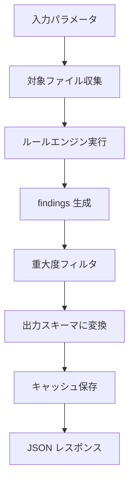
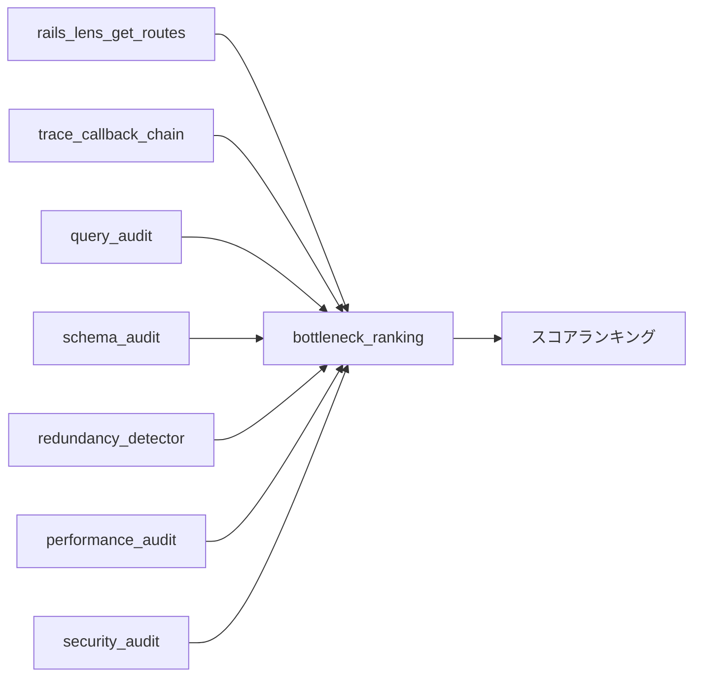
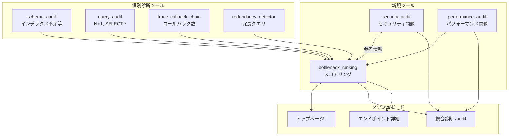

# rails-lens セキュリティ・パフォーマンス総合診断機能設計書

> **バージョン**: 1.0.0
> **最終更新**: 2026-03-31
> **ステータス**: 設計確定・実装前
> **前提ドキュメント**:
> - [REQUIREMENTS.md](./REQUIREMENTS.md)
> - [SQL_DIAGNOSTICS_FEATURE.md](./SQL_DIAGNOSTICS_FEATURE.md)
> - [WEB_DASHBOARD_DESIGN.md](./WEB_DASHBOARD_DESIGN.md)

## 目次

1. [概要](#1-概要)
2. [背景と課題](#2-背景と課題)
3. [設計思想](#3-設計思想)
4. [ツール仕様: rails_lens_security_audit](#4-ツール仕様-rails_lens_security_audit)
5. [ツール仕様: rails_lens_performance_audit](#5-ツール仕様-rails_lens_performance_audit)
6. [ツール仕様: rails_lens_bottleneck_ranking](#6-ツール仕様-rails_lens_bottleneck_ranking)
7. [実装方針](#7-実装方針)
8. [Webダッシュボード統合](#8-webダッシュボード統合)
9. [既存ツールとの連携](#9-既存ツールとの連携)
10. [ディレクトリ構造](#10-ディレクトリ構造)
11. [実装フェーズとマイルストーン](#11-実装フェーズとマイルストーン)
12. [設計上の注意点](#12-設計上の注意点)

---

## 1. 概要

Rails アプリケーションのセキュリティ・パフォーマンスを **静的解析のみ** で総合診断する3つのツールを追加する。

| ツール名 | 目的 | 性質 |
|---|---|---|
| `rails_lens_security_audit` | セキュリティ上の問題を静的に検出 | 個別診断ツール |
| `rails_lens_performance_audit` | アーキテクチャレベルのパフォーマンス問題を検出 | 個別診断ツール |
| `rails_lens_bottleneck_ranking` | 全エンドポイントをスコアリングしてランキング | メタ分析ツール |

これら3ツールは既存の SQL 診断機能（`schema_audit`, `query_audit`）と同じ設計パターン（ルール ID 方式、重大度分類、修正提案付き）に準拠する。

---

## 2. 背景と課題

### 2.1 解決する課題

| 課題 | 現状 | 本機能の解決策 |
|---|---|---|
| セキュリティレビューの属人化 | 経験者がコードレビューで発見するしかない | ルールベースの自動検出で網羅的にチェック |
| パフォーマンス問題の発見遅延 | 本番デプロイ後に初めて顕在化する | コード段階で構造的な問題を事前検出 |
| 改善優先順位の不明確さ | どのエンドポイントから直すべきか判断基準がない | スコアリングによるランキングで優先順位を提示 |
| 対象コード実行のリスク | 動的解析はコード実行を伴い、セキュリティ上の懸念がある | 全て静的解析で実装、コード実行不要 |

### 2.2 利用シーン

- **プロジェクト参画初日**: ボトルネックランキングを実行し、最もインパクトの大きい改善ポイントを即座に把握する
- **コードレビュー前**: セキュリティ診断でハードコードされた秘密情報や認証の穴を自動検出する
- **リリース前チェック**: パフォーマンス診断でトランザクション内の外部通信や同期的な重い処理を洗い出す
- **技術的負債の可視化**: ダッシュボードで「プロジェクト健全度」を常時監視する

---

## 3. 設計思想

rails-lens は対象アプリケーションを **実行せずに** 分析する。コードの実行には常にリスクが伴う。特にセキュリティ診断においては、対象コードを実行すること自体がリスクになりうる（悪意あるコードの実行、機密情報へのアクセス等）。

したがって、本機能は全て **静的解析**（ソースコードの grep / 正規表現 / パターンマッチング）で実装する。ランタイム情報が必要な場合は、既存ツール（`introspect_model` 等）のキャッシュ済み結果を参照する。

### 設計原則

| 原則 | 内容 |
|---|---|
| **DB 接続不要** | Ruby ソースコード、設定ファイル、`db/schema.rb` のみを解析対象とする |
| **静的解析のみ** | コードの実行やプロセスの起動を一切行わない |
| **ルール ID 方式** | 各検出ルールに一意の ID を付与し、設定ファイルで有効/無効を制御可能にする |
| **重大度分類** | `critical` / `warning` / `info` の3段階で問題をトリアージする |
| **修正提案付き** | 問題の指摘だけでなく、具体的な修正方法を提示する |
| **既存ツール統合** | ボトルネックランキングは既存ツールのキャッシュ済み結果を再利用する |

---

## 4. ツール仕様: rails_lens_security_audit

### 4.1 目的

Rails アプリケーションのセキュリティ上の問題を静的に検出する。秘密情報のハードコード、ログへの機密情報漏洩、認証・認可の穴、API レスポンスからの情報漏洩を包括的にチェックする。

### 4.2 入力スキーマ

```json
{
  "type": "object",
  "required": [],
  "properties": {
    "scope": {
      "type": "string",
      "enum": ["all", "credentials", "logging", "auth", "exposure", "dependencies"],
      "default": "all",
      "description": "診断対象のカテゴリ。all で全カテゴリを診断"
    },
    "severity_filter": {
      "type": "string",
      "enum": ["all", "critical", "warning", "info"],
      "default": "all",
      "description": "指定した重大度以上の問題のみを返す"
    },
    "exclude_rules": {
      "type": "array",
      "items": { "type": "string" },
      "default": [],
      "description": "除外するルール ID のリスト（例: [\"CRED006\", \"DEP002\"]）"
    },
    "exclude_paths": {
      "type": "array",
      "items": { "type": "string" },
      "default": ["spec/", "test/", "db/seeds.rb", "db/fixtures/"],
      "description": "診断対象から除外するパスのパターン"
    }
  }
}
```

### 4.3 出力スキーマ

```json
{
  "type": "object",
  "properties": {
    "summary": {
      "type": "object",
      "properties": {
        "total": { "type": "integer" },
        "critical": { "type": "integer" },
        "warning": { "type": "integer" },
        "info": { "type": "integer" },
        "scanned_files": { "type": "integer" },
        "scan_duration_ms": { "type": "integer" }
      }
    },
    "findings": {
      "type": "array",
      "items": {
        "type": "object",
        "properties": {
          "rule_id": { "type": "string", "description": "例: CRED001" },
          "severity": { "type": "string", "enum": ["critical", "warning", "info"] },
          "category": { "type": "string", "description": "例: credentials, logging, auth, exposure, dependencies" },
          "title": { "type": "string", "description": "検出内容の要約" },
          "file_path": { "type": "string" },
          "line_number": { "type": "integer", "nullable": true },
          "code_snippet": { "type": "string", "description": "問題のあるコード断片" },
          "confidence": { "type": "string", "enum": ["high", "medium", "low"], "description": "検出の信頼度" },
          "suggestion": { "type": "string", "description": "修正提案" },
          "suggestion_code": { "type": "string", "nullable": true, "description": "修正コード例" }
        }
      }
    },
    "metadata": {
      "type": "object",
      "properties": {
        "generated_at": { "type": "string", "format": "date-time" },
        "rails_lens_version": { "type": "string" },
        "rules_applied": { "type": "integer" },
        "rules_excluded": { "type": "array", "items": { "type": "string" } }
      }
    }
  }
}
```

### 4.4 検出ルール一覧

#### カテゴリ: 秘密情報のハードコード（credentials）

| ルールID | 検出内容 | 重大度 | 検出パターン | 修正提案 |
|---|---|---|---|---|
| `CRED001` | API キー / トークンのハードコード | critical | ソースコード内の文字列リテラルが以下のパターンにマッチ: `sk-[a-zA-Z0-9]{20,}`, `ghp_[a-zA-Z0-9]{36}`, `AKIA[0-9A-Z]{16}`, `bearer [a-zA-Z0-9]{20,}`, `token: "[a-zA-Z0-9]{16,}"` 等。一般的な API キーのプレフィックスパターンを網羅 | `Rails.application.credentials` または `ENV['KEY_NAME']` を使用してください |
| `CRED002` | パスワードのハードコード | critical | `password` / `passwd` / `secret` という変数名への文字列リテラル代入: `password = "..."`, `password: "..."` （テストファイル・fixtures は除外） | `Rails.application.credentials` または環境変数に移動してください |
| `CRED003` | データベース接続情報のハードコード | critical | `database.yml` 以外のファイルで `host:`, `username:`, `password:` がセットで出現、または `mysql2://`, `postgres://` のような接続 URL 文字列 | `DATABASE_URL` 環境変数または `credentials.yml.enc` を使用してください |
| `CRED004` | .env ファイルの Git 管理 | critical | `.gitignore` に `.env` が含まれていない、かつ `.env` ファイルがプロジェクトルートに存在する | `.gitignore` に `.env` を追加してください |
| `CRED005` | credentials.yml.enc の master key 露出 | critical | `config/master.key` が `.gitignore` に含まれていない | `.gitignore` に `config/master.key` を追加してください |
| `CRED006` | 秘密情報を含むコメント | warning | コメント行に `password`, `token`, `secret`, `key` と共に具体的な値が含まれている: `# API key: sk-abc123...` | コメントから秘密情報を削除してください |
| `CRED007` | initializer での秘密情報ハードコード | critical | `config/initializers/` 内のファイルで文字列リテラルが API キーパターンにマッチ | `Rails.application.credentials` を使用してください |

#### カテゴリ: ログへの機密情報漏洩（logging）

| ルールID | 検出内容 | 重大度 | 検出パターン | 修正提案 |
|---|---|---|---|---|
| `LOG001` | params 全体のログ出力 | warning | `logger.info(params.inspect)` / `logger.debug(params)` / `Rails.logger.info(params.to_json)` — params にはパスワードやトークンが含まれうる | `params.except(:password, :token)` でフィルタするか、`config.filter_parameters` に追加してください |
| `LOG002` | filter_parameters の不足 | warning | `config/initializers/filter_parameter_logging.rb` で `filter_parameters` にフィルタされていない機密パラメータ名がある。チェック対象: `token`, `secret`, `api_key`, `access_token`, `refresh_token`, `ssn`, `credit_card`, `cvv`, `authorization` | `config.filter_parameters += [:token, :secret, :api_key, ...]` を追加してください |
| `LOG003` | 例外オブジェクトのログ出力 | info | `rescue => e; logger.error(e.inspect)` / `logger.error(e.message)` — 例外メッセージに機密情報が含まれることがある（DB エラーにクエリ文字列が含まれる等） | 例外ログには `e.class` と `e.message` のみ出力し、`e.inspect` は避けてください |
| `LOG004` | puts / p / pp のデバッグ出力残留 | warning | 本番コード（`app/` 配下、テスト以外）に `puts `, `p `, `pp ` が残っている | `Rails.logger` を使用するか、デバッグ出力を削除してください |
| `LOG005` | モデル属性のログ出力 | warning | `logger.info(user.inspect)` / `logger.info(@order.attributes)` — `inspect` や `attributes` は全カラム（`encrypted_password` 等含む）を出力する | 必要な属性のみを指定して出力してください: `logger.info(user.slice(:id, :name))` |

#### カテゴリ: 認証・認可（auth）

| ルールID | 検出内容 | 重大度 | 検出パターン | 修正提案 |
|---|---|---|---|---|
| `AUTH001` | 認証のスキップ | critical | `skip_before_action :authenticate_user!` があるが、同一コントローラ内に代替の認証メカニズム（`before_action :other_auth`）がない | 認証をスキップする場合は代替の認証手段を実装してください |
| `AUTH002` | IDOR（安全でない直接オブジェクト参照） | critical | `Model.find(params[:id])` で現在のユーザーの所有物かチェックしていない。`current_user.models.find(params[:id])` ではなく `Model.find(params[:id])` を使っている箇所 | `current_user.{association}.find(params[:id])` を使用するか、Pundit/CanCanCan で認可してください |
| `AUTH003` | CSRF 保護の無効化 | warning | `skip_before_action :verify_authenticity_token` が API コントローラ以外で使われている | API コントローラ以外では CSRF 保護を無効化しないでください |
| `AUTH004` | Mass Assignment 保護なし | warning | `params.permit!` の使用（全パラメータを許可） | 必要なパラメータのみを `permit(:name, :email, ...)` で指定してください |
| `AUTH005` | admin 系アクションの認可不足 | warning | `Admin::` 名前空間のコントローラに `before_action` で認可チェック（`authorize`, `admin?` チェック等）がない | 管理者権限のチェックを追加してください |

#### カテゴリ: データ露出（exposure）

| ルールID | 検出内容 | 重大度 | 検出パターン | 修正提案 |
|---|---|---|---|---|
| `EXP001` | render json でのシリアライザ未使用 | warning | `render json: @model`（シリアライザ指定なし）で ActiveRecord オブジェクトを直接返している。`password_digest` 等の機密カラムが漏れる | シリアライザまたは `.as_json(only: [...])` で返すカラムを明示してください |
| `EXP002` | 機密カラムの API レスポンス含有 | critical | シリアライザや jbuilder テンプレートで `password_digest`, `encrypted_password`, `reset_password_token`, `api_token`, `*_secret`, `*_key` パターンのカラムを含んでいる | 機密カラムをレスポンスから除外してください |
| `EXP003` | to_json / as_json のオーバーライドなし | warning | モデルに `as_json` のオーバーライドがなく、かつそのモデルが `render json:` で使われている。全カラムがデフォルトで出力される | `as_json` をオーバーライドして `except: [:password_digest, ...]` を指定するか、シリアライザを使用してください |
| `EXP004` | エラーレスポンスでの内部情報漏洩 | warning | `rescue => e; render json: { error: e.message }` — 例外メッセージに SQL クエリやスタックトレースが含まれることがある | ユーザー向けには汎用エラーメッセージを返し、詳細はログに記録してください |
| `EXP005` | デバッグモードの本番有効化 | critical | `config/environments/production.rb` で `config.consider_all_requests_local = true` が設定されている | 本番環境では `false` に設定してください |

#### カテゴリ: 依存関係（dependencies）

| ルールID | 検出内容 | 重大度 | 検出パターン | 修正提案 |
|---|---|---|---|---|
| `DEP001` | Gemfile.lock の Git 未管理 | warning | `.gitignore` に `Gemfile.lock` が含まれている（アプリケーションの場合。gem ライブラリの場合は正しい） | アプリケーションでは `Gemfile.lock` をバージョン管理に含めてください |
| `DEP002` | バージョン固定なしの Gem | info | `Gemfile` で `gem 'xxx'` のようにバージョン指定なしの Gem がある | `gem 'xxx', '~> 1.0'` のようにバージョンを固定してください |

### 4.5 Pydantic モデル定義

```python
from enum import Enum
from pydantic import BaseModel, Field, ConfigDict


class SecurityScope(str, Enum):
    ALL = "all"
    CREDENTIALS = "credentials"
    LOGGING = "logging"
    AUTH = "auth"
    EXPOSURE = "exposure"
    DEPENDENCIES = "dependencies"


class SeverityFilter(str, Enum):
    ALL = "all"
    CRITICAL = "critical"
    WARNING = "warning"
    INFO = "info"


class SecurityAuditInput(BaseModel):
    model_config = ConfigDict(str_strip_whitespace=True)

    scope: SecurityScope = Field(
        default=SecurityScope.ALL,
        description="診断対象のカテゴリ。all で全カテゴリを診断",
    )
    severity_filter: SeverityFilter = Field(
        default=SeverityFilter.ALL,
        description="指定した重大度以上の問題のみを返す",
    )
    exclude_rules: list[str] = Field(
        default_factory=list,
        description="除外するルール ID のリスト（例: ['CRED006', 'DEP002']）",
    )
    exclude_paths: list[str] = Field(
        default_factory=lambda: ["spec/", "test/", "db/seeds.rb", "db/fixtures/"],
        description="診断対象から除外するパスのパターン",
    )


class Confidence(str, Enum):
    HIGH = "high"
    MEDIUM = "medium"
    LOW = "low"


class SecurityFinding(BaseModel):
    rule_id: str = Field(..., description="ルール ID（例: CRED001）")
    severity: str = Field(..., description="critical / warning / info")
    category: str = Field(..., description="credentials / logging / auth / exposure / dependencies")
    title: str = Field(..., description="検出内容の要約")
    file_path: str
    line_number: int | None = None
    code_snippet: str = Field(..., description="問題のあるコード断片")
    confidence: Confidence = Field(..., description="検出の信頼度")
    suggestion: str = Field(..., description="修正提案")
    suggestion_code: str | None = Field(default=None, description="修正コード例")


class SecurityAuditSummary(BaseModel):
    total: int
    critical: int
    warning: int
    info: int
    scanned_files: int
    scan_duration_ms: int


class SecurityAuditOutput(BaseModel):
    summary: SecurityAuditSummary
    findings: list[SecurityFinding]
    metadata: dict
```

### 4.6 ツール定義

```python
@mcp.tool(
    name="rails_lens_security_audit",
    annotations={
        "title": "Security Audit",
        "readOnlyHint": True,
        "destructiveHint": False,
        "idempotentHint": True,
        "openWorldHint": False,
    },
)
async def security_audit(params: SecurityAuditInput) -> str:
    """Rails アプリケーションのセキュリティ問題を静的に検出する。
    秘密情報のハードコード、ログへの機密漏洩、認証の穴、APIレスポンスからの情報漏洩を検出する。
    コードの変更やデプロイの前に必ずこのツールで確認すること。
    """
    ...
```

---

## 5. ツール仕様: rails_lens_performance_audit

### 5.1 目的

既存の SQL 診断（`query_audit`）、N+1 検出（`n_plus_one_detector`）、冗長呼び出し検出（`redundancy_detector`）でカバーしきれない、**アーキテクチャレベルのパフォーマンス問題**を検出する。

### 5.2 入力スキーマ

```json
{
  "type": "object",
  "required": [],
  "properties": {
    "scope": {
      "type": "string",
      "enum": ["all", "memory", "transaction", "sync", "query_ext"],
      "default": "all",
      "description": "診断対象のカテゴリ。all で全カテゴリを診断"
    },
    "severity_filter": {
      "type": "string",
      "enum": ["all", "critical", "warning", "info"],
      "default": "all",
      "description": "指定した重大度以上の問題のみを返す"
    },
    "exclude_rules": {
      "type": "array",
      "items": { "type": "string" },
      "default": [],
      "description": "除外するルール ID のリスト"
    },
    "target_path": {
      "type": "string",
      "default": null,
      "description": "特定のファイルまたはディレクトリに限定して診断する"
    }
  }
}
```

### 5.3 出力スキーマ

```json
{
  "type": "object",
  "properties": {
    "summary": {
      "type": "object",
      "properties": {
        "total": { "type": "integer" },
        "critical": { "type": "integer" },
        "warning": { "type": "integer" },
        "info": { "type": "integer" },
        "scanned_files": { "type": "integer" },
        "scan_duration_ms": { "type": "integer" }
      }
    },
    "findings": {
      "type": "array",
      "items": {
        "type": "object",
        "properties": {
          "rule_id": { "type": "string" },
          "severity": { "type": "string", "enum": ["critical", "warning", "info"] },
          "category": { "type": "string", "description": "memory / transaction / sync / query_ext" },
          "title": { "type": "string" },
          "file_path": { "type": "string" },
          "line_number": { "type": "integer", "nullable": true },
          "code_snippet": { "type": "string" },
          "confidence": { "type": "string", "enum": ["high", "medium", "low"] },
          "suggestion": { "type": "string" },
          "suggestion_code": { "type": "string", "nullable": true },
          "estimated_impact": { "type": "string", "enum": ["high", "medium", "low"], "description": "推定されるパフォーマンスへの影響度" }
        }
      }
    },
    "metadata": {
      "type": "object",
      "properties": {
        "generated_at": { "type": "string", "format": "date-time" },
        "rails_lens_version": { "type": "string" },
        "rules_applied": { "type": "integer" },
        "rules_excluded": { "type": "array", "items": { "type": "string" } }
      }
    }
  }
}
```

### 5.4 検出ルール一覧

#### カテゴリ: メモリ膨張（memory）

| ルールID | 検出内容 | 重大度 | 検出パターン | 修正提案 |
|---|---|---|---|---|
| `MEM001` | 全件ロード + 配列操作 | critical | `Model.all.map`, `Model.all.select`, `Model.all.reject`, `Model.where(...).to_a` — 全レコードをメモリにロードしてから Ruby 側でフィルタ/変換している | DB 側で絞り込む（`.where`, `.pluck`, `.select`）か、`find_each` でバッチ処理してください |
| `MEM002` | 巨大なインスタンス変数 | warning | コントローラで `@users = User.all` のように無条件の全件取得をインスタンス変数に代入している | ページネーション（`.page(params[:page])`）またはスコープで件数を制限してください |
| `MEM003` | 文字列連結ループ | info | ループ内で `result += string` パターン（毎回新しい String オブジェクトが生成される） | `StringIO` または `Array#join` を使用してください |

#### カテゴリ: トランザクション内の危険な処理（transaction）

| ルールID | 検出内容 | 重大度 | 検出パターン | 修正提案 |
|---|---|---|---|---|
| `TXN001` | トランザクション内の外部 API 呼び出し | critical | `transaction do` ブロック内に `Net::HTTP`, `Faraday`, `HTTParty`, `RestClient`, `HTTP.get` 等の HTTP クライアント呼び出しがある | 外部 API 呼び出しはトランザクションの外で行うか、`after_commit` コールバックに移動してください。トランザクション内の外部通信は DB ロックを延長し、タイムアウト時にデッドロックの原因になります |
| `TXN002` | トランザクション内のメール送信 | warning | `transaction do` ブロック内に `Mailer.*.deliver_now` がある | `deliver_later`（ActiveJob 経由）を使用するか、`after_commit` に移動してください |
| `TXN003` | トランザクション内のファイル操作 | warning | `transaction do` ブロック内に `File.write`, `File.open`, `FileUtils` 等のファイル I/O がある | ファイル操作はトランザクション外で行ってください。ロールバックしてもファイルは戻りません |
| `TXN004` | 長大なトランザクション | warning | `transaction do` ブロックが30行以上ある | トランザクションは最小限に保ってください。長大なトランザクションは DB ロック時間を延長します |

#### カテゴリ: 同期的な重い処理（sync）

| ルールID | 検出内容 | 重大度 | 検出パターン | 修正提案 |
|---|---|---|---|---|
| `SYNC001` | リクエスト中の画像/ファイル処理 | warning | コントローラのアクション内で `MiniMagick`, `ImageMagick`, `Vips`, `CarrierWave::Uploader#process`, `Prawn`（PDF生成）等が同期的に呼ばれている | `ActiveJob` で非同期処理に移動してください |
| `SYNC002` | リクエスト中の外部 API 呼び出し | warning | コントローラのアクション内（`before_action` 含む）で HTTP クライアントが同期呼び出しされている（トランザクション外でも） | レスポンスタイムに直接影響します。可能なら非同期化するか、キャッシュを導入してください |
| `SYNC003` | リクエスト中の CSV/Excel 生成 | warning | コントローラ内で `CSV.generate`, `Axlsx`, `RubyXL`, `Spreadsheet` 等が使われている | 大量データの場合は ActiveJob で生成してダウンロード URL を返すパターンに変更してください |
| `SYNC004` | sleep の使用 | critical | コントローラやモデルに `sleep` が残っている | ポーリングが必要な場合は ActionCable や ActiveJob を使用してください |

#### カテゴリ: クエリの非効率パターン（query_ext）— query_audit の拡張

| ルールID | 検出内容 | 重大度 | 検出パターン | 修正提案 |
|---|---|---|---|---|
| `QEXT001` | ループ内の個別 save/update | warning | `.each` / `.map` ブロック内で `.save`, `.update`, `.update!` を個別に呼んでいる | `update_all` や `insert_all`（Rails 6+）でバルク処理してください |
| `QEXT002` | 日付範囲の非効率な検索 | info | `where("created_at > '#{date}'")` のような文字列ベースの日付検索 | `where(created_at: date..)` の Range 形式を使用してください。インデックス効率も向上します |
| `QEXT003` | LIKE 検索の先頭ワイルドカード | info | `where("name LIKE ?", "%#{query}%")` — 先頭の `%` があるとインデックスが使えない | 全文検索（PostgreSQL の `pg_search`、Elasticsearch 等）の導入を検討してください |

### 5.5 Pydantic モデル定義

```python
from enum import Enum
from pydantic import BaseModel, Field, ConfigDict


class PerformanceScope(str, Enum):
    ALL = "all"
    MEMORY = "memory"
    TRANSACTION = "transaction"
    SYNC = "sync"
    QUERY_EXT = "query_ext"


class PerformanceAuditInput(BaseModel):
    model_config = ConfigDict(str_strip_whitespace=True)

    scope: PerformanceScope = Field(
        default=PerformanceScope.ALL,
        description="診断対象のカテゴリ。all で全カテゴリを診断",
    )
    severity_filter: SeverityFilter = Field(
        default=SeverityFilter.ALL,
        description="指定した重大度以上の問題のみを返す",
    )
    exclude_rules: list[str] = Field(
        default_factory=list,
        description="除外するルール ID のリスト",
    )
    target_path: str | None = Field(
        default=None,
        description="特定のファイルまたはディレクトリに限定して診断する",
    )


class EstimatedImpact(str, Enum):
    HIGH = "high"
    MEDIUM = "medium"
    LOW = "low"


class PerformanceFinding(BaseModel):
    rule_id: str = Field(..., description="ルール ID（例: MEM001）")
    severity: str = Field(..., description="critical / warning / info")
    category: str = Field(..., description="memory / transaction / sync / query_ext")
    title: str = Field(..., description="検出内容の要約")
    file_path: str
    line_number: int | None = None
    code_snippet: str = Field(..., description="問題のあるコード断片")
    confidence: Confidence = Field(..., description="検出の信頼度")
    suggestion: str = Field(..., description="修正提案")
    suggestion_code: str | None = Field(default=None, description="修正コード例")
    estimated_impact: EstimatedImpact = Field(..., description="推定されるパフォーマンスへの影響度")


class PerformanceAuditOutput(BaseModel):
    summary: SecurityAuditSummary  # 同じサマリ構造を共有
    findings: list[PerformanceFinding]
    metadata: dict
```

### 5.6 ツール定義

```python
@mcp.tool(
    name="rails_lens_performance_audit",
    annotations={
        "title": "Performance Audit",
        "readOnlyHint": True,
        "destructiveHint": False,
        "idempotentHint": True,
        "openWorldHint": False,
    },
)
async def performance_audit(params: PerformanceAuditInput) -> str:
    """アーキテクチャレベルのパフォーマンス問題を検出する。
    トランザクション内の外部通信、同期的な重い処理、メモリ膨張パターンを検出する。
    query_audit や schema_audit ではカバーしきれない構造的な問題に焦点を当てる。
    """
    ...
```

---

## 6. ツール仕様: rails_lens_bottleneck_ranking

### 6.1 目的

全エンドポイントを横断して「レスポンスが遅くなりそうな順」にスコアリングしてランキングする。各ツールの診断結果を統合した**メタ分析ツール**。

個別の診断ツールは「何が問題か」を報告する。ボトルネックランキングは「**どこから直すべきか**」を報告する。

### 6.2 入力スキーマ

```json
{
  "type": "object",
  "required": [],
  "properties": {
    "top_n": {
      "type": "integer",
      "default": 10,
      "description": "上位何件を表示するか"
    },
    "include_api_only": {
      "type": "boolean",
      "default": false,
      "description": "API エンドポイントのみに絞るか"
    },
    "include_details": {
      "type": "boolean",
      "default": true,
      "description": "各エンドポイントの問題詳細を含めるか"
    }
  }
}
```

### 6.3 出力スキーマ

```json
{
  "type": "object",
  "properties": {
    "generated_at": { "type": "string", "format": "date-time" },
    "total_endpoints_analyzed": { "type": "integer" },
    "data_sources": {
      "type": "object",
      "description": "各診断ツールのキャッシュ状態",
      "properties": {
        "query_audit": { "type": "string", "enum": ["available", "missing"] },
        "schema_audit": { "type": "string", "enum": ["available", "missing"] },
        "callback_chain": { "type": "string", "enum": ["available", "missing"] },
        "redundancy_detector": { "type": "string", "enum": ["available", "missing"] },
        "performance_audit": { "type": "string", "enum": ["available", "missing"] },
        "security_audit": { "type": "string", "enum": ["available", "missing"] }
      }
    },
    "ranking": {
      "type": "array",
      "items": {
        "type": "object",
        "properties": {
          "rank": { "type": "integer" },
          "controller_action": { "type": "string", "description": "例: OrdersController#create" },
          "url": { "type": "string", "description": "例: POST /orders" },
          "score": { "type": "integer" },
          "level": { "type": "string", "enum": ["good", "warning", "concern", "critical"] },
          "breakdown": {
            "type": "object",
            "description": "スコア内訳（各要因のカウントとスコア）"
          },
          "top_recommendations": {
            "type": "array",
            "items": { "type": "string" },
            "description": "上位3つの改善提案（期待削減ポイント付き）"
          },
          "security_notes": {
            "type": "array",
            "items": { "type": "string" },
            "description": "関連するセキュリティ問題（参考情報）"
          }
        }
      }
    }
  }
}
```

### 6.4 スコアリングモデル

各エンドポイント（コントローラ#アクション）に対して、以下の重み付きスコアを算出する:

| 要因 | 重み | 情報源 | 説明 |
|---|---|---|---|
| N+1 クエリの兆候数 | ×10 | `query_audit` PERF005 | N+1 は最も一般的なパフォーマンス問題 |
| コールバック数（同期） | ×3 | `trace_callback_chain` | コールバックが多いほど save/create が遅い |
| 外部 API 同期呼び出し数 | ×15 | `performance_audit` SYNC002, TXN001 | 外部通信はレイテンシの最大要因 |
| 冗長クエリ数 | ×5 | `redundancy_detector` | 同じデータの再取得 |
| インデックス不足のクエリ数 | ×8 | `schema_audit` IDX001-006 + `query_preview` | フルテーブルスキャンの可能性 |
| SELECT * の使用 | ×2 | `query_audit` PERF002 | 不要なデータ転送 |
| 全件ロード | ×12 | `performance_audit` MEM001, MEM002 | メモリとレスポンス時間の両方に影響 |
| トランザクション内の外部通信 | ×20 | `performance_audit` TXN001 | DB ロック延長 + 外部通信の二重リスク |
| セキュリティ critical 問題数 | ×0 | `security_audit` | パフォーマンスではないが参考情報として表示 |

**スコアの解釈**:

| スコア範囲 | レベル | 表示 | 意味 |
|---|---|---|---|
| 0–10 | `good` | 🟢 Good | 明確なボトルネックなし |
| 11–30 | `warning` | 🟡 Warning | いくつかの改善余地あり |
| 31–60 | `concern` | 🟠 Concern | パフォーマンス問題の可能性が高い |
| 61+ | `critical` | 🔴 Critical | 早急な対応が必要 |

> **設計判断の記録**: スコアリング重みは初期値を設定した上で `.rails-lens.toml` で調整可能にする。プロジェクトによって外部 API 呼び出しの影響度は異なるため。

### 6.5 出力例

```json
{
  "generated_at": "2026-03-31T12:00:00Z",
  "total_endpoints_analyzed": 14,
  "data_sources": {
    "query_audit": "available",
    "schema_audit": "available",
    "callback_chain": "available",
    "redundancy_detector": "available",
    "performance_audit": "available",
    "security_audit": "available"
  },
  "ranking": [
    {
      "rank": 1,
      "controller_action": "OrdersController#create",
      "url": "POST /orders",
      "score": 78,
      "level": "critical",
      "breakdown": {
        "n_plus_one": { "count": 2, "score": 20 },
        "callbacks_sync": { "count": 8, "score": 24 },
        "external_api_sync": { "count": 1, "score": 15, "detail": "Taxable#apply_tax → TaxCalculator API" },
        "redundant_queries": { "count": 2, "score": 10 },
        "index_missing": { "count": 1, "score": 8 },
        "transaction_external": { "count": 0, "score": 0 },
        "select_star": { "count": 1, "score": 2 }
      },
      "top_recommendations": [
        "TaxCalculator API 呼び出しを after_commit に移動するか、税率をキャッシュしてください（-15 points）",
        "order_items の eager loading を追加してください（-10 points）",
        "calculate_subtotal → apply_tax → calculate_total のコールバック連鎖を1つのメソッドに統合してください（-9 points）"
      ],
      "security_notes": []
    },
    {
      "rank": 2,
      "controller_action": "Api::V1::UsersController#index",
      "url": "GET /api/v1/users",
      "score": 42,
      "level": "concern",
      "breakdown": {
        "n_plus_one": { "count": 1, "score": 10 },
        "callbacks_sync": { "count": 0, "score": 0 },
        "external_api_sync": { "count": 0, "score": 0 },
        "redundant_queries": { "count": 0, "score": 0 },
        "index_missing": { "count": 2, "score": 16 },
        "full_table_load": { "count": 1, "score": 12, "detail": "User.active — ページネーションなし" },
        "select_star": { "count": 2, "score": 4 }
      },
      "top_recommendations": [
        "ページネーションを追加してください（-12 points）",
        "company_id + status の複合インデックスを追加してください（-8 points）",
        ".select(:id, :name, :email, :role) で必要なカラムのみ取得してください（-4 points）"
      ],
      "security_notes": [
        "EXP001: シリアライザなしで render json: を使用しています"
      ]
    }
  ]
}
```

### 6.6 Pydantic モデル定義

```python
from pydantic import BaseModel, Field, ConfigDict


class BottleneckRankingInput(BaseModel):
    model_config = ConfigDict(str_strip_whitespace=True)

    top_n: int = Field(
        default=10,
        description="上位何件を表示するか",
        ge=1,
        le=100,
    )
    include_api_only: bool = Field(
        default=False,
        description="API エンドポイントのみに絞るか",
    )
    include_details: bool = Field(
        default=True,
        description="各エンドポイントの問題詳細を含めるか",
    )


class DataSourceStatus(str, Enum):
    AVAILABLE = "available"
    MISSING = "missing"


class BreakdownItem(BaseModel):
    count: int = Field(..., description="検出数")
    score: int = Field(..., description="重み付きスコア")
    detail: str | None = Field(default=None, description="補足情報")


class RankedEndpoint(BaseModel):
    rank: int
    controller_action: str = Field(..., description="例: OrdersController#create")
    url: str = Field(..., description="例: POST /orders")
    score: int
    level: str = Field(..., description="good / warning / concern / critical")
    breakdown: dict[str, BreakdownItem]
    top_recommendations: list[str] = Field(default_factory=list)
    security_notes: list[str] = Field(default_factory=list)


class BottleneckRankingOutput(BaseModel):
    generated_at: str
    total_endpoints_analyzed: int
    data_sources: dict[str, DataSourceStatus]
    ranking: list[RankedEndpoint]
```

### 6.7 ツール定義

```python
@mcp.tool(
    name="rails_lens_bottleneck_ranking",
    annotations={
        "title": "Bottleneck Ranking",
        "readOnlyHint": True,
        "destructiveHint": False,
        "idempotentHint": True,
        "openWorldHint": False,
    },
)
async def bottleneck_ranking(params: BottleneckRankingInput) -> str:
    """全エンドポイントのパフォーマンスリスクをスコアリングしてランキングする。
    各ツールの診断結果を統合したメタ分析。
    プロジェクトに参加した初日に「まずどこを直すべきか」を把握するために使う。
    既存の全診断ツールのキャッシュが揃っていると最も正確な結果が出る。
    """
    ...
```

### 6.8 TOML 設定（スコアリング重みのカスタマイズ）

`.rails-lens.toml` に以下のセクションを追加:

```toml
[bottleneck_ranking.weights]
n_plus_one = 10
callbacks_sync = 3
external_api_sync = 15
redundant_queries = 5
index_missing = 8
select_star = 2
full_table_load = 12
transaction_external = 20
```

---

## 7. 実装方針

### 7.1 解析エンジンの共通設計

3ツールとも以下の共通パターンで実装する:



### 7.2 ルールエンジン設計

各ルールは以下のインターフェースを実装する:

```python
from abc import ABC, abstractmethod
from dataclasses import dataclass


@dataclass
class RuleMatch:
    file_path: str
    line_number: int | None
    code_snippet: str
    confidence: str  # high / medium / low
    context: dict  # ルール固有の追加情報


class BaseRule(ABC):
    rule_id: str
    severity: str
    category: str
    title: str
    suggestion: str

    @abstractmethod
    def scan(self, file_path: str, content: str) -> list[RuleMatch]:
        """ファイル内容をスキャンし、マッチ箇所をリストで返す"""
        ...

    @abstractmethod
    def scan_project(self, project_root: str) -> list[RuleMatch]:
        """プロジェクト全体をスキャンするルール用（.gitignore チェック等）"""
        ...
```

### 7.3 セキュリティ診断の実装詳細

#### 正規表現パターン定義

```python
# CRED001: API キーパターン
API_KEY_PATTERNS = [
    r'sk-[a-zA-Z0-9]{20,}',           # OpenAI
    r'ghp_[a-zA-Z0-9]{36}',           # GitHub Personal Access Token
    r'AKIA[0-9A-Z]{16}',              # AWS Access Key ID
    r'bearer\s+[a-zA-Z0-9\-._~+/]+=*',  # Bearer token
    r'token:\s*["\'][a-zA-Z0-9]{16,}["\']',  # Generic token assignment
    r'sk_live_[a-zA-Z0-9]{24,}',       # Stripe
    r'rk_live_[a-zA-Z0-9]{24,}',       # Stripe restricted key
    r'SG\.[a-zA-Z0-9\-_]{22}\.[a-zA-Z0-9\-_]{43}',  # SendGrid
    r'xoxb-[0-9]{10,}-[a-zA-Z0-9]{24,}',  # Slack Bot Token
]

# CRED002: パスワードハードコードパターン
PASSWORD_PATTERNS = [
    r'(?:password|passwd|secret)\s*[=:]\s*["\'][^"\']{4,}["\']',
]
```

#### テストファイル除外ロジック

```python
DEFAULT_EXCLUDE_PATHS = [
    "spec/", "test/", "db/seeds.rb", "db/fixtures/",
    "vendor/", "node_modules/",
]

def should_exclude(file_path: str, exclude_paths: list[str]) -> bool:
    return any(file_path.startswith(p) or f"/{p}" in file_path for p in exclude_paths)
```

### 7.4 パフォーマンス診断の実装詳細

#### トランザクションブロック解析

`transaction do ... end` ブロックの範囲を特定し、ブロック内のコードに対してルールを適用する。簡易的な Ruby パーサー（`do ... end` / `{ ... }` のネスト追跡）で実装する。

```python
def extract_transaction_blocks(content: str) -> list[tuple[int, int, str]]:
    """transaction ブロックの開始行、終了行、ブロック内コードを返す"""
    blocks = []
    lines = content.split("\n")
    in_transaction = False
    depth = 0
    start_line = 0
    block_lines = []

    for i, line in enumerate(lines):
        stripped = line.strip()
        if "transaction" in stripped and ("do" in stripped or "{" in stripped):
            in_transaction = True
            depth = 1
            start_line = i + 1
            block_lines = [line]
            continue

        if in_transaction:
            block_lines.append(line)
            # do...end / { } のネスト追跡
            depth += stripped.count(" do") + stripped.count("{")
            depth -= stripped.count("end") + stripped.count("}")
            if depth <= 0:
                blocks.append((start_line, i + 1, "\n".join(block_lines)))
                in_transaction = False
                block_lines = []

    return blocks
```

### 7.5 ボトルネックランキングの実装詳細

ボトルネックランキングは **既存ツールの結果を統合するメタツール**。自前の解析ロジックは持たず、以下のツールのキャッシュ済み結果を読み取ってスコアリングする:



1. `rails_lens_get_routes` → 全エンドポイント一覧を取得
2. 各エンドポイントに対して、各ツールの結果をマッピング
3. スコアリングモデルに基づいてスコアを算出
4. スコアの降順でソートし、`top_n` 件を返す

全ツールのキャッシュが揃っていない場合は、揃っている範囲でスコアリングし、不足分は `data_sources` で `"missing"` として明示する。

---

## 8. Webダッシュボード統合

### 8.1 ページ定義

#### 総合診断ページ

| 項目 | 内容 |
|---|---|
| **URL** | `GET /audit` |
| **目的** | セキュリティ診断とパフォーマンス診断の結果を統合表示する |
| **表示内容** | ボトルネックランキング、セキュリティ問題一覧、パフォーマンス問題一覧 |
| **使用MCPツール** | `rails_lens_security_audit`, `rails_lens_performance_audit`, `rails_lens_bottleneck_ranking` |

#### エンドポイント別詳細ページ

| 項目 | 内容 |
|---|---|
| **URL** | `GET /audit/endpoint/{controller}/{action}` |
| **目的** | 特定エンドポイントに関する全診断結果を集約表示する |
| **表示内容** | スコア内訳、関連する全ルール違反、改善提案 |
| **使用MCPツール** | `rails_lens_bottleneck_ranking` |

### 8.2 タブ構成

| タブ名 | クエリパラメータ | 表示内容 |
|---|---|---|
| ボトルネックランキング | `?tab=ranking` (デフォルト) | TOP N エンドポイントのスコアカード |
| セキュリティ | `?tab=security` | セキュリティ問題を重大度別にグループ化 |
| パフォーマンス | `?tab=performance` | パフォーマンス問題を重大度別にグループ化 |
| 全て | `?tab=all` | セキュリティ + パフォーマンスの全問題を統合表示 |

### 8.3 ボトルネックランキングタブ

TOP 5 ボトルネックをカード形式で表示する。各カードには以下を含む:

- エンドポイント名、URL、スコア、レベル表示
- スコア内訳の水平バーチャート（PicoCSS の `<progress>` 要素 or CSS で描画）
- 最も効果的な改善提案1件

```
┌─ 🔴 #1  POST /orders  (Score: 78) ─────────────────────┐
│  OrdersController#create                                │
│                                                         │
│  ████████████████████░░░░  Callbacks (24)               │
│  ██████████████░░░░░░░░░░  N+1 (20)                    │
│  ████████████░░░░░░░░░░░░  External API (15)            │
│  ██████████░░░░░░░░░░░░░░  Redundant (10)               │
│                                                         │
│  💡 TaxCalculator API を非同期化すると -15pt            │
└─────────────────────────────────────────────────────────┘
```

各カードクリックで詳細ページ（`/audit/endpoint/{controller}/{action}`）に遷移。

### 8.4 セキュリティタブ

重大度別にグループ化して問題を表示:

- 🔴 **Critical** セクション: 即座に修正が必要
- 🟡 **Warning** セクション: 改善を推奨
- ⚪ **Info** セクション: 参考情報

各問題カードには:
- ルール ID + 説明
- ファイルパス:行番号
- 問題のコードスニペット
- 修正提案（コードブロック付き）

### 8.5 パフォーマンスタブ

セキュリティタブと同じレイアウトで、パフォーマンスルールの結果を表示する。

### 8.6 ダッシュボードトップへの統合

既存の `GET /` ダッシュボードトップに「プロジェクト健全度」セクションを追加:

```
┌─── 🏥 プロジェクト健全度 ──────────────────────────────┐
│                                                         │
│  🔴 セキュリティ Critical: 5件    → [詳細を見る]       │
│  🟠 ボトルネック TOP 1: POST /orders (Score: 78)       │
│  🟡 ボトルネック TOP 2: GET /api/v1/users (Score: 42)  │
│                                                         │
│  最終診断: 2026-03-30 12:00  → [再診断する]            │
└─────────────────────────────────────────────────────────┘
```

トップページのハンドラ:

```python
@app.get("/", response_class=HTMLResponse)
async def dashboard_top(request: Request):
    # ... 既存のコード ...

    # ボトルネックランキング TOP 3 を取得（キャッシュがあれば）
    try:
        bottleneck = await _call_bottleneck_ranking(top_n=3)
    except Exception:
        bottleneck = None

    # セキュリティ critical 件数を取得（キャッシュがあれば）
    try:
        security = await _call_security_audit(severity_filter="critical")
        security_critical_count = security.summary.critical
    except Exception:
        security_critical_count = None

    return templates.TemplateResponse("index.html", {
        "request": request,
        # ... 既存の変数 ...
        "bottleneck_top3": bottleneck,
        "security_critical_count": security_critical_count,
    })
```

### 8.7 内部 API エンドポイント

| メソッド | パス | 処理内容 | レスポンス形式 |
|---|---|---|---|
| `GET` | `/audit` | セキュリティ・パフォーマンス診断結果 | HTML (Jinja2) |
| `GET` | `/audit/endpoint/{controller}/{action}` | エンドポイント別の詳細分析 | HTML (Jinja2) |
| `POST` | `/audit/run` | 全診断の再実行（キャッシュ無効化 + 再診断） | リダイレクト (`303 /audit`) |

```python
@app.get("/audit", response_class=HTMLResponse)
async def audit_dashboard(
    request: Request,
    tab: str = "ranking",      # "ranking", "security", "performance", "all"
    severity: str = "all",
):
    security_result = await _call_security_audit(severity_filter=severity)
    performance_result = await _call_performance_audit(severity_filter=severity)
    bottleneck = await _call_bottleneck_ranking(top_n=10, include_details=True)

    return templates.TemplateResponse("audit.html", {
        "request": request,
        "tab": tab,
        "severity": severity,
        "security": security_result,
        "performance": performance_result,
        "bottleneck": bottleneck,
    })


@app.get("/audit/endpoint/{controller}/{action}", response_class=HTMLResponse)
async def audit_endpoint_detail(
    request: Request,
    controller: str,
    action: str,
):
    endpoint = f"{controller}#{action}"
    security = await _call_security_audit(scope="controllers")
    performance = await _call_performance_audit(scope="controllers")
    bottleneck = await _call_bottleneck_ranking(top_n=100)

    endpoint_data = next(
        (r for r in bottleneck.ranking if r.controller_action == endpoint), None
    )

    return templates.TemplateResponse("audit_endpoint.html", {
        "request": request,
        "controller": controller,
        "action": action,
        "endpoint_data": endpoint_data,
    })


@app.post("/audit/run")
async def audit_run(request: Request):
    await _invalidate_cache("security_audit")
    await _invalidate_cache("performance_audit")
    await _invalidate_cache("query_audit")
    await _invalidate_cache("schema_audit")
    return RedirectResponse("/audit", status_code=303)
```

### 8.8 ナビゲーションへの追加

```html
<nav>
    <ul>
        <li><a href="/">ダッシュボード</a></li>
        <li><a href="/models">モデル</a></li>
        <li><a href="/er">ER図</a></li>
        <li><a href="/screens">画面台帳</a></li>
        <li><a href="/sql">SQL診断</a></li>
        <li><a href="/audit">総合診断</a></li>
        <li><a href="/gems">Gem</a></li>
        <li><a href="/cache">キャッシュ</a></li>
    </ul>
</nav>
```

### 8.9 テンプレート設計

#### audit.html

```html

総合診断 - rails-lens


<h1>セキュリティ・パフォーマンス総合診断</h1>

{# タブナビゲーション #}
<nav>
    <ul>
        <li><a href="/audit?tab=ranking" aria-current="page">ボトルネックランキング</a></li>
        <li><a href="/audit?tab=security" aria-current="page">セキュリティ</a></li>
        <li><a href="/audit?tab=performance" aria-current="page">パフォーマンス</a></li>
        <li><a href="/audit?tab=all" aria-current="page">全て</a></li>
    </ul>
</nav>

{# 再診断ボタン #}
<form method="post" action="/audit/run">
    <button type="submit">再診断する</button>
</form>


  {# ボトルネックランキング表示 #}
  
  <article>
    <header>
      <span class="level-badge level-{{ item.level }}">{{ item.level | upper }}</span>
      <strong>#{{ item.rank }} {{ item.url }}</strong>
      <span class="score">Score: {{ item.score }}</span>
    </header>
    <p>{{ item.controller_action }}</p>
    
    
    <div class="breakdown-row">
      <label>{{ key }}</label>
      <progress value="{{ val.score }}" max="{{ bottleneck.ranking[0].score }}"></progress>
      <span>{{ val.score }}</span>
    </div>
    
    
    
    <footer>{{ item.top_recommendations[0] }}</footer>
    
  </article>
  


  {# セキュリティ問題表示 #}
  
  
  
  <section>
    <h2>{{ severity_group | upper }} ({{ findings | length }}件)</h2>
    
    <article>
      <header><code>{{ finding.rule_id }}</code> {{ finding.title }}</header>
      <p>{{ finding.file_path }}:{{ finding.line_number }}</p>
      <pre><code>{{ finding.code_snippet }}</code></pre>
      <blockquote>{{ finding.suggestion }}</blockquote>
    </article>
    
  </section>
  
  


  {# パフォーマンス問題表示（セキュリティタブと同じレイアウト） #}
  
  
  
  <section>
    <h2>{{ severity_group | upper }} ({{ findings | length }}件)</h2>
    
    <article>
      <header><code>{{ finding.rule_id }}</code> {{ finding.title }}</header>
      <p>{{ finding.file_path }}:{{ finding.line_number }}</p>
      <pre><code>{{ finding.code_snippet }}</code></pre>
      <blockquote>{{ finding.suggestion }}</blockquote>
    </article>
    
  </section>
  
  


  {# 全て表示 #}
  {# セキュリティ + パフォーマンスの findings を統合してソート #}



```

#### audit_endpoint.html

```html

{{ controller }}#{{ action }} - 総合診断


<h1>{{ controller }}#{{ action }}</h1>


<article>
    <header>
        <span class="level-badge level-{{ endpoint_data.level }}">{{ endpoint_data.level | upper }}</span>
        <strong>{{ endpoint_data.url }}</strong>
        <span class="score">Score: {{ endpoint_data.score }}</span>
    </header>

    <h2>スコア内訳</h2>
    
    
    <div class="breakdown-row">
        <label>{{ key }}</label>
        <progress value="{{ val.score }}" max="{{ endpoint_data.score }}"></progress>
        <span>{{ val.score }} ({{ val.count }}件)</span>
        <small>{{ val.detail }}</small>
    </div>
    
    

    <h2>改善提案</h2>
    <ol>
    
        <li>{{ rec }}</li>
    
    </ol>

    
    <h2>セキュリティ注意事項</h2>
    <ul>
    
        <li>{{ note }}</li>
    
    </ul>
    
</article>

<p>このエンドポイントの診断データがありません。<a href="/audit/run" data-method="post">再診断</a>してください。</p>



```

---

## 9. 既存ツールとの連携

### 9.1 データフロー



### 9.2 重複排除

以下のルールで既存ツールとの検出内容の重複を回避する:

| 新規ルール | 既存ツールの類似検出 | 棲み分け |
|---|---|---|
| `MEM001` (全件ロード) | `query_audit` PERF005 (N+1) | MEM001 は `Model.all.map` 等のメモリ上の操作に焦点。PERF005 はクエリ発行パターンに焦点 |
| `QEXT001` (ループ内 save) | `redundancy_detector` | QEXT001 は更新系のバルク化提案。redundancy_detector は読み取り系の冗長性検出 |
| `TXN001` (トランザクション内 API) | `SYNC002` (リクエスト中 API) | TXN001 はトランザクションブロック内限定。SYNC002 はコントローラアクション全体が対象 |
| `EXP002` (機密カラム露出) | `query_audit` PERF002 (SELECT *) | EXP002 はセキュリティ観点（何が漏れるか）。PERF002 はパフォーマンス観点（何が無駄か） |

### 9.3 キャッシュ戦略

既存のキャッシュメカニズム（[REQUIREMENTS.md §5](./REQUIREMENTS.md) 参照）に準拠する。

- セキュリティ診断・パフォーマンス診断: ファイルの変更日時に基づくキャッシュ無効化
- ボトルネックランキング: 依存する全ツールのキャッシュが更新された場合に無効化
- ダッシュボードの「再診断」ボタン: 全キャッシュを明示的に無効化して再実行

---

## 10. ディレクトリ構造

### 10.1 追加ファイル

```
src/rails_lens/
├── analyzers/
│   ├── security_audit.py        # セキュリティ診断ルールエンジン
│   ├── performance_audit.py     # パフォーマンス診断ルールエンジン
│   └── bottleneck_ranking.py    # ボトルネックスコアリングエンジン
├── tools/
│   ├── security_audit.py        # MCP ツール定義（security_audit）
│   ├── performance_audit.py     # MCP ツール定義（performance_audit）
│   └── bottleneck_ranking.py    # MCP ツール定義（bottleneck_ranking）
└── web/
    └── templates/
        ├── audit.html            # 総合診断ページテンプレート
        └── audit_endpoint.html   # エンドポイント別詳細テンプレート
```

### 10.2 ファイル責務

| ファイル | 責務 |
|---|---|
| `analyzers/security_audit.py` | セキュリティルールの定義・正規表現パターン・スキャンロジック |
| `analyzers/performance_audit.py` | パフォーマンスルールの定義・トランザクションブロック解析・スキャンロジック |
| `analyzers/bottleneck_ranking.py` | 各ツールのキャッシュ読み取り・スコアリング計算・ランキング生成 |
| `tools/security_audit.py` | `rails_lens_security_audit` MCP ツールのエントリポイント・入出力変換 |
| `tools/performance_audit.py` | `rails_lens_performance_audit` MCP ツールのエントリポイント・入出力変換 |
| `tools/bottleneck_ranking.py` | `rails_lens_bottleneck_ranking` MCP ツールのエントリポイント・入出力変換 |
| `web/templates/audit.html` | 総合診断ページの Jinja2 テンプレート（タブ切り替え・カード表示） |
| `web/templates/audit_endpoint.html` | エンドポイント別詳細の Jinja2 テンプレート |

---

## 11. 実装フェーズとマイルストーン

| フェーズ | 内容 | 成果物 | 難易度 | 工数目安 |
|---|---|---|---|---|
| Phase 1 | セキュリティ診断ルールエンジン + CRED / LOG ルール | `analyzers/security_audit.py`, `tools/security_audit.py` | M | 8h |
| Phase 2 | セキュリティ診断 AUTH / EXP / DEP ルール | 上記ファイルへの追加 | M | 6h |
| Phase 3 | パフォーマンス診断ルールエンジン + 全ルール | `analyzers/performance_audit.py`, `tools/performance_audit.py` | H | 10h |
| Phase 4 | ボトルネックランキング | `analyzers/bottleneck_ranking.py`, `tools/bottleneck_ranking.py` | M | 6h |
| Phase 5 | ダッシュボード統合 | `web/templates/audit.html`, `audit_endpoint.html`, ルーティング追加 | M | 6h |
| Phase 6 | テスト・ドキュメント | テストケース、TOML 設定対応 | L | 4h |

**完了条件**:

- 全ルールが正規表現ベースで動作し、テストファイルが除外されること
- ボトルネックランキングが既存ツールのキャッシュを正しく統合できること
- ダッシュボードで全タブが正常に表示されること
- `.rails-lens.toml` でスコアリング重みのカスタマイズが可能なこと

---

## 12. 設計上の注意点

### 12.1 偽陽性・偽陰性の方針

| ツール | 方針 | 理由 |
|---|---|---|
| セキュリティ診断 | **偽陰性（見逃し）よりも偽陽性（過検知）を許容** | 漏れるより警告が多い方が安全 |
| パフォーマンス診断 | **偽陽性を抑える** | 開発者が「またノイズか」と思って無視するようになると、本当の問題も見逃す |

### 12.2 ルール別の注意事項

- **`CRED001`**（API キーハードコード）: テストファイル（`spec/`, `test/`）、フィクスチャ、seed ファイルではデフォルトで無効化する。テスト用のダミーキーを誤検知しないため
- **`AUTH002`**（IDOR）: 検出精度が低い（`Model.find(params[:id])` を使っているだけでは、別の箇所で認可チェックしている可能性がある）。`confidence` フィールドで信頼度を `low` に設定し、明示する
- **`TXN004`**（長大なトランザクション）: 30行という閾値は `.rails-lens.toml` で変更可能にする

### 12.3 ボトルネックランキングの前提条件

- 全ツールのキャッシュが揃っている必要がある
- 初回実行時は「まず以下のツールを実行してキャッシュを構築してください」とガイダンスを出す
- ダッシュボードの「再診断」ボタンで全ツール一括実行も可能
- キャッシュが部分的にしか存在しない場合は、存在する範囲でスコアリングし、`data_sources` で不足を明示する

### 12.4 TOML 設定の拡張

`.rails-lens.toml` に以下のセクションを追加:

```toml
[security_audit]
exclude_rules = []                    # グローバルに除外するルール ID
exclude_paths = ["spec/", "test/"]    # グローバルに除外するパス

[performance_audit]
exclude_rules = []
transaction_max_lines = 30            # TXN004 の閾値

[bottleneck_ranking.weights]
n_plus_one = 10
callbacks_sync = 3
external_api_sync = 15
redundant_queries = 5
index_missing = 8
select_star = 2
full_table_load = 12
transaction_external = 20
```
