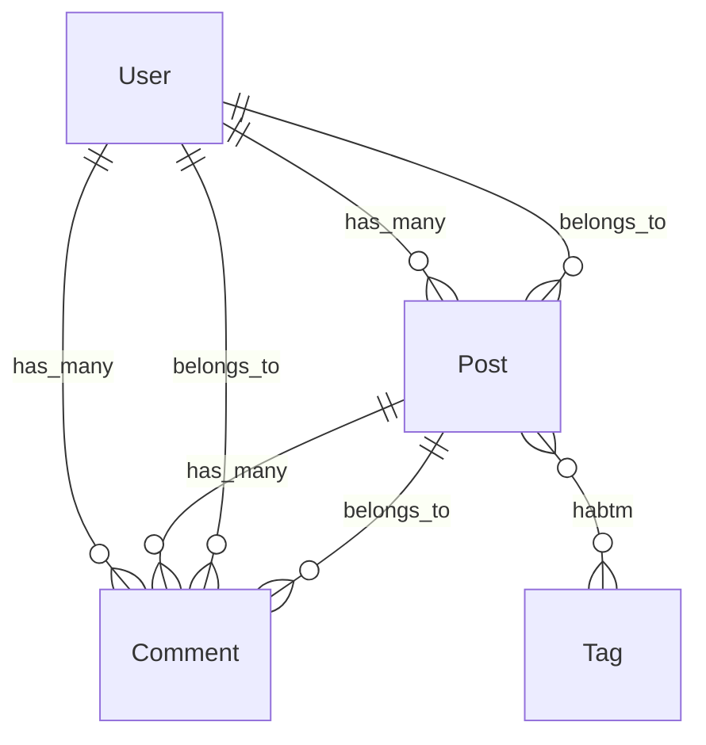

# rails-lens Webダッシュボード設計書

> **バージョン**: 0.1.0
> **作成日**: 2026-03-28
> **前提ドキュメント**:
> - [設計書 (DESIGN.md)](./DESIGN.md)
> - [要件定義書 (REQUIREMENTS.md)](./REQUIREMENTS.md)
> - **実装時期**: Phase 4完了後（HTTPトランスポート対応後）

---

## 目次

1. [技術スタック](#1-技術スタック)
2. [画面構成（全ページ定義）](#2-画面構成全ページ定義)
3. [ER図生成設計](#3-er図生成設計)
4. [内部API設計（エンドポイント一覧）](#4-内部api設計エンドポイント一覧)
5. [HTTPトランスポートとの統合](#5-httpトランスポートとの統合)
6. [ディレクトリ構造（追加分）](#6-ディレクトリ構造追加分)
7. [REQUIREMENTS.md §9 整合性チェックリスト](#7-requirementsmd-9-整合性チェックリスト)
8. [プロジェクト健全性ページ](#8-プロジェクト健全性ページcircular_dependencies--dead_code-連携)
9. [リクエストフローページ](#9-リクエストフローページdata_flow-連携)
10. [変更影響分析ページ](#10-変更影響分析ページimpact_analysis-連携)
11. [リファクタリング支援ページ](#11-リファクタリング支援ページextract_concern--dead_code-連携)
12. [Gem情報ページ](#12-gem情報ページgem_introspect-連携)
13. [Mermaid出力要件](#13-mermaid出力要件phase-58実装指針)
14. [画面台帳ページ（screen_map 連携）](#14-画面台帳ページscreen_map-連携)
15. [影響範囲ハイライトの画面レベル拡張](#15-影響範囲ハイライトの画面レベル拡張)
16. [コールバック連鎖専用可視化ページ](#16-コールバック連鎖専用可視化ページ)
17. [画面マッピング機能のナビゲーション統合・ディレクトリ構造・設計上の注意点](#17-画面マッピング機能のナビゲーション統合ディレクトリ構造設計上の注意点)
18. [SQL診断ページ（schema_audit / query_audit / query_preview 連携）](#18-sql診断ページschema_audit--query_audit--query_preview-連携)

---

## 1. 技術スタック

| コンポーネント | 選定技術 | 理由 |
|---|---|---|
| **HTTPサーバー** | FastAPI | 既存の `asyncio` ベース設計と親和性が高い。自動的にOpenAPI仕様を生成できる |
| **テンプレートエンジン** | Jinja2 | FastAPIと標準統合されており、サーバーサイドレンダリングに最適 |
| **CSSフレームワーク** | PicoCSS | 追加クラスなしでセマンティックHTMLにスタイルを適用できる軽量フレームワーク。依存ゼロ |
| **ダイアグラム描画** | Mermaid.js | ブラウザ側でMermaid記法のテキストをSVGに変換。既存の `mermaid_diagram` フィールドをそのまま利用可能 |

### 1.1 依存関係

```toml
# pyproject.toml への追加分（既存依存への追記）
[project.optional-dependencies]
web = [
    "fastapi>=0.110.0",
    "jinja2>=3.1.0",
    "python-multipart>=0.0.9",   # POST フォーム処理用
    "uvicorn>=0.29.0",           # 開発用ASGIサーバー
]
```

Web ダッシュボードはオプション機能として `pip install rails-lens[web]` で追加インストールする。

---

## 2. 画面構成（全ページ定義）

### 2.1 ダッシュボードトップ (`/`)

| 項目 | 内容 |
|---|---|
| **URL** | `GET /` |
| **目的** | rails-lens の稼働状況と Rails プロジェクトの概要を一覧表示する |
| **表示内容** | プロジェクトルートパス、rails-lens バージョン、検出モデル総数、キャッシュ状態（ヒット率・最終更新）、利用可能ツール一覧 |
| **使用MCPツール** | `list_models`（モデル総数取得）、`CacheManager.stats()`（キャッシュ統計） |

### 2.2 モデル一覧 (`/models`)

| 項目 | 内容 |
|---|---|
| **URL** | `GET /models` |
| **目的** | Rails プロジェクトの全 ActiveRecord モデルをテーブル表示する |
| **表示内容** | モデル名、テーブル名、ファイルパス（クリックで詳細ページへ遷移） |
| **使用MCPツール** | `list_models`（`ListModelsOutput.models` の `ModelSummary` 一覧） |

### 2.3 モデル詳細 (`/models/{model_name}`)

| 項目 | 内容 |
|---|---|
| **URL** | `GET /models/{model_name}` |
| **目的** | 特定モデルの完全なイントロスペクション結果を表示する |
| **表示内容** | アソシエーション、コールバック、バリデーション、スコープ、スキーマ情報、依存関係グラフ、コールバック連鎖Mermaid図 |
| **使用MCPツール** | `introspect_model`（全セクション取得）、`trace_callback_chain`（before_save/after_save等主要イベント） |

コールバック連鎖の Mermaid 図は `TraceCallbackChainOutput.mermaid_diagram` をそのまま `<div class="mermaid">` タグに埋め込む。

### 2.4 ER図 (`/er`)

| 項目 | 内容 |
|---|---|
| **URL** | `GET /er` |
| **目的** | 全モデル間のアソシエーションを Mermaid erDiagram で可視化する |
| **表示内容** | 全モデルのアソシエーション情報から自動生成した Mermaid erDiagram |
| **使用MCPツール** | `list_models`（全モデル名取得）+ `introspect_model`（各モデルの associations セクション） |

クエリパラメータ `?focus=ModelName` でフォーカスするモデルを指定可能（指定モデルおよびその関連モデルのみ表示）。

### 2.5 依存関係グラフ (`/graph/{model_name}`)

| 項目 | 内容 |
|---|---|
| **URL** | `GET /graph/{model_name}` |
| **目的** | 特定モデルを起点とした依存関係を Mermaid graph LR で表示する |
| **表示内容** | `dependency_graph` の `mermaid_diagram` を描画。深さ（depth）をスライダーで1〜5に変更可能 |
| **使用MCPツール** | `dependency_graph`（`DependencyGraphInput.format = "mermaid"`） |

### 2.6 キャッシュ管理 (`/cache`)

| 項目 | 内容 |
|---|---|
| **URL** | `GET /cache` |
| **目的** | キャッシュの状態確認と手動無効化操作を行う |
| **表示内容** | キャッシュエントリ一覧（ツール名、最終更新時刻、ファイルサイズ）、全無効化ボタン、ツール別無効化ボタン |
| **使用MCPツール** | `CacheManager.list_entries()`（内部API）、`POST /cache/invalidate`（フォーム送信） |

---

## 3. ER図生成設計

### 3.1 概要

`introspect_model` の `associations` セクションから得られるアソシエーション情報を用いて、Mermaid `erDiagram` 形式のテキストを自動生成する。

### 3.2 アソシエーション種別とMermaid表現

| Railsアソシエーション | `Association.type` | Mermaid 記法 |
|---|---|---|
| `has_many` | `has_many` | `ModelA ||--o{ ModelB : "has_many"` |
| `belongs_to` | `belongs_to` | `ModelA }o--|| ModelB : "belongs_to"` |
| `has_one` | `has_one` | `ModelA ||--|| ModelB : "has_one"` |
| `has_and_belongs_to_many` | `has_and_belongs_to_many` | `ModelA }o--o{ ModelB : "habtm"` |
| `has_many :through` | `has_many` (through あり) | `ModelA ||--o{ ModelB : "has_many through ModelC"` |

### 3.3 生成アルゴリズム

```python
def generate_er_diagram(models: list[IntrospectModelOutput]) -> str:
    """全モデルのアソシエーションから Mermaid erDiagram を生成する"""
    lines = ["erDiagram"]
    seen_edges: set[frozenset] = set()

    for model in models:
        for assoc in model.associations:
            edge_key = frozenset([model.model_name, assoc.class_name])
            if edge_key in seen_edges:
                continue  # 双方向重複を除去
            seen_edges.add(edge_key)

            relation = _assoc_type_to_mermaid(assoc.type, assoc.through)
            label = assoc.through or assoc.type
            lines.append(
                f'    {model.model_name} {relation} {assoc.class_name} : "{label}"'
            )

    return "\n".join(lines)
```

### 3.4 実装例（Mermaidコード）

以下は User / Post / Comment / Tag の4モデルを例とした出力イメージ:



### 3.5 パフォーマンス考慮

- 全モデルの `introspect_model` 呼び出しは並列ではなく逐次実行する（`rails runner` の同時起動を回避）
- `CacheManager` により2回目以降はキャッシュから取得するため、ページロードは高速
- 大規模プロジェクト（100モデル超）では `?focus=ModelName` クエリパラメータで表示対象を絞り込むことを推奨

---

## 4. 内部API設計（エンドポイント一覧）

### 4.1 エンドポイント一覧

| メソッド | パス | 処理内容 | レスポンス形式 |
|---|---|---|---|
| `GET` | `/` | ダッシュボードトップ表示 | HTML (Jinja2) |
| `GET` | `/models` | 全モデル一覧取得・表示 | HTML (Jinja2) |
| `GET` | `/models/{model_name}` | モデル詳細取得・表示 | HTML (Jinja2) |
| `GET` | `/er` | ER図ページ表示 | HTML (Jinja2) |
| `GET` | `/graph/{model_name}` | 依存関係グラフ表示 | HTML (Jinja2) |
| `GET` | `/cache` | キャッシュ管理ページ表示 | HTML (Jinja2) |
| `POST` | `/cache/invalidate` | 全キャッシュ無効化 | リダイレクト (`303 /cache`) |
| `POST` | `/cache/invalidate/{tool_name}` | 特定ツールのキャッシュ無効化 | リダイレクト (`303 /cache`) |
| `GET` | `/sql` | SQL 診断結果の統合表示（スキーマ診断・クエリ診断・クエリプレビュー） | HTML (Jinja2) |

### 4.2 各エンドポイント詳細

#### `GET /`

```python
@app.get("/", response_class=HTMLResponse)
async def dashboard_top(request: Request):
    models_output = await _call_list_models()
    cache_stats = _cache.get_stats()
    return templates.TemplateResponse("index.html", {
        "request": request,
        "model_count": len(models_output.models),
        "cache_stats": cache_stats,
        "project_root": _config.rails_root,
        "version": __version__,
    })
```

#### `GET /models`

```python
@app.get("/models", response_class=HTMLResponse)
async def models_list(request: Request):
    models_output = await _call_list_models()
    return templates.TemplateResponse("models.html", {
        "request": request,
        "models": models_output.models,
    })
```

#### `GET /models/{model_name}`

```python
@app.get("/models/{model_name}", response_class=HTMLResponse)
async def model_detail(request: Request, model_name: str):
    introspect = await _call_introspect_model(model_name, sections=None)
    callback_chains = {}
    for event in ["before_save", "after_save", "before_create", "after_create"]:
        try:
            callback_chains[event] = await _call_trace_callback_chain(model_name, event)
        except RailsLensError:
            callback_chains[event] = None
    return templates.TemplateResponse("model_detail.html", {
        "request": request,
        "model": introspect,
        "callback_chains": callback_chains,
    })
```

#### `GET /er`

```python
@app.get("/er", response_class=HTMLResponse)
async def er_diagram(request: Request, focus: str | None = None):
    models_output = await _call_list_models()
    all_models = [
        await _call_introspect_model(m.name, sections=["associations"])
        for m in models_output.models
    ]
    if focus:
        all_models = _filter_by_focus(all_models, focus)
    mermaid_code = generate_er_diagram(all_models)
    return templates.TemplateResponse("er.html", {
        "request": request,
        "mermaid_code": mermaid_code,
        "focus": focus,
    })
```

#### `GET /graph/{model_name}`

```python
@app.get("/graph/{model_name}", response_class=HTMLResponse)
async def dependency_graph(request: Request, model_name: str, depth: int = 2):
    graph = await _call_dependency_graph(model_name, depth=depth, format="mermaid")
    return templates.TemplateResponse("graph.html", {
        "request": request,
        "model_name": model_name,
        "depth": depth,
        "mermaid_code": graph.mermaid_diagram,
    })
```

#### `GET /cache`

```python
@app.get("/cache", response_class=HTMLResponse)
async def cache_management(request: Request):
    entries = _cache.list_entries()
    return templates.TemplateResponse("cache.html", {
        "request": request,
        "entries": entries,
    })
```

#### `POST /cache/invalidate`

```python
@app.post("/cache/invalidate")
async def invalidate_all_cache():
    _cache.invalidate_all()
    return RedirectResponse(url="/cache", status_code=303)
```

#### `POST /cache/invalidate/{tool_name}`

```python
@app.post("/cache/invalidate/{tool_name}")
async def invalidate_tool_cache(tool_name: str):
    _cache.invalidate(tool_name)
    return RedirectResponse(url="/cache", status_code=303)
```

### 4.3 MCPツール内部再利用方式

FastAPI ルートハンドラから MCP ツール関数を **直接呼び出す** 方式を採用する。MCPプロトコルを経由しないため、オーバーヘッドなしにツールのビジネスロジックを再利用できる。

```python
# tools/introspect_model.py の関数を直接インポートして呼び出す
from rails_lens.tools.introspect_model import introspect_model_impl
from rails_lens.tools.list_models import list_models_impl

# web/app.py 内から直接呼び出し
async def _call_list_models() -> ListModelsOutput:
    return await list_models_impl(_bridge, _cache, _config)

async def _call_introspect_model(
    model_name: str,
    sections: list[str] | None,
) -> IntrospectModelOutput:
    return await introspect_model_impl(
        IntrospectModelInput(model_name=model_name, sections=sections),
        _bridge, _cache,
    )
```

各ツールモジュールはMCP登録関数（デコレータ付き）と実装関数（`_impl` サフィックス）に分離し、`_impl` 関数を Web 層からも呼び出せるようにする。

---

## 5. HTTPトランスポートとの統合

### 5.1 背景

現在の `server.py` は `mcp.run(transport="stdio")` でstdioモードで起動する。Phase 4では `transport="http"` へ移行し、チーム共有サーバーとして運用可能にする（REQUIREMENTS.md §9.1）。Webダッシュボードはこの移行と同時に実装する。

### 5.2 server.py の変更点

```python
# 現在（Phase 1〜3）
def main():
    mcp.run(transport="stdio")

# Phase 4以降
def main():
    import uvicorn
    from rails_lens.web.app import create_app

    # MCP over HTTP/SSE + Web ダッシュボードを同一プロセスで起動
    web_app = create_app(bridge=_bridge, cache=_cache, config=_config)
    mcp.run(transport="http", app=web_app, host="0.0.0.0", port=8000)
```

### 5.3 FastAPIアプリとMCPサーバーの共存方式

```
┌─────────────────────────────────────────────────────────┐
│  uvicorn (ASGI)  port 8000                              │
│                                                         │
│  ┌────────────────────┐  ┌────────────────────────────┐ │
│  │  FastMCP (HTTP/SSE)│  │  FastAPI (Web ダッシュボード)│ │
│  │  /mcp/*            │  │  /         /models         │ │
│  │  /sse              │  │  /er       /graph/*        │ │
│  └────────────────────┘  │  /cache                    │ │
│                           └────────────────────────────┘ │
│                                                         │
│  共有リソース: RailsBridge, CacheManager, GrepSearch     │
└─────────────────────────────────────────────────────────┘
```

FastMCP の `http` トランスポートは内部的に Starlette/ASGI アプリを生成する。FastAPI アプリを `app.mount("/", web_app)` でサブマウントすることで、同一ポートで MCP エンドポイントと Web UI を提供する。

### 5.4 設定ファイルへの追加項目

```toml
# .rails-lens.toml への追加（Phase 4）
[web]
enabled = true
host = "127.0.0.1"
port = 8000
# ダッシュボードへのアクセス制限（将来拡張）
# auth_token = "..."
```

---

## 6. ディレクトリ構造（追加分）

Webダッシュボード実装時に追加するファイル・ディレクトリ構造:

```
src/rails_lens/
├── web/
│   ├── __init__.py
│   ├── app.py                  # FastAPI アプリケーションファクトリ (create_app)
│   ├── er_builder.py           # ER図生成ロジック (generate_er_diagram)
│   ├── routes/
│   │   ├── __init__.py
│   │   ├── dashboard.py        # GET /
│   │   ├── models.py           # GET /models, GET /models/{model_name}
│   │   ├── er.py               # GET /er
│   │   ├── graph.py            # GET /graph/{model_name}
│   │   └── cache.py            # GET /cache, POST /cache/invalidate[/{tool_name}]
│   ├── templates/
│   │   ├── base.html           # 共通レイアウト（PicoCSS + Mermaid.js CDN）
│   │   ├── index.html          # ダッシュボードトップ
│   │   ├── models.html         # モデル一覧
│   │   ├── model_detail.html   # モデル詳細
│   │   ├── er.html             # ER図
│   │   ├── graph.html          # 依存関係グラフ
│   │   └── cache.html          # キャッシュ管理
│   └── static/
│       └── rails-lens.css      # PicoCSS 上書き用カスタムスタイル（最小限）
```

### 6.1 ファイル責務

| ファイル | 責務 |
|---|---|
| `web/app.py` | `create_app(bridge, cache, config)` ファクトリ関数。FastAPIインスタンス生成、ルーター登録、テンプレート設定 |
| `web/er_builder.py` | `generate_er_diagram(models)` 関数。アソシエーション情報 → Mermaid erDiagram 変換 |
| `web/routes/dashboard.py` | `GET /` ハンドラ |
| `web/routes/models.py` | `GET /models`, `GET /models/{model_name}` ハンドラ |
| `web/routes/er.py` | `GET /er` ハンドラ |
| `web/routes/graph.py` | `GET /graph/{model_name}` ハンドラ |
| `web/routes/cache.py` | `GET /cache`, `POST /cache/invalidate`, `POST /cache/invalidate/{tool_name}` ハンドラ |
| `web/templates/base.html` | PicoCSS CDN、Mermaid.js CDN、ナビゲーションバーを含む共通テンプレート |
| `web/static/rails-lens.css` | Mermaidダイアグラムのサイズ調整等、最小限のカスタムスタイル |

---

## 7. REQUIREMENTS.md §9 整合性チェックリスト

REQUIREMENTS.md §9「将来の拡張計画」との整合性を確認する。

### §9.1 短期（Phase 4完了後）

| 要件 | 本設計での対応 | 状態 |
|---|---|---|
| **HTTPトランスポート対応**（SSEトランスポートの追加、チーム共有MCPサーバー） | §5「HTTPトランスポートとの統合」にて設計。`mcp.run(transport="http")` への切り替え手順と FastAPI 共存方式を定義 | ✅ 対応済み |
| **Rails 8対応**（Solid Queue, Solid Cache等） | 本設計書のスコープ外（ブリッジ層・Rubyスクリプト側の対応）。Webダッシュボードは Rails バージョンに依存しない | — スコープ外 |
| **パフォーマンス最適化**（500+モデルでのベンチマーク） | §3.5「パフォーマンス考慮」にて逐次実行方針とキャッシュ活用を明記。`?focus=ModelName` による表示絞り込みを提供 | ✅ 考慮済み |

### §9.2 中期

| 要件 | 本設計での対応 | 状態 |
|---|---|---|
| **差分更新**（watchdog によるキャッシュ自動更新） | 本設計書のスコープ外。キャッシュ管理ページ（`/cache`）から手動無効化で代替 | — 将来拡張 |
| **ER図生成**（モデル間の関連から Mermaid erDiagram を自動生成） | §2.4・§3「ER図生成設計」にて詳細設計。`/er` ページとして実装 | ✅ 本設計で実装 |
| **マイグレーション影響分析** | 本設計書のスコープ外（Phase 5以降の新規ツール追加） | — 将来拡張 |
| **Gemイントロスペクション** | 本設計書のスコープ外（ブリッジ層・Rubyスクリプト側の対応） | — 将来拡張 |

### §9.3 長期

| 要件 | 本設計での対応 | 状態 |
|---|---|---|
| **他フレームワーク対応**（Django, Laravel等） | 本設計書のスコープ外。Web層はフレームワーク非依存の設計だが、ブリッジ層の抽象化が前提 | — 将来拡張 |
| **MCP Resource対応** | 本設計書のスコープ外。Webダッシュボードとは独立した機能 | — 将来拡張 |

### チェックサマリー

- **本設計で対応するもの**: HTTPトランスポート統合（§9.1）、ER図生成（§9.2）
- **本設計で考慮するもの**: パフォーマンス最適化（§9.1）
- **スコープ外（将来拡張）**: Rails 8対応、差分更新、マイグレーション影響分析、Gemイントロスペクション、他フレームワーク対応、MCP Resource対応

---

---

## 8. プロジェクト健全性ページ（circular_dependencies / dead_code 連携）

### 8.1 ページ概要

| 項目 | 内容 |
|---|---|
| **URL** | `GET /health` |
| **目的** | プロジェクト全体の構造的健全性を可視化する。循環依存の有無とデッドコードの蓄積状況を一覧表示する |
| **使用MCPツール** | `rails_lens_find_circular_dependencies`（循環依存検出）、`rails_lens_find_dead_code`（デッドコード検出） |

### 8.2 表示内容

#### 循環依存セクション

- **ステータスバッジ**: 循環依存が検出されない場合は緑（✅ 循環依存なし）、1件以上検出された場合は赤（🔴 N件検出）を表示
- **Mermaid graph 可視化**: `CircularDependenciesOutput.mermaid_diagram` を `<div class="mermaid">` タグに直接埋め込み、循環パスを有向グラフで表示する
- **循環サマリーテーブル**: 各 `CyclePath` のモデル一覧（`models` フィールド）、循環種別（`cycle_type`）、深刻度（`severity`）を行単位で表示

#### デッドコードセクション

- **件数サマリー**: 検出件数（`total_dead_code_found`）と分析対象メソッド数（`total_methods_analyzed`）をカード表示
- **信頼度分布**: `confidence = "high"` / `"medium"` ごとの件数をバッジ付きで表示
- **デッドコード一覧テーブル**: `DeadCodeItem.type`（method/callback/scope）、ファイル名・行番号、`reason`、`dynamic_call_risk` フラグを列として表示

### 8.3 内部APIエンドポイント追加

| メソッド | パス | 処理内容 |
|---|---|---|
| `GET` | `/health` | 循環依存ステータス + デッドコードサマリー表示 |

```python
@app.get("/health", response_class=HTMLResponse)
async def project_health(request: Request):
    circular = await _call_circular_dependencies(format="mermaid")
    dead_code = await _call_dead_code(scope="models", confidence="high")
    return templates.TemplateResponse("health.html", {
        "request": request,
        "circular": circular,
        "dead_code": dead_code,
        "has_cycles": circular.total_cycles > 0,
    })
```

---

## 9. リクエストフローページ（data_flow 連携）

### 9.1 ページ概要

| 項目 | 内容 |
|---|---|
| **URL** | `GET /flow/{controller}/{action}` |
| **目的** | 特定のコントローラ/アクションにおけるHTTPリクエストからDB保存までの全レイヤーのデータフローを可視化する |
| **使用MCPツール** | `rails_lens_trace_data_flow` |

### 9.2 表示内容

- **エンドポイント選択UI**: `/flow` ページにコントローラ名・アクション名の入力フォームを配置し、`GET /flow/{controller}/{action}` へ遷移する
- **Mermaid sequenceDiagram 表示**: `DataFlowOutput.mermaid_diagram` をそのまま `<div class="mermaid">` タグに埋め込む
- **レイヤー別詳細テーブル**: `DataFlowOutput.flow_steps` の各 `DataFlowStep` を順序・レイヤー・説明・ファイル位置の列でテーブル表示する

### 9.3 Mermaid出力要件

`rails_lens_trace_data_flow` が返す `mermaid_diagram` は **sequenceDiagram 形式** に準拠すること:

```
sequenceDiagram
    participant Client
    participant Router
    participant Controller as {ControllerName}
    participant Params as StrongParameters
    participant Model as {ModelName} Model
    participant DB

    Client->>Router: {HTTP動詞} {パス}
    Router->>Controller: #{アクション名}
    Controller->>Params: params.require(:{param_key}).permit(...)
    Params->>Model: {ModelName}.new(permitted_params) / .update(...)
    Model->>Model: {コールバック名} ({イベント名})
    Model->>DB: {SQL操作}
```

- **参加者 (participant)** はレイヤー名を固定値として使用する: `Client`, `Router`, `Controller`, `Params`（StrongParameters）, `Model`, `DB`
- ネストした `accepts_nested_attributes_for` が存在する場合は `participant NestedModel as {関連モデル名} Model` を追加する

### 9.4 内部APIエンドポイント追加

| メソッド | パス | 処理内容 |
|---|---|---|
| `GET` | `/flow` | エンドポイント選択フォーム表示 |
| `GET` | `/flow/{controller}/{action}` | 指定コントローラ/アクションのデータフロー表示 |

```python
@app.get("/flow", response_class=HTMLResponse)
async def flow_selector(request: Request):
    return templates.TemplateResponse("flow_selector.html", {"request": request})

@app.get("/flow/{controller}/{action}", response_class=HTMLResponse)
async def request_flow(request: Request, controller: str, action: str):
    flow = await _call_data_flow(controller_action=f"{controller}#{action}")
    return templates.TemplateResponse("flow.html", {
        "request": request,
        "controller": controller,
        "action": action,
        "flow": flow,
        "mermaid_code": flow.mermaid_diagram,
    })
```

---

## 10. 変更影響分析ページ（impact_analysis 連携）

### 10.1 ページ概要

| 項目 | 内容 |
|---|---|
| **URL** | `GET /impact/{model_name}` |
| **目的** | 特定モデルのカラムまたはメソッドを変更した場合の影響範囲をカテゴリ別に可視化する |
| **使用MCPツール** | `rails_lens_analyze_impact` |

### 10.2 表示内容

- **モデル名 + カラム/メソッド入力フォーム**: `/impact/{model_name}` ページに `target`（カラム名またはメソッド名）と `change_type`（remove/rename/type_change/modify）のフォームを配置し、`GET /impact/{model_name}?target=xxx&change_type=yyy` で結果を取得する
- **影響範囲一覧（カテゴリ別）**: `ImpactAnalysisOutput.direct_impacts` を `category` フィールドでグループ化し、カテゴリタブ（validation / callback / view / mailer / scope / serializer / job / controller）ごとに表示する
- **重大度バッジ**: 各 `ImpactItem.severity` に応じて 🔴（breaking）/ 🟡（warning）/ ⚪（info）のバッジを付与する
- **修正が必要なファイル一覧**: `affected_files` をチェックリスト形式で表示する

### 10.3 Mermaid出力要件

`rails_lens_analyze_impact` は `ImpactAnalysisOutput` に `mermaid_diagram` フィールドを追加し、**graph LR 形式**で影響グラフを返すこと:

```
graph LR
    Target["{model_name}.{target}"]
    Target --> Validation["validation\n{ファイル名}:{行番号}"]
    Target --> Callback["callback\n{ファイル名}:{行番号}"]
    Target --> View["view\n{ファイル名}:{行番号}"]
    Target --> Mailer["mailer\n{ファイル名}:{行番号}"]
    style Target fill:#ff6666
    style Validation fill:#ffaaaa
```

- 影響ノードは `severity` に応じて色付けする: `breaking` → `fill:#ffaaaa`、`warning` → `fill:#ffffaa`、`info` → `fill:#aaffaa`

### 10.4 内部APIエンドポイント追加

| メソッド | パス | 処理内容 |
|---|---|---|
| `GET` | `/impact/{model_name}` | モデル影響分析フォーム + 結果表示 |

```python
@app.get("/impact/{model_name}", response_class=HTMLResponse)
async def impact_analysis(
    request: Request,
    model_name: str,
    target: str | None = None,
    change_type: str = "modify",
):
    result = None
    if target:
        result = await _call_impact_analysis(model_name, target, change_type)
    return templates.TemplateResponse("impact.html", {
        "request": request,
        "model_name": model_name,
        "target": target,
        "change_type": change_type,
        "result": result,
    })
```

---

## 11. リファクタリング支援ページ（extract_concern / dead_code 連携）

### 11.1 ページ概要

| 項目 | 内容 |
|---|---|
| **URL** | `GET /refactor/{model_name}` |
| **目的** | Fat Modelのリファクタリングを支援する。Concern分割候補の可視化とデッドコードの一覧表示を組み合わせて提供する |
| **使用MCPツール** | `rails_lens_suggest_extract_concern`（分割案）、`rails_lens_find_dead_code`（未使用コード） |

### 11.2 表示内容

#### Concern分割候補セクション

- **凝集度クラスタ図（Mermaid graph）**: `ExtractConcernOutput.candidates` の各 `ConcernCandidate` をノードとし、`methods` と `shared_columns` をエッジで表した **graph TD 形式**のMermaid図を表示する
- **クラスタカード一覧**: 各 `ConcernCandidate` について `suggested_name`（提案Concern名）、`methods`（対象メソッド一覧）、`shared_columns`（共通カラム）、`cohesion_score`（凝集度スコア）、`rationale`（根拠説明）をカード形式で表示する
- **既存Concern重複警告**: `existing_concern_overlap` が存在する場合は黄色の警告バナーで表示する

#### デッドコード一覧セクション

- **対象モデルのデッドコード**: `rails_lens_find_dead_code(model_name={model_name})` の結果をテーブル表示する
- **信頼度バッジ**: `DeadCodeItem.confidence` に応じて 🔴 high / 🟡 medium のバッジを付与する

### 11.3 内部APIエンドポイント追加

| メソッド | パス | 処理内容 |
|---|---|---|
| `GET` | `/refactor/{model_name}` | Concern分割案 + デッドコード表示 |

```python
@app.get("/refactor/{model_name}", response_class=HTMLResponse)
async def refactor_support(request: Request, model_name: str):
    concern_candidates = await _call_extract_concern(model_name)
    dead_code = await _call_dead_code(scope="models", model_name=model_name)
    return templates.TemplateResponse("refactor.html", {
        "request": request,
        "model_name": model_name,
        "candidates": concern_candidates,
        "dead_code": dead_code,
    })
```

---

## 12. Gem情報ページ（gem_introspect 連携）

### 12.1 ページ概要

| 項目 | 内容 |
|---|---|
| **URL** | `GET /gems/{gem_name}` |
| **目的** | 特定Gemがモデルに追加する暗黙メソッド・コールバック・ルートを可視化し、アプリ固有の挙動とGem由来の挙動を区別する |
| **使用MCPツール** | `rails_lens_gem_introspect` |

### 12.2 表示内容

- **Gem一覧ページ** (`/gems`): `rails_lens_gem_introspect()` を引数なしで呼び出し、影響の大きいGemの一覧を表示する。各GemはGem名リンク → `/gems/{gem_name}` に遷移する
- **Gem由来の暗黙メソッド一覧**: `GemImpact.added_methods` を `type`（instance_method / class_method / scope）ごとにグループ化してテーブル表示する
- **Gem由来のコールバック一覧**: `GemImpact.added_callbacks` を `kind`（before_save 等）と `event` でテーブル表示する
- **Gem由来のルート一覧**: `GemImpact.added_routes` を `verb` / `path` / `controller#action` でテーブル表示する
- **アプリ固有 vs Gem由来の区別表示**: `affected_models` の各モデルについて、モデル詳細ページ（`/models/{model_name}`）へのリンクとともに Gem由来コンポーネントのバッジを付与する
- **オーバーライドされた既存メソッドの警告**: `overridden_methods` が存在する場合は赤色の警告バナーで表示する

### 12.3 内部APIエンドポイント追加

| メソッド | パス | 処理内容 |
|---|---|---|
| `GET` | `/gems` | 影響の大きいGem一覧表示 |
| `GET` | `/gems/{gem_name}` | 特定Gemの詳細（メソッド/コールバック/ルート）表示 |

```python
@app.get("/gems", response_class=HTMLResponse)
async def gems_list(request: Request):
    result = await _call_gem_introspect()
    return templates.TemplateResponse("gems.html", {
        "request": request,
        "gems": result.gems,
    })

@app.get("/gems/{gem_name}", response_class=HTMLResponse)
async def gem_detail(request: Request, gem_name: str):
    result = await _call_gem_introspect(gem_name=gem_name)
    gem = result.gems[0] if result.gems else None
    return templates.TemplateResponse("gem_detail.html", {
        "request": request,
        "gem_name": gem_name,
        "gem": gem,
    })
```

---

## 13. Mermaid出力要件（Phase 5〜8実装指針）

### 13.1 概要

Phase 5〜8で実装する各ツール（`rails_lens_impact_analysis`、`rails_lens_data_flow`、`rails_lens_circular_dependencies`、`rails_lens_suggest_extract_concern`）は、Webダッシュボードへの統合を前提として `mermaid_diagram` フィールドを出力モデルに含めること。

### 13.2 フォーマット要件一覧

| ツール | Mermaidフォーマット | 用途 |
|---|---|---|
| `rails_lens_trace_data_flow` | `sequenceDiagram` | リクエストフローの時系列表現 |
| `rails_lens_analyze_impact` | `graph LR` | 変更影響の有向グラフ（左→右） |
| `rails_lens_find_circular_dependencies` | `graph TD` | 循環依存の有向グラフ（上→下） |
| `rails_lens_suggest_extract_concern` | `graph TD` | Concern分割クラスタ図 |
| 既存: `trace_callback_chain` | `sequenceDiagram` | コールバック実行順序（Phase 1〜4で実装済み） |
| 既存: `dependency_graph` | `graph LR` | モデル依存グラフ（Phase 1〜4で実装済み） |

### 13.3 共通インターフェース

Webダッシュボードは各ツール出力モデルの `mermaid_diagram: str` フィールドを **そのまま** `<div class="mermaid">` タグに埋め込んでレンダリングする。ダッシュボード側では変換処理を行わない。

**ツール側の実装責任**:

```python
# 各OutputモデルにはPydanticフィールドとして定義すること
class XxxOutput(BaseModel):
    ...
    mermaid_diagram: str = ""   # 空文字列 = 図なし（正常ケース）
```

- `mermaid_diagram` フィールドは常に存在すること（`None` は不可、空文字列で代替する）
- 図の生成に失敗した場合は空文字列を返し、例外を送出しないこと
- 出力するMermaid記法は [Mermaid.js v10系](https://mermaid.js.org/) の構文に準拠すること

### 13.4 sequenceDiagram 共通規則

- **参加者ラベル**: スペースを含む場合は `participant X as "Label With Space"` 形式を使用
- **メッセージ**: `->>`（実線矢印）= 同期呼び出し、`-->>`（破線矢印）= 非同期/レスポンス
- **ノート**: 補足が必要な場合は `Note over X: テキスト` 形式を使用

### 13.5 graph LR / graph TD 共通規則

- **ノードID**: `snake_case` を使用し、`[ラベル]`（矩形）、`(ラベル)`（角丸矩形）、`{ラベル}`（菱形）でノード種別を表現
- **エッジラベル**: `A -->|"ラベル"| B` 形式（ラベルに記号を含む場合はクォート）
- **スタイリング**: `style NodeId fill:#色コード` で重大度や種別を色で表現する（赤系 = critical/breaking、黄系 = warning、緑系 = ok）

---

## 14. 画面台帳ページ（screen_map 連携）

> **前提ドキュメント**: [画面マッピング機能設計書 (SCREEN_MAP_FEATURE.md)](./SCREEN_MAP_FEATURE.md)
>
> 本セクションでは `rails_lens_screen_map` MCP ツールの出力を Web ダッシュボード上でどう表示するかに焦点を当てる。MCP ツール側の入出力仕様は前提ドキュメントを参照のこと。

### 14.1 画面台帳一覧ページ (`/screens`)

| 項目 | 内容 |
|---|---|
| **URL** | `GET /screens` |
| **目的** | Rails アプリの全画面（Web 画面 + API エンドポイント）の台帳を表示する。ドキュメントが整備されていないプロジェクトの全体把握に使う |
| **使用MCPツール** | `rails_lens_screen_map`（`mode: "full_inventory"`） |

#### 14.1.1 統計サマリー

ページ上部に統計カードを横並びで表示する:

| カード | 値のソース |
|---|---|
| 全画面数 | `inventory.stats.total` |
| Web 画面数 | `inventory.stats.web_count` |
| API エンドポイント数 | `inventory.stats.api_count` |
| 共有パーシャル数 | `len(inventory.shared_partials)` |

```html
{# screens.html 統計カード部分 #}
<div class="grid">
    <article><h3>{{ stats.total }}</h3><p>全画面数</p></article>
    <article><h3>{{ stats.web_count }}</h3><p>Web 画面</p></article>
    <article><h3>{{ stats.api_count }}</h3><p>API エンドポイント</p></article>
    <article><h3>{{ shared_partials | length }}</h3><p>共有パーシャル</p></article>
</div>
```

#### 14.1.2 フィルタ・検索

PicoCSS + 素の JavaScript で実装する。フレームワークは使わない。

| フィルタ種別 | UI 要素 | 動作 |
|---|---|---|
| テキスト検索 | `<input type="search">` | 画面名・URL・コントローラ名・モデル名で即時フィルタリング（`oninput` で JS 関数呼び出し） |
| 名前空間フィルタ | `<select>` | ルート / Admin / Api::V1 等の名前空間で絞り込み |
| 種別フィルタ | ラジオボタン 3 択 | 全て / Web 画面のみ / API のみ |

```html
{# screens.html の検索フィルタ部分 #}
<fieldset role="group">
    <input type="search" id="screenSearch" placeholder="画面名、URL、モデル名で検索..."
           oninput="filterScreens()">
    <select id="namespaceFilter" onchange="filterScreens()">
        <option value="">全名前空間</option>
        
        <option value="{{ ns }}" {{ 'selected' if ns == current_namespace }}>{{ ns }}</option>
        
    </select>
</fieldset>
<fieldset>
    <label><input type="radio" name="kind" value="all" checked onchange="filterScreens()"> 全て</label>
    <label><input type="radio" name="kind" value="web" onchange="filterScreens()"> Web 画面のみ</label>
    <label><input type="radio" name="kind" value="api" onchange="filterScreens()"> API のみ</label>
</fieldset>

<script>
function filterScreens() {
    const query = document.getElementById('screenSearch').value.toLowerCase();
    const ns = document.getElementById('namespaceFilter').value;
    const kind = document.querySelector('input[name="kind"]:checked').value;
    document.querySelectorAll('#screenTable tbody tr').forEach(row => {
        const text = row.textContent.toLowerCase();
        const rowNs = row.dataset.namespace || '';
        const rowKind = row.dataset.kind || '';
        const matchText = !query || text.includes(query);
        const matchNs = !ns || rowNs === ns;
        const matchKind = kind === 'all' || rowKind === kind;
        row.style.display = (matchText && matchNs && matchKind) ? '' : 'none';
    });
}
</script>
```

#### 14.1.3 メインテーブル

| 列 | データソース | 備考 |
|---|---|---|
| 画面名 | `screen.name` | クリックで `/screens/{controller}/{action}` に遷移 |
| URL パターン | `screen.url_pattern` | |
| HTTP メソッド | `screen.http_method` | |
| コントローラ#アクション | `screen.controller_action` | |
| テンプレートファイル | `screen.template_file` | |
| パーシャル数 | `screen.partial_count` | |
| 使用モデル | `screen.models` | カンマ区切り |

- API エンドポイントには `<mark>API</mark>` バッジを表示して Web 画面と視覚的に区別する
- 各行に `data-namespace` / `data-kind` 属性を付与し、JavaScript フィルタの対象とする

```html
{# screens.html メインテーブル部分 #}
<table id="screenTable">
    <thead>
        <tr>
            <th>画面名</th><th>URL</th><th>メソッド</th>
            <th>コントローラ#アクション</th><th>テンプレート</th>
            <th>パーシャル数</th><th>使用モデル</th>
        </tr>
    </thead>
    <tbody>
        
        <tr data-namespace="{{ s.namespace }}" data-kind="{{ 'api' if s.is_api else 'web' }}">
            <td>
                <a href="/screens/{{ s.controller }}/{{ s.action }}">{{ s.name }}</a>
                <mark>API</mark>
            </td>
            <td>{{ s.url_pattern }}</td>
            <td>{{ s.http_method }}</td>
            <td>{{ s.controller_action }}</td>
            <td>{{ s.template_file }}</td>
            <td>{{ s.partial_count }}</td>
            <td>{{ s.models | join(', ') }}</td>
        </tr>
        
    </tbody>
</table>
```

#### 14.1.4 共有パーシャル使用状況セクション

テーブル下部に配置する。

| 列 | データソース | 備考 |
|---|---|---|
| パーシャル名 | `partial.name` | クリックで `/screens/source?file={partial.file_path}` に遷移 |
| 使用画面数 | `partial.used_in_count` | |
| 影響レベル | `partial.impact_level` | critical / high / moderate / low |

影響レベルに応じて PicoCSS の色クラスで行を色分けする:

```html
{# screens.html 共有パーシャルセクション #}
<h3>共有パーシャル使用状況</h3>
<table>
    <thead>
        <tr><th>パーシャル名</th><th>使用画面数</th><th>影響レベル</th></tr>
    </thead>
    <tbody>
        
        <tr>
            <td><a href="/screens/source?file={{ p.file_path }}">{{ p.name }}</a></td>
            <td>{{ p.used_in_count }}</td>
            <td>
                <mark style="background:#ff6666">critical</mark>
                <mark style="background:#ffaa66">high</mark>
                <mark style="background:#ffdd66">moderate</mark>
                <mark style="background:#66cc66">low</mark>
                
            </td>
        </tr>
        
    </tbody>
</table>
```

### 14.2 画面詳細ページ (`/screens/{controller}/{action}`)

| 項目 | 内容 |
|---|---|
| **URL** | `GET /screens/{controller}/{action}` |
| **目的** | 特定画面を構成する全ファイルの一覧を表示する |
| **使用MCPツール** | `rails_lens_screen_map`（`mode: "screen_to_source"`） |

#### 14.2.1 表示内容

| セクション | 内容 | 表示形式 |
|---|---|---|
| 画面基本情報 | 画面名、URL パターン、HTTP メソッド、コントローラ#アクション | 定義リスト（`<dl>`） |
| テンプレート構成ツリー | layout → テンプレート → パーシャル（ネスト含む） | インデント付きリスト。各ファイルのパスを表示 |
| ヘルパーメソッド一覧 | メソッド名、定義ファイル、行番号、呼び出し元 | テーブル |
| モデル参照一覧 | モデル名（`/models/{model_name}` リンク）、アクセス属性・メソッド・関連 | モデル名ごとのネストリスト |
| i18n キー一覧 | 使用 i18n キーと値 | テーブル |
| ハードコードテキスト | i18n 化されていない直書きテキスト | 黄色背景（`style="background:#ffffcc"`）で強調表示 |

```html
{# screen_detail.html テンプレート構成ツリー部分 #}
<h3>テンプレート構成</h3>
<ul>
    <li>📄 {{ screen.layout_file }} <small>(layout)</small>
        <ul>
            <li>📄 {{ screen.template_file }} <small>(template)</small>
                <ul>
                    
                    <li>📄 {{ partial.file_path }}
                        
                        <ul>{{ loop(partial.children) }}</ul>
                        
                    </li>
                    
                </ul>
            </li>
        </ul>
    </li>
</ul>
```

```html
{# screen_detail.html ハードコードテキスト部分 #}

<h3>ハードコードされたテキスト</h3>
<p><small>i18n 化されていない直書きテキストです。国際化の改善余地として確認してください。</small></p>
<table>
    <thead><tr><th>テキスト</th><th>ファイル</th><th>行番号</th></tr></thead>
    <tbody>
        
        <tr style="background:#ffffcc">
            <td>{{ t.text }}</td>
            <td>{{ t.file_path }}</td>
            <td>{{ t.line_number }}</td>
        </tr>
        
    </tbody>
</table>

```

### 14.3 ソース逆引きページ (`/screens/source`)

| 項目 | 内容 |
|---|---|
| **URL** | `GET /screens/source` |
| **クエリパラメータ** | `file`（ファイルパス）or `method`（ヘルパーメソッド名） |
| **目的** | 特定のパーシャル・ヘルパー・モデルがどの画面で使われているかを表示する |
| **使用MCPツール** | `rails_lens_screen_map`（`mode: "source_to_screens"`） |

#### 14.3.1 表示内容

| セクション | 内容 | 表示形式 |
|---|---|---|
| ソースファイル情報 | ファイルパス、ファイル種別（partial / helper / model / decorator） | 定義リスト（`<dl>`） |
| 使用画面一覧 | 画面名、URL、コントローラ#アクション、呼び出し元ファイル:行番号 | テーブル。画面名は `/screens/{controller}/{action}` へのリンク |
| 影響レベルバッジ | critical（赤）/ high（オレンジ）/ moderate（黄）/ low（緑） | PicoCSS `<mark>` + インラインカラー |

- layout 経由で全画面に影響するパーシャルの場合は、ページ上部に赤い警告バナーを表示する:

```html
{# screen_source.html 警告バナー部分 #}

<article style="background:#ff6666; color:white; padding:1rem; margin-bottom:1rem;">
    ⚠️ このファイルは layout 経由で全画面に影響します。変更時は十分にご注意ください。
</article>

```

### 14.4 内部 API エンドポイント

| メソッド | パス | 処理内容 | レスポンス形式 |
|---|---|---|---|
| `GET` | `/screens` | 画面台帳表示 | HTML (Jinja2) |
| `GET` | `/screens/{controller}/{action}` | 画面詳細表示 | HTML (Jinja2) |
| `GET` | `/screens/source` | ソース逆引き表示 | HTML (Jinja2) |

```python
@app.get("/screens", response_class=HTMLResponse)
async def screen_inventory(
    request: Request,
    namespace: str | None = None,
    kind: str = "all",  # "all", "web", "api"
):
    inventory = await _call_screen_map(
        mode="full_inventory",
        include_api=True,
        group_by="namespace",
        locale="ja",
    )
    screens = inventory.screens
    if namespace:
        screens = [s for s in screens if s.namespace == namespace]
    if kind == "web":
        screens = [s for s in screens if not s.is_api]
    elif kind == "api":
        screens = [s for s in screens if s.is_api]

    namespaces = sorted(set(s.namespace for s in inventory.screens))
    return templates.TemplateResponse("screens.html", {
        "request": request,
        "screens": screens,
        "shared_partials": inventory.shared_partials,
        "stats": inventory.stats,
        "namespaces": namespaces,
        "current_namespace": namespace,
        "current_kind": kind,
    })


@app.get("/screens/{controller}/{action}", response_class=HTMLResponse)
async def screen_detail(request: Request, controller: str, action: str):
    result = await _call_screen_map(
        mode="screen_to_source",
        controller_action=f"{controller}#{action}",
    )
    return templates.TemplateResponse("screen_detail.html", {
        "request": request,
        "screen": result,
    })


@app.get("/screens/source", response_class=HTMLResponse)
async def screen_source_reverse(
    request: Request,
    file: str | None = None,
    method: str | None = None,
):
    result = await _call_screen_map(
        mode="source_to_screens",
        file_path=file,
        method_name=method,
    )
    return templates.TemplateResponse("screen_source.html", {
        "request": request,
        "source": result,
    })
```

---

## 15. 影響範囲ハイライトの画面レベル拡張

### 15.1 概要

既存の `/impact/{model_name}` ページ（セクション 10）を拡張し、影響範囲を **画面レベル** でもハイライトできるようにする。現在は「どのファイルが影響を受けるか」を表示しているが、「どの画面が影響を受けるか」も表示する。

### 15.2 既存ページへの追加セクション

`/impact/{model_name}?target=xxx&change_type=yyy` の結果表示に、以下のセクションを追加する。

#### 15.2.1 影響を受ける画面一覧セクション

処理フロー:

1. `ImpactAnalysisOutput.affected_files` の中からビュー関連ファイル（`app/views/`、`app/helpers/`）を抽出する
2. それらのファイルに対して `rails_lens_screen_map`（`mode: "source_to_screens"`）を呼び出し、影響を受ける画面の一覧を取得する
3. 画面名、URL、影響レベル、影響経路（「パーシャル `_user_card.html.erb` 経由」等）をテーブル表示する

表示仕様:

| 列 | 内容 |
|---|---|
| 画面名 | `/screens/{controller}/{action}` へのリンク |
| URL | 画面の URL パターン |
| 影響レベル | critical / high / moderate / low バッジ |
| 影響経路 | 「パーシャル `_xxx.html.erb` 経由」等の説明テキスト |

- 影響レベル critical の画面がある場合、セクション上部に赤い警告バナーを表示する:

```html
{# impact.html 影響画面セクション部分 #}

<h3>影響を受ける画面</h3>

<article style="background:#ff6666; color:white; padding:1rem; margin-bottom:1rem;">
    🔴 critical レベルの影響を受ける画面があります。変更前に十分な確認を行ってください。
</article>

<table>
    <thead>
        <tr><th>画面名</th><th>URL</th><th>影響レベル</th><th>影響経路</th></tr>
    </thead>
    <tbody>
        
        <tr>
            <td><a href="/screens/{{ s.controller }}/{{ s.action }}">{{ s.name }}</a></td>
            <td>{{ s.url_pattern }}</td>
            <td>
                <mark style="background:#ff6666">critical</mark>
                <mark style="background:#ffaa66">high</mark>
                <mark style="background:#ffdd66">moderate</mark>
                <mark style="background:#66cc66">low</mark>
                
            </td>
            <td>{{ s.impact_path }}</td>
        </tr>
        
    </tbody>
</table>

```

#### 15.2.2 Mermaid 図への画面ノード追加

既存の `graph LR` 形式の影響グラフに、画面ノードを追加する。ツール側（`rails_lens_analyze_impact`）の `mermaid_diagram` 生成ロジックを拡張する:

```
graph LR
    Target["User.email"]
    Target --> Validation["validation\nuser.rb:35"]
    Target --> View["view\nusers/show.html.erb:11"]
    Target --> Mailer["mailer\nUserMailer"]

    View --> Screen_UserDetail["🖥️ ユーザー詳細\n/users/:id"]
    View --> Screen_UserList["🖥️ ユーザー一覧\n/users"]
    Mailer --> Screen_None["📧 メール送信\n（画面なし）"]

    style Target fill:#ff6666
    style Screen_UserDetail fill:#ffdddd
    style Screen_UserList fill:#ffdddd
```

画面ノードの規則:

- ノード ID: `Screen_{controller}_{action}` 形式
- ラベル: `🖥️ {画面名}\n{URL パターン}` 形式
- スタイル: `fill:#ffdddd`（薄い赤）で統一
- メール送信等、画面を持たない影響先は `📧` アイコンで区別する

### 15.3 内部 API エンドポイントの変更

既存の `/impact/{model_name}` エンドポイントを拡張する。追加のクエリパラメータ:

| パラメータ | デフォルト | 説明 |
|---|---|---|
| `include_screens` | `true` | 影響を受ける画面の逆引きを含めるか |

```python
@app.get("/impact/{model_name}", response_class=HTMLResponse)
async def impact_analysis(
    request: Request,
    model_name: str,
    target: str | None = None,
    change_type: str = "modify",
    include_screens: bool = True,  # 追加
):
    result = None
    affected_screens = []
    if target:
        result = await _call_impact_analysis(model_name, target, change_type)
        if include_screens and result:
            # ビュー関連の affected_files から画面を逆引き
            view_files = [
                f for f in result.affected_files
                if f.startswith("app/views/") or f.startswith("app/helpers/")
            ]
            for vf in view_files:
                screen_result = await _call_screen_map(
                    mode="source_to_screens", file_path=vf,
                )
                affected_screens.extend(screen_result.used_in_screens)
            # 重複除去
            seen = set()
            affected_screens = [
                s for s in affected_screens
                if s.controller_action not in seen and not seen.add(s.controller_action)
            ]
    return templates.TemplateResponse("impact.html", {
        "request": request,
        "model_name": model_name,
        "target": target,
        "change_type": change_type,
        "result": result,
        "affected_screens": affected_screens,  # 追加
    })
```

---

## 16. コールバック連鎖専用可視化ページ

### 16.1 ページ概要

| 項目 | 内容 |
|---|---|
| **URL** | `GET /callbacks/{model_name}` |
| **目的** | 特定モデルのコールバック連鎖を全ライフサイクルイベント横断で可視化する。既存の `/models/{model_name}` ページではコールバック情報がモデル詳細の一部として表示されるのに対し、このページはコールバックに特化した専用ビューを提供する |
| **使用MCPツール** | `rails_lens_trace_callback_chain`（複数イベント分を一括取得） |

### 16.2 既存ページとの違い

| 観点 | 既存 `/models/{model_name}`（§2.3） | 新規 `/callbacks/{model_name}` |
|---|---|---|
| 対象イベント | `before_save` / `after_save` / `before_create` / `after_create` の 4 イベントのみ | **全ライフサイクルイベント** を網羅（validation, save, create, update, destroy, commit, initialize, find, touch） |
| レイアウト | モデル詳細の一セクションとして埋め込み | コールバック連鎖に特化した専用レイアウト |
| イベント間関係 | 個別表示のみ | save は create/update の親、といったイベント間の関係を俯瞰図で可視化 |
| 警告表示 | なし | クロスモデル副作用、順序依存、ロックリスク等の警告を目立つ形で表示 |

### 16.3 表示内容

#### 16.3.1 全イベント俯瞰図

ページ上部に、全イベントを横断した「コールバック全体像」の Mermaid 図を表示する。これは **ダッシュボード側で生成する**（ツール側の `mermaid_diagram` ではない）:

```
graph TB
    subgraph "Validation Phase"
        BV[before_validation] --> AV[after_validation]
    end
    subgraph "Save Phase"
        BS[before_save] --> AR[around_save]
        AR --> AS[after_save]
    end
    subgraph "Create Phase"
        BC[before_create] --> AC[after_create]
    end
    subgraph "Commit Phase"
        ACM[after_commit]
    end

    AV --> BS
    AS --> ACM

    BV --- |"2 callbacks"| BV
    BS --- |"3 callbacks"| BS
    AR --- |"1 callback"| AR
    AS --- |"2 callbacks"| AS
    BC --- |"1 callback"| BC
    AC --- |"2 callbacks"| AC
    ACM --- |"3 callbacks"| ACM
```

この図は各フェーズのコールバック数を一目で把握するためのもの。フェーズ名クリックで該当セクションにスクロールする。

#### 16.3.2 イベント選択タブ

ページ上部にライフサイクルイベントのタブを配置する:

`validation` | `save` | `create` | `update` | `destroy` | `commit`

- 各タブのラベルにコールバック数をバッジ表示（例: `save (11)`）
- タブクリックで該当セクションにスクロール（JavaScript によるスムーススクロール）
- SPA 的なタブ切り替えではなく、全イベント分を 1 ページに描画してアンカーリンクで移動する

```html
{# callbacks.html イベント選択タブ部分 #}
<nav>
    <ul>
        
        
        
        <li>
            <a href="#event-{{ event }}">
                {{ event }} <sup>{{ chain.callback_chain | length }}</sup>
            </a>
        </li>
        
        
    </ul>
</nav>
```

#### 16.3.3 各イベントのコールバック連鎖表示

各イベントセクションは以下の 3 パートで構成する:

**① Mermaid sequenceDiagram**:

- `TraceCallbackChainOutput.mermaid_diagram` をそのまま `<div class="mermaid">` に埋め込む
- Concern 由来のコールバックは participant 名に Concern 名を含める
- Mermaid 図が大きくなりすぎる場合（コールバック 30 個超）のフォールバック: テーブル表示のみに切り替える

```html
{# callbacks.html 各イベントの Mermaid 図部分 #}

<div class="mermaid">{{ chain.mermaid_diagram }}</div>

<p><small>コールバック数が多いため、テーブル表示のみとなります。</small></p>

```

**② コールバックテーブル**:

| 列 | データソース | 備考 |
|---|---|---|
| 実行順序 | `callback.order` | |
| 種別 | `callback.kind` | before / after / around |
| メソッド名 | `callback.method_name` | `around` には 🔄 アイコン付与 |
| 定義元 | `callback.defined_in` | Concern 名 or モデル自身 |
| ファイルパス:行番号 | `callback.file_path`:`callback.line_number` | |
| 条件 | `callback.conditions` | if / unless / on |

- Concern 由来の行は背景色を変える（`<ins>` 要素で薄い緑背景）
- `around` コールバックの行には 🔄 を付与し、「yield の前後で処理が分かれる」ことを示す

```html
{# callbacks.html コールバックテーブル部分 #}
<table>
    <thead>
        <tr>
            <th>#</th><th>種別</th><th>メソッド</th>
            <th>定義元</th><th>ファイル</th><th>条件</th>
        </tr>
    </thead>
    <tbody>
        
        <tr style="background:#e6ffe6">
            <td>{{ cb.order }}</td>
            <td>{{ cb.kind }}</td>
            <td>🔄 {{ cb.method_name }}</td>
            <td>{{ cb.defined_in }}</td>
            <td>{{ cb.file_path }}:{{ cb.line_number }}</td>
            <td>{{ cb.conditions or '—' }}</td>
        </tr>
        
    </tbody>
</table>
```

**③ 警告セクション**:

`TraceCallbackChainOutput.warnings` を `<article>` タグ（PicoCSS の警告カード）で表示する。

| 警告種別 | アイコン | 説明 |
|---|---|---|
| クロスモデル副作用 | 🔴 | 別モデルを更新している |
| 順序依存 | 🟡 | コールバックの実行順序に依存した計算がある |
| ロックリスク | 🟠 | `around_save` 内で DB ロックを取得している |
| 外部 API 呼び出し | 🔵 | 同期的な外部通信がある |

```html
{# callbacks.html 警告セクション部分 #}


<article>
    🔴
    🟡
    🟠
    🔵
    
    <strong>{{ w.title }}</strong>
    <p>{{ w.description }}</p>
</article>


```

### 16.4 内部 API エンドポイント

| メソッド | パス | 処理内容 | レスポンス形式 |
|---|---|---|---|
| `GET` | `/callbacks/{model_name}` | コールバック連鎖専用ページ表示 | HTML (Jinja2) |

```python
LIFECYCLE_EVENTS = [
    "validation", "save", "create", "update", "destroy", "commit",
    "initialize", "find", "touch",
]

@app.get("/callbacks/{model_name}", response_class=HTMLResponse)
async def callback_chains(request: Request, model_name: str):
    chains = {}
    for event in LIFECYCLE_EVENTS:
        try:
            chains[event] = await _call_trace_callback_chain(model_name, event)
        except RailsLensError:
            chains[event] = None

    # 全イベント俯瞰図の生成（ダッシュボード側で組み立て）
    overview_mermaid = _generate_callback_overview_mermaid(model_name, chains)

    # 警告の集約（全イベント横断）
    all_warnings = []
    for event, chain in chains.items():
        if chain and chain.warnings:
            for w in chain.warnings:
                all_warnings.append({"event": event, "warning": w})

    return templates.TemplateResponse("callbacks.html", {
        "request": request,
        "model_name": model_name,
        "chains": chains,
        "events": LIFECYCLE_EVENTS,
        "overview_mermaid": overview_mermaid,
        "all_warnings": all_warnings,
    })


def _generate_callback_overview_mermaid(
    model_name: str,
    chains: dict,
) -> str:
    """全ライフサイクルイベントの俯瞰 Mermaid 図を生成する"""
    lines = ["graph TB"]

    phase_map = {
        "validation": ("Validation Phase", ["before_validation", "after_validation"]),
        "save": ("Save Phase", ["before_save", "around_save", "after_save"]),
        "create": ("Create Phase", ["before_create", "after_create"]),
        "update": ("Update Phase", ["before_update", "after_update"]),
        "destroy": ("Destroy Phase", ["before_destroy", "after_destroy"]),
        "commit": ("Commit Phase", ["after_commit", "after_rollback"]),
    }

    for event, (phase_label, sub_events) in phase_map.items():
        chain = chains.get(event)
        if not chain:
            continue
        count = len(chain.callback_chain) if chain.callback_chain else 0
        if count == 0:
            continue

        lines.append(f'    {event}["{phase_label}<br/>{count} callbacks"]')

    # フェーズ間の接続
    if chains.get("validation") and chains.get("save"):
        lines.append("    validation --> save")
    if chains.get("save") and chains.get("commit"):
        lines.append("    save --> commit")

    return "\n".join(lines) if len(lines) > 1 else ""
```

---

## 17. 画面マッピング機能のナビゲーション統合・ディレクトリ構造・設計上の注意点

### 17.1 既存ナビゲーションへの統合

`base.html` のグローバルナビゲーション（`<nav>` タグ）に「画面台帳」リンクを追加する:

```html
<nav>
    <ul>
        <li><a href="/">ダッシュボード</a></li>
        <li><a href="/models">モデル</a></li>
        <li><a href="/er">ER図</a></li>
        <li><a href="/screens">画面台帳</a></li>   {# 追加 #}
        <li><a href="/gems">Gem</a></li>
        <li><a href="/cache">キャッシュ</a></li>
    </ul>
</nav>
```

また、既存のモデル詳細ページ（`/models/{model_name}`）の `model_detail.html` に以下のリンクを追加する:

```html
{# model_detail.html に追加するリンクセクション #}
<nav>
    <ul>
        <li><a href="/callbacks/{{ model_name }}">コールバック詳細を見る →</a></li>
        <li><a href="/impact/{{ model_name }}">影響分析を行う →</a></li>
        <li><a href="/screens/source?file=app/models/{{ model_name | underscore }}.rb">このモデルを使っている画面 →</a></li>
    </ul>
</nav>
```

### 17.2 ディレクトリ構造（追加テンプレート）

```
src/rails_lens/web/templates/
├── screens.html           # 画面台帳（§14.1）
├── screen_detail.html     # 画面詳細 — screen_to_source（§14.2）
├── screen_source.html     # ソース逆引き — source_to_screens（§14.3）
└── callbacks.html         # コールバック連鎖専用ページ（§16）
```

既存テンプレートへの変更:

| ファイル | 変更内容 | 関連セクション |
|---|---|---|
| `impact.html` | 影響を受ける画面一覧セクションの追加 | §15 |
| `model_detail.html` | コールバック詳細・画面逆引きへのリンク追加 | §17.1 |
| `base.html` | ナビゲーションに「画面台帳」リンク追加 | §17.1 |

### 17.3 ルーティング追加（routes/ ディレクトリ）

```
src/rails_lens/web/routes/
├── screens.py             # GET /screens, GET /screens/{controller}/{action}, GET /screens/source
└── callbacks.py           # GET /callbacks/{model_name}
```

### 17.4 設計上の注意点

| 項目 | 方針 |
|---|---|
| **JS フレームワーク不使用** | テーブルのフィルタリングは PicoCSS + 素の JavaScript で行う。React / Vue 等のフレームワークは導入しない |
| **画面台帳の初回表示パフォーマンス** | 全ルーティングの走査が必要なため重い。`CacheManager` を活用し、2 回目以降は高速に表示する |
| **ソース逆引きのインデックス** | `/screens/source` での逆引きは事前にインデックスが構築されている必要がある。未構築の場合は「インデックスを構築中…」のプログレス表示を出す |
| **コールバック一括取得の負荷** | 全イベント一括取得は `rails runner` の呼び出し回数が多い（最大 9 回）。キャッシュがない初回は数十秒かかる可能性がある。ページ上部にローディングインジケータを表示し、全取得完了後に一括レンダリングする（Jinja2 SSR のためストリーミング不可。将来的に htmx 導入で段階的ロードも検討可能） |
| **Mermaid 図のフォールバック** | コールバック 30 個超等で Mermaid 図が大きくなりすぎる場合はテーブル表示に切り替える |
| **`_call_screen_map` ヘルパー** | 既存の `_call_impact_analysis` / `_call_data_flow` と同じパターンで、MCP ツール呼び出しをラップするヘルパー関数を `app.py` または `routes/screens.py` に定義する |

---

## 18. SQL診断ページ（schema_audit / query_audit / query_preview 連携）

> **詳細設計**: [SQL_DIAGNOSTICS_FEATURE.md](./SQL_DIAGNOSTICS_FEATURE.md) §7「ダッシュボードページ設計」を参照

### 18.1 ページ概要

| 項目 | 内容 |
|---|---|
| **URL** | `GET /sql` |
| **目的** | スキーマ診断、クエリパターン診断、クエリプレビューの結果を統合表示する |
| **使用 MCP ツール** | `rails_lens_schema_audit` + `rails_lens_query_audit` + `rails_lens_query_preview` + `rails_lens_query_preview_snippet` |

### 18.2 表示内容

#### サマリーカード

ページ上部に重大度ごとの問題数を表示する。スキーマ診断とクエリ診断の内訳も表示。

#### タブ構成

- **全て** | **スキーマ診断** | **クエリ診断** | **クエリプレビュー**

各タブ内ではさらに重大度フィルタ（critical / warning / info / all）で絞り込み可能（クエリプレビュータブでは重大度フィルタは非表示）。タブとフィルタはクエリパラメータ `?tab=schema&severity=critical` で URL に反映する。

#### クエリプレビュータブ

モデル選択とクエリプレビュー機能を提供する:

- **モデル選択フォーム**: `list_models` で取得したモデル一覧をドロップダウンで表示。選択するとそのモデルのスコープ一覧と予測 SQL を表示
- **暗黙の条件警告**: `default_scope` や論理削除 Gem（`acts_as_paranoid` 等）が検出された場合、ページ上部に警告バナーを表示
- **スコープ一覧テーブル**: 各スコープの Ruby 定義・予測 SQL・インデックス状況を横並びで表示。インデックスがない場合は黄色背景 + 警告アイコン
- **Association クエリ**: association アクセス時に発行される SQL を予測表示
- **スコープチェーン例**: コードベースから検出された実際のスコープチェーンの使用例と予測 SQL
- **コードスニペット入力フォーム**: 任意の ActiveRecord メソッドチェーンを入力して SQL を予測する。メソッドと SQL 句の対応を `←` で注釈表示
- **精度注記**: 「この SQL は静的解析による予測です。実際のクエリは DB アダプタやバージョンによって異なる場合があります」

### 18.3 内部 API エンドポイント

| メソッド | パス | 処理内容 | レスポンス形式 |
|---|---|---|---|
| `GET` | `/sql` | SQL 診断結果の統合表示 | HTML (Jinja2) |

クエリパラメータ:

| パラメータ | 型 | デフォルト | 説明 |
|---|---|---|---|
| `tab` | `str` | `"all"` | `"all"`, `"schema"`, `"query"`, `"preview"` |
| `severity` | `str` | `"all"` | `"all"`, `"critical"`, `"warning"`, `"info"` |
| `table` | `str \| None` | `None` | 特定テーブルに絞る（スキーマ診断用） |
| `model` | `str \| None` | `None` | クエリプレビュー用: 対象モデル名 |
| `code` | `str \| None` | `None` | クエリプレビュー用: コードスニペット入力 |

`tab=preview` かつ `model` が指定された場合のみ `_call_query_preview` / `_call_query_preview_snippet` を呼び出す。それ以外のタブでは既存の `_call_schema_audit` / `_call_query_audit` のみ呼び出す。

### 18.4 ナビゲーション

`base.html` のグローバルナビゲーションに「SQL診断」リンクを追加する:

```html
<nav>
    <ul>
        <li><a href="/">ダッシュボード</a></li>
        <li><a href="/models">モデル</a></li>
        <li><a href="/er">ER図</a></li>
        <li><a href="/screens">画面台帳</a></li>
        <li><a href="/sql">SQL診断</a></li>   {# 追加 #}
        <li><a href="/gems">Gem</a></li>
        <li><a href="/cache">キャッシュ</a></li>
    </ul>
</nav>
```

---

*設計書終端*
