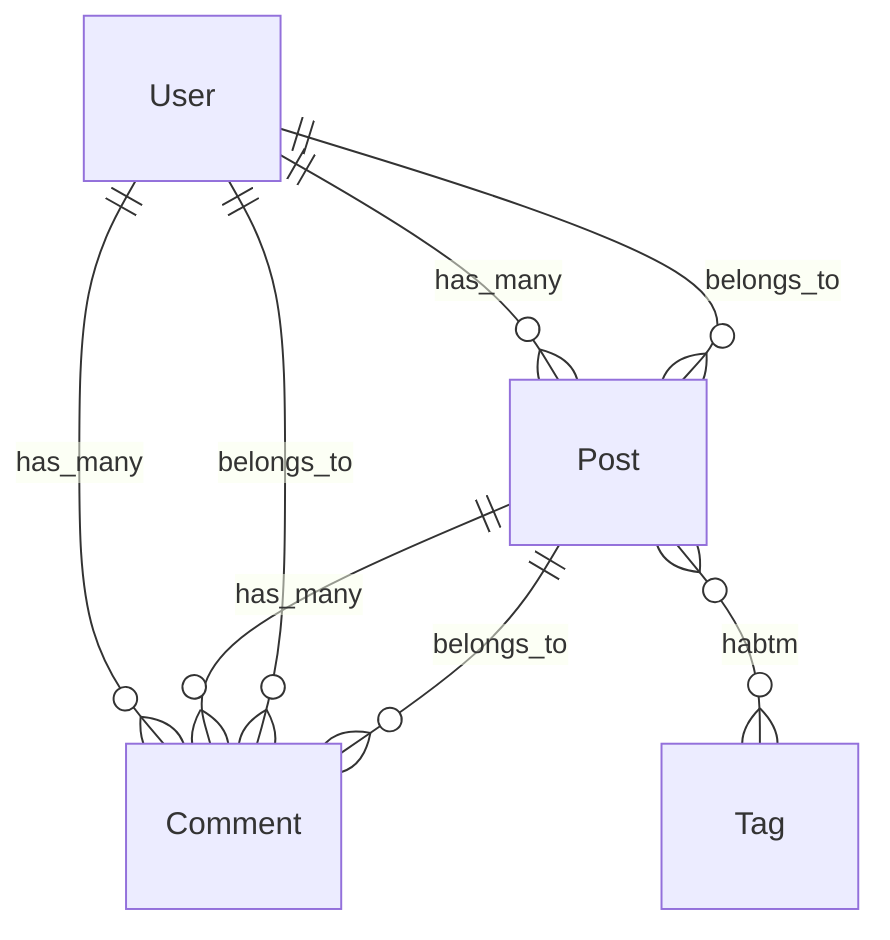

# rails-lens Webダッシュボード設計書

> **バージョン**: 0.1.0
> **作成日**: 2026-03-28
> **前提ドキュメント**:
> - [設計書 (DESIGN.md)](./DESIGN.md)
> - [要件定義書 (REQUIREMENTS.md)](./REQUIREMENTS.md)
> - **実装時期**: Phase 4完了後（HTTPトランスポート対応後）

---

## 目次

1. [技術スタック](#1-技術スタック)
2. [画面構成（全ページ定義）](#2-画面構成全ページ定義)
3. [ER図生成設計](#3-er図生成設計)
4. [内部API設計（エンドポイント一覧）](#4-内部api設計エンドポイント一覧)
5. [HTTPトランスポートとの統合](#5-httpトランスポートとの統合)
6. [ディレクトリ構造（追加分）](#6-ディレクトリ構造追加分)
7. [REQUIREMENTS.md §9 整合性チェックリスト](#7-requirementsmd-9-整合性チェックリスト)

---

## 1. 技術スタック

| コンポーネント | 選定技術 | 理由 |
|---|---|---|
| **HTTPサーバー** | FastAPI | 既存の `asyncio` ベース設計と親和性が高い。自動的にOpenAPI仕様を生成できる |
| **テンプレートエンジン** | Jinja2 | FastAPIと標準統合されており、サーバーサイドレンダリングに最適 |
| **CSSフレームワーク** | PicoCSS | 追加クラスなしでセマンティックHTMLにスタイルを適用できる軽量フレームワーク。依存ゼロ |
| **ダイアグラム描画** | Mermaid.js | ブラウザ側でMermaid記法のテキストをSVGに変換。既存の `mermaid_diagram` フィールドをそのまま利用可能 |

### 1.1 依存関係

```toml
# pyproject.toml への追加分（既存依存への追記）
[project.optional-dependencies]
web = [
    "fastapi>=0.110.0",
    "jinja2>=3.1.0",
    "python-multipart>=0.0.9",   # POST フォーム処理用
    "uvicorn>=0.29.0",           # 開発用ASGIサーバー
]
```

Web ダッシュボードはオプション機能として `pip install rails-lens[web]` で追加インストールする。

---

## 2. 画面構成（全ページ定義）

### 2.1 ダッシュボードトップ (`/`)

| 項目 | 内容 |
|---|---|
| **URL** | `GET /` |
| **目的** | rails-lens の稼働状況と Rails プロジェクトの概要を一覧表示する |
| **表示内容** | プロジェクトルートパス、rails-lens バージョン、検出モデル総数、キャッシュ状態（ヒット率・最終更新）、利用可能ツール一覧 |
| **使用MCPツール** | `list_models`（モデル総数取得）、`CacheManager.stats()`（キャッシュ統計） |

### 2.2 モデル一覧 (`/models`)

| 項目 | 内容 |
|---|---|
| **URL** | `GET /models` |
| **目的** | Rails プロジェクトの全 ActiveRecord モデルをテーブル表示する |
| **表示内容** | モデル名、テーブル名、ファイルパス（クリックで詳細ページへ遷移） |
| **使用MCPツール** | `list_models`（`ListModelsOutput.models` の `ModelSummary` 一覧） |

### 2.3 モデル詳細 (`/models/{model_name}`)

| 項目 | 内容 |
|---|---|
| **URL** | `GET /models/{model_name}` |
| **目的** | 特定モデルの完全なイントロスペクション結果を表示する |
| **表示内容** | アソシエーション、コールバック、バリデーション、スコープ、スキーマ情報、依存関係グラフ、コールバック連鎖Mermaid図 |
| **使用MCPツール** | `introspect_model`（全セクション取得）、`trace_callback_chain`（before_save/after_save等主要イベント） |

コールバック連鎖の Mermaid 図は `TraceCallbackChainOutput.mermaid_diagram` をそのまま `<div class="mermaid">` タグに埋め込む。

### 2.4 ER図 (`/er`)

| 項目 | 内容 |
|---|---|
| **URL** | `GET /er` |
| **目的** | 全モデル間のアソシエーションを Mermaid erDiagram で可視化する |
| **表示内容** | 全モデルのアソシエーション情報から自動生成した Mermaid erDiagram |
| **使用MCPツール** | `list_models`（全モデル名取得）+ `introspect_model`（各モデルの associations セクション） |

クエリパラメータ `?focus=ModelName` でフォーカスするモデルを指定可能（指定モデルおよびその関連モデルのみ表示）。

### 2.5 依存関係グラフ (`/graph/{model_name}`)

| 項目 | 内容 |
|---|---|
| **URL** | `GET /graph/{model_name}` |
| **目的** | 特定モデルを起点とした依存関係を Mermaid graph LR で表示する |
| **表示内容** | `dependency_graph` の `mermaid_diagram` を描画。深さ（depth）をスライダーで1〜5に変更可能 |
| **使用MCPツール** | `dependency_graph`（`DependencyGraphInput.format = "mermaid"`） |

### 2.6 キャッシュ管理 (`/cache`)

| 項目 | 内容 |
|---|---|
| **URL** | `GET /cache` |
| **目的** | キャッシュの状態確認と手動無効化操作を行う |
| **表示内容** | キャッシュエントリ一覧（ツール名、最終更新時刻、ファイルサイズ）、全無効化ボタン、ツール別無効化ボタン |
| **使用MCPツール** | `CacheManager.list_entries()`（内部API）、`POST /cache/invalidate`（フォーム送信） |

---

## 3. ER図生成設計

### 3.1 概要

`introspect_model` の `associations` セクションから得られるアソシエーション情報を用いて、Mermaid `erDiagram` 形式のテキストを自動生成する。

### 3.2 アソシエーション種別とMermaid表現

| Railsアソシエーション | `Association.type` | Mermaid 記法 |
|---|---|---|
| `has_many` | `has_many` | `ModelA ||--o{ ModelB : "has_many"` |
| `belongs_to` | `belongs_to` | `ModelA }o--|| ModelB : "belongs_to"` |
| `has_one` | `has_one` | `ModelA ||--|| ModelB : "has_one"` |
| `has_and_belongs_to_many` | `has_and_belongs_to_many` | `ModelA }o--o{ ModelB : "habtm"` |
| `has_many :through` | `has_many` (through あり) | `ModelA ||--o{ ModelB : "has_many through ModelC"` |

### 3.3 生成アルゴリズム

```python
def generate_er_diagram(models: list[IntrospectModelOutput]) -> str:
    """全モデルのアソシエーションから Mermaid erDiagram を生成する"""
    lines = ["erDiagram"]
    seen_edges: set[frozenset] = set()

    for model in models:
        for assoc in model.associations:
            edge_key = frozenset([model.model_name, assoc.class_name])
            if edge_key in seen_edges:
                continue  # 双方向重複を除去
            seen_edges.add(edge_key)

            relation = _assoc_type_to_mermaid(assoc.type, assoc.through)
            label = assoc.through or assoc.type
            lines.append(
                f'    {model.model_name} {relation} {assoc.class_name} : "{label}"'
            )

    return "\n".join(lines)
```

### 3.4 実装例（Mermaidコード）

以下は User / Post / Comment / Tag の4モデルを例とした出力イメージ:



### 3.5 パフォーマンス考慮

- 全モデルの `introspect_model` 呼び出しは並列ではなく逐次実行する（`rails runner` の同時起動を回避）
- `CacheManager` により2回目以降はキャッシュから取得するため、ページロードは高速
- 大規模プロジェクト（100モデル超）では `?focus=ModelName` クエリパラメータで表示対象を絞り込むことを推奨

---

## 4. 内部API設計（エンドポイント一覧）

### 4.1 エンドポイント一覧

| メソッド | パス | 処理内容 | レスポンス形式 |
|---|---|---|---|
| `GET` | `/` | ダッシュボードトップ表示 | HTML (Jinja2) |
| `GET` | `/models` | 全モデル一覧取得・表示 | HTML (Jinja2) |
| `GET` | `/models/{model_name}` | モデル詳細取得・表示 | HTML (Jinja2) |
| `GET` | `/er` | ER図ページ表示 | HTML (Jinja2) |
| `GET` | `/graph/{model_name}` | 依存関係グラフ表示 | HTML (Jinja2) |
| `GET` | `/cache` | キャッシュ管理ページ表示 | HTML (Jinja2) |
| `POST` | `/cache/invalidate` | 全キャッシュ無効化 | リダイレクト (`303 /cache`) |
| `POST` | `/cache/invalidate/{tool_name}` | 特定ツールのキャッシュ無効化 | リダイレクト (`303 /cache`) |

### 4.2 各エンドポイント詳細

#### `GET /`

```python
@app.get("/", response_class=HTMLResponse)
async def dashboard_top(request: Request):
    models_output = await _call_list_models()
    cache_stats = _cache.get_stats()
    return templates.TemplateResponse("index.html", {
        "request": request,
        "model_count": len(models_output.models),
        "cache_stats": cache_stats,
        "project_root": _config.rails_root,
        "version": __version__,
    })
```

#### `GET /models`

```python
@app.get("/models", response_class=HTMLResponse)
async def models_list(request: Request):
    models_output = await _call_list_models()
    return templates.TemplateResponse("models.html", {
        "request": request,
        "models": models_output.models,
    })
```

#### `GET /models/{model_name}`

```python
@app.get("/models/{model_name}", response_class=HTMLResponse)
async def model_detail(request: Request, model_name: str):
    introspect = await _call_introspect_model(model_name, sections=None)
    callback_chains = {}
    for event in ["before_save", "after_save", "before_create", "after_create"]:
        try:
            callback_chains[event] = await _call_trace_callback_chain(model_name, event)
        except RailsLensError:
            callback_chains[event] = None
    return templates.TemplateResponse("model_detail.html", {
        "request": request,
        "model": introspect,
        "callback_chains": callback_chains,
    })
```

#### `GET /er`

```python
@app.get("/er", response_class=HTMLResponse)
async def er_diagram(request: Request, focus: str | None = None):
    models_output = await _call_list_models()
    all_models = [
        await _call_introspect_model(m.name, sections=["associations"])
        for m in models_output.models
    ]
    if focus:
        all_models = _filter_by_focus(all_models, focus)
    mermaid_code = generate_er_diagram(all_models)
    return templates.TemplateResponse("er.html", {
        "request": request,
        "mermaid_code": mermaid_code,
        "focus": focus,
    })
```

#### `GET /graph/{model_name}`

```python
@app.get("/graph/{model_name}", response_class=HTMLResponse)
async def dependency_graph(request: Request, model_name: str, depth: int = 2):
    graph = await _call_dependency_graph(model_name, depth=depth, format="mermaid")
    return templates.TemplateResponse("graph.html", {
        "request": request,
        "model_name": model_name,
        "depth": depth,
        "mermaid_code": graph.mermaid_diagram,
    })
```

#### `GET /cache`

```python
@app.get("/cache", response_class=HTMLResponse)
async def cache_management(request: Request):
    entries = _cache.list_entries()
    return templates.TemplateResponse("cache.html", {
        "request": request,
        "entries": entries,
    })
```

#### `POST /cache/invalidate`

```python
@app.post("/cache/invalidate")
async def invalidate_all_cache():
    _cache.invalidate_all()
    return RedirectResponse(url="/cache", status_code=303)
```

#### `POST /cache/invalidate/{tool_name}`

```python
@app.post("/cache/invalidate/{tool_name}")
async def invalidate_tool_cache(tool_name: str):
    _cache.invalidate(tool_name)
    return RedirectResponse(url="/cache", status_code=303)
```

### 4.3 MCPツール内部再利用方式

FastAPI ルートハンドラから MCP ツール関数を **直接呼び出す** 方式を採用する。MCPプロトコルを経由しないため、オーバーヘッドなしにツールのビジネスロジックを再利用できる。

```python
# tools/introspect_model.py の関数を直接インポートして呼び出す
from rails_lens.tools.introspect_model import introspect_model_impl
from rails_lens.tools.list_models import list_models_impl

# web/app.py 内から直接呼び出し
async def _call_list_models() -> ListModelsOutput:
    return await list_models_impl(_bridge, _cache, _config)

async def _call_introspect_model(
    model_name: str,
    sections: list[str] | None,
) -> IntrospectModelOutput:
    return await introspect_model_impl(
        IntrospectModelInput(model_name=model_name, sections=sections),
        _bridge, _cache,
    )
```

各ツールモジュールはMCP登録関数（デコレータ付き）と実装関数（`_impl` サフィックス）に分離し、`_impl` 関数を Web 層からも呼び出せるようにする。

---

## 5. HTTPトランスポートとの統合

### 5.1 背景

現在の `server.py` は `mcp.run(transport="stdio")` でstdioモードで起動する。Phase 4では `transport="http"` へ移行し、チーム共有サーバーとして運用可能にする（REQUIREMENTS.md §9.1）。Webダッシュボードはこの移行と同時に実装する。

### 5.2 server.py の変更点

```python
# 現在（Phase 1〜3）
def main():
    mcp.run(transport="stdio")

# Phase 4以降
def main():
    import uvicorn
    from rails_lens.web.app import create_app

    # MCP over HTTP/SSE + Web ダッシュボードを同一プロセスで起動
    web_app = create_app(bridge=_bridge, cache=_cache, config=_config)
    mcp.run(transport="http", app=web_app, host="0.0.0.0", port=8000)
```

### 5.3 FastAPIアプリとMCPサーバーの共存方式

```
┌─────────────────────────────────────────────────────────┐
│  uvicorn (ASGI)  port 8000                              │
│                                                         │
│  ┌────────────────────┐  ┌────────────────────────────┐ │
│  │  FastMCP (HTTP/SSE)│  │  FastAPI (Web ダッシュボード)│ │
│  │  /mcp/*            │  │  /         /models         │ │
│  │  /sse              │  │  /er       /graph/*        │ │
│  └────────────────────┘  │  /cache                    │ │
│                           └────────────────────────────┘ │
│                                                         │
│  共有リソース: RailsBridge, CacheManager, GrepSearch     │
└─────────────────────────────────────────────────────────┘
```

FastMCP の `http` トランスポートは内部的に Starlette/ASGI アプリを生成する。FastAPI アプリを `app.mount("/", web_app)` でサブマウントすることで、同一ポートで MCP エンドポイントと Web UI を提供する。

### 5.4 設定ファイルへの追加項目

```toml
# .rails-lens.toml への追加（Phase 4）
[web]
enabled = true
host = "127.0.0.1"
port = 8000
# ダッシュボードへのアクセス制限（将来拡張）
# auth_token = "..."
```

---

## 6. ディレクトリ構造（追加分）

Webダッシュボード実装時に追加するファイル・ディレクトリ構造:

```
src/rails_lens/
├── web/
│   ├── __init__.py
│   ├── app.py                  # FastAPI アプリケーションファクトリ (create_app)
│   ├── er_builder.py           # ER図生成ロジック (generate_er_diagram)
│   ├── routes/
│   │   ├── __init__.py
│   │   ├── dashboard.py        # GET /
│   │   ├── models.py           # GET /models, GET /models/{model_name}
│   │   ├── er.py               # GET /er
│   │   ├── graph.py            # GET /graph/{model_name}
│   │   └── cache.py            # GET /cache, POST /cache/invalidate[/{tool_name}]
│   ├── templates/
│   │   ├── base.html           # 共通レイアウト（PicoCSS + Mermaid.js CDN）
│   │   ├── index.html          # ダッシュボードトップ
│   │   ├── models.html         # モデル一覧
│   │   ├── model_detail.html   # モデル詳細
│   │   ├── er.html             # ER図
│   │   ├── graph.html          # 依存関係グラフ
│   │   └── cache.html          # キャッシュ管理
│   └── static/
│       └── rails-lens.css      # PicoCSS 上書き用カスタムスタイル（最小限）
```

### 6.1 ファイル責務

| ファイル | 責務 |
|---|---|
| `web/app.py` | `create_app(bridge, cache, config)` ファクトリ関数。FastAPIインスタンス生成、ルーター登録、テンプレート設定 |
| `web/er_builder.py` | `generate_er_diagram(models)` 関数。アソシエーション情報 → Mermaid erDiagram 変換 |
| `web/routes/dashboard.py` | `GET /` ハンドラ |
| `web/routes/models.py` | `GET /models`, `GET /models/{model_name}` ハンドラ |
| `web/routes/er.py` | `GET /er` ハンドラ |
| `web/routes/graph.py` | `GET /graph/{model_name}` ハンドラ |
| `web/routes/cache.py` | `GET /cache`, `POST /cache/invalidate`, `POST /cache/invalidate/{tool_name}` ハンドラ |
| `web/templates/base.html` | PicoCSS CDN、Mermaid.js CDN、ナビゲーションバーを含む共通テンプレート |
| `web/static/rails-lens.css` | Mermaidダイアグラムのサイズ調整等、最小限のカスタムスタイル |

---

## 7. REQUIREMENTS.md §9 整合性チェックリスト

REQUIREMENTS.md §9「将来の拡張計画」との整合性を確認する。

### §9.1 短期（Phase 4完了後）

| 要件 | 本設計での対応 | 状態 |
|---|---|---|
| **HTTPトランスポート対応**（SSEトランスポートの追加、チーム共有MCPサーバー） | §5「HTTPトランスポートとの統合」にて設計。`mcp.run(transport="http")` への切り替え手順と FastAPI 共存方式を定義 | ✅ 対応済み |
| **Rails 8対応**（Solid Queue, Solid Cache等） | 本設計書のスコープ外（ブリッジ層・Rubyスクリプト側の対応）。Webダッシュボードは Rails バージョンに依存しない | — スコープ外 |
| **パフォーマンス最適化**（500+モデルでのベンチマーク） | §3.5「パフォーマンス考慮」にて逐次実行方針とキャッシュ活用を明記。`?focus=ModelName` による表示絞り込みを提供 | ✅ 考慮済み |

### §9.2 中期

| 要件 | 本設計での対応 | 状態 |
|---|---|---|
| **差分更新**（watchdog によるキャッシュ自動更新） | 本設計書のスコープ外。キャッシュ管理ページ（`/cache`）から手動無効化で代替 | — 将来拡張 |
| **ER図生成**（モデル間の関連から Mermaid erDiagram を自動生成） | §2.4・§3「ER図生成設計」にて詳細設計。`/er` ページとして実装 | ✅ 本設計で実装 |
| **マイグレーション影響分析** | 本設計書のスコープ外（Phase 5以降の新規ツール追加） | — 将来拡張 |
| **Gemイントロスペクション** | 本設計書のスコープ外（ブリッジ層・Rubyスクリプト側の対応） | — 将来拡張 |

### §9.3 長期

| 要件 | 本設計での対応 | 状態 |
|---|---|---|
| **他フレームワーク対応**（Django, Laravel等） | 本設計書のスコープ外。Web層はフレームワーク非依存の設計だが、ブリッジ層の抽象化が前提 | — 将来拡張 |
| **MCP Resource対応** | 本設計書のスコープ外。Webダッシュボードとは独立した機能 | — 将来拡張 |

### チェックサマリー

- **本設計で対応するもの**: HTTPトランスポート統合（§9.1）、ER図生成（§9.2）
- **本設計で考慮するもの**: パフォーマンス最適化（§9.1）
- **スコープ外（将来拡張）**: Rails 8対応、差分更新、マイグレーション影響分析、Gemイントロスペクション、他フレームワーク対応、MCP Resource対応

---

---

## 8. プロジェクト健全性ページ（circular_dependencies / dead_code 連携）

### 8.1 ページ概要

| 項目 | 内容 |
|---|---|
| **URL** | `GET /health` |
| **目的** | プロジェクト全体の構造的健全性を可視化する。循環依存の有無とデッドコードの蓄積状況を一覧表示する |
| **使用MCPツール** | `rails_lens_find_circular_dependencies`（循環依存検出）、`rails_lens_find_dead_code`（デッドコード検出） |

### 8.2 表示内容

#### 循環依存セクション

- **ステータスバッジ**: 循環依存が検出されない場合は緑（✅ 循環依存なし）、1件以上検出された場合は赤（🔴 N件検出）を表示
- **Mermaid graph 可視化**: `CircularDependenciesOutput.mermaid_diagram` を `<div class="mermaid">` タグに直接埋め込み、循環パスを有向グラフで表示する
- **循環サマリーテーブル**: 各 `CyclePath` のモデル一覧（`models` フィールド）、循環種別（`cycle_type`）、深刻度（`severity`）を行単位で表示

#### デッドコードセクション

- **件数サマリー**: 検出件数（`total_dead_code_found`）と分析対象メソッド数（`total_methods_analyzed`）をカード表示
- **信頼度分布**: `confidence = "high"` / `"medium"` ごとの件数をバッジ付きで表示
- **デッドコード一覧テーブル**: `DeadCodeItem.type`（method/callback/scope）、ファイル名・行番号、`reason`、`dynamic_call_risk` フラグを列として表示

### 8.3 内部APIエンドポイント追加

| メソッド | パス | 処理内容 |
|---|---|---|
| `GET` | `/health` | 循環依存ステータス + デッドコードサマリー表示 |

```python
@app.get("/health", response_class=HTMLResponse)
async def project_health(request: Request):
    circular = await _call_circular_dependencies(format="mermaid")
    dead_code = await _call_dead_code(scope="models", confidence="high")
    return templates.TemplateResponse("health.html", {
        "request": request,
        "circular": circular,
        "dead_code": dead_code,
        "has_cycles": circular.total_cycles > 0,
    })
```

---

## 9. リクエストフローページ（data_flow 連携）

### 9.1 ページ概要

| 項目 | 内容 |
|---|---|
| **URL** | `GET /flow/{controller}/{action}` |
| **目的** | 特定のコントローラ/アクションにおけるHTTPリクエストからDB保存までの全レイヤーのデータフローを可視化する |
| **使用MCPツール** | `rails_lens_trace_data_flow` |

### 9.2 表示内容

- **エンドポイント選択UI**: `/flow` ページにコントローラ名・アクション名の入力フォームを配置し、`GET /flow/{controller}/{action}` へ遷移する
- **Mermaid sequenceDiagram 表示**: `DataFlowOutput.mermaid_diagram` をそのまま `<div class="mermaid">` タグに埋め込む
- **レイヤー別詳細テーブル**: `DataFlowOutput.flow_steps` の各 `DataFlowStep` を順序・レイヤー・説明・ファイル位置の列でテーブル表示する

### 9.3 Mermaid出力要件

`rails_lens_trace_data_flow` が返す `mermaid_diagram` は **sequenceDiagram 形式** に準拠すること:

```
sequenceDiagram
    participant Client
    participant Router
    participant Controller as {ControllerName}
    participant Params as StrongParameters
    participant Model as {ModelName} Model
    participant DB

    Client->>Router: {HTTP動詞} {パス}
    Router->>Controller: #{アクション名}
    Controller->>Params: params.require(:{param_key}).permit(...)
    Params->>Model: {ModelName}.new(permitted_params) / .update(...)
    Model->>Model: {コールバック名} ({イベント名})
    Model->>DB: {SQL操作}
```

- **参加者 (participant)** はレイヤー名を固定値として使用する: `Client`, `Router`, `Controller`, `Params`（StrongParameters）, `Model`, `DB`
- ネストした `accepts_nested_attributes_for` が存在する場合は `participant NestedModel as {関連モデル名} Model` を追加する

### 9.4 内部APIエンドポイント追加

| メソッド | パス | 処理内容 |
|---|---|---|
| `GET` | `/flow` | エンドポイント選択フォーム表示 |
| `GET` | `/flow/{controller}/{action}` | 指定コントローラ/アクションのデータフロー表示 |

```python
@app.get("/flow", response_class=HTMLResponse)
async def flow_selector(request: Request):
    return templates.TemplateResponse("flow_selector.html", {"request": request})

@app.get("/flow/{controller}/{action}", response_class=HTMLResponse)
async def request_flow(request: Request, controller: str, action: str):
    flow = await _call_data_flow(controller_action=f"{controller}#{action}")
    return templates.TemplateResponse("flow.html", {
        "request": request,
        "controller": controller,
        "action": action,
        "flow": flow,
        "mermaid_code": flow.mermaid_diagram,
    })
```

---

## 10. 変更影響分析ページ（impact_analysis 連携）

### 10.1 ページ概要

| 項目 | 内容 |
|---|---|
| **URL** | `GET /impact/{model_name}` |
| **目的** | 特定モデルのカラムまたはメソッドを変更した場合の影響範囲をカテゴリ別に可視化する |
| **使用MCPツール** | `rails_lens_analyze_impact` |

### 10.2 表示内容

- **モデル名 + カラム/メソッド入力フォーム**: `/impact/{model_name}` ページに `target`（カラム名またはメソッド名）と `change_type`（remove/rename/type_change/modify）のフォームを配置し、`GET /impact/{model_name}?target=xxx&change_type=yyy` で結果を取得する
- **影響範囲一覧（カテゴリ別）**: `ImpactAnalysisOutput.direct_impacts` を `category` フィールドでグループ化し、カテゴリタブ（validation / callback / view / mailer / scope / serializer / job / controller）ごとに表示する
- **重大度バッジ**: 各 `ImpactItem.severity` に応じて 🔴（breaking）/ 🟡（warning）/ ⚪（info）のバッジを付与する
- **修正が必要なファイル一覧**: `affected_files` をチェックリスト形式で表示する

### 10.3 Mermaid出力要件

`rails_lens_analyze_impact` は `ImpactAnalysisOutput` に `mermaid_diagram` フィールドを追加し、**graph LR 形式**で影響グラフを返すこと:

```
graph LR
    Target["{model_name}.{target}"]
    Target --> Validation["validation\n{ファイル名}:{行番号}"]
    Target --> Callback["callback\n{ファイル名}:{行番号}"]
    Target --> View["view\n{ファイル名}:{行番号}"]
    Target --> Mailer["mailer\n{ファイル名}:{行番号}"]
    style Target fill:#ff6666
    style Validation fill:#ffaaaa
```

- 影響ノードは `severity` に応じて色付けする: `breaking` → `fill:#ffaaaa`、`warning` → `fill:#ffffaa`、`info` → `fill:#aaffaa`

### 10.4 内部APIエンドポイント追加

| メソッド | パス | 処理内容 |
|---|---|---|
| `GET` | `/impact/{model_name}` | モデル影響分析フォーム + 結果表示 |

```python
@app.get("/impact/{model_name}", response_class=HTMLResponse)
async def impact_analysis(
    request: Request,
    model_name: str,
    target: str | None = None,
    change_type: str = "modify",
):
    result = None
    if target:
        result = await _call_impact_analysis(model_name, target, change_type)
    return templates.TemplateResponse("impact.html", {
        "request": request,
        "model_name": model_name,
        "target": target,
        "change_type": change_type,
        "result": result,
    })
```

---

## 11. リファクタリング支援ページ（extract_concern / dead_code 連携）

### 11.1 ページ概要

| 項目 | 内容 |
|---|---|
| **URL** | `GET /refactor/{model_name}` |
| **目的** | Fat Modelのリファクタリングを支援する。Concern分割候補の可視化とデッドコードの一覧表示を組み合わせて提供する |
| **使用MCPツール** | `rails_lens_suggest_extract_concern`（分割案）、`rails_lens_find_dead_code`（未使用コード） |

### 11.2 表示内容

#### Concern分割候補セクション

- **凝集度クラスタ図（Mermaid graph）**: `ExtractConcernOutput.candidates` の各 `ConcernCandidate` をノードとし、`methods` と `shared_columns` をエッジで表した **graph TD 形式**のMermaid図を表示する
- **クラスタカード一覧**: 各 `ConcernCandidate` について `suggested_name`（提案Concern名）、`methods`（対象メソッド一覧）、`shared_columns`（共通カラム）、`cohesion_score`（凝集度スコア）、`rationale`（根拠説明）をカード形式で表示する
- **既存Concern重複警告**: `existing_concern_overlap` が存在する場合は黄色の警告バナーで表示する

#### デッドコード一覧セクション

- **対象モデルのデッドコード**: `rails_lens_find_dead_code(model_name={model_name})` の結果をテーブル表示する
- **信頼度バッジ**: `DeadCodeItem.confidence` に応じて 🔴 high / 🟡 medium のバッジを付与する

### 11.3 内部APIエンドポイント追加

| メソッド | パス | 処理内容 |
|---|---|---|
| `GET` | `/refactor/{model_name}` | Concern分割案 + デッドコード表示 |

```python
@app.get("/refactor/{model_name}", response_class=HTMLResponse)
async def refactor_support(request: Request, model_name: str):
    concern_candidates = await _call_extract_concern(model_name)
    dead_code = await _call_dead_code(scope="models", model_name=model_name)
    return templates.TemplateResponse("refactor.html", {
        "request": request,
        "model_name": model_name,
        "candidates": concern_candidates,
        "dead_code": dead_code,
    })
```

---

## 12. Gem情報ページ（gem_introspect 連携）

### 12.1 ページ概要

| 項目 | 内容 |
|---|---|
| **URL** | `GET /gems/{gem_name}` |
| **目的** | 特定Gemがモデルに追加する暗黙メソッド・コールバック・ルートを可視化し、アプリ固有の挙動とGem由来の挙動を区別する |
| **使用MCPツール** | `rails_lens_gem_introspect` |

### 12.2 表示内容

- **Gem一覧ページ** (`/gems`): `rails_lens_gem_introspect()` を引数なしで呼び出し、影響の大きいGemの一覧を表示する。各GemはGem名リンク → `/gems/{gem_name}` に遷移する
- **Gem由来の暗黙メソッド一覧**: `GemImpact.added_methods` を `type`（instance_method / class_method / scope）ごとにグループ化してテーブル表示する
- **Gem由来のコールバック一覧**: `GemImpact.added_callbacks` を `kind`（before_save 等）と `event` でテーブル表示する
- **Gem由来のルート一覧**: `GemImpact.added_routes` を `verb` / `path` / `controller#action` でテーブル表示する
- **アプリ固有 vs Gem由来の区別表示**: `affected_models` の各モデルについて、モデル詳細ページ（`/models/{model_name}`）へのリンクとともに Gem由来コンポーネントのバッジを付与する
- **オーバーライドされた既存メソッドの警告**: `overridden_methods` が存在する場合は赤色の警告バナーで表示する

### 12.3 内部APIエンドポイント追加

| メソッド | パス | 処理内容 |
|---|---|---|
| `GET` | `/gems` | 影響の大きいGem一覧表示 |
| `GET` | `/gems/{gem_name}` | 特定Gemの詳細（メソッド/コールバック/ルート）表示 |

```python
@app.get("/gems", response_class=HTMLResponse)
async def gems_list(request: Request):
    result = await _call_gem_introspect()
    return templates.TemplateResponse("gems.html", {
        "request": request,
        "gems": result.gems,
    })

@app.get("/gems/{gem_name}", response_class=HTMLResponse)
async def gem_detail(request: Request, gem_name: str):
    result = await _call_gem_introspect(gem_name=gem_name)
    gem = result.gems[0] if result.gems else None
    return templates.TemplateResponse("gem_detail.html", {
        "request": request,
        "gem_name": gem_name,
        "gem": gem,
    })
```

---

## 13. Mermaid出力要件（Phase 5〜8実装指針）

### 13.1 概要

Phase 5〜8で実装する各ツール（`rails_lens_impact_analysis`、`rails_lens_data_flow`、`rails_lens_circular_dependencies`、`rails_lens_suggest_extract_concern`）は、Webダッシュボードへの統合を前提として `mermaid_diagram` フィールドを出力モデルに含めること。

### 13.2 フォーマット要件一覧

| ツール | Mermaidフォーマット | 用途 |
|---|---|---|
| `rails_lens_trace_data_flow` | `sequenceDiagram` | リクエストフローの時系列表現 |
| `rails_lens_analyze_impact` | `graph LR` | 変更影響の有向グラフ（左→右） |
| `rails_lens_find_circular_dependencies` | `graph TD` | 循環依存の有向グラフ（上→下） |
| `rails_lens_suggest_extract_concern` | `graph TD` | Concern分割クラスタ図 |
| 既存: `trace_callback_chain` | `sequenceDiagram` | コールバック実行順序（Phase 1〜4で実装済み） |
| 既存: `dependency_graph` | `graph LR` | モデル依存グラフ（Phase 1〜4で実装済み） |

### 13.3 共通インターフェース

Webダッシュボードは各ツール出力モデルの `mermaid_diagram: str` フィールドを **そのまま** `<div class="mermaid">` タグに埋め込んでレンダリングする。ダッシュボード側では変換処理を行わない。

**ツール側の実装責任**:

```python
# 各OutputモデルにはPydanticフィールドとして定義すること
class XxxOutput(BaseModel):
    ...
    mermaid_diagram: str = ""   # 空文字列 = 図なし（正常ケース）
```

- `mermaid_diagram` フィールドは常に存在すること（`None` は不可、空文字列で代替する）
- 図の生成に失敗した場合は空文字列を返し、例外を送出しないこと
- 出力するMermaid記法は [Mermaid.js v10系](https://mermaid.js.org/) の構文に準拠すること

### 13.4 sequenceDiagram 共通規則

- **参加者ラベル**: スペースを含む場合は `participant X as "Label With Space"` 形式を使用
- **メッセージ**: `->>`（実線矢印）= 同期呼び出し、`-->>`（破線矢印）= 非同期/レスポンス
- **ノート**: 補足が必要な場合は `Note over X: テキスト` 形式を使用

### 13.5 graph LR / graph TD 共通規則

- **ノードID**: `snake_case` を使用し、`[ラベル]`（矩形）、`(ラベル)`（角丸矩形）、`{ラベル}`（菱形）でノード種別を表現
- **エッジラベル**: `A -->|"ラベル"| B` 形式（ラベルに記号を含む場合はクォート）
- **スタイリング**: `style NodeId fill:#色コード` で重大度や種別を色で表現する（赤系 = critical/breaking、黄系 = warning、緑系 = ok）

---

*設計書終端*
