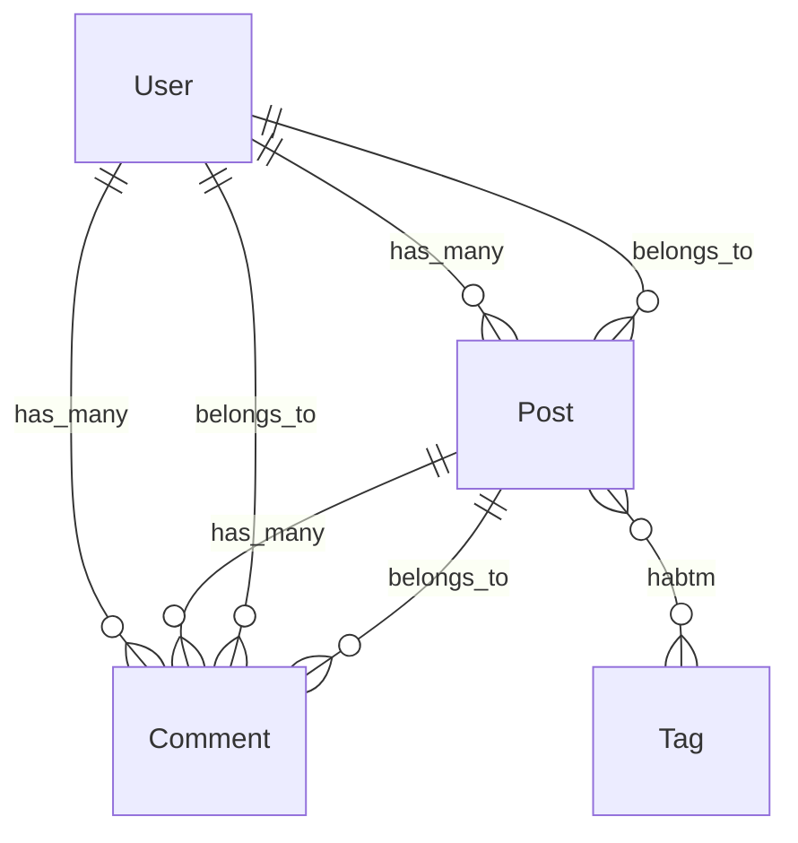

# rails-lens Webダッシュボード設計書

> **バージョン**: 0.1.0
> **作成日**: 2026-03-28
> **前提ドキュメント**:
> - [設計書 (DESIGN.md)](./DESIGN.md)
> - [要件定義書 (REQUIREMENTS.md)](./REQUIREMENTS.md)
> - **実装時期**: Phase 4完了後（HTTPトランスポート対応後）

---

## 目次

1. [技術スタック](#1-技術スタック)
2. [画面構成（全ページ定義）](#2-画面構成全ページ定義)
3. [ER図生成設計](#3-er図生成設計)
4. [内部API設計（エンドポイント一覧）](#4-内部api設計エンドポイント一覧)
5. [HTTPトランスポートとの統合](#5-httpトランスポートとの統合)
6. [ディレクトリ構造（追加分）](#6-ディレクトリ構造追加分)
7. [REQUIREMENTS.md §9 整合性チェックリスト](#7-requirementsmd-9-整合性チェックリスト)

---

## 1. 技術スタック

| コンポーネント | 選定技術 | 理由 |
|---|---|---|
| **HTTPサーバー** | FastAPI | 既存の `asyncio` ベース設計と親和性が高い。自動的にOpenAPI仕様を生成できる |
| **テンプレートエンジン** | Jinja2 | FastAPIと標準統合されており、サーバーサイドレンダリングに最適 |
| **CSSフレームワーク** | PicoCSS | 追加クラスなしでセマンティックHTMLにスタイルを適用できる軽量フレームワーク。依存ゼロ |
| **ダイアグラム描画** | Mermaid.js | ブラウザ側でMermaid記法のテキストをSVGに変換。既存の `mermaid_diagram` フィールドをそのまま利用可能 |

### 1.1 依存関係

```toml
# pyproject.toml への追加分（既存依存への追記）
[project.optional-dependencies]
web = [
    "fastapi>=0.110.0",
    "jinja2>=3.1.0",
    "python-multipart>=0.0.9",   # POST フォーム処理用
    "uvicorn>=0.29.0",           # 開発用ASGIサーバー
]
```

Web ダッシュボードはオプション機能として `pip install rails-lens[web]` で追加インストールする。

---

## 2. 画面構成（全ページ定義）

### 2.1 ダッシュボードトップ (`/`)

| 項目 | 内容 |
|---|---|
| **URL** | `GET /` |
| **目的** | rails-lens の稼働状況と Rails プロジェクトの概要を一覧表示する |
| **表示内容** | プロジェクトルートパス、rails-lens バージョン、検出モデル総数、キャッシュ状態（ヒット率・最終更新）、利用可能ツール一覧 |
| **使用MCPツール** | `list_models`（モデル総数取得）、`CacheManager.stats()`（キャッシュ統計） |

### 2.2 モデル一覧 (`/models`)

| 項目 | 内容 |
|---|---|
| **URL** | `GET /models` |
| **目的** | Rails プロジェクトの全 ActiveRecord モデルをテーブル表示する |
| **表示内容** | モデル名、テーブル名、ファイルパス（クリックで詳細ページへ遷移） |
| **使用MCPツール** | `list_models`（`ListModelsOutput.models` の `ModelSummary` 一覧） |

### 2.3 モデル詳細 (`/models/{model_name}`)

| 項目 | 内容 |
|---|---|
| **URL** | `GET /models/{model_name}` |
| **目的** | 特定モデルの完全なイントロスペクション結果を表示する |
| **表示内容** | アソシエーション、コールバック、バリデーション、スコープ、スキーマ情報、依存関係グラフ、コールバック連鎖Mermaid図 |
| **使用MCPツール** | `introspect_model`（全セクション取得）、`trace_callback_chain`（before_save/after_save等主要イベント） |

コールバック連鎖の Mermaid 図は `TraceCallbackChainOutput.mermaid_diagram` をそのまま `<div class="mermaid">` タグに埋め込む。

### 2.4 ER図 (`/er`)

| 項目 | 内容 |
|---|---|
| **URL** | `GET /er` |
| **目的** | 全モデル間のアソシエーションを Mermaid erDiagram で可視化する |
| **表示内容** | 全モデルのアソシエーション情報から自動生成した Mermaid erDiagram |
| **使用MCPツール** | `list_models`（全モデル名取得）+ `introspect_model`（各モデルの associations セクション） |

クエリパラメータ `?focus=ModelName` でフォーカスするモデルを指定可能（指定モデルおよびその関連モデルのみ表示）。

### 2.5 依存関係グラフ (`/graph/{model_name}`)

| 項目 | 内容 |
|---|---|
| **URL** | `GET /graph/{model_name}` |
| **目的** | 特定モデルを起点とした依存関係を Mermaid graph LR で表示する |
| **表示内容** | `dependency_graph` の `mermaid_diagram` を描画。深さ（depth）をスライダーで1〜5に変更可能 |
| **使用MCPツール** | `dependency_graph`（`DependencyGraphInput.format = "mermaid"`） |

### 2.6 キャッシュ管理 (`/cache`)

| 項目 | 内容 |
|---|---|
| **URL** | `GET /cache` |
| **目的** | キャッシュの状態確認と手動無効化操作を行う |
| **表示内容** | キャッシュエントリ一覧（ツール名、最終更新時刻、ファイルサイズ）、全無効化ボタン、ツール別無効化ボタン |
| **使用MCPツール** | `CacheManager.list_entries()`（内部API）、`POST /cache/invalidate`（フォーム送信） |

---

## 3. ER図生成設計

### 3.1 概要

`introspect_model` の `associations` セクションから得られるアソシエーション情報を用いて、Mermaid `erDiagram` 形式のテキストを自動生成する。

### 3.2 アソシエーション種別とMermaid表現

| Railsアソシエーション | `Association.type` | Mermaid 記法 |
|---|---|---|
| `has_many` | `has_many` | `ModelA ||--o{ ModelB : "has_many"` |
| `belongs_to` | `belongs_to` | `ModelA }o--|| ModelB : "belongs_to"` |
| `has_one` | `has_one` | `ModelA ||--|| ModelB : "has_one"` |
| `has_and_belongs_to_many` | `has_and_belongs_to_many` | `ModelA }o--o{ ModelB : "habtm"` |
| `has_many :through` | `has_many` (through あり) | `ModelA ||--o{ ModelB : "has_many through ModelC"` |

### 3.3 生成アルゴリズム

```python
def generate_er_diagram(models: list[IntrospectModelOutput]) -> str:
    """全モデルのアソシエーションから Mermaid erDiagram を生成する"""
    lines = ["erDiagram"]
    seen_edges: set[frozenset] = set()

    for model in models:
        for assoc in model.associations:
            edge_key = frozenset([model.model_name, assoc.class_name])
            if edge_key in seen_edges:
                continue  # 双方向重複を除去
            seen_edges.add(edge_key)

            relation = _assoc_type_to_mermaid(assoc.type, assoc.through)
            label = assoc.through or assoc.type
            lines.append(
                f'    {model.model_name} {relation} {assoc.class_name} : "{label}"'
            )

    return "\n".join(lines)
```

### 3.4 実装例（Mermaidコード）

以下は User / Post / Comment / Tag の4モデルを例とした出力イメージ:



### 3.5 パフォーマンス考慮

- 全モデルの `introspect_model` 呼び出しは並列ではなく逐次実行する（`rails runner` の同時起動を回避）
- `CacheManager` により2回目以降はキャッシュから取得するため、ページロードは高速
- 大規模プロジェクト（100モデル超）では `?focus=ModelName` クエリパラメータで表示対象を絞り込むことを推奨

---

## 4. 内部API設計（エンドポイント一覧）

### 4.1 エンドポイント一覧

| メソッド | パス | 処理内容 | レスポンス形式 |
|---|---|---|---|
| `GET` | `/` | ダッシュボードトップ表示 | HTML (Jinja2) |
| `GET` | `/models` | 全モデル一覧取得・表示 | HTML (Jinja2) |
| `GET` | `/models/{model_name}` | モデル詳細取得・表示 | HTML (Jinja2) |
| `GET` | `/er` | ER図ページ表示 | HTML (Jinja2) |
| `GET` | `/graph/{model_name}` | 依存関係グラフ表示 | HTML (Jinja2) |
| `GET` | `/cache` | キャッシュ管理ページ表示 | HTML (Jinja2) |
| `POST` | `/cache/invalidate` | 全キャッシュ無効化 | リダイレクト (`303 /cache`) |
| `POST` | `/cache/invalidate/{tool_name}` | 特定ツールのキャッシュ無効化 | リダイレクト (`303 /cache`) |

### 4.2 各エンドポイント詳細

#### `GET /`

```python
@app.get("/", response_class=HTMLResponse)
async def dashboard_top(request: Request):
    models_output = await _call_list_models()
    cache_stats = _cache.get_stats()
    return templates.TemplateResponse("index.html", {
        "request": request,
        "model_count": len(models_output.models),
        "cache_stats": cache_stats,
        "project_root": _config.rails_root,
        "version": __version__,
    })
```

#### `GET /models`

```python
@app.get("/models", response_class=HTMLResponse)
async def models_list(request: Request):
    models_output = await _call_list_models()
    return templates.TemplateResponse("models.html", {
        "request": request,
        "models": models_output.models,
    })
```

#### `GET /models/{model_name}`

```python
@app.get("/models/{model_name}", response_class=HTMLResponse)
async def model_detail(request: Request, model_name: str):
    introspect = await _call_introspect_model(model_name, sections=None)
    callback_chains = {}
    for event in ["before_save", "after_save", "before_create", "after_create"]:
        try:
            callback_chains[event] = await _call_trace_callback_chain(model_name, event)
        except RailsLensError:
            callback_chains[event] = None
    return templates.TemplateResponse("model_detail.html", {
        "request": request,
        "model": introspect,
        "callback_chains": callback_chains,
    })
```

#### `GET /er`

```python
@app.get("/er", response_class=HTMLResponse)
async def er_diagram(request: Request, focus: str | None = None):
    models_output = await _call_list_models()
    all_models = [
        await _call_introspect_model(m.name, sections=["associations"])
        for m in models_output.models
    ]
    if focus:
        all_models = _filter_by_focus(all_models, focus)
    mermaid_code = generate_er_diagram(all_models)
    return templates.TemplateResponse("er.html", {
        "request": request,
        "mermaid_code": mermaid_code,
        "focus": focus,
    })
```

#### `GET /graph/{model_name}`

```python
@app.get("/graph/{model_name}", response_class=HTMLResponse)
async def dependency_graph(request: Request, model_name: str, depth: int = 2):
    graph = await _call_dependency_graph(model_name, depth=depth, format="mermaid")
    return templates.TemplateResponse("graph.html", {
        "request": request,
        "model_name": model_name,
        "depth": depth,
        "mermaid_code": graph.mermaid_diagram,
    })
```

#### `GET /cache`

```python
@app.get("/cache", response_class=HTMLResponse)
async def cache_management(request: Request):
    entries = _cache.list_entries()
    return templates.TemplateResponse("cache.html", {
        "request": request,
        "entries": entries,
    })
```

#### `POST /cache/invalidate`

```python
@app.post("/cache/invalidate")
async def invalidate_all_cache():
    _cache.invalidate_all()
    return RedirectResponse(url="/cache", status_code=303)
```

#### `POST /cache/invalidate/{tool_name}`

```python
@app.post("/cache/invalidate/{tool_name}")
async def invalidate_tool_cache(tool_name: str):
    _cache.invalidate(tool_name)
    return RedirectResponse(url="/cache", status_code=303)
```

### 4.3 MCPツール内部再利用方式

FastAPI ルートハンドラから MCP ツール関数を **直接呼び出す** 方式を採用する。MCPプロトコルを経由しないため、オーバーヘッドなしにツールのビジネスロジックを再利用できる。

```python
# tools/introspect_model.py の関数を直接インポートして呼び出す
from rails_lens.tools.introspect_model import introspect_model_impl
from rails_lens.tools.list_models import list_models_impl

# web/app.py 内から直接呼び出し
async def _call_list_models() -> ListModelsOutput:
    return await list_models_impl(_bridge, _cache, _config)

async def _call_introspect_model(
    model_name: str,
    sections: list[str] | None,
) -> IntrospectModelOutput:
    return await introspect_model_impl(
        IntrospectModelInput(model_name=model_name, sections=sections),
        _bridge, _cache,
    )
```

各ツールモジュールはMCP登録関数（デコレータ付き）と実装関数（`_impl` サフィックス）に分離し、`_impl` 関数を Web 層からも呼び出せるようにする。

---

## 5. HTTPトランスポートとの統合

### 5.1 背景

現在の `server.py` は `mcp.run(transport="stdio")` でstdioモードで起動する。Phase 4では `transport="http"` へ移行し、チーム共有サーバーとして運用可能にする（REQUIREMENTS.md §9.1）。Webダッシュボードはこの移行と同時に実装する。

### 5.2 server.py の変更点

```python
# 現在（Phase 1〜3）
def main():
    mcp.run(transport="stdio")

# Phase 4以降
def main():
    import uvicorn
    from rails_lens.web.app import create_app

    # MCP over HTTP/SSE + Web ダッシュボードを同一プロセスで起動
    web_app = create_app(bridge=_bridge, cache=_cache, config=_config)
    mcp.run(transport="http", app=web_app, host="0.0.0.0", port=8000)
```

### 5.3 FastAPIアプリとMCPサーバーの共存方式

```
┌─────────────────────────────────────────────────────────┐
│  uvicorn (ASGI)  port 8000                              │
│                                                         │
│  ┌────────────────────┐  ┌────────────────────────────┐ │
│  │  FastMCP (HTTP/SSE)│  │  FastAPI (Web ダッシュボード)│ │
│  │  /mcp/*            │  │  /         /models         │ │
│  │  /sse              │  │  /er       /graph/*        │ │
│  └────────────────────┘  │  /cache                    │ │
│                           └────────────────────────────┘ │
│                                                         │
│  共有リソース: RailsBridge, CacheManager, GrepSearch     │
└─────────────────────────────────────────────────────────┘
```

FastMCP の `http` トランスポートは内部的に Starlette/ASGI アプリを生成する。FastAPI アプリを `app.mount("/", web_app)` でサブマウントすることで、同一ポートで MCP エンドポイントと Web UI を提供する。

### 5.4 設定ファイルへの追加項目

```toml
# .rails-lens.toml への追加（Phase 4）
[web]
enabled = true
host = "127.0.0.1"
port = 8000
# ダッシュボードへのアクセス制限（将来拡張）
# auth_token = "..."
```

---

## 6. ディレクトリ構造（追加分）

Webダッシュボード実装時に追加するファイル・ディレクトリ構造:

```
src/rails_lens/
├── web/
│   ├── __init__.py
│   ├── app.py                  # FastAPI アプリケーションファクトリ (create_app)
│   ├── er_builder.py           # ER図生成ロジック (generate_er_diagram)
│   ├── routes/
│   │   ├── __init__.py
│   │   ├── dashboard.py        # GET /
│   │   ├── models.py           # GET /models, GET /models/{model_name}
│   │   ├── er.py               # GET /er
│   │   ├── graph.py            # GET /graph/{model_name}
│   │   └── cache.py            # GET /cache, POST /cache/invalidate[/{tool_name}]
│   ├── templates/
│   │   ├── base.html           # 共通レイアウト（PicoCSS + Mermaid.js CDN）
│   │   ├── index.html          # ダッシュボードトップ
│   │   ├── models.html         # モデル一覧
│   │   ├── model_detail.html   # モデル詳細
│   │   ├── er.html             # ER図
│   │   ├── graph.html          # 依存関係グラフ
│   │   └── cache.html          # キャッシュ管理
│   └── static/
│       └── rails-lens.css      # PicoCSS 上書き用カスタムスタイル（最小限）
```

### 6.1 ファイル責務

| ファイル | 責務 |
|---|---|
| `web/app.py` | `create_app(bridge, cache, config)` ファクトリ関数。FastAPIインスタンス生成、ルーター登録、テンプレート設定 |
| `web/er_builder.py` | `generate_er_diagram(models)` 関数。アソシエーション情報 → Mermaid erDiagram 変換 |
| `web/routes/dashboard.py` | `GET /` ハンドラ |
| `web/routes/models.py` | `GET /models`, `GET /models/{model_name}` ハンドラ |
| `web/routes/er.py` | `GET /er` ハンドラ |
| `web/routes/graph.py` | `GET /graph/{model_name}` ハンドラ |
| `web/routes/cache.py` | `GET /cache`, `POST /cache/invalidate`, `POST /cache/invalidate/{tool_name}` ハンドラ |
| `web/templates/base.html` | PicoCSS CDN、Mermaid.js CDN、ナビゲーションバーを含む共通テンプレート |
| `web/static/rails-lens.css` | Mermaidダイアグラムのサイズ調整等、最小限のカスタムスタイル |

---

## 7. REQUIREMENTS.md §9 整合性チェックリスト

REQUIREMENTS.md §9「将来の拡張計画」との整合性を確認する。

### §9.1 短期（Phase 4完了後）

| 要件 | 本設計での対応 | 状態 |
|---|---|---|
| **HTTPトランスポート対応**（SSEトランスポートの追加、チーム共有MCPサーバー） | §5「HTTPトランスポートとの統合」にて設計。`mcp.run(transport="http")` への切り替え手順と FastAPI 共存方式を定義 | ✅ 対応済み |
| **Rails 8対応**（Solid Queue, Solid Cache等） | 本設計書のスコープ外（ブリッジ層・Rubyスクリプト側の対応）。Webダッシュボードは Rails バージョンに依存しない | — スコープ外 |
| **パフォーマンス最適化**（500+モデルでのベンチマーク） | §3.5「パフォーマンス考慮」にて逐次実行方針とキャッシュ活用を明記。`?focus=ModelName` による表示絞り込みを提供 | ✅ 考慮済み |

### §9.2 中期

| 要件 | 本設計での対応 | 状態 |
|---|---|---|
| **差分更新**（watchdog によるキャッシュ自動更新） | 本設計書のスコープ外。キャッシュ管理ページ（`/cache`）から手動無効化で代替 | — 将来拡張 |
| **ER図生成**（モデル間の関連から Mermaid erDiagram を自動生成） | §2.4・§3「ER図生成設計」にて詳細設計。`/er` ページとして実装 | ✅ 本設計で実装 |
| **マイグレーション影響分析** | 本設計書のスコープ外（Phase 5以降の新規ツール追加） | — 将来拡張 |
| **Gemイントロスペクション** | 本設計書のスコープ外（ブリッジ層・Rubyスクリプト側の対応） | — 将来拡張 |

### §9.3 長期

| 要件 | 本設計での対応 | 状態 |
|---|---|---|
| **他フレームワーク対応**（Django, Laravel等） | 本設計書のスコープ外。Web層はフレームワーク非依存の設計だが、ブリッジ層の抽象化が前提 | — 将来拡張 |
| **MCP Resource対応** | 本設計書のスコープ外。Webダッシュボードとは独立した機能 | — 将来拡張 |

### チェックサマリー

- **本設計で対応するもの**: HTTPトランスポート統合（§9.1）、ER図生成（§9.2）
- **本設計で考慮するもの**: パフォーマンス最適化（§9.1）
- **スコープ外（将来拡張）**: Rails 8対応、差分更新、マイグレーション影響分析、Gemイントロスペクション、他フレームワーク対応、MCP Resource対応

---

*設計書終端*
